# خواننده تلگرام

<!-- TOP_NAV START -->

<a href="https://github.com/Monster-Of-Mishigan/aio-downloader/blob/main/telegram/content/archive_1.md" style="display:inline-block; padding:6px 12px; margin:0 4px; background-color:#2ea44f; color:white; text-decoration:none; border-radius:4px; font-weight:bold;">صفحه بعد</a>

<!-- TOP_NAV END -->

<!-- MSG START -->

---
📅 بروزرسانی: 1405/02/22 02:13
---

## VahidOOnLine — post 239598

  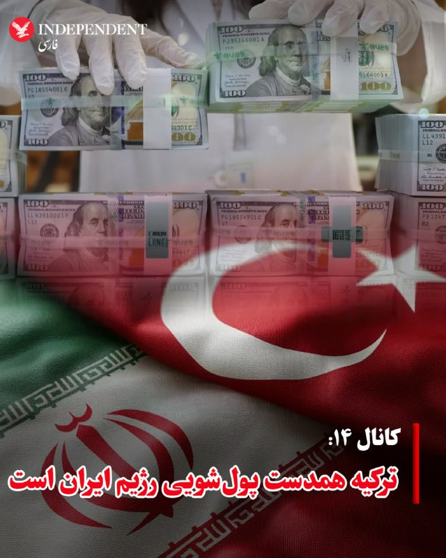

♦️کانال ۱۴ تلویزیون اسرائیل به نقش ترکیه در پولشویی برای رژیم ایران اشاره کرده و می گوید گزارش‌هایی درباره هواپیماهای خصوصی حامل پول نقد و طلا، صراف‌ها و انتقال آزادانه منابع مالی حکومت از طریق مرز زمینی باز منتشر شده است.
صراف‌های غیررسمی ترکیه پس از تنش ها بین رژیم ایران و امارات متحده عربی به شریان مالی جدید حکومت ایران تبدیل شده‌اند.
کانال ۱۴می گوید، بدون اینکه اردوغان چشم خود را بر این فعالیت‌ها ببندد، بقای حکومت زیر فشار اقتصادی بسیار دشوار خواهد بود.»
این گزارش می گوید، حکومت ایران به‌طور فزاینده‌ای فعالیت‌های مالی خود را به سیستم «حواله» منتقل می‌کند؛ سازوکاری غیررسمی برای انتقال پول. این سیستم به این شکل عمل می‌کند.
‌🇸🇦 Indypersian

🤖 @VahidOOnLine

## VahidOOnLine — post 239597

  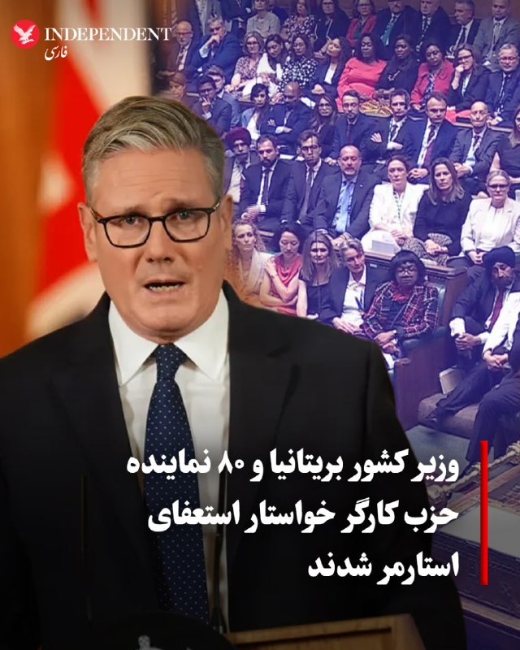

♦️نشریه تایمز روز دوشنبه ۲۱ اردیبهشت گزارش داد که دست‌کم ۸۰ نماینده حزب کارگر در نامه‌ای که کاترین وست، نماینده پارلمان، ارائه کرده است از کی‌یر استارمر، نخست‌وزیر بریتانیا، خواسته شده برای کناره‌گیری خود جدول زمانی مشخصی ارائه دهد.
بر اساس این گزارش، برخی اعضای ارشد این کابینه از جمله شابانا محمود، وزیر کشور، نیز به استارمر توصیه کرده‌اند درباره ادامه حضور خود در قدرت تجدیدنظر کند. هم‌زمان، یکی از دستیاران وزارتی نیز در اعتراض به وضعیت فعلی استعفا داده و خواستار کناره‌گیری نخست‌وزیر شده است.
در همین حال، اختلافات درون‌حزبی در میان نمایندگان حزب کارگر افزایش یافته و تلاش‌ها برای جلب حمایت از برگزاری انتخابات رهبری تا ماه سپتامبر ادامه دارد. با این حال، استارمر با رد این درخواست‌ها تاکید کرده که از «مبارزه برای آینده بریتانیا» عقب‌نشینی نخواهد کرد.
‌🇸🇦 Indypersian

🤖 @VahidOOnLine

## VahidOOnLine — post 239596

  

♦️لیندزی گراهام، سناتور جمهوری‌خواه، در واکنش به گزارش‌های اخیر مبنی بر پناه دادن پاکستان به هواپیماهای نظامی رژیم ایران، خواستار بازنگری در نقش دیپلماتیک اسلام‌آباد شد و در اکس نوشت: «اگر این گزارش‌ها دقیق باشد، مستلزم ارزیابی مجدد کامل نقشی است که پاکستان به عنوان میانجی بین ایران، ایالات متحده و سایر طرف‌ها ایفا می‌کند.» او همچنین با اشاره به مواضع پیشین مقامات دفاعی پاکستان در قبال اسرائیل، تاکید کرد که از شنیدن چنین خبری شوکه نخواهد شد، چرا که این اقدامات با رویکرد اخیر اسلام‌آباد همخوانی دارد.
پیش از این، «سی‌بی‌اس» روز دوشنبه، ۲۱ اردیبهشت‌ماه، گزارش داد که پاکستان برخلاف نقش خود به عنوان میانجی دیپلماتیک میان تهران و واشنگتن، به طور مخفیانه اجازه داده است هواپیماهای نظامی رژیم ایران در پایگاه‌های هوایی این کشور مستقر شوند تا از حملات هوایی آمریکا در امان بمانند. خبری که مقامات ارشد پاکستان در گفتگو با «سی‌بی‌اس نیوز» آن را تکذیب کرده‌اند.
‌🇸🇦 Indypersian

🤖 @VahidOOnLine

## VahidOOnLine — post 239595

  

لیندسی گراهام، سناتور جمهوری‌خواه، در واکنش به گزارش سی‌بی‌اس درباره انتقال هواپیماهای نظامی ایران به پاکستان گفت: «اگر این گزارش درست باشد، باید نقش پاکستان به‌عنوان میانجی میان ایران، آمریکا و سایر طرف‌ها به‌طور کامل بازنگری شود.»
لیندسی گراهام افزود با توجه به برخی اظهارات گذشته مقام‌های دفاعی پاکستان درباره اسرائیل، صحت این گزارش درباره کمک اسلام آباد به حکومت ایران برای او دور از انتظار نیست.
‌🏁 🇬🇧 IranintlTV

🤖 @VahidOOnLine

## VahidOOnLine — post 239594

  

♦️دونالد ترامپ روز دوشنبه، ۲۱ اردیبهشت‌ماه، با انتشار پیامی در شبکه اجتماعی «تروث سوشال»، در آستانه سفر به پکن، با ابراز خرسندی نوشت: «بسیار مشتاق سفرم به چین هستم. کشوری شگفت‌انگیز با رهبری همچون رئیس‌جمهور شی که مورد احترام همگان است.» رئیس‌جمهوری ایالات متحده در ادامه پیام خود با خوش‌بینی نسبت به نتایج این دیدار تاکید کرد که «اتفاقات بزرگی برای هر دو کشور رقم خواهد خورد.» ترامپ قرار است از ۲۳ تا ۲۵ اردیبهشت‌ماه به پکن سفر کند.
‌🇸🇦 Indypersian

🤖 @VahidOOnLine

## VahidOOnLine — post 239593

  <a href="telegram/content/VahidOOnLine_239593_1778539400.mp4" target="_blank">🎬 Download video</a>

روزنامه وال‌استریت ژورنال به نقل از منابع آگاه گزارش داد امارات متحده عربی به‌طور مخفیانه حملاتی نظامی علیه جمهوری اسلامی انجام داده و به یکی از طرف‌های مستقیم جنگ تبدیل شده است.

بر اساس این گزارش، یکی از این حملات در ماه آوریل پالایشگاه نفتی لاوان در خلیج فارس را هدف قرار داده؛ حمله‌ای که همزمان با اعلام آتش‌بس از سوی دونالد ترامپ رخ داده و باعث آتش‌سوزی گسترده و از کار افتادن بخش بزرگی از ظرفیت پالایشگاه برای چند ماه شده است.

به نوشته وال‌استریت ژورنال، جمهوری اسلامی در آن زمان اعلام کرده بود پالایشگاه در «حمله دشمن» هدف قرار گرفته و در واکنش، موجی از حملات موشکی و پهپادی علیه امارات و کویت انجام داده است.

این گزارش می‌گوید آمریکا از حمله امارات ناراضی نبوده و به‌طور غیرعلنی از مشارکت کشورهای خلیج فارس در جنگ علیه جمهوری اسلامی استقبال کرده است.

وزارت خارجه امارات از اظهار نظر مستقیم درباره این حملات خودداری کرده، اما به بیانیه‌های پیشین خود درباره «حق پاسخ، از جمله پاسخ نظامی، به اقدامات خصمانه» اشاره کرده است.

وال‌استریت ژورنال همچنین گزارش داد جمهوری اسلامی بیش از ۲۸۰۰ موشک و پهپاد به سمت امارات شلیک کرده؛ حملاتی که به بخش‌های هوایی، گردشگری و بازار املاک این کشور آسیب زده است.

در این گزارش آمده امارات پس از آغاز جنگ، همکاری نظامی خود با آمریکا را حفظ کرده و همزمان اقداماتی علیه منافع مالی جمهوری اسلامی، از جمله محدودیت برای شهروندان ایرانی و تعطیلی مراکز مرتبط با تهران در دبی، انجام داده است.
‌🏁 🇬🇧 ManotoTV

🤖 @VahidOOnLine

## VahidOOnLine — post 239592

  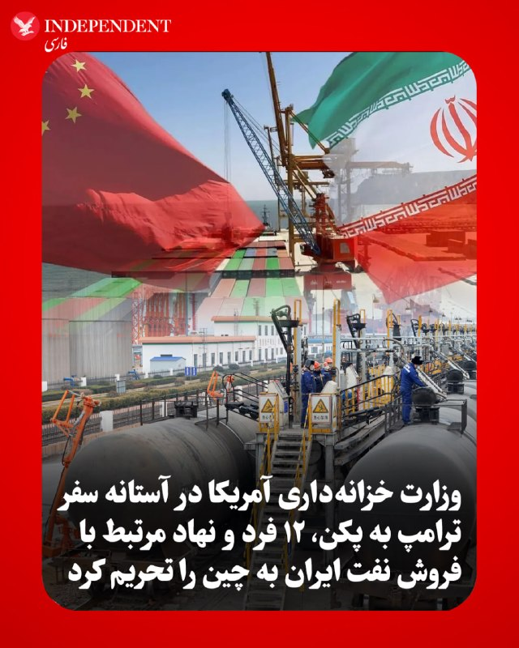

♦️به گزارش خبرگزاری فرانسه، ایالات متحده در آستانه سفر دونالد ترامپ، رئیس جمهوری آمریکا به پکن، تحریم‌های جدیدی را علیه ۱۲ فرد و نهاد مرتبط با شبکه فروش و جابجایی نفت ایران به چین اعمال کرد. وزارت خزانه‌داری آمریکا روز دوشنبه در بیانیه‌ای اعلام کرد که این افراد و شرکت‌ها نقش کلیدی در تسهیل تجارت نفتی تهران ایفا کرده‌اند. واشنگتن تاکید کرد که سپاه پاسداران برای پنهان کردن نقش خود در معاملات نفتی و هدایت درآمدهای حاصل از آن به سمت رژیم ایران، به طور گسترده از شرکت‌های صوری در حوزه‌های قضایی با نظارت اقتصادی ضعیف استفاده می‌کند.
در فهرست جدید تحریم‌ها، نام چندین فرد مستقر در ایران و شرکت‌هایی در امارات متحده عربی و هنگ‌کنگ به چشم می‌خورد که متهم به همکاری با نیروی قدس سپاه پاسداران هستند. این اقدام که درست چند روز پیش از دیدارهای دیپلماتیک سطح بالای ترامپ در چین نهایی شده، نشان‌دهنده عزم واشنگتن برای مسدود کردن مسیرهای دور زدن تحریم‌ها و خشکاندن منابع مالی تهران در بازارهای شرق آسیا است. بر اساس این تحریم‌ها، کلیه دارایی‌های این نهادها در آمریکا مسدود و هرگونه مراوده مالی با آن‌ها با جریمه‌های سنگین مواجه خواهد شد.
‌🇸🇦 Indypersian

🤖 @VahidOOnLine

## VahidOOnLine — post 239591

  

شاهزاده رضا پهلوی در شبکه اجتماعی ایکس نوشت که جمهوری اسلامی ۴۷ سال است علیه آمریکا و متحدانش جنگ به راه انداخته، و تاکید کرد: «امروز این رژیم از همیشه ضعیف‌تر است و مردم ایران آماده‌اند تا آن را سرنگون کنند.»
او نوشت که اتخاذ سیاستی درست در این لحظه، می‌تواند قرن آینده را تغییر دهد.

‌🏁 🇬🇧 IranintlTV

🤖 @VahidOOnLine

## VahidOOnLine — post 239590

  

♦️محمدباقر قالیباف، رئیس مجلس شورای اسلامی، روز دوشنبه با انتشار پیامی در اکس، بر ضرورت پذیرش شروط تهران تاکید کرد و نوشت: «هیچ جایگزینی جز پذیرش حقوق ملت ایران، آن‌گونه که در پیشنهاد ۱۴ ماده‌ای آمده است، وجود ندارد.» او با هشدار نسبت به بی‌نتیجه بودن رویکردهای جایگزین مدعی شد که هر مسیر دیگری «کاملا بی‌سرانجام خواهد بود و چیزی جز شکست‌های پی‌درپی به همراه نخواهد داشت.» قالیباف همچنین خطاب به مقامات آمریکایی خاطرنشان کرد که «هرچه بیشتر در این امر تعلل کنند، مالیات‌دهندگان آمریکایی هزینه بیشتری برای آن پرداخت خواهند کرد.»
‌🇸🇦 Indypersian

🤖 @VahidOOnLine

## VahidOOnLine — post 239589

  

♦️روزنامه اطلاعات در یادداشتی با اشاره به ادامه جنگ، تحریم‌ها و محدودیت‌های دولت، از مردم خواست در مصرف منابعی مانند آب، برق، سوخت و مواد غذایی صرفه‌جویی کنند.
این روزنامه با انتقاد از برخی رفتارهای مصرفی نوشت در شرایطی که حمل‌ونقل عمومی در دسترس است، استفاده از خودروهای تک‌سرنشین یا «دور دور»های تفریحی ضرورتی ندارد و به افزایش مصرف سوخت دامن می‌زند.
اطلاعات همچنین به موضوع مصرف مواد غذایی پرداخت و تاکید کرد مصرف بیش از اندازه اقلامی مانند برنج و گندم، در کنار الگوهای تغذیه ناسالم، می‌تواند به بروز بیماری‌ها، کاهش طول عمر و افزایش هزینه‌های درمانی منجر شود.
‌🇸🇦 Indypersian

🤖 @VahidOOnLine

## VahidOOnLine — post 239588

  <a href="telegram/content/VahidOOnLine_239588_1778539405.mp4" target="_blank">🎬 Download video</a>

‌
محمدباقر قالیباف، رئیس مجلس شورای اسلامی، در پیامی به زبان انگلیسی در شبکه اکس نوشت «هیچ» جایگزینی جز پذیرش «طرح ۱۴ ماده‌ای» وجود ندارد.

قالیباف افزود:
«هر رویکرد دیگری کاملاً بی‌نتیجه خواهد بود و چیزی جز شکست‌های پی‌درپی به همراه نخواهد داشت. هرچه بیشتر وقت‌کشی کنند، هزینه بیشتری بر دوش مالیات‌دهندگان آمریکایی گذاشته خواهد شد.»
‌🏁 🇬🇧 ManotoTV

🤖 @VahidOOnLine

## VahidOOnLine — post 239587

  <a href="telegram/content/VahidOOnLine_239587_1778539405.mp4" target="_blank">🎬 Download video</a>

تماسی از چنارشاهیجان کازرون:
از جاویدنامان علیرضا نادری، عارف براتی، فرزانه ساسانی‌پور، بهبود حسن‌زاده، جبار پناهی و آنیسا هوشنگی گفت…
‌🏁 🇬🇧 ManotoTV

🤖 @VahidOOnLine

## VahidOOnLine — post 239586

  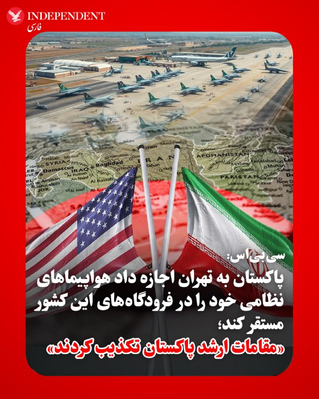

♦️«سی‌بی‌اس» روز دوشنبه، ۲۱ اردیبهشت‌ماه، گزارش داد که پاکستان برخلاف نقش خود به عنوان میانجی دیپلماتیک میان تهران و واشنگتن، به طور مخفیانه اجازه داده است هواپیماهای نظامی ایران در پایگاه‌های هوایی این کشور مستقر شوند تا از حملات هوایی آمریکا در امان بمانند. بر اساس گزارش منابع آگاه در دولت ایالات متحده، تنها چند روز پس از اعلام آتش‌بس موقت توسط دونالد ترامپ، رئیس جمهوری آمریکا، در اوایل آوریل، چندین فروند هواپیما از جمله یک هواپیمای شناسایی و جاسوسی مدل «آر-۱۳۰» (RC-130) نیروی هوایی ایران در پایگاه هوایی «نورخان» پاکستان، واقع در نزدیکی شهر راولپندی، دیده شده‌اند. هم‌زمان گزارش‌هایی از اعزام هواپیماهای غیرنظامی ایران به افغانستان نیز منتشر شده است که به نظر می‌رسد بخشی از تلاش گسترده تهران برای حفاظت از دارایی‌های هوانوردی و نظامی باقی‌مانده خود در میانه درگیری‌های اخیر باشد.
همزمان، مقامات ارشد پاکستان این ادعاها را به شدت رد کرده‌اند. یک مقام عالی‌رتبه پاکستانی در گفتگو با «سی‌بی‌اس نیوز» تاکید کرد که پایگاه هوایی نورخان در قلب شهر واقع شده و استقرار ناوگان بزرگی از هواپیماهای خارجی در چنین مکانی غیرممکن است که از دید عموم پنهان بماند. با این حال، تحلیلگران آمریکایی بر این باورند که این جابه‌جایی‌های استراتژیک نشان‌دهنده تلاش رژیم ایران برای بهره‌گیری از روابط منطقه‌ای جهت کاهش آسیب‌پذیری ناوگان هوایی خود در برابر فشارهای نظامی و محاصره اعمال شده توسط واشنگتن است.
‌🇸🇦 Indypersian

🤖 @VahidOOnLine

## VahidOOnLine — post 239585

  

مجتبی ذوالنوری، عضو کمیسیون حقوقی مجلس، گفت: «لازم نیست در تنگه هرمز باشیم تا هر شناوری را که از آنجا رد می‌شود، بزنیم. از سمنان و مشهد و تهران می‌زنیم. چند شناور که آنجا غرق شود، خود تنگه بسته می‌شود. روی بحث مین‌ریزی کار کردیم و نجابت به خرج دادیم از این حق استفاده نکردیم.»
‌🏁 🇬🇧 IranintlTV

🤖 @VahidOOnLine

## VahidOOnLine — post 239584

  

وال استریت ژورنال به نقل از منابع مطلع گزارش داد که امارات متحده عربی حملات نظامی علیه جمهوری اسلامی انجام داده است؛ اقدامی که این کشور را در جایگاه یکی از طرف‌های فعال در جنگ قرار می‌دهد.

در این گزارش آمده است نیروهای نظامی این کشور به جنگنده‌های ساخت غرب و شبکه‌های نظارتی پیشرفته مجهز هستند و این حملات نشان می‌دهد امارات متحده عربی اکنون تمایل بیشتری دارد از این توانمندی‌ها برای حفاظت از قدرت اقتصادی و نفوذ رو‌به‌گسترش خود در سراسر خاورمیانه استفاده کند.

وال استریت ژورنال افزود که این حملات شامل حمله به یک پالایشگاه در جزیره لاوان ایران در خلیج فارس بوده که در اواسط فروردین انجام شده است؛ امارات به‌طور علنی انجام این حملات را تایید نکرده است.
در بخش دیگری از این گزارش آمده است که امارات متحده عربی اکنون تهران را تهدیدی مستقیم علیه ثبات و مدل اقتصادی خود می‌داند. همچنین براساس گمانه‌زنی‌ها، گفته می‌شود امارات متحده عربی با استفاده از جنگنده‌های میراژ فرانسوی و پهپادهای چینی متعلق به خود، در داخل ایران عملیات انجام داده است.
‌🏁 🇬🇧 IranintlTV

🤖 @VahidOOnLine

## VahidOOnLine — post 239583

  

♦️همزمان با افزایش تنش‌ها میان تهران و واشنگتن، مجتبی ذوالنور، عضو کمیسیون قضایی و حقوقی مجلس، در گفتگو با شبکه خبر با اشاره به ویژگی‌های جغرافیایی تنگه هرمز گفت عرض این تنگه در باریک‌ترین نقطه حدود ۴۵ کیلومتر است، اما همه این محدوده قابل کشتیرانی نیست. به گفته او، بخش‌هایی از مسیر به‌دلیل عمق کم و بستر صخره‌ای، به‌ویژه در نزدیکی سواحل عمان و جزیره سلامه، محدودیت عبور دارند و عملا مسیرهای کشتیرانی به نواحی مشخصی محدود می‌شود.
ذوالنور همچنین با اشاره به موقعیت راهبردی ایران در این منطقه افزود آب‌های سرزمینی ایران، که حدود ۱۲ مایل دریایی (نزدیک به ۲۲ کیلومتر) را شامل می‌شود، بخش مهمی از مسیر عبور کشتی‌ها را پوشش می‌دهد. او مدعی شد ایران توان هدف قرار دادن شناورها را حتی از فواصل دور دارد و تأکید کرد هر شناوری که بخواهد از تنگه هرمز عبور کند را می‌توانیم از سمنان، تهران و مشهد بزنیم.
او همچنین به موضوع توانمندی‌های مین‌ریزی در خلیج فارس اشاره کرد و گفت ایران تاکنون از این ظرفیت استفاده نکرده است.
‌🇸🇦 Indypersian

🤖 @VahidOOnLine

## VahidOOnLine — post 239582

  

♦️وزارت خزانه‌داری ایالات متحده، روز دوشنبه، ۲۱ اردیبهشت‌ماه، در بیانیه‌ای رسمی اعلام کرد که پاسخ اخیر تهران به پیشنهاد دیپلماتیک واشنگتن، نه‌تنها از نظر سیاسی غیرقابل‌قبول است، بلکه با استانداردهای لازم برای لغو تحریم‌های مالی و اقتصادی نیز همخوانی ندارد. این وزارتخانه تاکید کرد که رویکرد فعلی ایران مانع از هرگونه گشایش در مسیر مبادلات بین‌المللی و آزادسازی دارایی‌های بلوکه شده می‌شود و تا زمانی که تعهدات شفافی در حوزه برنامه هسته‌ای ارائه نشود، فشارها بر شبکه مالی این کشور ادامه خواهد یافت.
در همین راستا، اسکات بسنت، وزیر خزانه‌داری دولت دونالد ترامپ، در اکس با بازنشر این بیانیه، موضعی قاطعانه اتخاذ کرد. او با اشاره به اینکه پاسخ تهران نشان‌دهنده عدم تمایل این کشور به همکاری واقعی است، نوشت: «در حالی که دولت ترامپ با حسن نیت مسیری برای دیپلماسی باز کرد، تهران با پاسخی کاملا غیرقابل‌قبول به میز مذاکره بازگشته است.» بسنت تاکید کرد که وزارت خزانه‌داری، سیاست‌های مالی را به گونه‌ای تنظیم خواهد کرد که جمهوری اسلامی متوجه شود عدم پذیرش توافق، هزینه‌های اقتصادی سنگین و غیرقابل‌جبرانی برای نظام پولی و بانکی این کشور به همراه خواهد داشت. او نوشت: «زمان آن رسیده که تهران متوجه شود هزینه لجاجت، فروپاشی کامل اقتصادی است».
‌🇸🇦 Indypersian

🤖 @VahidOOnLine

## VahidOOnLine — post 239581

  <a href="telegram/content/VahidOOnLine_239581_1778539411.mp4" target="_blank">🎬 Download video</a>

وزارت خزانه‌داری آمریکا اعلام کرد ۱۲ فرد و نهاد را به‌دلیل نقش در فروش و انتقال نفت جمهوری اسلامی توسط سپاه پاسداران به چین تحریم کرده است.

در بیانیه دفتر کنترل دارایی‌های خارجی وزارت خزانه‌داری آمریکا آمده سپاه پاسداران برای پنهان کردن نقش خود در فروش نفت و انتقال درآمدها به جمهوری اسلامی، از شرکت‌های پوششی در کشورهای مختلف استفاده می‌کند.

اسکات بسنت، وزیر خزانه‌داری آمریکا، گفت: «در حالی که ارتش ایران تلاش می‌کند خود را بازسازی کند، عملیات “خشم اقتصادی” به محروم کردن جمهوری اسلامی از منابع مالی برنامه‌های تسلیحاتی، نیروهای نیابتی و جاه‌طلبی‌های هسته‌ای ادامه خواهد داد.»

وزارت خزانه‌داری آمریکا همچنین اعلام کرد جمهوری اسلامی به‌جای استفاده از درآمدهای نفتی برای حمایت از مردم ایران، این منابع را صرف توسعه تسلیحات، حمایت از گروه‌های نیابتی و تأمین مالی نیروهای امنیتی می‌کند.

در میان افراد تحریم‌شده، نام احمد محمدی‌زاده، رئیس قرارگاه نفتی شهید پورجعفری سپاه، صمد فتحی سلامی، مسئول مالی این قرارگاه، و محمدرضا اشرفی گهی، مسئول بازرگانی آن، دیده می‌شود.

همچنین چند شرکت مستقر در هنگ‌کنگ، دبی، عمان و شارجه به اتهام همکاری در انتقال نفت ایران و دور زدن تحریم‌ها هدف تحریم قرار گرفته‌اند.

وزارت خزانه‌داری آمریکا هشدار داد هر شرکت یا مؤسسه مالی خارجی که با شبکه‌های مرتبط با سپاه پاسداران همکاری کند، ممکن است هدف تحریم‌های ثانویه آمریکا قرار گیرد.
‌🏁 🇬🇧 ManotoTV

🤖 @VahidOOnLine

## VahidOOnLine — post 239580

  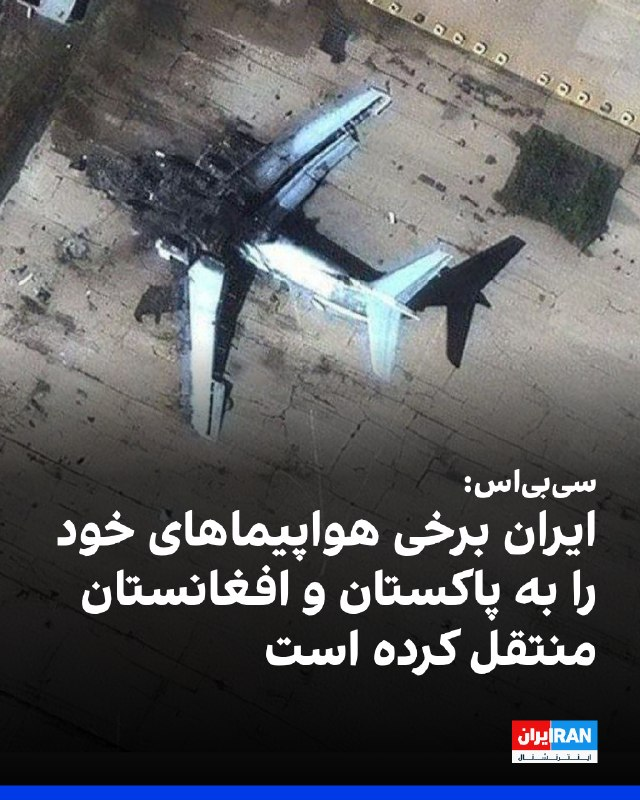

سی‌بی‌اس نیوز به نقل از مقام‌های آمریکایی گزارش داد که پاکستان به‌طور غیررسمی اجازه داده است برخی هواپیماهای نظامی ایران در فرودگاه‌های این کشور مستقر شوند؛ اقدامی که احتمالا آن‌ها را از حملات هوایی آمریکا مصون می‌سازد.
براساس این گزارش، ایران همچنین برخی هواپیماهای غیرنظامی خود را به افغانستان منتقل کرده است، هرچند مشخص نیست که آیا در میان آن‌ها هواپیماهای نظامی نیز وجود دارد یا خیر.
‌🏁 🇬🇧 IranintlTV

🤖 @VahidOOnLine

## VahidOOnLine — post 239579

  <a href="telegram/content/VahidOOnLine_239579_1778539413.mp4" target="_blank">🎬 Download video</a>

دونالد ترامپ در کاخ سفید با تیم امنیتی و فرماندهان نظامی آمریکا درباره ادامه مسیر جنگ با جمهوری اسلامی جلسه برگزار می‌کند. او گفته در داخل حکومت ایران اختلاف وجود دارد؛ «میانه‌روها» دنبال توافق‌اند اما «دیوانه‌ها» می‌خواهند جنگ ادامه پیدا کند.
‌🏁 🇬🇧 IranintlTV

🤖 @VahidOOnLine

## WithYashar — post 11015

  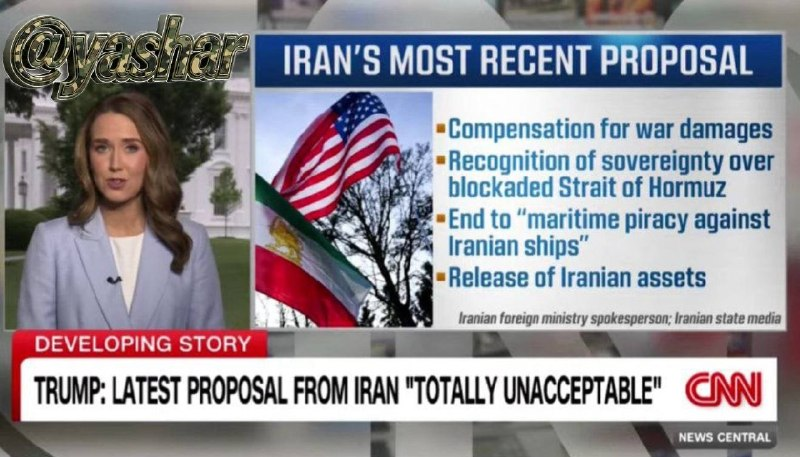

فاکس نیوز اعلام کرد
جزئیات جدیدترین پیشنهاد ایران
که ترامپ آن را رد کرد:

- دریافت غرامت بابت خسارات جنگی
- به رسمیت شناختن حاکمیت ایران بر تنگه هرمز
- پایان دزدی دریایی آمریکا علیه کشتی‌های ایرانی
- آزادسازی دارایی‌های مسدود شده ایران
@withyashar

## WithYashar — post 11014

ادعای سی.بی.اس به نقل از مقامات آمریکایی: چند روز پس از اعلام آتش‌بس با ایران توسط ترامپ در اوایل آوریل، تهران چندین فروند هواپیما را به پایگاه هوایی «نور خان» نیروی هوایی پاکستان فرستاد. این پایگاه، یک تأسیسات نظامی راهبردی است که درست در حومه شهر راولپندی،…

## WithYashar — post 11013

ترامپ : من خیلی منتظر سفرم به چین هستم، یک کشور فوق‌العاده، با رهبری، رئیس‌جمهور شی، که مورد احترام همه است.

همکاری های بزرگی برای هر دو کشور رخ خواهد داد!
@withyashar

## WithYashar — post 11012

تایید نشده : ایران به شورای امنیت سازمان ملل اطلاع داده است که در صورت اعزام زیردریایی هسته‌ای آمریکا به خاورمیانه، سطح غنی سازی ۱۰ تن اورانیوم باقی مانده را به ۶۰ درصد خواهد رساند
@withyashar

## WithYashar — post 11011

## WithYashar — post 11010

یاشارجان درود
وقتت بخیر
اینکه میگن قراره تو دیدار ترامپ و شی و از طرفی بصورت غیرمستقیم با پوتین در مورد تایوان و ایران و اوکراین معامله صورت بگیره درسته؟؟
لطفا یه تحلیل کوچولو در این مورد برو
ازبس که از اینور اونور این اخبار زرد و بی اساس. شنیدیم واقعا خسته ایم
بعنوان یه ایرانی واژه خسته با ماها معنی میشه

ممنونم ازت بابت کانال خوبت و اخبار کاملی که میذاری
در پناه اهورای پاک🙏🙏🙏💚🤍♥️

## WithYashar — post 11009

من یکی با اینکه قبلا رفتار های اشتباهی در مقابل شما داشتم
ولی الان واقعا قدر زحماتتونو میفهمم
تنها ویسایی که باز میکنم ویسای شماست و ممنونم که واسمون وقت میزاری 🙏❤️

## WithYashar — post 11008

## WithYashar — post 11007

اخجون کلی ویس
اخجون تحلیل😍

## WithYashar — post 11006

## WithYashar — post 11005

## WithYashar — post 11004

  <a href="telegram/content/WithYashar_11004_1778539416.mp4" target="_blank">🎬 Download video</a>

😳😳😳😳 @withyashar

## WithYashar — post 11003

## WithYashar — post 11002

## WithYashar — post 11001

## WithYashar — post 11000

## WithYashar — post 10999

## WithYashar — post 10997

پنتاگون تأیید کرد که زیردریایی هسته‌ای آمریکایی در مسیر خود به خاورمیانه ست @withyashar

## WithYashar — post 10996

کانال ۱۲ اسرائیل: رئیس‌جمهور ترامپ تمایل دارد دستور ازسرگیری درگیری با ایران را صادر کند
@withyashar

## WithYashar — post 10995

## mwarmonitor — post 8935

🔴تحلیل اختصاصی کانال: دیپلماسی در لبه پرتگاه؛ استراتژی «تأدیب» یا «تغییر رژیم»؟

📝گزارش اخیر «باراک راوید» از وضعیت کنونی روابط ایران و آمریکا، نشان‌دهنده عبور از مرحله «چانه‌زنی سخت» و ورود به فاز «رویارویی کنترل‌شده» است. در ادامه، ابعاد مختلف این بن‌بست سیاسی تحلیل می‌شود:

۱. کالبدشکافی استراتژی ترامپ: «نقشه ساده» برای معامله‌ای پیچیده
ترامپ در سخنان خود از مفهومی به نام «بهترین نقشه تاریخ» یاد می‌کند که در ظاهر ساده است (ایران نباید سلاح هسته‌ای داشته باشد)، اما در باطن بر پایه تخریب کامل اهرم‌های قدرت طرف مقابل بنا شده است.

تاکتیک گوش‌مالی (Adjustment): استفاده از عبارت «کمی آن‌ها را تنظیم خواهد کرد» نشان می‌دهد که ترامپ به دنبال جنگ کلاسیک و اشغال‌گرایانه نیست؛ بلکه به دنبال حملات جراحی‌گونه (Surgical Strikes) برای تحمیل اراده سیاسی است.

تشدید دوقطبی داخلی ایران: ادعای ترامپ مبنی بر تقسیم رهبری ایران به «میانه‎‌روها و دیوانگان»، یک جنگ روانی هدفمند برای ایجاد گسل در ساختار تصمیم‌گیری تهران در لحظات بحرانی است.

۲. بن‌بست هسته‌ای؛ خط قرمزهای متقاطع
شکاف اصلی در مذاکرات روز یکشنبه، بر سر «خروج ذخایر اورانیوم» بوده است.
موضع ایران: تهران با غیرقابل مذاکره خواندن غنی‌سازی، به دنبال حفظ «آستانه هسته‌ای» به عنوان تنها کارت بازی باقی‌مانده است.
موضع ترامپ: او معتقد است ایرانِ بدون توان نظامی (طبق ادعای او)، حق داشتنِ اهرم هسته‌ای را ندارد. تعبیر «آتش‌بس در کما»، سیگنال واضحی است که آمریکا دیگر «زمان» را به عنوان یک فاکتور دیپلماتیک به رسمیت نمی‌شناسد.

۳. گزینه‌های نظامی روی میز: از «پروژه آزادی» تا «تأسیسات زیربنایی»
در صورت شکست کامل دیپلماسی پس از سفر ترامپ به چین، سه سناریوی نظامی محتمل است:
محاصره دریایی و تنگه هرمز: ازسرگیری «پروژه آزادی» به معنای به چالش کشیدن حاکمیت دریایی ایران و قطع شریان‌های باقی‌مانده اقتصادی است.
تکمیل بانک اهداف: اشاره به ۲۵ درصد باقی‌مانده از اهداف شناسایی شده، نشان‌دهنده آمادگی پنتاگون برای هدف قرار دادن زیرساخت‌های حیاتی (انرژی و مخابرات) است.
سناریوی خطرناک اسرائیل: عملیات نیروهای ویژه برای تصرف ذخایر اورانیوم، اگرچه از نظر ترامپ «پرخطر» توصیف شده، اما وجود آن در لیست بررسی، نشان‌دهنده سطح بی‌سابقه تنش است.

۴. متغیر چین؛ میانجی‌گری یا چراغ سبز؟
سفر ترامپ به چین نقطه عطف این بحران است. ترامپ به دنبال آن است که با استفاده از نفوذ اقتصادی چین بر ایران، تهران را به پذیرش شروط خود وادار کند.

🔵 اگر شی‌جین‌پینگ نتواند ایران را به عقب‌نشینی متقاعد کند، ترامپ احتمالاً از این «شکستِ دیپلماتیک» به عنوان مجوزی برای اقدام نظامی استفاده خواهد کرد تا به افکار عمومی نشان دهد «تمامی راه‌های غیرنظامی» را طی کرده است.

📌 پارادوکس «تاج مآبانه»
لحن ترامپ (استفاده از استعاره‌های پزشکی و تجاری) نشان می‌دهد که او با بحران ایران مانند یک «دارایی ورشکسته» در تجارت املاک برخورد می‌کند. او معتقد است ایران در ضعیف‌ترین موضع تاریخی خود قرار دارد و به همین دلیل، تمایلی به دادن امتیاز کوچک هم ندارد.

🔴ما اکنون در وضعیت «انتظار فعال» هستیم. بازه زمانی بازگشت ترامپ از چین (آخر هفته میلادی)، بحرانی‌ترین زمان برای تعیین تکلیف صلح یا جنگ خواهد بود. ایران میان دو گزینه «پذیرش خلع سلاح غنی‌سازی» (که آن را تسلیم می‌نامد) و «تحمل موج جدید حملات نظامی»، با سخت‌ترین تصمیم دهه اخیر خود روبروست.

☑️ تأکید ترامپ بر کشته شدن ۴۲,۰۰۰ نفر در اعتراضات، نشان‌دهنده آن است که او قصد دارد هرگونه اقدام نظامی احتمالی را تحت پوشش «حمایت از مردم» و «مسائل حقوق بشری» مشروعیت‌بخشی کند.

@mwarmonitor

## mwarmonitor — post 8934

  

✈️📡 هواپیمای RC-135V Rivet Joint هواپیمای شناسایی و شنود الکترونیکی (جمع‌آوری اطلاعات سیگنالی و ارتباطی).(شماره 64-14848 از پایگاه سودا بی یونان) بر فراز عربستان سعودی مشاهده شد؛ در حال بازگشت از خلیج فارس. (تداخل شدید GPS در منطقه میان ریاض، امارات متحده…

## mwarmonitor — post 8933

  <a href="telegram/content/mwarmonitor_8933_1778539419.mp4" target="_blank">🎬 Download video</a>

📝 این انگل‌های وارداتی حشدالشعبی که معلوم نیست چطور فارسی‌نفهمیده برای خامنه‌ای زجه می‌زنند، در واقع آینه دقِ آن حرامزاده‌های ارتشی و بزدلانِ پادگان‌نشینی هستند که شرفشان را با جیره و مواجب معامله کرده‌اند. خاک بر سر آن نظامیانی که دیروز مدعی بودند یک گردان کشته دادند تا کسی به ناموس ایران نگاه چپ نکند، اما حالا مثل هرزه‌های ترسو در سوراخ‌های خود خزیده‌اند و فرشِ زیر پای وحوشِ بیگانه شده‌اند. شما نه پاسدار مرز، که نگهبان ذلت و تماشاگرِ حقارتِ ملت هستید؛ بی‌رگ‌هایی که در ازای یک لقمه نانِ آغشته به خون، عزت و خاک وطن را به این گله‌های وارداتی واگذار کردید.

@mwarmonitor

## mwarmonitor — post 8932

🇦🇪امارات متحده عربی به‌طور مخفیانه حملات نظامی علیه ایران انجام داده است، به گفته منابع - وال‌استریت ژورنال

🔸این حملات شامل حمله به یک پالایشگاه در جزیره لاوان ایران بوده است.

@mwarmonitor

## mwarmonitor — post 8931

🔴رئیس‌جمهور ترامپ تمایل دارد دستور ازسرگیری درگیری با ایران را صادر کند — کانال ۱۲ اسرائیل

@mwarmonitor

## mwarmonitor — post 8930

💠امروز، دفتر کنترل دارایی‌های خارجی وزارت خزانه‌داری آمریکا (OFAC)، ۱۲ فرد و نهاد را به دلیل نقش آن‌ها در تسهیل فروش و انتقال نفت ایران توسط سپاه پاسداران انقلاب اسلامی (IRGC) به جمهوری خلق چین تحریم کرد.

💠سپاه پاسداران برای پنهان‌سازی نقش خود در فروش نفت و انتقال درآمدها به حکومت ایران، به شرکت‌های پوششی در حوزه‌های اقتصادی سهل‌گیر متکی است. به‌جای آنکه این درآمدها صرف حمایت از مردم در مضیقه ایران شود، حکومت ایران آن را به سمت توسعه تسلیحات، حمایت از نیروهای نیابتی تروریستی، و تأمین مالی نیروهای امنیتی که آزادی‌های شهروندان را سرکوب می‌کنند هدایت می‌کند.

🔸اسکات بسنت وزیر خزانه‌داری آمریکا ؛

🔘در حالی که نیروهای نظامی ایران به‌شدت در تلاش برای بازسازی خود هستند، کارزار «خشم اقتصادی» همچنان به محروم کردن رژیم از منابع مالی مورد نیاز برای برنامه‌های تسلیحاتی، نیروهای نیابتی تروریستی و جاه‌طلبی‌های هسته‌ای ادامه خواهد داد.

🔘وزارت خزانه‌داری به تلاش خود برای قطع دسترسی رژیم ایران به شبکه‌های مالی که از آن‌ها برای انجام اقدامات تروریستی و بی‌ثبات کردن اقتصاد جهانی استفاده می‌کند، ادامه خواهد داد.

@mwarmonitor

## mwarmonitor — post 8929

⚠️افشاگری به نقل از CBSNews: 🔴منابعی به Jennifer Jacobs و JimLaPorta گفتند که در حالی که پاکستان خود را به‌عنوان کانال دیپلماتیک میان تهران و واشینگتن مطرح می‌کرد، به‌طور پنهانی به هواپیماهای نظامی ایران اجازه داد در خاک این کشور مستقر شوند؛ اقدامی که می‌توانست…

## mwarmonitor — post 8928

⚠️افشاگری به نقل از CBSNews:

🔴منابعی به Jennifer Jacobs و JimLaPorta گفتند که در حالی که پاکستان خود را به‌عنوان کانال دیپلماتیک میان تهران و واشینگتن مطرح می‌کرد، به‌طور پنهانی به هواپیماهای نظامی ایران اجازه داد در خاک این کشور مستقر شوند؛ اقدامی که می‌توانست آن‌ها را از حملات هوایی آمریکا مصون نگه دارد.

🔴چند روز پس از آنکه دونالد ترامپ در اوایل آوریل آتش‌بس را اعلام کرد، تهران چندین فروند هواپیما را به پایگاه هوایی نورخان متعلق به نیروی هوایی پاکستان منتقل کرد.

🔴در میان تجهیزات نظامی منتقل‌شده، یک فروند RC-130 نیروی هوایی ایران نیز وجود داشت؛ گونه‌ای شناسایی و جمع‌آوری اطلاعات از هواپیمای ترابری تاکتیکی C-130 هرکولس.

@mwarmonitor

## FoxNewsTwitter — post 341563

  <a href="telegram/content/FoxNewsTwitter_341563_1778539421.mp4" target="_blank">🎬 Download video</a>

Fox News (Twitter/X)

"We know this virus. It's not novel and we know what we need to do."

CDC official David Fitter said the Andes hantavirus strain is significantly more difficult to spread than typical respiratory viruses.

## FoxNewsTwitter — post 341562

  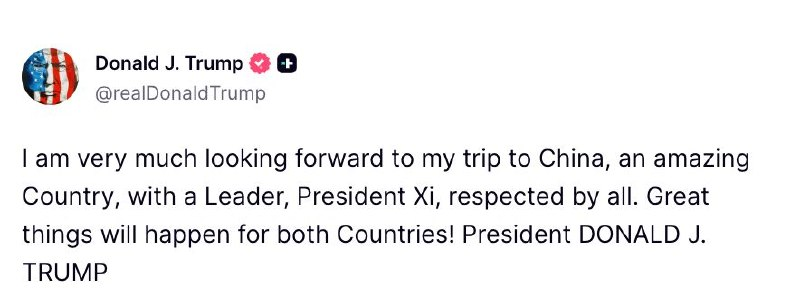

Fox News (Twitter/X)

President Trump announced he is "very much looking forward to" his upcoming trip to China.

## FoxNewsTwitter — post 341561

  

Fox News (Twitter/X)

WATCH LIVE: Health officials hold hantavirus news conference in Georgia
https://twitter.com/i/broadcasts/1nxnRYdRXLkxO

## FoxNewsTwitter — post 341560

  <a href="telegram/content/FoxNewsTwitter_341560_1778539425.mp4" target="_blank">🎬 Download video</a>

Fox News (Twitter/X)

NEW: President Trump is met with 'Hoosiers' chants as he reflects on the team's historic National Championship run during their visit to the White House:

"This was a year that will live forever in the hearts of Indiana football fans."

"You're the biggest story. There's no story like this."

"The Hoosiers delivered the program's first-ever undefeated, untied season and capped it off with their first-ever national title. That's amazing."

## FoxNewsTwitter — post 341559

  

Fox News (Twitter/X)

NEW: President Trump receives an honorary ‘Trump’ jersey from the reigning CFP National Champions, the Indiana Hoosiers, during their White House celebration ceremony.

## FoxNewsTwitter — post 341558

  <a href="telegram/content/FoxNewsTwitter_341558_1778539429.mp4" target="_blank">🎬 Download video</a>

Fox News (Twitter/X)

NEW: President Trump addresses star quarterback of the 2025 National Championship Indiana Hoosiers Fernando Mendoza not attending the White House ceremony:

"The reason he's not here — he was so nice, he called..."

"Actually, JD's a big fan of yours. You wouldn't believe it because he didn't show up. I'm not happy, but that's okay."

"The reason he didn't because he's at spring training, right?"

COACH CIGNETTI: Correct."

"If he was not here for other reasons like he didn't like Trump or he didn't want to come, I wouldn't have even mentioned him... But he's a great guy actually and he is actually a big fan of what we're doing for our country."

## FoxNewsTwitter — post 341557

  <a href="telegram/content/FoxNewsTwitter_341557_1778539431.mp4" target="_blank">🎬 Download video</a>

Fox News (Twitter/X)

BREAKING: President Trump is presented with a custom “Trump” jersey and helmet by Indiana Hoosiers coach Curt Cignetti:

“I like this guy.”

## FoxNewsTwitter — post 341556

  <a href="telegram/content/FoxNewsTwitter_341556_1778539434.mp4" target="_blank">🎬 Download video</a>

Fox News (Twitter/X)

RT @Outkick: “I think he’s the coach of the decade.”

Donald Trump gives Curt Cignetti his flowers 💐

## FoxNewsTwitter — post 341555

  <a href="telegram/content/FoxNewsTwitter_341555_1778539436.mp4" target="_blank">🎬 Download video</a>

Fox News (Twitter/X)

BREAKING: President Trump welcomes the 2025 College Football National Champions the Indiana Hoosiers to the White House.

## FoxNewsTwitter — post 341554

  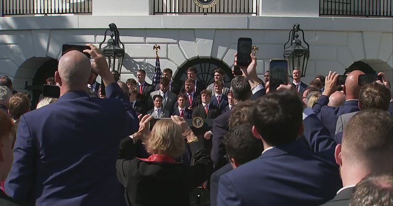

Fox News (Twitter/X)

WATCH LIVE: President Trump hosts college football champion Indiana Hoosiers https://twitter.com/i/broadcasts/1qxvvkErMBgxB

## FoxNewsTwitter — post 341553

  <a href="telegram/content/FoxNewsTwitter_341553_1778539439.mp4" target="_blank">🎬 Download video</a>

Fox News (Twitter/X)

JUST IN: Senate Majority Leader John Thune slams Democrats for their attempt to block funding for immigration enforcement:

"My Democrat colleagues refused to provide a single dollar for the men and women who protect our borders."

"They refused to provide a single dollar for the men and women who take dangerous criminal, illegal aliens off of our streets."

"My Democrat colleagues apparently believe that there should be no physical presence at our borders and no law enforcement officers to deport dangerous criminals who have entered our country illegally."

## pm_afshaa — post 90601

🔥رفقا هانا که همیشه تبلیغشو کردم فقط مخصوص یوزرای ما تخفیف گذاشته👇🏼 1 Gig = 280,000 T 2 Gig = 560,000 T 3 Gig = 800,000 T 5 Gig = 1,200,000 T 10 Gig = 2,200,000T 20 Gig = 4,000,000T 💎پرداخت ریال ، کارت به کارت 💵واریز با ارز دیجیتال ( ترون ) 📌قابلیت…

## pm_afshaa — post 90600

🔥رفقا هانا که همیشه تبلیغشو کردم فقط مخصوص یوزرای ما تخفیف گذاشته👇🏼

1 Gig = 280,000 T
2 Gig = 560,000 T
3 Gig = 800,000 T
5 Gig = 1,200,000 T
10 Gig = 2,200,000T
20 Gig = 4,000,000T

💎پرداخت ریال ، کارت به کارت

💵واریز با ارز دیجیتال ( ترون )

📌قابلیت مشاهده حجم مصرفی
📌نامحدود بودن تعداد کاربران
📌سرعت دانلود به شدت بالا

ایدی جهت خرید👇🏼👇🏼👇🏼👇🏼

@RealHoneyi

## pm_afshaa — post 90599

  <a href="telegram/content/pm_afshaa_90599_1778539441.webm" target="_blank">🎬 Download video</a>

🔴سی‌بی‌اس نیوز به نقل از مقامات آمریکایی: پاکستان علیرغم نقش میانجی، به هواپیماهای نظامی ایران اجازه داد در فرودگاه‌هایش پارک کنن و به طور بالقوه از آنها در برابر حملات هوایی آمریکا محافظت کنه! چند روز پس از اعلام آتش‌بس با ایران توسط ترامپ، ایران چندین فروند…

## pm_afshaa — post 90598

  <a href="telegram/content/pm_afshaa_90598_1778539442.webm" target="_blank">🎬 Download video</a>

🔴سی‌بی‌اس نیوز به نقل از مقامات آمریکایی:
پاکستان علیرغم نقش میانجی، به هواپیماهای نظامی ایران اجازه داد در فرودگاه‌هایش پارک کنن و به طور بالقوه از آنها در برابر حملات هوایی آمریکا محافظت کنه!

چند روز پس از اعلام آتش‌بس با ایران توسط ترامپ، ایران چندین فروند هواپیما رو به پایگاه هوایی «نور خان» نیروی هوایی پاکستان فرستاد. این پایگاه، یک تأسیسات نظامی راهبردی است که درست در حومه شهر راولپندی، شهر پادگانی پاکستان قرار داره. در میان تجهیزات نظامی ارسالی، یک فروند آر سی-۱۳۰ از نیروی هوایی ایران وجود داشت که نوعی هواپیمای شناسایی و گردآوری اطلاعات از فروند لاکهید سی-۱۳۰ هرکولس (هواپیمای ترابری تاکتیکی) محسوب میشه.

💧Rainbet.com the #1 Non-KYC Crypto Casino & Sportsbook @rainbetcom

😁 @Pm_Afshaa

## pm_afshaa — post 90597

  <a href="telegram/content/pm_afshaa_90597_1778539443.webm" target="_blank">🎬 Download video</a>

🔴اسکای‌نیوز:
60 تا از نماینده حزب کارگر خواستار کناره‌گیری کیر استارمر نخست وزیر بریتانیا شدن.

💧 Rainbet.com the #1 Non-KYC Crypto Casino & Sportsbook @rainbetcom

😁 @Pm_Afshaa

## pm_afshaa — post 90596

  <a href="telegram/content/pm_afshaa_90596_1778539443.webm" target="_blank">🎬 Download video</a>

🔴مدیرعامل آرامکو: جنگ ایران و بسته‌ موندن تنگه هرمز باعث شده که یک میلیارد بشکه نفت صادر نشه.

💧 Rainbet.com the #1 Non-KYC Crypto Casino & Sportsbook @rainbetcom

😁 @Pm_Afshaa

## pm_afshaa — post 90595

  <a href="telegram/content/pm_afshaa_90595_1778539444.webm" target="_blank">🎬 Download video</a>

🔴آمریکا تحریم‌های جدیدی علیه 3 فرد و 9 نهاد مرتبط با جمهوری اسلامی اعمال کرد؛ نهادهایی در هنگ‌کنگ، امارات و عمان.

طبق این گزارش، محمدرضا اشرفی، صمد فتحی سلامی و احمد محمدی‌زاده به دلیل ارتباط با سپاه پاسداران تحریم شدن.

💧Rainbet.com the #1 Non-KYC Crypto Casino & Sportsbook @rainbetcom

😁 @Pm_Afshaa

## pm_afshaa — post 90593

  <a href="telegram/content/pm_afshaa_90593_1778539444.webm" target="_blank">🎬 Download video</a>

🔴سازمان رادیو و تلویزیون اسرائیل:
در ساعات اخیر بحث و رایزنی‌هایی با آمریکا درباره ازسرگیری جنگ علیه ایران در حال انجامه.

💧 Rainbet.com the #1 Non-KYC Crypto Casino & Sportsbook @rainbetcom

😁 @Pm_Afshaa

## pm_afshaa — post 90592

  <a href="telegram/content/pm_afshaa_90592_1778539445.webm" target="_blank">🎬 Download video</a>

🔴تسنیم به نقل از منبع نزدیک به تیم مذاکرات: برخلاف اظهارات برخی رسانه‌های غربی، در متن پیشنهادی جمهوری اسلامی هیچ‌گونه پذیرش خروج مواد غنی‌شده هسته‌ای از کشور وجود نداره.

💧 Rainbet.com the #1 Non-KYC Crypto Casino & Sportsbook @rainbetcom

😁 @Pm_Afshaa

## pm_afshaa — post 90591

🔴وزیر دفاع بلژیک: به ابتکار فرانسه و انگلیس برای پاکسازی تنگه هرمز از مین‌های دریایی و بازگشت به دریانوردی آزاد خواهیم پیوست

💧 Rainbet.com the #1 Non-KYC Crypto Casino & Sportsbook @rainbetcom

😁 @Pm_Afshaa

## iaghapour — post 2599

سلام خواستم یه نکته کوچولو بگم
فقط بحث کسب و کارهای کوچیک نبود
فقط بحث آنلاین شاپ ها نبود
ماهایی که ۴ سال تو دیجیتال مارکتینگ بودیم توی طراحی سایت و سئو و اتوماسیون کار میکردیم هم کاملا ورشکست شدیم
نه از ۹ اسفند
ما یه بار جنگ خرداد زمین خوردیم تا اومدیم بلند شیم از جامون و داشتیم اوکی میشدیم دلار دی ماه سر به فلک کشید و بعد یه قطعی دیگه داشتیم که خیلی ها بهانه کردن و پول ندادن آخر دی ما هیچی پروژه نداشتیم حتی بهترین کارفرماها اومدن گفتن کار شما خیلی خوبه ولی ما واقعا پول پرسنل رو هم به زور میدیم نمیرسه به سئو
بهمن اومدیم خودمون رو جمع کنیم تیر آخر رو اول اسفند بهمون زدن
دفترمون رو تحویل دادیم
نیروهامونو از بهمن تعدیل کرده بودیم
و الان چه جوون ها و چه پدرانی که بیکار شدن
منی که تمام تخصصم همیناست
یک متخصص بیکار محسوب میشم.

©️ پیام ارسالی از کاربر shafikhany

## DEJradio — post 4574

  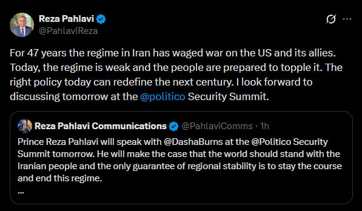

👑
📱 شاهزاده رضا پهلوی در نخستین دقایق بامداد سه‌شنبه،در پیامی در شبکهٔ اکس اعلام کردند جمهوری اسلامی طی ۴۷سال گذشته علیه آمریکا و متحدانش جنگ به راه انداخته است. ایشان با اشاره به تضعیف بی‌سابقهٔ رژیم،تأکید کردند مردم ایران آماده‌اند جمهوری اسلامی را سرنگون کنند. شاهزاده رضا پهلوی همچنین نوشتند اتخاذ سیاستی درست در این مقطع حساس،می‌تواند قرن آینده را تغییر دهد. ایشان افزودند که قرار است روز سه‌شنبه در «نشست امنیتی پولیتیکو» دربارهٔ این موضوع گفت‌وگو کنند.

#شاهزاده_رضا_پهلوی
@DEJradio

## DEJradio — post 4573

  <a href="telegram/content/DEJradio_4573_1778539446.mp4" target="_blank">🎬 Download video</a>

🚨
🔸 خبر ۲۱
دوشنبه ۲۱ اردیبهشت ۱۴۰۵

#خبر۲۱
@DEJradio

## mamlekate — post 103504

📝 رویترز: نفتکش‌هایی از قطر، امارات متحده عربی و عراق از تنگه‌ هرمز عبور کردند

بررسی داده‌ها و گزارش‌های رسمی نشان می‌دهد عبور نفتکش‌ها و کشتی‌های حامل گاز طبیعی مایع از تنگه هرمز همچنان به‌صورت محدود، موردی و با هماهنگی‌های امنیتی انجام می‌شود. برخی کشتی‌ها با موافقت جمهوری اسلامی و خاموش کردن سیستم‌های رهگیری از این آبراه عبور کرده‌اند.

@mamlekate

## VahidOnline — post 75426

  

وزارت خزانه‌داری ایالات متحده، روز دوشنبه، ۲۱ اردیبهشت‌ماه، در بیانیه‌ای رسمی اعلام کرد که پاسخ اخیر تهران به پیشنهاد دیپلماتیک واشنگتن، نه‌تنها از نظر سیاسی غیرقابل‌قبول است، بلکه با استانداردهای لازم برای لغو تحریم‌های مالی و اقتصادی نیز همخوانی ندارد.

این وزارتخانه تاکید کرد که رویکرد فعلی ایران مانع از هرگونه گشایش در مسیر مبادلات بین‌المللی و آزادسازی دارایی‌های بلوکه شده می‌شود و تا زمانی که تعهدات شفافی در حوزه برنامه هسته‌ای ارائه نشود، فشارها بر شبکه مالی این کشور ادامه خواهد یافت.

در همین راستا، اسکات بسنت، وزیر خزانه‌داری دولت دونالد ترامپ، در اکس با بازنشر این بیانیه، موضعی قاطعانه اتخاذ کرد.
او با اشاره به اینکه پاسخ تهران نشان‌دهنده عدم تمایل این کشور به همکاری واقعی است، نوشت: «در حالی که دولت ترامپ با حسن نیت مسیری برای دیپلماسی باز کرد، تهران با پاسخی کاملا غیرقابل‌قبول به میز مذاکره بازگشته است.» بسنت تاکید کرد که وزارت خزانه‌داری، سیاست‌های مالی را به گونه‌ای تنظیم خواهد کرد که جمهوری اسلامی متوجه شود عدم پذیرش توافق، هزینه‌های اقتصادی سنگین و غیرقابل‌جبرانی برای نظام پولی و بانکی این کشور به همراه خواهد داشت. او نوشت: «زمان آن رسیده که تهران متوجه شود هزینه لجاجت، فروپاشی کامل اقتصادی است».
@VahidOOnLine

📡 @VahidOnline

## kianmeli1 — post 87355

  <a href="telegram/content/kianmeli1_87355_1778539450.mp4" target="_blank">🎬 Download video</a>

🔴 شبکه 14 اسرائیل: بخشی از اهداف بعدی ایران

-تاسیسات انرژی و صنعت پتروشیمی
-صنعت خودروسازی و پایگاه‌ های موشک بالستیک
-صنعت نفت و صنعت فولاد
https://t.me/kianmeli1

## kianmeli1 — post 87354

  <a href="https://t.me/kianmeli1/87354" target="_blank">📎 Download file</a>

https://t.me/kianmeli1

## kianmeli1 — post 87353

  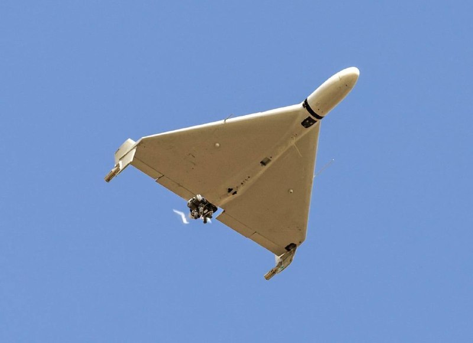

🔴روسیه با شروع صادرات قطعات به ایران، بزرگترین کارخانه پهپاد جهان را گسترش می‌دهد.
https://t.me/kianmeli1

## kianmeli1 — post 87352

  

🔴طبق گزارش سی‌بی‌اس، به نقل از مقامات آمریکایی که نخواستند نامشان فاش شود، پاکستان، میانجی کلیدی در مذاکرات جاری به ایران اجازه داد تا هواپیماهای کلیدی خود را در پایگاه‌هایشان جابجا کند، احتمالاً برای جلوگیری از دست دادن آنها در حملات هوایی ایالات متحده. طبق این گزارش، هم پاکستان و هم افغانستان به آنها اجازه انجام این کار را دادند. ایران در روزهای اولیه جنگ، یکی از هواپیماهای ISR خود، یک RC-130 تبدیل‌شده به نام «صبا» و سایر هواپیماها، چه نظامی و چه غیرنظامی، را به پایگاه نیروی هوایی نورخان پاکستان فرستاد.
https://t.me/kianmeli1

## kianmeli1 — post 87351

  

🔴به گزارش وال استریت ژورنال، به نقل از افراد آگاه، امارات متحده عربی در واقع حملاتی علیه ایران انجام داده است.

طبق این گزارش، این حملات شامل حملات به پالایشگاه ایران در جزیره لاوان بلافاصله پس از اعلام آتش‌بس اسمی نیز می‌شد.

علاوه بر این، طبق گزارش‌ها، ایالات متحده نه تنها از دخالت خود آگاه بوده، بلکه «بی‌سروصدا» از پیوستن امارات و احتمالاً سایر کشورهای خلیج فارس به اقدامات تهاجمی علیه ایران استقبال کرده است.

تا به امروز، امارات متحده عربی به طور نامتناسبی بیشتر از هر یک از همسایگان خلیج فارس خود، هدف موشک‌ها و پهپادهای ایرانی قرار گرفته است و همواره گفته است که حق خود را برای جلوگیری از حملات ایران به هر وسیله ممکن محفوظ می‌دارد.
https://t.me/kianmeli1

## kianmeli1 — post 87350

  <a href="telegram/content/kianmeli1_87350_1778539454.mp4" target="_blank">🎬 Download video</a>

🔴ذوالنور عضو کمیسیون قضایی و حقوقی مجلس: هر شناوری که بخواهد از تنگه هرمز عبور کند را می‌توانیم از سمنان ،تهران و مشهد بزنیم
https://t.me/kianmeli1

## kianmeli1 — post 87349

  

🔴رونق بازار سیم‌کارت‌های عراقی در شهرهای مرزی کشور / اینترنت جایگزین از مسیر غیررسمی به ایران رسید

گزارش‌های میدانی و پیام‌های دریافتی از مخاطبان نشان می‌دهد در برخی مناطق مرزی کشور، به‌ویژه در استان خوزستان و نواحی همجوار با مرز عراق، فروش سیم‌کارت‌های اپراتورهای عراقی از جمله زین و دیگر اپراتورهای فعال این کشور افزایش یافته است.

این سیم‌کارت‌ها از مسیرهای غیررسمی وارد کشور شده و با قیمت‌هایی به‌مراتب بالاتر از نرخ معمول، در اختیار متقاضیان قرار می‌گیرند.
آنچه این بازار را قابل توجه کرده، استقبال بخشی از مردم از این سیم‌کارت‌هاست؛ کاربرانی که برای دسترسی به اینترنت بین‌الملل و حفظ ارتباطات خود، به استفاده از خدمات اپراتورهای خارجی روی آورده‌اند.
https://t.me/kianmeli1

## kianmeli1 — post 87348

  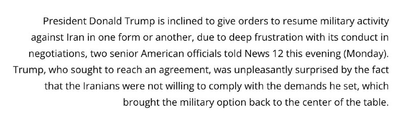

🔴 ترامپ به سمت صدور دستور از سرگیری جنگ با ایران متمایل است -N12
https://t.me/kianmeli1

## IranIntlTV — post 336717

  <a href="https://t.me/IranintlTV/336717" target="_blank">📎 Download file</a>

🎧نسخه صوتی سیاست با مراد ویسی: از شاه‌ تا مجتبی، اوج و افول نفت ایران
@iranintlTV

## IranIntlTV — post 336716

  <a href="telegram/content/IranIntlTV_336716_1778539459.mp4" target="_blank">🎬 Download video</a>

مراد ویسی، تحلیل‌گر ارشد ایران‌اینترنشنال، گفت: «این روزها در رسانه‌های جمهوری اسلامی از علی لاریجانی به‌عنوان چهره‌ای اهل تدبیر یاد می‌شود، در حالی که او به‌عنوان دبیر شورای عالی امنیت ملی نقش اصلی را در کشتار دی‌ماه داشته است. لاریجانی پس از خامنه‌ای، آمر اصلی بزرگ‌ترین کشتار خیابانی تاریخ ایران است.»
@iranintltv

## IranIntlTV — post 336715

  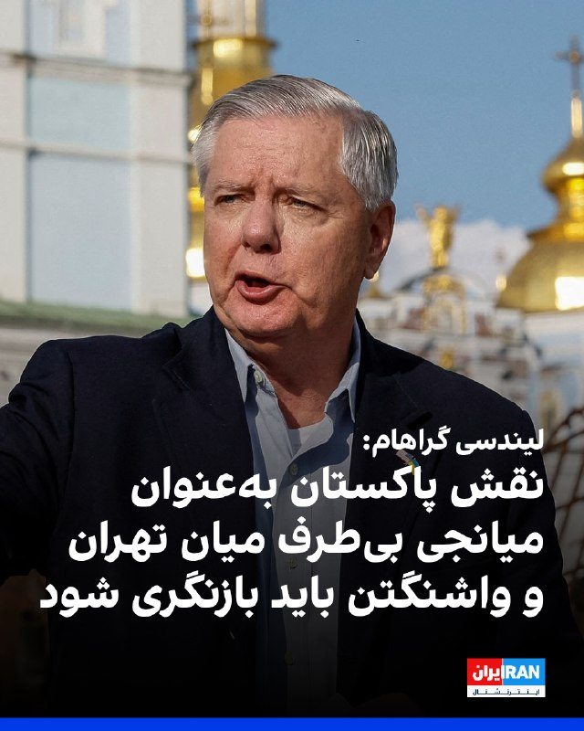

لیندسی گراهام، سناتور جمهوری‌خواه، در واکنش به گزارش سی‌بی‌اس درباره انتقال هواپیماهای نظامی ایران به پاکستان گفت: «اگر این گزارش درست باشد، باید نقش پاکستان به‌عنوان میانجی میان ایران، آمریکا و سایر طرف‌ها به‌طور کامل بازنگری شود.»
لیندسی گراهام افزود با توجه به برخی اظهارات گذشته مقام‌های دفاعی پاکستان درباره اسرائیل، صحت این گزارش درباره کمک اسلام آباد به حکومت ایران برای او دور از انتظار نیست.
https://iranintl.com/202605115329

## IranIntlTV — post 336714

  <a href="https://t.me/IranintlTV/336714" target="_blank">📎 Download file</a>

🎧نسخه صوتی «برنامه با کامبیز حسینی»؛ دارو؛ کالایی لوکس در میانهٔ فروپاشی معیشت در ایران
@iranintlTV

## IranIntlTV — post 336713

  <a href="telegram/content/IranIntlTV_336713_1778539462.mp4" target="_blank">🎬 Download video</a>

میلاد محمدی، برادر شهریار محمدی، جان‌باخته اعتراضات سراسری ۱۴۰۱ ایران، با انتشار ویدیویی در اینستاگرام از هم‌پیمان شدن جمعی از مادران دادخواه کردستان خبر داد.
او در شرح این ویدیو نوشته است: «ما مادران دادخواه، مادران کردستان، مادران «ژن، ژیان، ئازادی» هنوز با جای خالی فرزندانمان نفس می‌کشیم. ما را با سکوت آشنا کردند، اما درد به ما صدا داد. مادر بودن فقط زندگی بخشیدن نیست؛ گاهی یعنی ایستادن بر زخم و ادامه دادن.»
او در پایان، روز مادر را به همه مادران دادخواه و داغدار تبریک گفت.
@iranintltv

## IranIntlTV — post 336712

  <a href="telegram/content/IranIntlTV_336712_1778539463.mp4" target="_blank">🎬 Download video</a>

مراد ویسی، تحلیل‌گر ارشد ایران‌اینترنشنال، گفت: «با رسیدن مذاکرات جمهوری اسلامی و آمریکا به بن‌بست، موقعیت اسرائیل که طرفدار ازسرگیری حملات نظامی است تقویت شده چون اسرائیل از ابتدا معتقد بود مذاکره و توافق با جمهوری اسلامی نتیجه‌ای ندارد. حالا که ترامپ پیشنهاد جمهوری اسلامی را غیرقابل قبول می‌داند، دست اسرائیل برای ترغیب واشینگتن به بازگشت به گزینه نظامی بازتر شده است.»
@iranintltv

## IranIntlTV — post 336711

  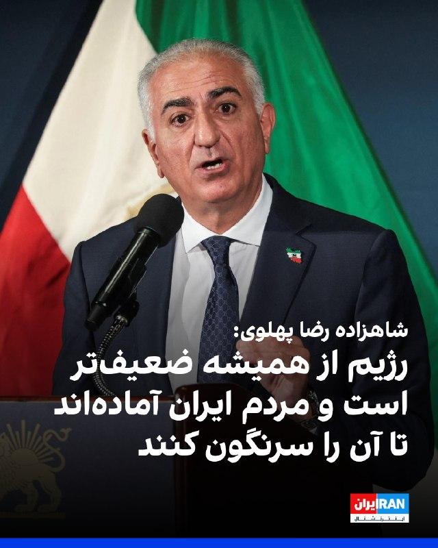

شاهزاده رضا پهلوی در شبکه اجتماعی ایکس نوشت که جمهوری اسلامی ۴۷ سال است علیه آمریکا و متحدانش جنگ به راه انداخته، و تاکید کرد: «امروز این رژیم از همیشه ضعیف‌تر است و مردم ایران آماده‌اند تا آن را سرنگون کنند.»
او نوشت که اتخاذ سیاستی درست در این لحظه، می‌تواند قرن آینده را تغییر دهد.

https://iranintl.com/202605117455

## IranIntlTV — post 336710

  <a href="telegram/content/IranIntlTV_336710_1778539466.mp4" target="_blank">🎬 Download video</a>

مراد ویسی، تحلیل‌گر ارشد ایران‌اینترنشنال، گفت: «در حالی که عربستان با ظرفیت تولید ۱۲ میلیون بشکه نفت در روز و صادرات هفت میلیون بشکه در روز حتی در شرایط جنگی، در اوج قدرت نفتی است، در جمهوری اسلامی ایران تولید و صادرات نفت به شدت افت کرده و تامین بنزین داخلی هم به وضعیت بحرانی رسیده است. ایران و عربستان دو کشوری که روزی غول‌های نفتی منطقه بودند، حالا دو سرنوشت نفتی متفاوت یافته‌اند.»
@iranintltv

## IranIntlTV — post 336709

  

مجتبی ذوالنوری، عضو کمیسیون حقوقی مجلس، گفت: «لازم نیست در تنگه هرمز باشیم تا هر شناوری را که از آنجا رد می‌شود، بزنیم. از سمنان و مشهد و تهران می‌زنیم. چند شناور که آنجا غرق شود، خود تنگه بسته می‌شود. روی بحث مین‌ریزی کار کردیم و نجابت به خرج دادیم از این حق استفاده نکردیم.»
https://iranintl.com/202605116088

## IranIntlTV — post 336708

  

وال استریت ژورنال به نقل از منابع مطلع گزارش داد که امارات متحده عربی حملات نظامی علیه جمهوری اسلامی انجام داده است؛ اقدامی که این کشور را در جایگاه یکی از طرف‌های فعال در جنگ قرار می‌دهد.

در این گزارش آمده است نیروهای نظامی این کشور به جنگنده‌های ساخت غرب و شبکه‌های نظارتی پیشرفته مجهز هستند و این حملات نشان می‌دهد امارات متحده عربی اکنون تمایل بیشتری دارد از این توانمندی‌ها برای حفاظت از قدرت اقتصادی و نفوذ رو‌به‌گسترش خود در سراسر خاورمیانه استفاده کند.

وال استریت ژورنال افزود که این حملات شامل حمله به یک پالایشگاه در جزیره لاوان ایران در خلیج فارس بوده که در اواسط فروردین انجام شده است؛ امارات به‌طور علنی انجام این حملات را تایید نکرده است.
در بخش دیگری از این گزارش آمده است که امارات متحده عربی اکنون تهران را تهدیدی مستقیم علیه ثبات و مدل اقتصادی خود می‌داند. همچنین براساس گمانه‌زنی‌ها، گفته می‌شود امارات متحده عربی با استفاده از جنگنده‌های میراژ فرانسوی و پهپادهای چینی متعلق به خود، در داخل ایران عملیات انجام داده است.
https://iranintl.com/202605110620

## IranIntlTV — post 336707

  <a href="telegram/content/IranIntlTV_336707_1778539469.mp4" target="_blank">🎬 Download video</a>

دونالد ترامپ گفت که آتش‌بس مانند بیماری در وضعیت احتضار با دستگاه زنده است و شانس زنده ماندن آن را «تنها یک درصد» خواند. همزمان گمانه‌زنی‌ها درباره ادامه رویکرد ترامپ برای حل مساله ایران از طریق دیپلماسی یا حمله نظامی ادامه دارد.

گفت‌وگو با جیسون برادسکی، مدیر سیاست‌گذاری اتحاد علیه ایران هسته‌ای
@iranintltv

## IranIntlTV — post 336706

  <a href="telegram/content/IranIntlTV_336706_1778539471.mp4" target="_blank">🎬 Download video</a>

مصطفی دانشگر، تحلیل‌گر سیاسی، گفت: «تلاش تهران برای امتیاز ندادن به واشینگتن در مساله هسته‌ای، بیش از آن‌که بر پشتوانه‌ای مشخص استوار باشد، ناشی از توهم و اشتباه محاسباتی است.»
@iranintltv

## IranIntlTV — post 336705

  <a href="telegram/content/IranIntlTV_336705_1778539473.mp4" target="_blank">🎬 Download video</a>

ائتلاف منطقه‌ای علیه تهران در حال شکل‌گیری است. تام کاتن، سناتور جمهوری‌خواه، گفت کشورهای عربی دیگر از آمریکا برای صلح کمک نمی‌خواهند، بلکه به‌دنبال همکاری نظامی علیه جمهوری اسلامی هستند.

گفت‌وگو با شایان سمیعی، کارشناس امنیت ملی
@iranintltv

## IranIntlTV — post 336704

  

سی‌بی‌اس نیوز به نقل از مقام‌های آمریکایی گزارش داد که پاکستان به‌طور غیررسمی اجازه داده است برخی هواپیماهای نظامی ایران در فرودگاه‌های این کشور مستقر شوند؛ اقدامی که احتمالا آن‌ها را از حملات هوایی آمریکا مصون می‌سازد.
براساس این گزارش، ایران همچنین برخی هواپیماهای غیرنظامی خود را به افغانستان منتقل کرده است، هرچند مشخص نیست که آیا در میان آن‌ها هواپیماهای نظامی نیز وجود دارد یا خیر.
https://iranintl.com/202605113219

## IranIntlTV — post 336703

  <a href="telegram/content/IranIntlTV_336703_1778539476.mp4" target="_blank">🎬 Download video</a>

دونالد ترامپ در کاخ سفید با تیم امنیتی و فرماندهان نظامی آمریکا درباره ادامه مسیر جنگ با جمهوری اسلامی جلسه برگزار می‌کند. او گفته در داخل حکومت ایران اختلاف وجود دارد؛ «میانه‌روها» دنبال توافق‌اند اما «دیوانه‌ها» می‌خواهند جنگ ادامه پیدا کند.
@iranintltv

## IranIntlTV — post 336702

  <a href="https://t.me/IranintlTV/336702" target="_blank">📎 Download file</a>

🎧نسخه صوتی ۲۴ با فرداد فرحزاد: جلسه ترامپ و فرماندهان ارتش در کاخ سفید در مورد ایران
@iranintlTV

## IranIntlTV — post 336701

  <a href="telegram/content/IranIntlTV_336701_1778539478.mp4" target="_blank">🎬 Download video</a>

وخیم‌ترین اوضاع اقتصاد ایران بعد از قحطی جنگ جهانی

چشم‌انداز با مهدی مهدوی‌آزاد

تماشای نسخه کامل این برنامه در یوتیوب:
https://youtu.be/r1t36aJQtRA
@iranintltv

## IranIntlTV — post 336700

  <a href="https://t.me/IranintlTV/336700" target="_blank">📎 Download file</a>

🎧نسخه صوتی چشم‌انداز: وخیم‌ترین اوضاع اقتصاد ایران بعد از قحطی جنگ جهانی
@iranintlTV

## Shin_Persian — post 5961

↩️ Quoted tweet: Shin ✓ @hey_itsmyturn Sun, 10 May 2026 21:01:49 UTC Another night with jet activity over Baghdad #Iraq 🇮🇶 ↩️ توییت نقل‌قول شده — برای پاسخ، پست زیر را ببینید. فارسی شبی دیگر با فعالیت جنگنده‌ها بر فراز بغداد #Iraq 🇮🇶 𝕏 · @shin_persian

## Shin_Persian — post 5960

↩️ Quoted tweet:
Shin ✓ @hey_itsmyturn
Sun, 10 May 2026 21:01:49 UTC

Another night with jet activity over Baghdad #Iraq 🇮🇶

↩️ توییت نقل‌قول شده — برای پاسخ، پست زیر را ببینید.

فارسی

شبی دیگر با فعالیت جنگنده‌ها بر فراز بغداد #Iraq 🇮🇶

𝕏 · @shin_persian

## Shin_Persian — post 5959

Shin ✓ @hey_itsmyturn
Mon, 11 May 2026 19:30:59 UTC

Treasury's Economic Fury campaign targets 12 individuals and entities facilitating IRGC oil sales to China through front companies in Hong Kong, Dubai, and other jurisdictions, disrupting tens of millions in oil revenue.

𝐈𝐧𝐝𝐢𝐯𝐢𝐝𝐮𝐚𝐥𝐬:
- 𝐀𝐡𝐦𝐚𝐝 𝐌𝐨𝐡𝐚𝐦𝐦𝐚𝐝𝐢 𝐙𝐚𝐝𝐞𝐡 (Iran): Chief of IRGC Shahid Purja'fari Oil Headquarters, coordinates debt resolution with sanctioned entities through Golden Globe cover company
- 𝐒𝐚𝐦𝐚𝐝 𝐅𝐚𝐭𝐡𝐢 𝐒𝐚𝐥𝐚𝐦𝐢 (Iran): Finance chief of IRGC Shahid Purja'fari Oil Headquarters, manages foreign currency operations overseas
- 𝐌𝐨𝐡𝐚𝐦𝐦𝐚𝐝𝐫𝐞𝐳𝐚 𝐀𝐬𝐡𝐫𝐚𝐟𝐢 𝐆𝐡𝐞𝐡𝐢 (Iran): Commercial chief of IRGC oil headquarters, handled communications with Haokun Energy regarding debts

𝐄𝐧𝐭𝐢𝐭𝐢𝐞𝐬:
- 𝐇𝐨𝐧𝐠 𝐊𝐨𝐧𝐠 𝐁𝐥𝐮𝐞 𝐎𝐜𝐞𝐚𝐧 𝐋𝐢𝐦𝐢𝐭𝐞𝐝 (Hong Kong): Cover company arranging IRGC oil sales and shipments worth tens of millions, used sanctioned tankers GAGAN, CANGJIE, and HASNA
- 𝐇𝐨𝐧𝐠 𝐊𝐨𝐧𝐠 𝐒𝐚𝐧𝐦𝐮 𝐋𝐢𝐦𝐢𝐭𝐞𝐝 (Hong Kong): Cover company performing similar role to Golden Globe in facilitating Iranian oil sales
- 𝐎𝐜𝐞𝐚𝐧 𝐀𝐥𝐥𝐢𝐚𝐧𝐳 𝐒𝐡𝐢𝐩𝐩𝐢𝐧𝐠 𝐋𝐋𝐂 (Dubai): Facilitated IRGC oil shipments on five sanctioned shadow fleet tankers in 2025
- 𝐀𝐭𝐢𝐜 𝐄𝐧𝐞𝐫𝐠𝐲 𝐅𝐙𝐄 (Sharjah): Worked with IRGC to facilitate oil shipments on sanctioned vessels
- 𝐙𝐞𝐮𝐬 𝐋𝐨𝐠𝐢𝐬𝐭𝐢𝐜𝐬 𝐆𝐫𝐨𝐮𝐩 (Oman): Arranged vessels for Iranian oil cargoes including shipments on CANGJIE
- 𝐉𝐢𝐚𝐧𝐝𝐢 𝐇𝐊 𝐋𝐢𝐦𝐢𝐭𝐞𝐝 (Hong Kong): Entered deal to purchase tens of millions in Iranian oil from IRGC in mid-2025
- 𝐌𝐚𝐱 𝐇𝐨𝐧𝐨𝐫 𝐈𝐧𝐭𝐞𝐫𝐧𝐚𝐭𝐢𝐨𝐧𝐚𝐥 𝐓𝐫𝐚𝐝𝐞 𝐂𝐨., 𝐋𝐢𝐦𝐢𝐭𝐞𝐝 (Hong Kong): Purchased millions of barrels of Iranian oil carried on sanctioned SCALER and SKIPPER
- 𝐁𝐥𝐚𝐧𝐜𝐚 𝐆𝐨𝐨𝐝𝐬 𝐖𝐡𝐨𝐥𝐞𝐬𝐚𝐥𝐞𝐫 𝐋𝐋𝐂 (Dubai): Arranged 2025 oil deal with IRGC via Golden Globe
- 𝐔𝐧𝐢𝐯𝐞𝐫𝐬𝐚𝐥 𝐅𝐨𝐫𝐭𝐮𝐧𝐞 𝐓𝐫𝐚𝐝𝐢𝐧𝐠 𝐋𝐋𝐂 (Dubai): Contracted with Golden Globe for oil carried by sanctioned XD LEO, also serves as NIOC front company

𝐊𝐞𝐲 𝐕𝐞𝐬𝐬𝐞𝐥𝐬 𝐑𝐞𝐟𝐞𝐫𝐞𝐧𝐜𝐞𝐝:
- 𝐆𝐀𝐆𝐀𝐍 (IMO 9256468)
- 𝐂𝐀𝐍𝐆𝐉𝐈𝐄 (IMO 9299680)
- 𝐇𝐀𝐒𝐍𝐀 (IMO 9212917)
- 𝐇𝐀𝐍𝐒𝐎𝐍 (IMO 9237412)
- 𝐎𝐓𝐋𝐀 (IMO 9299719)
- 𝐒𝐂𝐀𝐋𝐄𝐑 (IMO 9254915)
- 𝐁𝐄𝐋𝐋𝐀 𝟏 (IMO 9230880)
- 𝐀𝐍𝐃𝐑𝐎𝐌𝐄𝐃𝐀 𝐕 (IMO 9197832)
- 𝐒𝐊𝐈𝐏𝐏𝐄𝐑 (IMO 9304667)
- 𝐗𝐃 𝐋𝐄𝐎 (IMO 9312872)

Action builds on July 2025 designation of Golden Globe Demir Celik Petrol, expanding pressure on IRGC oil revenue networks. Treasury warns of potential secondary sanctions on Chinese "teapot" refineries and foreign financial institutions facilitating Iranian commerce.

ترجمه فارسی در بخش نظرات

𝕏 · @shin_persian

## ManotoTV — post 105327

  <a href="telegram/content/ManotoTV_105327_1778539481.mp4" target="_blank">🎬 Download video</a>

سهیلا یوسفی فعال سیاسی و عضو حزب ایران نوین در گردهمایی ایرانیان روبروی دادگاه لاهه در هلند گفت: «شاهزاده رضا پهلوی تنها رهبر ماست».

## ManotoTV — post 105326

  <a href="telegram/content/ManotoTV_105326_1778539483.mp4" target="_blank">🎬 Download video</a>

روزنامه وال‌استریت ژورنال به نقل از منابع آگاه گزارش داد امارات متحده عربی به‌طور مخفیانه حملاتی نظامی علیه جمهوری اسلامی انجام داده و به یکی از طرف‌های مستقیم جنگ تبدیل شده است.

بر اساس این گزارش، یکی از این حملات در ماه آوریل پالایشگاه نفتی لاوان در خلیج فارس را هدف قرار داده؛ حمله‌ای که همزمان با اعلام آتش‌بس از سوی دونالد ترامپ رخ داده و باعث آتش‌سوزی گسترده و از کار افتادن بخش بزرگی از ظرفیت پالایشگاه برای چند ماه شده است.

به نوشته وال‌استریت ژورنال، جمهوری اسلامی در آن زمان اعلام کرده بود پالایشگاه در «حمله دشمن» هدف قرار گرفته و در واکنش، موجی از حملات موشکی و پهپادی علیه امارات و کویت انجام داده است.

این گزارش می‌گوید آمریکا از حمله امارات ناراضی نبوده و به‌طور غیرعلنی از مشارکت کشورهای خلیج فارس در جنگ علیه جمهوری اسلامی استقبال کرده است.

وزارت خارجه امارات از اظهار نظر مستقیم درباره این حملات خودداری کرده، اما به بیانیه‌های پیشین خود درباره «حق پاسخ، از جمله پاسخ نظامی، به اقدامات خصمانه» اشاره کرده است.

وال‌استریت ژورنال همچنین گزارش داد جمهوری اسلامی بیش از ۲۸۰۰ موشک و پهپاد به سمت امارات شلیک کرده؛ حملاتی که به بخش‌های هوایی، گردشگری و بازار املاک این کشور آسیب زده است.

در این گزارش آمده امارات پس از آغاز جنگ، همکاری نظامی خود با آمریکا را حفظ کرده و همزمان اقداماتی علیه منافع مالی جمهوری اسلامی، از جمله محدودیت برای شهروندان ایرانی و تعطیلی مراکز مرتبط با تهران در دبی، انجام داده است.

## ManotoTV — post 105325

  <a href="telegram/content/ManotoTV_105325_1778539485.mp4" target="_blank">🎬 Download video</a>

‌
محمدباقر قالیباف، رئیس مجلس شورای اسلامی، در پیامی به زبان انگلیسی در شبکه اکس نوشت «هیچ» جایگزینی جز پذیرش «طرح ۱۴ ماده‌ای» وجود ندارد.

قالیباف افزود:
«هر رویکرد دیگری کاملاً بی‌نتیجه خواهد بود و چیزی جز شکست‌های پی‌درپی به همراه نخواهد داشت. هرچه بیشتر وقت‌کشی کنند، هزینه بیشتری بر دوش مالیات‌دهندگان آمریکایی گذاشته خواهد شد.»

## ManotoTV — post 105324

  <a href="telegram/content/ManotoTV_105324_1778539485.mp4" target="_blank">🎬 Download video</a>

تماسی از چنارشاهیجان کازرون:
از جاویدنامان علیرضا نادری، عارف براتی، فرزانه ساسانی‌پور، بهبود حسن‌زاده، جبار پناهی و آنیسا هوشنگی گفت…

## ManotoTV — post 105323

  <a href="telegram/content/ManotoTV_105323_1778539487.mp4" target="_blank">🎬 Download video</a>

وزارت خزانه‌داری آمریکا اعلام کرد ۱۲ فرد و نهاد را به‌دلیل نقش در فروش و انتقال نفت جمهوری اسلامی توسط سپاه پاسداران به چین تحریم کرده است.

در بیانیه دفتر کنترل دارایی‌های خارجی وزارت خزانه‌داری آمریکا آمده سپاه پاسداران برای پنهان کردن نقش خود در فروش نفت و انتقال درآمدها به جمهوری اسلامی، از شرکت‌های پوششی در کشورهای مختلف استفاده می‌کند.

اسکات بسنت، وزیر خزانه‌داری آمریکا، گفت: «در حالی که ارتش ایران تلاش می‌کند خود را بازسازی کند، عملیات “خشم اقتصادی” به محروم کردن جمهوری اسلامی از منابع مالی برنامه‌های تسلیحاتی، نیروهای نیابتی و جاه‌طلبی‌های هسته‌ای ادامه خواهد داد.»

وزارت خزانه‌داری آمریکا همچنین اعلام کرد جمهوری اسلامی به‌جای استفاده از درآمدهای نفتی برای حمایت از مردم ایران، این منابع را صرف توسعه تسلیحات، حمایت از گروه‌های نیابتی و تأمین مالی نیروهای امنیتی می‌کند.

در میان افراد تحریم‌شده، نام احمد محمدی‌زاده، رئیس قرارگاه نفتی شهید پورجعفری سپاه، صمد فتحی سلامی، مسئول مالی این قرارگاه، و محمدرضا اشرفی گهی، مسئول بازرگانی آن، دیده می‌شود.

همچنین چند شرکت مستقر در هنگ‌کنگ، دبی، عمان و شارجه به اتهام همکاری در انتقال نفت ایران و دور زدن تحریم‌ها هدف تحریم قرار گرفته‌اند.

وزارت خزانه‌داری آمریکا هشدار داد هر شرکت یا مؤسسه مالی خارجی که با شبکه‌های مرتبط با سپاه پاسداران همکاری کند، ممکن است هدف تحریم‌های ثانویه آمریکا قرار گیرد.

## ManotoTV — post 105322

  <a href="telegram/content/ManotoTV_105322_1778539489.mp4" target="_blank">🎬 Download video</a>

تماسی از رشت:
«از رضا سمیع‌پور گفت…
۵۱ ساله، مردی نجیب و حامی حیوانات که جلوی خانه‌اش از پشت هدف گلوله قرار گرفت.
و از آیدین دولت‌خواه…
جوان ۲۲ ساله‌ای که با چهار گلوله کشته شد.

## FarsiVOA — post 217489

  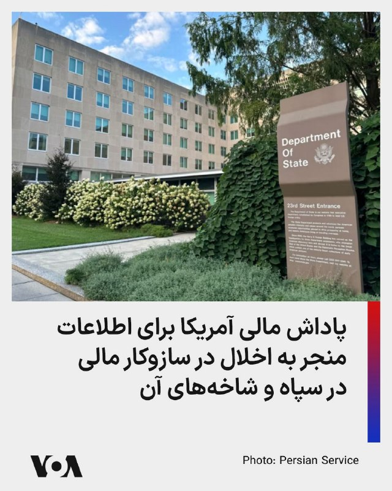

⚡️وزارت خارجه آمریکا، با اعلام خبر تحریم‌های روز دوشنبه علیه شبکه بین‌المللی فروش نفت سپاه، گفت «برنامه پاداش برای عدالت» وزارت امور خارجه ایالات متحده، تا سقف ۱۵ میلیون دلار برای اطلاعاتی که منجر به اختلال در سازوکارهای مالی سپاه پاسداران انقلاب اسلامی و شاخه‌های مختلف آن شود، پاداش می‌دهد.
@FarsiVOA

## FarsiVOA — post 217488

⚡️تازه‌ترین واکنش‌های قانون‌گذاران آمریکایی به تحولات مرتبط با ایران
@FarsiVOA

## FarsiVOA — post 217487

  <a href="telegram/content/FarsiVOA_217487_1778539491.mp4" target="_blank">🎬 Download video</a>

⚡️بحران برق در ایران و نگرانی‌ها درباره آینده صادرات انرژی به افغانستان
@FarsiVOA

## FarsiVOA — post 217486

⚡️پوشش ویژه | پرزیدنت ترامپ میزبان قهرمانان ملی فوتبال آمریکایی
@FarsiVOA

## FarsiVOA — post 217485

⚡️دونالد ترامپ: پاسخ حکومت ایران به پیشنهاد صلح ایالات متحده را «پیشنهادی احمقانه» است
@FarsiVOA

## FarsiVOA — post 217484

🔺وزارت خزانه‌داری آمریکا به بانک‌ها دستور داد شبکه‌های مشکوک پول‌شویی مرتبط با رژیم ایران را شناسایی و گزارش کنند

▪️وزارت خزانه‌داری آمریکا روز دوشنبه ۲۱ اردیبهشت از بانک‌ها و دیگر مؤسسات مالی این کشور خواست شبکه‌های احتمالی پولشویی مرتبط با جمهوری اسلامی ایران را که از منابع مالی خود برای قاچاق نفت تحریم‌شده از طریق شرکت‌های پوششی و شبکه‌های رمزارزی استفاده می‌کنند، شناسایی کرده و گزارش کنند.

⬇️ بیشتر بخوانید:
https://ir.voanews.com/a/treasury-banking-monitoring-money-laundering-iran/8148885.html
@FarsiVOA

## FarsiVOA — post 217483

🔺آمریکا شبکه بین‌المللی فروش نفت سپاه پاسداران را هدف تحریم‌های تازه قرار داد

▪️وزارت خزانه‌داری ایالات متحده روز دوشنبه ۲۱ اردیبهشت از اعمال تحریم‌های جدید علیه ۱۲ فرد و شرکت مرتبط با شبکه فروش نفت سپاه پاسداران انقلاب اسلامی خبر داد؛ اقدامی که بخشی از کارزار «خشم اقتصادی» دولت رئیس جمهوری آمریکا، دونالد ترامپ علیه رژیم ایران توصیف شده است.

⬇️ بیشتر بخوانید:
https://ir.voanews.com/a/ofac-sanctions-twelve-iranian-individuals-and-entities-oil/8148883.html
@FarsiVOA

## FarsiVOA — post 217482

  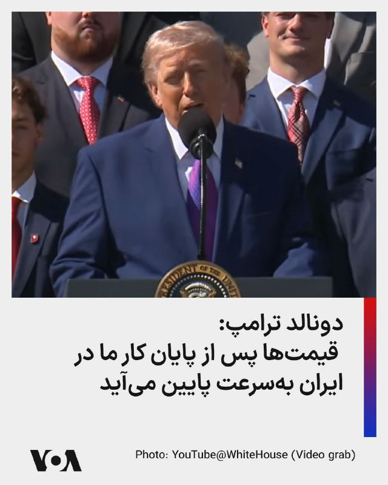

⚡️دونالد ترامپ، رئیس جمهوری آمریکا، دوشنبه عصر در یک سخنرانی در کاخ سفید با اشاره به قیمت‌های انرژی گفت: «ما مجبور شدیم سفری به کشور زیبای ایران داشته باشیم. نمی‌خواستیم اجازه دهیم آنها به سلاح هسته‌ای دست پیدا کنند. و تصمیم درستی گرفتیم و حالا اوضاع‌مان خیلی خوب است. به‌محض اینکه آن ماجرا تمام شود، قیمت‌ها به‌شدت کاهش پیدا خواهد کرد و ما آن را سر و سامان می‌دهیم.»

@FarsiVOA

## FarsiVOA — post 217481

⚡️دونالد ترامپ، رئیس جمهوری آمریکا، روز دوشنبه ۲۱ اردیبهشت، طی مراسمی در کاخ سفید، درباره مذاکرات جاری با رژیم ایران گفت که رهبران جمهوری اسلامی افرادی غیرشرافتمند و دیوانگانی هستند که مدام نظرشان را تغییر می‌دهند. صدای آمریکا بخشی از این مراسم را به طور زنده و با ترجمه همزمان پژواک کیومرثی پخش کرد.
@FarsiVOA

## FarsiVOA — post 217480

  <a href="telegram/content/FarsiVOA_217480_1778539493.mp4" target="_blank">🎬 Download video</a>

⚡️سینا قنبرپور در برنامه تفسیر خبر: از زنان ایران بیاموزیم که چگونه یک حکومت خودکامه را به عقب برانیم
@FarsiVOA

## FarsiVOA — post 217479

🔺سی‌ان‌ان: رژیم ایران شبکه‌های خرابکاری را برای اقدامات یهودستیزانه در اروپا اجیر می‌کند

▪️شبکه «سی‌ان‌ان» در یک تحقیق مفصل گزارش داده است که رژیم ایران و گروه‌های نیابتی وابسته به آن در حال گسترش شبکه‌های اطلاعاتی و خرابکاری خود در اروپا هستند. آنها از طریق شبکه‌های اجتماعی افراد مختلفی مثل مجرمان، جوانان، و نیروهای اجیرشده را برای جمع‌آوری اطلاعات و انجام عملیات علیه یهودستیزانه جذب می‌کنند.

⬇️ بیشتر بخوانید:
https://ir.voanews.com/a/cnn-report-iran-antisemitism-terrorism-britain/8148804.html
@FarsiVOA

## FarsiVOA — post 217478

⚡️در گفت‌وگو با حسن هاشمیان از صدای آمریکا به سفر پنهانی اسماعیل قاآنی به بغداد پرداختیم؛ سفری که به‌گفته آقای هاشمیان با «ورود و دیدار قاچاقی» فرمانده نیروی قدس انجام شده و هدفش مهار دولت جدید عراق و دور کردن علی الزیدی از واشنگتن در میانه کشمکش فزاینده جمهوری اسلامی و آمریکا است.
@FarsiVOA

## FarsiVOA — post 217477

  <a href="telegram/content/FarsiVOA_217477_1778539494.mp4" target="_blank">🎬 Download video</a>

⚡️نازیلا گلستان در برنامه تفسیر خبر: آزادی زندانیان سیاسی باید به یک مطالبه ملی تبدیل شود
@FarsiVOA

## FarsiVOA — post 217476

⚡️در برنامه تفسیر خبر امروز، مهدی آقازمانی با کارشناسان مهمان، درباره چالش موجود در مذاکرات بین آمریکا و باقی‌مانده جمهوری اسلامی در سایه تشدید فشار داخلی بر مردم ایران از سوی حکومت و تلاش برای سرعت بخشی به اعدام معترضان، گفتگو می‌کند
@FarsiVOA

## FarsiVOA — post 217475

  <a href="telegram/content/FarsiVOA_217475_1778539495.mp4" target="_blank">🎬 Download video</a>

⚡️آلان توفیقی: اپوزسیون ایران به جای همگرایی به واگرایی رسیده است
@FarsiVOA

## DW_Farsi — post 124578

  

🔶 سفر قاآنی به عراق برای جلوگیری از خلع‌ سلاح حامیان جمهوری اسلامی

رسانه‌های عربی به نقل از منابع عراقی گزارش داده‌اند که تلاش‌هایی برای به تعویق انداختن نشست پارلمان عراق، که قرار است به رای‌گیری درباره ترکیب کابینه علی الزیدی اختصاص یابد، در جریان است.

بر اساس این گزارش‌ها، در درون "چارچوب هماهنگی" بر سر توزیع پست‌های وزارتی اختلاف‌های جدی وجود دارد و همین موضوع برگزاری نشست پارلمان را با تاخیر روبه‌رو کرده است.

هم‌زمان، روزنامه الشرق الاوسط به نقل از دو مقام عراقی گزارش داد که اختلاف بر سر نقش گروه‌های مسلح نزدیک به ایران، روند تشکیل دولت جدید عراق را با مانع روبه‌رو کرده است.

به گفته این منابع، تهران با تلاش‌ها برای محدود کردن حضور این گروه‌ها در ساختار دولت آینده مخالفت کرده و از جریان‌های همسو خواسته است از حمایت هر کابینه‌ای که به تضعیف جایگاه این نیروها منجر شود، خودداری کنند.

این گزارش‌ها هم‌زمان با خبرهایی درباره سفر اسماعیل قاآنی، فرمانده نیروی قدس سپاه پاسداران انقلاب اسلامی، به بغداد منتشر شده‌اند.
@dw_farsi

## DW_Farsi — post 124577

  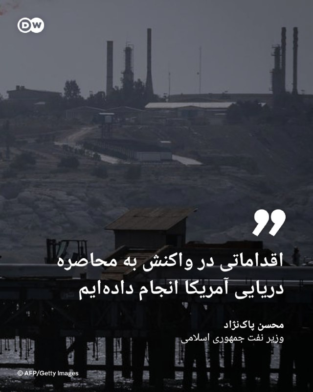

🔶 وزیر نفت ایران: اقداماتی در واکنش به محاصره دریایی آمریکا انجام داده‌ایم

محسن پاک‌نژاد، وزیر نفت جمهوری اسلامی، روز دوشنبه ۱۱ مه (۲۱ اردیبهشت) در گفت‌وگو با تلویزیون دولتی ایران گفت بخش نفت این کشور از زمان آغاز محاصره دریایی آمریکا علیه بنادر ایران با برخی مشکلات روبه‌رو شده، اما وزارت نفت اقدام‌های مقابله‌ای انجام داده است.

او بدون اشاره به جزئیات این اقدام‌ها گفت این روند همچنان ادامه دارد. پاک‌نژاد در عین حال اظهار داشت: «در طول ۴۰ روز جنگ، تولید ما کاهش پیدا نکرد و روند صادرات مطلوب بود.»

او افزود: «طبیعتا در روزهای پس از محاصره آمریکا با چالش‌هایی روبه‌رو شده‌ایم، اما اقدام‌هایی انجام شده و این روند ادامه دارد». وزیر نفت جمهوری اسلامی در ادامه گفت: «دشمن دچار توهم است.»

در همین حال، خبرگزاری رویترز گزارش داد که پاک‌نژاد در اظهارات خود جزئیاتی درباره این تدابیر ارائه نکرده است.

پیش‌تر نیز برخی مقام‌های آمریکایی گفته بودند جمهوری اسلامی در حال سازگار شدن با محاصره از راه‌های مختلف است.
@dw_farsi

## Persian_Trend_Official — post 13949

  

🔹محمد باقر قالیباف

💢هیچ راهی جز پذیرش حقوق ملت ایران، آن‌گونه که در طرح ۱۴ بندی آمده، وجود ندارد.

💢هر مسیر دیگری کاملاً بی‌نتیجه خواهد بود و چیزی جز شکست‌های پیاپی به همراه نخواهد داشت.

💢هرچه بیشتر وقت‌کشی کنند، هزینه بیشتری هم از جیب مالیات‌دهندگان آمریکایی پرداخت خواهد شد.

🫆:Tony

📌 @persian_trend_official
پرشین ترند | متفاوت‌ترین کانال نظامی

## Persian_Trend_Official — post 13948

  

🔴 وال‌استریت ژورنال: امارات حملات مخفیانه‌ای علیه ایران انجام داده است

💢وال‌استریت ژورنال به نقل از منابع مدعی شد امارات متحده عربی به‌صورت مخفیانه چند حمله نظامی علیه ایران انجام داده که از جمله آن‌ها حمله به یک پالایشگاه نفت در جزیره لاوان در اوایل آوریل بوده است؛ تقریباً هم‌زمان با زمانی که ترامپ از آتش‌بس صحبت کرده بود.

💢طبق این گزارش، این حمله باعث آتش‌سوزی گسترده شده و پالایشگاه را برای چند ماه از مدار خارج کرده است.

💢در ادامه ادعا شده ایران نیز در پاسخ، حملات موشکی و پهپادی علیه امارات و کویت انجام داده است.

🫆:Tony

📌 @persian_trend_official
پرشین ترند | متفاوت‌ترین کانال نظامی

## Persian_Trend_Official — post 13947

  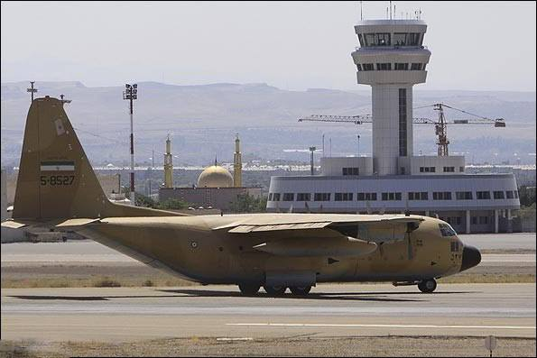

🔴 ادعای سی‌بی‌اس درباره پرواز هواپیماهای ایرانی به پاکستان برای حفاظت در برابر حملات

به گزارش سی‌بی‌اس به نقل از مقامات آمریکایی، چند روز پس از اعلام آتش‌بس میان ایران و آمریکا در اوایل آوریل، چند فروند هواپیمای ایرانی به پایگاه هوایی «نور خان» نیروی هوایی پاکستان در نزدیکی راولپندی اعزام شده‌اند.

بر اساس این ادعا:

این پایگاه یک مرکز نظامی مهم در حومه اسلام‌آباد/راولپندی محسوب می‌شود.

در میان هواپیماهای اعزامی، یک فروند C-130 هرکولس نیروی هوایی ایران نیز دیده شده است

📌 این گزارش هنوز به‌طور مستقل تأیید نشده و جزئیات رسمی از سوی ایران یا پاکستان منتشر نشده است.

🫆:Tony

📌 @persian_trend_official
پرشین ترند | متفاوت‌ترین کانال نظامی

## Persian_Trend_Official — post 13946

  <a href="telegram/content/Persian_Trend_Official_13946_1778539498.mp4" target="_blank">🎬 Download video</a>

🔹 آتش سوزی در پالایشگاه اوکلاهامای آمریکا

💢منابع خبری از وقوع آتش‌سوزی در پالایشگاه شرکت اچ‌اف سینکلر در تولسا، در اوکلاهمای آمریکا خبر دادند.

💢در جریان این حادثه دود سیاه عظیمی از این تأسیسات  نفتی به آسمان برخاست.

💢مقامات هنوز علت این آتش سوزی یا اینکه آیا کسی آسیب دیده است یا خیر را اعلام نکرده‌اند.

🫆:Tony

📌 @persian_trend_official
پرشین ترند | متفاوت‌ترین کانال نظامی

## Persian_Trend_Official — post 13945

🔴 ۶۰ نماینده حزب کارگر خواستار کناره‌گیری استارمر شدند

شبکه «اسکای‌نیوز» گزارش داد تاکنون ۶۰ نماینده حزب کارگر بریتانیا خواستار کناره‌گیری «کی یر استارمر» نخست‌وزیر این کشور شده‌اند.

🫆:Tony

📌 @persian_trend_official
پرشین ترند | متفاوت‌ترین کانال نظامی

## Persian_Trend_Official — post 13944

  <a href="telegram/content/Persian_Trend_Official_13944_1778539500.webm" target="_blank">🎬 Download video</a>

💢وزیر دفاع بلژیک

💢به فرانسه و انگلیس برای پاکسازی تنگه هرمز از مین‌های دریایی و بازگشت به دریانوردی آزاد خواهیم پیوست.

🫆:Tony

📌 @persian_trend_official
پرشین ترند | متفاوت‌ترین کانال نظامی

## Persian_Trend_Official — post 13943

🔴وزارت خزانه داری آمریکا اطلاع داده که تحریم های جدیدی علیه افراد مرتبط با جمهوری اسلامی اعمال کرده است

🫆:Tony

📌 @persian_trend_official
پرشین ترند | متفاوت‌ترین کانال نظامی

## RadioFarda — post 157068

آمریکا تحریم‌های جدیدی را علیه شبکه مالی حامی ایران اعمال کرد

🔸وزارت خزانه‌داری آمریکا در ادامه کارزار «خشم اقتصادی» علیه تهران، از اعمال تحریم‌های جدیدی علیه شبکه‌های مالی حامی جمهوری اسلامی خبر داد.

🔸بر اساس بیانیه‌ای که در وب‌سایت رسمی این وزارتخانه منتشر شد، واشینگتن ۳ فرد و ۹ نهاد را به فهرست تحریم‌های خود اضافه کرده است.

🔸نکته قابل توجه در این فهرست، حضور ۴ شرکت مستقر در هنگ‌کنگ است که به گفته مقامات آمریکایی، «نقشی کلیدی در تسهیل جابه‌جایی پول و دور زدن تحریم‌های نفتی ایران در بازارهای آسیایی» ایفا می‌کردند.

🔸بر اساس بیانیۀ وزارت خزانه‌داری ایالات متحده، این افراد و شرکت‌ها، انتقال نفت ایران به چین را تسهیل می‌کرده‌اند.

🔸مقامات وزارت خزانه‌داری آمریکا پیشتر تأکید کرده بودند که ردیابی دارایی‌های سپاه پاسداران در بانک‌های بین‌المللی با همکاری متحدان منطقه‌ای با سرعت بیشتری ادامه خواهد یافت.

🔸به گزارش رویترز، تحلیلگران معتقدند هدف قرار دادن شرکت‌های مستقر در هنگ‌کنگ، پیامی صریح به شبکه‌های واسطه در شرق آسیاست که همچنان به همکاری مالی با تهران ادامه می‌دهند. این تحریم‌ها در شرایطی اعمال می‌شود که بن‌بست دیپلماتیک میان واشینگتن و تهران بر سر بازگشایی تنگه هرمز و برنامه هسته‌ای همچنان پابرجاست.

@RadioFarda

## RadioFarda — post 157067

  

تشکیل جلسه امنیتی در کاخ سفید برای تصمیم‌گیری درباره جنگ ایران

🔸در پی سخنان دونالد ترامپ درباره پیشنهادات تازه ایران، وب‌سایت خبری اکسیوس روز دوشنبه به نقل از سه منبع خبر داد که قرار است برای تصمیم‌گیری درباره گام‌های پیشِ رو در مورد ایران در کاخ سفید جلسه امنیتی تشکیل شود.

🔸به نوشته اکسیوس، بررسی امکان بازگشت به حمله نظامی از جمله این گام‌های احتمالی است.

🔸بر اساس این گزارش، علاوه بر رئیس جمهور آمریکا، جی‌دی ونس، معاون او، استیو ویتکاف، نماینده ویژه ترامپ، مارکو روبیو، وزیر خارجه، و پیت هگست، وزیر دفاع، نیز در این جلسه حضور خواهند داشت.

🔸اکسیوس از دن کین، رئیس ستاد مشترک ارتش آمریکا، و جان رتکلیف، رئیس سی‌آی‌ای، به عنوان دو شرکت‌کننده دیگر در این جلسه امنیتی نام برده است.

🔸این جلسه پس از آن برگزار می‌شود که ترامپ در دفتر کار خود در گفت‌وگو با خبرنگاران پیشنهادات تازه حکومت ایران را «احمقانه» و «آشغال» نامید و چنین نظر داد که آتش‌بس فعلی به‌زور زنده نگه داشته شده است.

@RadioFarda

## IranianMinds — post 19983

## IranianMinds — post 19982

  

🔴 سی بی اس نیوز:

پاکستان به‌طور پنهانی به ایران اجازه داد تا هواپیماهای نظامی از جمله یک هواپیمای شناسایی RC-130 را در پایگاه هوایی راهبردی نورخان نزدیک راولپندی پارک کند، حتی در حالی که اسلام‌آباد به‌طور عمومی خود را به‌عنوان میانجی بین تهران و واشنگتن معرفی می‌کرد.

ایران همچنین هواپیماهای غیرنظامی خود را به افغانستان منتقل کرد؛ از جمله یک هواپیمای ماهان ایر که از کابل به هرات منتقل شد تا در جریان حملات هوایی پاکستان به کابل در ماه مارس در امنیت باشد.

مقامات پاکستان و طالبان افغانستان این ادعاها را رد کردند، در حالی که مقامات آمریکایی می‌گویند این اقدام به‌نظر می‌رسد با هدف محافظت از دارایی‌های ایرانی در برابر حملات آمریکا انجام شده باشد

@IranianMinds

## IranianMinds — post 19981

فقط کافیه مرغ از خیابون رد کنی و‌پولت چند برابر کنی
💵👌

## IranianMinds — post 19980

  <a href="telegram/content/IranianMinds_19980_1778539502.mp4" target="_blank">🎬 Download video</a>

بچه ها اسم این بازی عبور مرغ از خیابون  هست ویدئو نگاه کنید خیلی راحت 8 میلیون ازش سود گرفتیم😍

😤اگ توم دوس داری خیلی راحت از بازی های انلاین پول در بیاری حتما عضو کازینو شبانه شو
✅

توی کازینو شبانه بهت اموزش میدیم از بازی های انلاین پول دربیاری👌

کازینو شبانه راهی برای چند برابر کردن سرمایت 🤷‍♂

کسب درامد انلاین با یه ادم حرفه ای یاد بگیر و‌ پول دربیار 
💵
ae21
🎯همین حالا عضو شو و شروع کن👇
https://t.me/+OS-QBvyDO4M2ZGY0
https://t.me/+OS-QBvyDO4M2ZGY0

## IranianMinds — post 19979

  

🔴 ترامپ :

من خیلی منتظر سفرم به چین هستم، یک کشور فوق‌العاده، با رهبری، رئیس‌جمهور شی، که مورد احترام همه است.

کارهای بزرگی برای هر دو کشور رخ خواهد داد!

@IranianMinds

## IranianMinds — post 19978

🔴 کی‌ر استارمر، نخست وزیر بریتانیا : می‌دونم مردم و حتی کشور ازم ناراضی شدن

ولی قصد ندارم استفعا بدم و می‌خوام ثابت کنم که منتقدها اشتباه میکنن

@IranianMinds

## IranianMinds — post 19977

  

🔴 قالیباف:

نیروهای مسلح ما آماده‌اند تا پاسخ شایسته‌ای به هرگونه تجاوز بدهند؛ استراتژی اشتباه و تصمیمات نادرست همیشه به نتایج اشتباه منجر می‌شوند — کل جهان قبلاً این را فهمیده است.

ما برای همه گزینه‌ها آماده‌ایم؛ آن‌ها غافلگیر خواهند شد.

@IranianMinds

## IranianMinds — post 19976

🔴وال‌استریت‌ژورنال:

حمله ماه پیش به جزیره لاوان ایران، کار امارات بوده است.

@IranianMinds

## IranianMinds — post 19975

🔴کانال ۱۲ اسرائیل:

رئیس جمهور ترامپ تمایل دارد دستور از سرگیری درگیری با ایران را صادر کند.

@IranianMinds

## IranianMinds — post 19974

  

درود قهرمان.

@IranianMinds

## BBCPersian — post 280793

  

🔻به گزارش نشریه آمریکایی وال استريت ژورنال، امارات متحده عربی به‌طور مخفيانه حملات نظامی عليه ايران انجام داده است؛ موضوعی که به گفته منابع آگاه به این نشریه، می تواند امارات را به يکی از طرف‌های فعال مخاصمه با ایران مطرح کند.

منابع آگاه به وال استریت ژورنال گفته‌اند حملاتی که امارات تاکنون به‌صورت علنی تاييد نکرده، شامل حمله به يک پالايشگاه در جزيره لاوان در خليج فارس بوده است.

در اوايل آوريل گذشته و هم‌زمان با اعلام آتش‌بس از سوی دونالد ترامپ چند حمله هوایی به تاسیسات نفتی ایران در جزایر این کشور و اصطلاحا مناطق فلات قاره شرکت ملی نفت ایران صورت گرفت که باعث آتش‌سوزی گسترده و خروج بخش بزرگی از ظرفيت پالايشگاه لاوان از مدار برای چندين ماه شد.

ايران در آن زمان اعلام کرده بود اين پالايشگاه در يک «حمله دشمن» هدف قرار گرفته و در پاسخ، موجی از حملات موشکی و پهپادی عليه امارات و کويت انجام داده است.

📸AFP via Getty Images
https://bbc.in/4tyiBDX
@BBCPersian

## BBCPersian — post 280792

🔻رئیس سازمان انرژی اتمی: غنی‌سازی قابل مذاکره نیست

محمد اسلامی، رئیس سازمان انرژی اتمی ایران در نشست کمیسیون امنیت ملی مجلس با اشاره به این که «فناوری هسته‌ای در دستور کار مذاکرات قرار ندارد» گفت که برنامه غنی‌سازی ایران «قابل مذاکره نیست.»

آقای اسلامی گفت که «تمهیدات لازم» برای حفاظت از مراکز و دارایی‌های هسته‌ای ایران انجام شده است.

دونالد ترامپ عصر امروز درباره ذخیره اورانیوم غنی‌شده ایران گفته بود: «ایران به من گفت که می‌خواهد گردوغبار هسته‌ای را به ما بدهند. اما باید خودتان آن را خارج کنید.»

https://bbc.in/4nlrNud
@BBCPersian

## BBCPersian — post 280791

🔻نماینده ایران در سازمان بین‌المللی دریانوردی: اقدام آمریکا علیه دو نفتکش حامل خدمه ایرانی غیرقانونی است

نماینده جمهوری اسلامی ایران در سازمان بین‌المللی دریانوردی (آیمو) در نامه‌ای به دبیرکل این سازمان، اقدام علیه دو نفتکش حامل خدمه ایرانی را «غیرقانونی و غیرانسانی» خواند و واشنگتن را «مسئول جان و سلامت دریانوردان» گرفتار در این وضعیت دانست.

به گفته علی موسوی، این دو نفتکش در جریان عملیات محاصره دریایی آمریکا و به دلیل آن چه که «حمل محموله مرتبط با ایران» خوانده شده، توقیف شده‌اند.

در این نامه آمده است که حدود ۶۰ نفر از خدمه دو نفتکش «ام‌تی تیفانی» و «ام‌تی ماجستیک» پس از توقیف، به یدک‌کش منتقل شده‌اند و در شرایطی «نامناسب و ناامن» نگهداری می‌شوند.

در این نامه گفته شده است که که این افراد تاکنون بیش از«۱۲۰۰ مایل دریایی» جابه‌جا شده‌اند و با کمبود غذا و آب روبه‌رو هستند.

آقای موسوی همچنین گفته است که این شناور اجازه حرکت به سمت مالزی را نداشته و تحت فشار نیروهای آمریکایی به سمت سنگاپور هدایت شده، اما هنوز مجوز پیاده شدن خدمه در این بندر صادر نشده است.

نماینده ایران در آیمو با محکوم کردن رفتار آمریکا، این اقدامات را «غیرقانونی، غیرانسانی و مغایر با اصول بنیادین ایمنی جان انسان‌ها در دریا» توصیف کرد و هشدار داد که ادامه این وضعیت می‌تواند پیامدهای انسانی فاجعه‌باری به همراه داشته باشد.

او از دبیرکل آیمو و کشورهای عضو خواست برای ارسال فوری غذا، آب و کمک‌های پزشکی و همچنین فراهم کردن شرایط امن برای انتقال و تعیین تکلیف خدمه اقدام کنند.

https://bbc.in/49pCSo6
@BBCPersian

## BBCPersian — post 280790

  <a href="telegram/content/BBCPersian_280790_1778539507.mp4" target="_blank">🎬 Download video</a>

🔻آخرین خبرهای مهم روز دوشنبه ۲۱ اردیبهشت ۱۴۰۵

@BBCPersian

## BBCPersian — post 280789

🔻لیتوانی اعزام نیروی نظامی برای کمک به آمریکا در تنگه هرمز را بررسی می‌کند

لیتوانی اعزام نیروی نظامی برای کمک به ایالات متحده در تنگه هرمز را بررسی می‌کند.

شورای دفاع دولتی لیتوانی که ریاست آن با رئیس‌جمهور است، امروز طرحی در این زمینه به پارلمان فرستاد.

این طرح می گوید که به دنبال آن است که لیتوانی بتواند تا ۴۰ سرباز و نیروی نظامی برای کمک به ایالات متحده در تنگه هرمز اعزام کند.

https://bbc.in/4d4DBxt
@BBCPersian

## BBCPersian — post 280788

🔻وزیر ارتباطات: در تلاش هستیم تا اینترنت در اسرع وقت برقرار شود

وزیر ارتباطات و فناوری اطلاعات با اشاره به قطع اینترنت گفته است که این وزارتخانه به نمایندگی از مردم به صورت شبانه روزی در حال پیگری است تا «دسترسی با کیفیت به اینترنت بین‌الملل برای کاربران در اسرع وقت برقرار شود.»

ستار هاشمی گفت که یکی از مطالبات به حق مردم و کسب و کارها از حاکمیت «دسترسی با کیفیت به اینترنت است.»

به گفته وزیر ارتباطات محدودیت دسترسی به اینترنت بین‌المللی به دلیل شرایط جنگی و بر اساس صلاح‌دید مراجع مربوطه بوده است.

او همچنین با ابراز امیدواری به این که این وضعیت هر چه سریع‌تر بهبود پیدا کند، افزود در این مورد جلسات مکرری در حوزه‌های مختلف برگزار شده است.

از زمان شروع جنگ در نهم اسفند ماه سال گذشته دسترسی به اینترنت در ایران قطع شده است.

https://bbc.in/4ubn7K2
@BBCPersian

## Dirty_Kids — post 389294

  <a href="https://t.me/Dirty_Kids/389294" target="_blank">📎 Download file</a>

✅ اپلیکیشن اندروید سایت جهانی دربی بت

💰اولین سایت جهانی با امکان شارژ و برداشت ریالی(کارت به کارت)

🔗 برای ورود فیلترشکن روی کشور مناسب قرار دهید مانند فنلاند و المان و....

😀Telegram Channel
👇
https://t.me/+bcynkEgSW2dlYTc0

## Dirty_Kids — post 389293

  

😤دنبال یه سایت شرط بندی بین المللی بودی که به ایرانیا خدمات بده؟!
⛔

👍دربی بت همون انتخاب  100%

💎ویژگی های سایت جهانی Derby Bet:

⬅️امکان شارژ امن با کارت بانکی

⬅️واریز اول دوبل شارژ می شوید(بونوس۱۰۰٪)

⬅️پر اپشن ترین سایت فعال در ایران

⬅️تسویه حساب کمتر از 5 دقیقه

⬅️برگشت بخشی از باخت به صورت هفتگی

🚨کد هدیه ثبت نام:GG007

⚠️برای دانلود اپلکیشن کلیک کنید
👉

🔔کانال دربی بت :

🪙https://t.me/+bcynkEgSW2dlYTc0

## Dirty_Kids — post 389292

  

#بخوابیم

@Dirty_Kids 👻

## Dirty_Kids — post 389291

  

سریال Margo's Got Money Troubles
مشکلات مالی مارگو

یه سریال خوب کمدی-درام که سرشار از سکس و نود ایناس...

از شبکه +AppleTV توقع نداشتم

@Dirty_Kids 👻

## Dirty_Kids — post 389290

کاش زودتر آیفون ۱۸ بیاد که آیفون ۱۷ ارزون‌تر بشه بتونیم تن ماهی بخریم

@Dirty_Kids 👻

## Dirty_Kids — post 389289

  <a href="telegram/content/Dirty_Kids_389289_1778539511.mp4" target="_blank">🎬 Download video</a>

مجتبی‌پور محسن مورد علاقم 😂😂

@Dirty_Kids 👻

## Dirty_Kids — post 389288

  <a href="telegram/content/Dirty_Kids_389288_1778539513.mp4" target="_blank">🎬 Download video</a>

پارگی پرچم شیر و خورشید و آزار فیزیکی؛ درگیری کوثر افتخاری با تجمع‌کنندگان پرو-فلسطین

برلین، آلمان – کوثر افتخاری، یکی از نمادهای آسیب‌دیدگان جنبش زن، زندگی، آزادی، در جریان تجمعات اخیر در برلین هدف حمله گروهی از تجمع‌کنندگان حامی فلسطین و جمهوری اسلامی قرار گرفت.
کوثر افتخاری در مهرماه ۱۴۰۱ (اکتبر ۲۰۲۲) طی اعتراضات تهران با سلاح پینت‌بال یا گلوله مستقیم به چشم راستش مورد اصابت قرار گرفت و بینایی یک چشم خود را از دست داد. او پس از این حادثه به آلمان پناهنده شد و در برلین ساکن گردید.
بر اساس ویدیوهای منتشرشده، کوثر در مقابل تجمع حامیان جمهوری اسلامی و گروه‌های pro-Palestine در برلین حضور یافت، پرچم شیر و خورشید را برافراشت و شعارهایی مانند «سپاه پاسداران تروریست است» و روایت شخصی خود از شلیک به چشمش را فریاد زد. در ادامه، تعدادی از حاضران به سمت او هجوم بردند، پرچم را از دستش ربودند و پاره کردند، او را محاصره کرده و با رفتارهای خشن فیزیکی و جنسیتی آزار دادند. پلیس آلمان دخالت کرد و حداقل دو نفر را بازداشت کرد.
قبل از این درگیری، در دوزهای گذشته...

@Dirty_Kids 👻

## Dirty_Kids — post 389287

  

ظاهراً عمو «لینسی گراهام»، این رفیق گرمابه و گلستان ترامپ شیر خدا قراره دهن کشور نیوخایه‌مال پاکستان رو در این مقطع بگاد

طبق توئیت خبرنگار بلومبرگ، در دوران آتش‌بس روافض هزارپدر چند فروند از هواپیماهای نظامی‌شون رو از جمله یک فروند RC-130 که مدلی پیشرفته از هواپیمای هرکولس C-130 برای عملیات‌های شناسایی و جمع‌آوری اطلاعاته رو به پایگاه هوایی نورخان پاکستان قرمساق فرستاده و اونجا پارک کرده [ظاهراً تعدادی رو هم به افغانستان فرستاده]

عمو «لینسی گراهام» در توئیتی نظرش در خصوص این کسکلک‌بازی پاکستانی‌ها رو این‌طور بیان کرده:

«اگه این گزارش‌ها صحت داشته باشه، نقش پاکستان قرمدنگ به عنوان میانجی‌گر بین شیعه‌سانان رافضی، آمریکا و سایر طرف‌ها باید به طور کامل مورد بازنگری قرار بگیره. [این کسکشای نیوخایه‌مال هم از توبره دارن می‌خورن هم از آخور]

با توجه به مواضع تندی که برخی مقامات دفاعی قرمساق پاکستانی علیه اسرائیل اتخاذ کرده بودن، اگه این خبر واقعیت داشته باشه [دهنشون گاییده‌ست] و خیلی شوکه نمی‌شم [از این بی‌شرفای جاکش‌پدر].»

@Dirty_Kids 👻

## Dirty_Kids — post 389286

  <a href="telegram/content/Dirty_Kids_389286_1778539516.mp4" target="_blank">🎬 Download video</a>

🔴تو قسمت جدید سریال "ايفوريا | Euphoria" سیدنی سویینی حسابی به فوت فتیش‌ها حال داده و علاوه بر نمایش پاهاش، اونارو شخصا لیس زده!

+ تو این سریالِ فاخر، بانو سویینی به علت مسائل مالی، اکانت اونلی فنز زده و داره از این طریق، امرار معاش میکنه.

@Dirty_Kids 👻

## Dirty_Kids — post 389283

  <a href="telegram/content/Dirty_Kids_389283_1778539518.mp4" target="_blank">🎬 Download video</a>

لامین یامال بازیکن بی اخلاق و خانم‌باز بارسا توی جشن قهرمانی بارسلونا پرچم فلسطین را برافراشته.

+ این در جریان ۱ ماه دیگه باید بره امریکا لای کلی ایرانی؟

@Dirty_Kids 👻

## Dirty_Kids — post 389282

  <a href="telegram/content/Dirty_Kids_389282_1778539519.webm" target="_blank">🎬 Download video</a>

🎶 کانفیگ من کجایی

@Dirty_Kids 👻

## Dirty_Kids — post 389281

‏صدا سیما از آپارات شکایت کرده و 3.5 همت براش حکم بریده
بعد یجوری تیم مدیریتی آپارات توقع دارن مردم پشتشون باشن انگار تا الان درصدی پشت مردم بودن
کون لقتون خودتون داخل خودتون کون خودتون رو پاره کنید

پ‌ن: درصدی دلتون نسوزه
طرف مالک صبا ایده‌س جدای آپارات کلی پلتفرم رانتی دیگه از جمله فیلیمو داره که سالها 10 ها برابر این هزینه رو از هر کدومش دراورده
بعد جالبه کسی که خودش صادر کننده حکم اولیه انحصار پلتفرم توی فعالیت های مجازیه از انحصار صدا و سیما میناله
هنوز سایت فیلم و سریال های متفاوتی که با شکایت فیلیمو به فاک رفتن چون رایگان بودن از یاد کسی نرفته
جالبی ماجرا چیه؟
خود فعالیت فیلیمو غیرقانونیه از نظر جهانی و دقیقا همون فیلم سریال خارجی رو از تورنت به رایگان میگیرن انکد میکنن و با اشتراک میدن دست ملت
چرا؟ چون مردم صلاحیت استفاده از بیت تورنت رو ندارن و شورای فیلترینگ از همون اول اکثر ترکر ها رو فیلتر کرده برای مردم عادی!!!!
درصدی این افراد دم از وای آزادی بیان و انحصار بازار بزنن باید کیرتو در بیاری شلاقی بذاری دهنشون!

@Dirty_Kids 👻

## Dirty_Kids — post 389280

اگه اینترنت غزه ۷۲ روز قطع می‌شد گرتا تونبرگ به نشانه‌ی اعتراض ۷۲ متر کابل اینترنت رو می‌کرد تو کونش.

@Dirty_Kids 👻

## Dirty_Kids — post 389279

  <a href="telegram/content/Dirty_Kids_389279_1778539520.mp4" target="_blank">🎬 Download video</a>

وقتی آبرو نداری، نگران از دست دادنش نیستی و حد و مرزی برات وجود نداره در دروغ و تظاهر و فرومایگی و رنگ عوض کردن و جنایت و .... !! شرم بر کسانی که هنوز امید به اصلاح و بهبود از این نکبت دارند !!

@Dirty_Kids 👻

## Hranews — post 112891

گزارشی از قطع بیمه کارگران شهرداری ارومیه

❗️
❗️
❗️
❗️
❗️– شماری از #کارگران شهرداری ارومیه از قطع بیمه درمانی خود خبر دادند. اداره تامین اجتماعی ارومیه به دلیل بدهی‌های مالی شهرداری به تامین اجتماعی، از تمدید اعتبار درمان این کارگرانی که نیازمند خدمات هستند، خودداری کرده است.

ادامه مطلب

↘️
@hranews_bot تماس ✉️ - @Hranews کانال هرانا 🆑

## Hranews — post 112890

ایرانشهر؛ ۴ شهروند در پی تیراندازی بی‌ضابطه نیروهای امنیتی کشته شدند

❗️
❗️
❗️
❗️
❗️– روز گذشته در پی #تیراندازی_بی‌ضابطه نیروهای اداره اطلاعات ایرانشهر به سمت یک خودرو، چهار سرنشین آن جان خود را از دست دادند.

ادامه مطلب

↘️
@hranews_bot تماس ✉️ - @Hranews کانال هرانا 🆑

## manototv — post 105327

  <a href="telegram/content/manototv_105327_1778539523.mp4" target="_blank">🎬 Download video</a>

سهیلا یوسفی فعال سیاسی و عضو حزب ایران نوین در گردهمایی ایرانیان روبروی دادگاه لاهه در هلند گفت: «شاهزاده رضا پهلوی تنها رهبر ماست».

## manototv — post 105326

  <a href="telegram/content/manototv_105326_1778539526.mp4" target="_blank">🎬 Download video</a>

روزنامه وال‌استریت ژورنال به نقل از منابع آگاه گزارش داد امارات متحده عربی به‌طور مخفیانه حملاتی نظامی علیه جمهوری اسلامی انجام داده و به یکی از طرف‌های مستقیم جنگ تبدیل شده است.

بر اساس این گزارش، یکی از این حملات در ماه آوریل پالایشگاه نفتی لاوان در خلیج فارس را هدف قرار داده؛ حمله‌ای که همزمان با اعلام آتش‌بس از سوی دونالد ترامپ رخ داده و باعث آتش‌سوزی گسترده و از کار افتادن بخش بزرگی از ظرفیت پالایشگاه برای چند ماه شده است.

به نوشته وال‌استریت ژورنال، جمهوری اسلامی در آن زمان اعلام کرده بود پالایشگاه در «حمله دشمن» هدف قرار گرفته و در واکنش، موجی از حملات موشکی و پهپادی علیه امارات و کویت انجام داده است.

این گزارش می‌گوید آمریکا از حمله امارات ناراضی نبوده و به‌طور غیرعلنی از مشارکت کشورهای خلیج فارس در جنگ علیه جمهوری اسلامی استقبال کرده است.

وزارت خارجه امارات از اظهار نظر مستقیم درباره این حملات خودداری کرده، اما به بیانیه‌های پیشین خود درباره «حق پاسخ، از جمله پاسخ نظامی، به اقدامات خصمانه» اشاره کرده است.

وال‌استریت ژورنال همچنین گزارش داد جمهوری اسلامی بیش از ۲۸۰۰ موشک و پهپاد به سمت امارات شلیک کرده؛ حملاتی که به بخش‌های هوایی، گردشگری و بازار املاک این کشور آسیب زده است.

در این گزارش آمده امارات پس از آغاز جنگ، همکاری نظامی خود با آمریکا را حفظ کرده و همزمان اقداماتی علیه منافع مالی جمهوری اسلامی، از جمله محدودیت برای شهروندان ایرانی و تعطیلی مراکز مرتبط با تهران در دبی، انجام داده است.

## manototv — post 105325

  <a href="telegram/content/manototv_105325_1778539527.mp4" target="_blank">🎬 Download video</a>

‌
محمدباقر قالیباف، رئیس مجلس شورای اسلامی، در پیامی به زبان انگلیسی در شبکه اکس نوشت «هیچ» جایگزینی جز پذیرش «طرح ۱۴ ماده‌ای» وجود ندارد.

قالیباف افزود:
«هر رویکرد دیگری کاملاً بی‌نتیجه خواهد بود و چیزی جز شکست‌های پی‌درپی به همراه نخواهد داشت. هرچه بیشتر وقت‌کشی کنند، هزینه بیشتری بر دوش مالیات‌دهندگان آمریکایی گذاشته خواهد شد.»

## manototv — post 105324

  <a href="telegram/content/manototv_105324_1778539527.mp4" target="_blank">🎬 Download video</a>

تماسی از چنارشاهیجان کازرون:
از جاویدنامان علیرضا نادری، عارف براتی، فرزانه ساسانی‌پور، بهبود حسن‌زاده، جبار پناهی و آنیسا هوشنگی گفت…

## manototv — post 105323

  <a href="telegram/content/manototv_105323_1778539529.mp4" target="_blank">🎬 Download video</a>

وزارت خزانه‌داری آمریکا اعلام کرد ۱۲ فرد و نهاد را به‌دلیل نقش در فروش و انتقال نفت جمهوری اسلامی توسط سپاه پاسداران به چین تحریم کرده است.

در بیانیه دفتر کنترل دارایی‌های خارجی وزارت خزانه‌داری آمریکا آمده سپاه پاسداران برای پنهان کردن نقش خود در فروش نفت و انتقال درآمدها به جمهوری اسلامی، از شرکت‌های پوششی در کشورهای مختلف استفاده می‌کند.

اسکات بسنت، وزیر خزانه‌داری آمریکا، گفت: «در حالی که ارتش ایران تلاش می‌کند خود را بازسازی کند، عملیات “خشم اقتصادی” به محروم کردن جمهوری اسلامی از منابع مالی برنامه‌های تسلیحاتی، نیروهای نیابتی و جاه‌طلبی‌های هسته‌ای ادامه خواهد داد.»

وزارت خزانه‌داری آمریکا همچنین اعلام کرد جمهوری اسلامی به‌جای استفاده از درآمدهای نفتی برای حمایت از مردم ایران، این منابع را صرف توسعه تسلیحات، حمایت از گروه‌های نیابتی و تأمین مالی نیروهای امنیتی می‌کند.

در میان افراد تحریم‌شده، نام احمد محمدی‌زاده، رئیس قرارگاه نفتی شهید پورجعفری سپاه، صمد فتحی سلامی، مسئول مالی این قرارگاه، و محمدرضا اشرفی گهی، مسئول بازرگانی آن، دیده می‌شود.

همچنین چند شرکت مستقر در هنگ‌کنگ، دبی، عمان و شارجه به اتهام همکاری در انتقال نفت ایران و دور زدن تحریم‌ها هدف تحریم قرار گرفته‌اند.

وزارت خزانه‌داری آمریکا هشدار داد هر شرکت یا مؤسسه مالی خارجی که با شبکه‌های مرتبط با سپاه پاسداران همکاری کند، ممکن است هدف تحریم‌های ثانویه آمریکا قرار گیرد.

## alonews — post 119403

  <a href="telegram/content/alonews_119403_1778539531.webm" target="_blank">🎬 Download video</a>

👈خبرگزاری والا: ساختار دفاعی اسرائیل ارزیابی می‌کند که مجتبی خامنه‌ای مانع اصلی پیشرفت در مذاکرات ایالات متحده و جمهوری اسلامی است.

✅ @AloNews خبر جنگ

## alonews — post 119402

  

🔥
🔝از اول جنگ کانفیگ های اینجا وصله بدون قطعی، سروراش تضمین بازگشت وجه داره، درجه یک با کیفیت. قیمت خیلی مناسب گیگی 250 پرداخت ارزی و تومن داره

🖥آیدی خود عسل @Asal_vpn021

آیدی کانالش
⬇️

👑
⭐️https://t.me/+wXrSv4IM6p9kNGQ0

👑
⭐️https://t.me/+wXrSv4IM6p9kNGQ0

## alonews — post 119401

  <a href="telegram/content/alonews_119401_1778539532.mp4" target="_blank">🎬 Download video</a>

👈حرکت جنگنده های سنگین امشب بر فراز بغداد پایتخت عراق مشاهده شد

✅ @AloNews خبر جنگ

## alonews — post 119400

  <a href="telegram/content/alonews_119400_1778539533.webm" target="_blank">🎬 Download video</a>

👈کیر استارمر: استعفا نمیدم

✅ @AloNews خبر جنگ

## alonews — post 119399

  <a href="telegram/content/alonews_119399_1778539533.webm" target="_blank">🎬 Download video</a>

👈وال استریت ژورنال:
در پی حمله امارات به لاوان ایران پس از اعلام آتش بس ترامپ و تهران، ایران با حملات موشکی و پهپادی به امارات و کویت پاسخ داد.

🔴ایالات متحده از این حملات امارات ناراحت نشده و به‌طور خصوصی از مشارکت امارات و دیگر کشورهای حوزه خلیج فارس که مایل به پیوستن به نبرد هستند، استقبال کرده است.

✅ @AloNews خبر جنگ

## alonews — post 119398

  <a href="telegram/content/alonews_119398_1778539533.webm" target="_blank">🎬 Download video</a>

👈شیخ منصور، معاون رئیس امارات: ایرانی ها در حد امارات متحده عربی نیستند و بهتر است اراده ما را محک نزنند زیرا ما خود آتش هستیم

🔴آنها باید جزایر ما را پس دهند

✅ @AloNews خبر جنگ

## alonews — post 119397

  <a href="telegram/content/alonews_119397_1778539533.mp4" target="_blank">🎬 Download video</a>

👈یک روحانی در صداوسیما:
امام علی شوهر زنی را کشت اما چون مهربان بود با زن بیوه دوست شد با او به خونه‌‌اش رفت، بعد شام هم با بچه‌های زن بیوه بازی کرد هم با خود زن بیوه

🔴پ.ن: سوال اینجاست که این روحانی چطور از تمام جزئیات هم خبر دارد؟ مشخص است فقط دروغ میگوید

✅ @AloNews خبر جنگ

## alonews — post 119396

  <a href="telegram/content/alonews_119396_1778539535.webm" target="_blank">🎬 Download video</a>

👈دبیرکل سازمان ملل: جنگ باید تموم بشه

✅ @AloNews خبر جنگ

## alonews — post 119394

  <a href="telegram/content/alonews_119394_1778539535.mp4" target="_blank">🎬 Download video</a>

تهران در روزهای آتش بس

البته تهران پُرو

[@AloTweet]

## alonews — post 119392

  <a href="telegram/content/alonews_119392_1778539537.webm" target="_blank">🎬 Download video</a>

👈قالیباف: 
راه دیگری جز پذیرش حقوق مردم ایران که در پیشنهاد ۱۴ بندی آمده است، وجود ندارد.

🔴هر رویکرد دیگری کاملاً بی‌نتیجه و شکست‌ پشت شکست خواهد بود.

🔴هرچه بیشتر تعلل کنند، مالیات‌دهندگان آمریکایی هزینه بیشتری از جیب خود خواهند پرداخت.

✅ @AloNews خبر جنگ

## alonews — post 119391

  <a href="telegram/content/alonews_119391_1778539538.webm" target="_blank">🎬 Download video</a>

👈سایت خبری اسرائیلی والا به نقل از منابع: واشنگتن یک هفته پیشدر آستانه تصمیم گیری برای از سرگیری حملات به ایران بود

🔴افراد نزدیک به ترامپ هفته گذشته در آخرین لحظه او را متقاعد کردند که تصمیم به بازگشت به جنگ را متوقف کند.

🔴اسرائیل ارزیابی می‌کند که سید مجتبی خامنه‌ای همچنان مانع هرگونه پیشرفتی در مذاکرات می‌شود.

✅ @AloNews خبر جنگ

## alonews — post 119390

  <a href="telegram/content/alonews_119390_1778539538.webm" target="_blank">🎬 Download video</a>

🔴فوووووووووووری/ ایران به شورای امنیت سازمان ملل اطلاع داده است که در صورت اعزام زیردریایی هسته‌ای آمریکا به خاورمیانه، سطح غنی سازی ۱۰ تن اورانیوم باقی مانده را به ۶۰ درصد خواهد رساند!

✅ @AloNews خبر جنگ

## alonews — post 119389

  <a href="telegram/content/alonews_119389_1778539538.webm" target="_blank">🎬 Download video</a>

👈2 مقام ارشد آمریکایی به فاکس نیوز:
ترامپ به از سرگیری جنگ با ایران متمایل شده است.

✅ @AloNews خبر جنگ

## alonews — post 119388

  <a href="telegram/content/alonews_119388_1778539538.webm" target="_blank">🎬 Download video</a>

👈 آخرین قیمت نفت ۱۰۴.۲۴ دلار

✅ @AloNews خبر جنگ

## alonews — post 119387

  <a href="telegram/content/alonews_119387_1778539539.webm" target="_blank">🎬 Download video</a>

👈مدیرعامل آرامکو: اگر تنگهٔ هرمز همین امروز هم باز شود، بازگشت تعادل به بازار نفت ماه‌ها زمان خواهد برد

🔴اما اگر بازگشایی تنگه چند هفتهٔ دیگر به تعویق بیفتد، عادی‌سازی شرایط تا سال ۲۰۲۷ طول خواهد کشید.

✅ @AloNews خبر جنگ

## alonews — post 119386

  <a href="telegram/content/alonews_119386_1778539539.webm" target="_blank">🎬 Download video</a>

👈وال استریت ژورنال، با استناد به منابع:
امارات متحده عربی حملات نظامی علیه ایران انجام داده است، از جمله حمله به یک پالایشگاه در جزیره لاوان ایران

✅ @AloNews خبر جنگ

## alonews — post 119385

  <a href="telegram/content/alonews_119385_1778539539.webm" target="_blank">🎬 Download video</a>

👈فرماندهی عملیات مشترک عراق تأیید کرد که نیروهایش در ماه مارس با «واحدهای ناشناس بدون مجوز» که توسط هواپیما پشتیبانی می‌شدند در بیابان کربلا درگیر شدند، در حالی که تأکید کرد در حال حاضر هیچ نیروی غیرمجاز یا پایگاهی در خاک عراق وجود ندارد.

✅ @AloNews خبر جنگ

## alonews — post 119384

  <a href="telegram/content/alonews_119384_1778539539.webm" target="_blank">🎬 Download video</a>

👈کانال ۱۲ اسرائیل: رئیس‌جمهور ترامپ تمایل دارد دستور ازسرگیری درگیری با ایران را صادر کند

✅ @AloNews خبر جنگ

## alonews — post 119383

  <a href="telegram/content/alonews_119383_1778539540.webm" target="_blank">🎬 Download video</a>

👈کارکنان یک بیمارستان در هلند پس از اشتباهات رویه‌ای مرتبط با یک بیمار مبتلا به هانتاویروس، ایزوله شده‌اند، به گفته خبرگزاری AFP

✅ @AloNews خبر جنگ

## alonews — post 119382

  <a href="telegram/content/alonews_119382_1778539540.mp4" target="_blank">🎬 Download video</a>

👈ذوالنور عضو کمیسیون قضایی و حقوقی مجلس: هر شناوری که بخواهد از تنگه هرمز عبور کند را می‌توانیم از سمنان ،تهران و مشهد بزنیم

✅ @AloNews خبر جنگ

<!-- MSG END -->

<!-- NAV START -->

<a href="https://github.com/Monster-Of-Mishigan/aio-downloader/blob/main/telegram/content/archive_1.md" style="display:inline-block; padding:6px 12px; margin:0 4px; background-color:#2ea44f; color:white; text-decoration:none; border-radius:4px; font-weight:bold;">صفحه بعد</a>

<!-- NAV END -->
