# خواننده تلگرام

<!-- TOP_NAV START -->

<a href="https://github.com/Monster-Of-Mishigan/aio-downloader/blob/main/telegram/content/archive_1.md" style="display:inline-block; padding:6px 12px; margin:0 4px; background-color:#2ea44f; color:white; text-decoration:none; border-radius:4px; font-weight:bold;">صفحه بعد</a>

<!-- TOP_NAV END -->

<!-- MSG START -->

---
📅 بروزرسانی: 1405/02/22 11:47
---

## VahidOOnLine — post 239660

  <a href="telegram/content/VahidOOnLine_239660_1778573824.mp4" target="_blank">🎬 Download video</a>

گروهی از نیروهای ارتش بریتانیا برای رساندن کمک پزشکی به یک شهروند بریتانیایی مشکوک به ابتلا به هانتاویروس، با چتر روی جزیره دورافتاده تریستان دا کونا در جنوب اقیانوس اطلس فرود آمدند.

بر اساس اعلام وزارت دفاع بریتانیا، این عملیات با حضور شش چترباز و دو پزشک نظامی از تیپ شانزدهم حمله هوایی انجام شد. این نیروها از یک هواپیمای ترابری ایرفورس ای۴۰۰ام به جزیره اعزام شدند و همزمان اکسیژن و تجهیزات پزشکی نیز از هوا رها شد.

وزارت دفاع بریتانیا گفته است این نخستین‌بار است که ارتش این کشور برای یک ماموریت بشردوستانه پزشکی، نیروی درمانی را از راه پرش با چتر اعزام می‌کند. هانتاویروس بیماری نادری است که معمولا از طریق تماس یا تنفس ذرات آلوده به ادرار، مدفوع یا بزاق جوندگان منتقل می‌شود و در موارد شدید می‌تواند خطرناک باشد.
‌🏁 🇬🇧 ManotoTV

🤖 @VahidOOnLine

## VahidOOnLine — post 239659

🗣روایت شما از بحران اقتصادی و زندگی در آتش‌بس- سه‌شنبه ۲۲ اردیبهشت:

🔹در تاریخ ۲۰ اردیبهشت یک متر لوله پلیکا در ملایر خریدم یک میلیون و ۷۰۰ هزار تومان. قیمت‌ها به شکلی باورنکردنی افزایش یافته‌اند.

🔹من بیماری صرع دارم. پک ۶ تایی دارویم را قبلا در شیراز ۲۵۰ هزار تومن می‌خریدم، یک ماه پیش شد ۷۵۰ هزار تومان، الان قیمتش رسیده به دو میلیون و ۳۰۰ هزار تومان.

🔹چند ماه پیش قیمت آزاد قطره بتامتازون نهایتا ۷۰ هزار تومن بود امروز همان را با قیمت ۱۴۰ هزار تومان خریدم.

🔹قیمت بستنی قیفی در تهران در مقایسه با دوره پیش و پس از جنگ جهش کرده و از ۳۰ تومان به ۸۰ تومان رسیده است.

🔹من کارمند شرکت سایپا هستم حقوق‌ها را قسطی می‌ریزند، حتی به بازنشسته‌ها گفته‌اند سنوات‌تان را مهر ماه واریز می‌کنیم.

🔹پنج عدد تخم مرغ و سه تا دونه گوجه‌فرهنگی و یه پاکت سیگار، جمعا ۳۲۰ هزار تومن شد.
‌🏁 🇬🇧 IranintlTV

🤖 @VahidOOnLine

## VahidOOnLine — post 239658

  

نت‌بلاکس اعلام کرد امروز هفتاد و چهارمین روزی است که ایران تا حد زیادی از اینترنت جهانی قطع شده و این اختلال اکنون وارد هزار و هفتصد و پنجاه و دومین ساعت خود شده است. نت‌بلاکس نوشت از ۹ اسفند جهان شاهد پیشرفت‌هایی در حوزه علم و فناوری بوده، در حالی که همزمان حکومت ایران در حال بازداشت و اعدام متخصصان حوزه فناوری بوده است.
‌🏁 🇬🇧 IranintlTV

🤖 @VahidOOnLine

## VahidOOnLine — post 239657

  <a href="telegram/content/VahidOOnLine_239657_1778573827.mp4" target="_blank">🎬 Download video</a>

وزارت خارجه پاکستان اعلام کرد اگرچه مذاکرات رسمی هنوز از سر گرفته نشده، تماس‌های دیپلماتیک در سطح بالا همچنان ادامه دارد.

این وزارتخانه در واکنش به گزارش سی‌بی‌اس درباره حضور هواپیماهای جمهوری اسلامی در پایگاه نورخان پاکستان، این گزارش را «گمراه‌کننده و جنجالی» خواند و گفت هواپیماهایی از ایران و آمریکا پس از آتش‌بس و در جریان دور نخست گفت‌وگوهای اسلام‌آباد وارد پاکستان شده بودند تا جابه‌جایی دیپلمات‌ها، تیم‌های امنیتی و کارکنان اداری مرتبط با روند مذاکرات را تسهیل کنند.

وزارت خارجه پاکستان همچنین گفت برخی هواپیماها و نیروهای پشتیبانی به‌طور موقت در پاکستان باقی ماندند تا برای دورهای بعدی تماس‌ها آماده باشند. اسلام‌آباد تاکید کرده است هواپیماهای ایرانی موجود در پاکستان ارتباطی با «اقدام نظامی» یا «حفظ دارایی‌های نظامی» ندارند و پاکستان در این روند نقش میانجی «بی‌طرف و سازنده» داشته است.
‌🏁 🇬🇧 ManotoTV

🤖 @VahidOOnLine

## VahidOOnLine — post 239656

  

بر اساس اطلاعات رسیده به ایران‌اینترنشنال، شیوا اسماعیلی، گلرخ ایرایی، سکینه پروانه، فروغ تقی‌پور، زهرا صفایی، مرضیه فارسی، الهه فولادی و وریشه مرادی، هشت تن از زندانیان سیاسی زن محبوس در بند زنان زندان اوین، از حق ملاقات با خانواده و وکیلان خود محروم شده‌اند.

اطلاعات رسیده حاکی است این محرومیت‌ها پس از تشدید فضای امنیتی در بند زنان اوین و در پی فشار و برخورد با زندانیانی اعمال شده که در برنامه‌های جمعی، یادبودها و رخدادهای اعتراضی داخل بند، مشارکت داشته‌اند.
‌🏁 🇬🇧 IranintlTV

🤖 @VahidOOnLine

## VahidOOnLine — post 239655

  

بر اساس اطلاعات رسیده به ایران‌اینترنشنال، محترم پرندین، معروف به محشر، هنرمند و نقاش زندانی در اوین که ماه‌هاست با اتهامات سیاسی در حبس است، با وجود ابتلا به دو تومور در ناحیه پشت سر، نزدیک مخچه و گلو و همچنین بیماری حاد قلبی، از اعزام درمانی و جراحی فوری محروم مانده است.

یک منبع مطلع به ایران‌اینترنشنال گفت پزشک زندان جراحی فوری پرندین را ضروری دانسته و درباره خطر تومور نزدیک مخچه هشدار داده است؛ توموری که باعث اختلال در بینایی، تکلم و حرکات بدنی او شده و به گفته هم‌بندی‌هایش، آثار آن در راه رفتن و صحبت کردنش قابل مشاهده است.

به گفته این منبع آگاه، با وجود تاکید پزشک زندان، مسئولان تاکنون برای اعزام درمانی او همکاری نکرده‌اند و با وجود گذشت بیش از نیمی از ایام حبس و وخامت حال، با آزادی مشروط و مرخصی درمانی‌اش نیز مخالفت کرده‌اند؛ این در حالی است که سند لازم برای مرخصی در اختیار دادستانی قرار دارد.

محترم پرندین مادر یک پسر نوجوان و محصل است و پس از درگذشت همسرش سرپرستی خانواده را بر عهده دارد. فرزند او نیز به بیماری خاص مبتلاست و در نبود مادر با مشکلات جدی روبه‌رو شده است.
‌🏁 🇬🇧 IranintlTV

🤖 @VahidOOnLine

## VahidOOnLine — post 239654

  <a href="telegram/content/VahidOOnLine_239654_1778573830.mp4" target="_blank">🎬 Download video</a>

⭕️نفتکش ایرانی سه روز پس از حمله آمریکا در تنگه هرمز همچنان در حال سوختن است

♦️یک نفتکش متعلق به جمهوری اسلامی که به گفته مقام‌های آمریکایی با شلیک جنگنده‌های آمریکایی در دریای عمان و در نزدیکی بندر جاسک  متوقف شده بود، روز دوشنبه ۲۱ اردیبهشت‌ماه همچنان در آتش می‌سوخت.

فرماندهی مرکزی آمریکا، سنتکام، اعلام کرده بود نیروهای این کشور روز شنبه ۱۹ اردیبهشت دو نفتکش با پرچم جمهوری اسلامی را پیش از رسیدن به بنادر ایران متوقف کردند. جزئیات بیشتری درباره علت آتش‌سوزی و وضعیت خدمه این نفتکش منتشر نشده است.
‌🇸🇦 Indypersian

🤖 @VahidOOnLine

## VahidOOnLine — post 239653

  

ابراهیم رضایی، سخنگوی کمیسیون امنیت ملی مجلس، در شبکه اجتماعی ایکس نوشت یکی از گزینه‌های جمهوری اسلامی در صورت حمله مجدد می‌تواند غنی‌سازی ۹۰ درصد باشد.

او نوشت: «یکی از گزینه‌‌ها در صورت حمله مجدد می‌تواند غنی‌سازی ۹۰ درصد باشد. در مجلس بررسی می‌کنیم.»
‌🏁 🇬🇧 IranintlTV

🤖 @VahidOOnLine

## VahidOOnLine — post 239652

  

ابراهیم رضایی، سخنگوی کمیسیون امنیت ملی مجلس، در شبکه اجتماعی ایکس نوشت یکی از گزینه‌های جمهوری اسلامی در صورت حمله مجدد می‌تواند غنی‌سازی ۹۰ درصد باشد.

او نوشت: «یکی از گزینه‌‌ها در صورت حمله مجدد می‌تواند غنی‌سازی ۹۰ درصد باشد. در مجلس بررسی می‌کنیم.»
‌🏁 🇬🇧 IranintlTV

🤖 @VahidOOnLine

## VahidOOnLine — post 239651

  

ابراهیم رضایی، سخنگوی کمیسیون امنیت ملی مجلس، در شبکه اجتماعی ایکس نوشت یکی از گزینه‌های جمهوری اسلامی در صورت حمله مجدد می‌تواند غنی‌سازی ۹۰ درصد باشد.

او نوشت: «یکی از گزینه‌‌ها در صورت حمله مجدد می‌تواند غنی‌سازی ۹۰ درصد باشد. در مجلس بررسی می‌کنیم.»
‌🏁 🇬🇧 IranintlTV

🤖 @VahidOOnLine

## VahidOOnLine — post 239650

  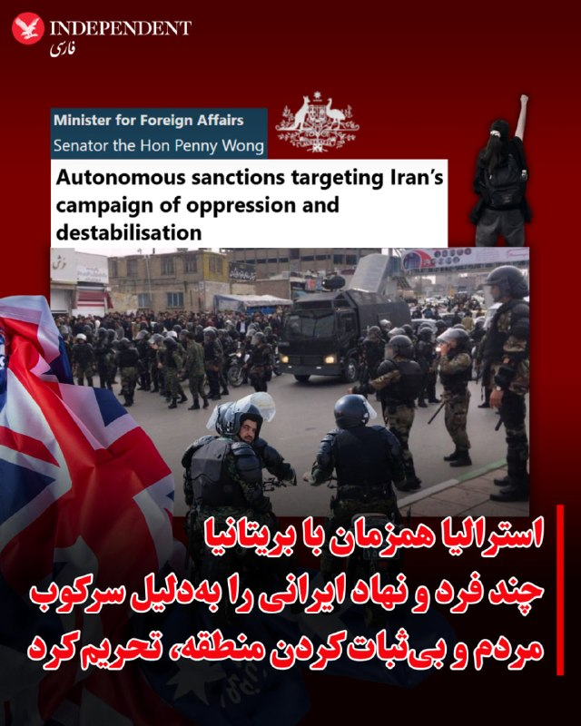

♦️وزارت امور خارجه استرالیا روز سه‌شنبه ۲۲ اردیبهشت ماه اعلام کرد هفت فرد و چهار نهاد مرتبط با جمهوری اسلامی را به‌دلیل «سرکوب خشونت‌بار مردم» و «اقدامات مخل ثبات منطقه‌ای» در فهرست تحریم‌های خود قرارداده است.

براساس بیانیه وزارت امور خارجه استرالیا، این تحریم‌ها در هماهنگی با بریتانیا و دیگر شرکای بین‌المللی انجام شده است.

عبدلله اسکندر مومنی، وزیر کشور دولت مسعود پزشکیان، سید مجید فیض جعفری، روح‌الله مومن‌نسب، قربان محمد ولی‌زاده، محسن ابراهیمی، ناصر زرین‌قلم و منصور زرین قلم، افرادی هستند که در فهرست تحریم‌های استرالیا قرار گرفته‌اند.
علاوه بر وزیر کشور، رئیس پلیس امنیت عمومی فراجا، دبیر ستاد امر به معروف و نهی از منکر تهران و فرمانده سپاه سیدالشهدا استان تهران در فهرست تحریم‌های به‌روز شده دولت استرالیا قرار دارند.

وزارت خارجه استرالیا یکی از این افراد را «مسئول هدایت سرکوب زنان و دختران در ایران» معرفی کرده و نوشته است که این فرد «با استقرار ۸۰ هزار نیرو، نظارت گسترده و اجرای اجباری حجاب را دنبال کرده است».

فرد دیگر نیز موسس «پایگاه‌های اطلاعاتی محلی» معرفی شده که «از طریق جمع‌آوری اطلاعات خانه‌به‌خانه و گشت‌های محلی، مخالفان جمهوری اسلامی را شناسایی و مجازات کرده است. برخی دیگر نیز مسئول بازداشت ناعادلانه اتباع خارجی» معرفی شده‌اند.

تحریم‌های اخیر استرالیا سامانه «بانکداری پنهان ایران» را به‌عنوان سازوکاری برای حمایت از گروه‌های نیابتی نظیر حماس و برنامه موشکی بالستیک» هدف قرار داده و دارایی‌های
 نیروی انتظامی، سازمان فضای مجازی سراج، صرافی برلیان و صرافی جی‌سی‌ام را تحت نظام مجازات‌های مالی آورده است.
‌🇸🇦 Indypersian

🤖 @VahidOOnLine

## VahidOOnLine — post 239649

  

⭕️ارتش اسرائیل برای ساکنان چهار منطقه جنوب لبنان هشدار تخلیه صادر کرد

♦️آویخای ادرعی، سخنگوی عرب‌زبان ارتش ارتش اسرائیل، روز سه‌شنبه ۲۲ اردیبهشت با انتشار هشداری فوری از ساکنان مناطق ارزون، صور، البازوریه و الحوش در لبنان خواست فورا خانه‌های خود را تخلیه کرده و دست‌کم هزار متر به مناطق باز بروند.

سخنگوی ارتش اسرائیل در این هشدار بار دیگر حزب‌الله را به نقض آتش‌بس متهم کرد و نوشت: هر فردی که در نزدیکی نیروها، تاسیسات یا تجهیزات حزب‌الله قرار داشته باشد، در معرض خطر است.
این هشدار در حالی صادر می‌شود که وزارت بهداشت لبنان اعلام کرد در جریان بمباران‌های صبح سه‌شنبه دست‌کم ۶ نفر در جنوب این کشور کشته شده‌اند.
‌🇸🇦 Indypersian

🤖 @VahidOOnLine

## VahidOOnLine — post 239648

  

وزارت خارجه پاکستان گزارش درباره اعزام هواپیماهای نظامی و غیرنظامی جمهوری اسلامی به پاکستان برای در امان ماندن از حملات، را «گمراه‌کننده» توصیف کرد و آن را رد کرد.

این وزارتخانه در بیانیه‌ای اعلام کرد که پس از برقراری آتش‌بس و در جریان مذاکرات، شماری از هواپیماها وارد پاکستان شدند تا جابه‌جایی تیم‌ها را تسهیل کنند و برخی از این هواپیماها و نیروهای پشتیبانی «به‌طور موقت» در این کشور باقی ماندند تا برای دورهای بعدی تعامل آماده باشند.

در این بیانیه آمده است: «هواپیماهای ایرانی که هم‌اکنون در پاکستان مستقر هستند، در دوره آتش‌بس وارد این کشور شدند و هیچ‌گونه ارتباطی با هیچ سناریوی نظامی یا ترتیبات حفاظتی ندارند.»

شبکه خبری سی‌بی‌اس به نقل از «مقام‌های آگاه آمریکایی» گزارش داده بود که جمهوری اسلامی، شماری از هواپیماهای نظامی خود را به پایگاه نورخان پاکستان و همچنین چند هواپیمای غیرنظامی را به افغانستان اعزام کرده است تا از خسارات ناشی از جنگ در امان بمانند.
‌🏁 🇬🇧 IranintlTV

🤖 @VahidOOnLine

## VahidOOnLine — post 239647

🗣روایت شما از بحران اقتصادی و زندگی در آتش‌بس- سه‌شنبه ۲۲ اردیبهشت:

🔹دانه قهوه شده کیلویی ۲ میلیون تومان، قهوه فوری شده کیلویی ۳ میلیون تومان! دیگه نمی‌شه قهوه خورد

🔹لوازم بهداشتی به‌شدت گران شده‌ان. قیمت مام ضد تعریقی که می‌گرفتم ۲۰۰ هزار تومان به ۶۰۰ هزار تومان افزایش یافته.

🔹با ۲۸ میلیون حقوق ماهیانه، زندگی دو نفره رزیدنتی ما به بن‌بست رسیده. پس‌اندازهایمان تمام شده و حتی توان تعمیر وسایل را نداریم.

🔹من فارغ‌التحصیل ارشدم، دو سال با بدبختی پول جور کردم یه لپ‌تاپ خریدم تحقیقات انجام دادم همین که اومدم مقاله رو چاپ کنم نت قطع شد. این وضعیت برای یکی مثل من که هیچ‌وقت دست از تلاش برنمی‌داشتم یعنی خود مرگ.

🔹از میانکوه خوزستان پیام می‌دهم؛ منطقه یک انتقال گاز در سال جدید حقوق ارکان ثالث را پرداخت نکرده که سابقه نداشته، همیشه برج یک دستمزدها پرداخت می‌شد.

🔹جمهوری اسلامی دقیقا به سبک کارتل‌های مواد مخدر عمل می‌کند. یک عده وفادار به خودش را با تطمیع و پول‌پاشی نگه داشته، ملت ایران را ول کرده در فقر و گرونی دست و پا بزنند. الحق که جمهوری اسلامی جمع رذایل همه‌ حکومت‌های تاریخ است.
‌🏁 🇬🇧 IranintlTV

🤖 @VahidOOnLine

## VahidOOnLine — post 239646

  

خبرگزاری میزان، رسانه قوه قضاییه جمهوری اسلامی، اعلام کرد که حکم اعدام عبدالجلیل شه‌بخش، زندانی بلوچ، بامداد سه‌شنبه ۲۲ اردیبهشت اجرا شده است. میزان اتهام او را «عضویت در گروه انصارالفرقان» و «بغی» عنوان کرده است.

در گزارش منتشرشده از سوی این رسانه، به تاریخ دقیق بازداشت عبدالجلیل شه‌بخش اشاره‌ای نشده است. همچنین پیشتر اطلاعی درباره بازداشت و روند طی شدن مراحل قضایی پرونده او منتشر نشده بود.
‌🏁 🇬🇧 IranintlTV

🤖 @VahidOOnLine

## VahidOOnLine — post 239645

  

♦️قیمت دلار صبح سه‌شنبه ۲۲ اردیبهشت و در زمان آغاز کار بازار با سه هزار تومان افزایش نسبت به روز قبل به ۱۸۵ هزار تومان رسید.
روند صعودی افزایش بهای ارزهای خارجی در بازارهای ایران در حالی ادامه دارد که با ادامه محاصره دریایی بنادر جنوب، تشدید تحریم‌ها و احتمال وقوع دوباره جنگ، نگرانی از کمبود دلار دوچندان شده است.

روز سه‌شنبه قیمت یورو به ۲۱۸ هزار تومان رسید و هر پوند بریتانیا در برابر ۲۵۱ هزار و ۸۰۰ تومان فروخته شد.

احتمال افزایش قیمت ارز تا پایان روز بسیار بالا است.
‌🇸🇦 Indypersian

🤖 @VahidOOnLine

## VahidOOnLine — post 239644

  <a href="telegram/content/VahidOOnLine_239644_1778573841.mp4" target="_blank">🎬 Download video</a>

وزارت خارجه استرالیا اعلام کرد این کشور تحریم‌های مالی هدفمند و ممنوعیت سفر تازه‌ای را علیه هفت فرد و چهار نهاد وابسته به جمهوری اسلامی اعمال کرده است.

پنی وانگ، وزیر خارجه استرالیا، گفت این تحریم‌ها در واکنش به «سرکوب خشونت‌بار مردم ایران»، قطع اینترنت، فشار بر زنان و دختران و اقدامات بی‌ثبات‌کننده جمهوری اسلامی در منطقه اعمال می‌شود.

بر اساس اعلام دفتر تحریم‌های استرالیا، افراد تحریم‌شده شامل اسکندر مومنی، مجید فیض جعفری، روح‌الله مومن‌نسب، قربان‌محمد ولی‌زاده، محسن ابراهیمی، ناصر زرین‌قلم و منصور زرین‌قلم هستند. نیروی انتظامی جمهوری اسلامی، سراج سایبرسپیس، صرافی برلیان و صرافی جی‌سی‌ام نیز در فهرست نهادهای تحریم‌شده قرار گرفته‌اند.
‌🏁 🇬🇧 ManotoTV

🤖 @VahidOOnLine

## VahidOOnLine — post 239643

  <a href="telegram/content/VahidOOnLine_239643_1778573841.mp4" target="_blank">🎬 Download video</a>

تصویری از نفتکش ایرانی «سی‌استار سه» منتشر شده که آتش‌سوزی در بخش دودکش آن را پس از هدف قرار گرفتن در دریای عمان نشان می‌دهد.

تانکر ترکرز گزارش داد این نفتکش متعلق به شرکت ملی نفتکش ایران، نزدیک جاسک هدف قرار گرفته است. به گفته این وب‌سایت تخصصی ردیابی نفتکش‌ها، «سی‌استار سه» از نفتکش‌های بسیار بزرگ حمل نفت خام است، نام اولیه آن «سنندج» بوده و پس از تحریم‌ها چند بار تغییر نام داده است.

در این گزارش آمده است خدمه نفتکش آسیبی ندیده‌اند.

پیشتر سنتکام، فرماندهی مرکزی ارتش آمریکا، اعلام کرده بود یک جنگنده نیروی دریایی آمریکا از ناو هواپیمابر «جورج اچ دبلیو بوش» ۱۸ اردیبهشت دودکش این نفتکش را هدف قرار داده است. سنتکام گفته بود این اقدام برای جلوگیری از ورود این نفتکش به یکی از بنادر ایران انجام شد.
‌🏁 🇬🇧 ManotoTV

🤖 @VahidOOnLine

## VahidOOnLine — post 239642

  <a href="telegram/content/VahidOOnLine_239642_1778573842.mp4" target="_blank">🎬 Download video</a>

پلیس منطقه یورک در کانادا اعلام کرد مهران محققی، ۳۹ ساله و ساکن ریچموند هیل، در ارتباط با حادثه‌ای در جریان یک تجمع درباره ایران در این شهر بازداشت و متهم شده است.

بر اساس بیانیه پلیس، این حادثه روز یکشنبه ۲۱ اردیبهشت در حوالی تقاطع خیابان یانگ و میجر مکنزی رخ داد. پلیس می‌گوید مظنون با خودرو به شکلی خطرناک در نزدیکی تجمع حرکت کرده، با یک راننده تحویل غذا که در تجمع حضور نداشت برخورد کرده و هنگام فرار نیز با خودرویی دیگر تصادف کرده است.

به گفته پلیس، محققی به حمله با سلاح، رانندگی خطرناک، تهدید و توقف نکردن پس از تصادف متهم شده است. تحقیقات در این پرونده ادامه دارد و پلیس از شاهدان و دارندگان تصاویر دوربین خودرو، تلفن همراه یا دوربین‌های امنیتی خواسته است اطلاعات خود را در اختیار بازرسان بگذارند.
‌🏁 🇬🇧 ManotoTV

🤖 @VahidOOnLine

## VahidOOnLine — post 239641

  

جانشین پایگاه دریابانی بندرعباس از شناسایی و انهدام یک خط لوله انتقال سوخت قاچاق به طول شش کیلومتر خبر داد. به گزارش فارس، وابسته به سپاه، قاچاقچیان این خطوط لوله را زیر ماسه‌ها و آب دریا جاسازی کرده بودند و از آن طریق، سوخت را از ساحل به دریا و شناورهای متخلف انتقال می‌دادند.
‌🏁 🇬🇧 IranintlTV

🤖 @VahidOOnLine

## WithYashar — post 11041

الجزیره : جمهوری اسلامی تهدید کرد که در صورت حمله مجدد آمریکا و اسرائیل سطح غنی‌سازی را به ۹۰٪ خواهد رساند.
@withyashar

## WithYashar — post 11040

شاهزاده رضا پهلوی: جمهوری‌اسلامی امروز از همیشه ضعیف‌تره و مردم ایران آماده‌ن تا سرنگونش کنن، اتخاذ سیاستی درست در این لحظه میتونه قرن آینده رو تغییر بده
@withyashar

## WithYashar — post 11039

  <a href="telegram/content/WithYashar_11039_1778573844.mp4" target="_blank">🎬 Download video</a>

منتظر تایید خنثی سازی هستیم 😂🙌🏾

## WithYashar — post 11038

منتظر تایید خنثی سازی هستیم 😂🙌🏾

## WithYashar — post 11037

🤭😂😂 لعنت به اخوند

## WithYashar — post 11036

اتاق جنگ با شما : بوشهر دو بار زدن دود سیاه کانفینگم حجم نداره
@withyashar

## WithYashar — post 11035

بوشهر رو زدن پایگاه

## WithYashar — post 11034

گزارش صدای انفجار در بوشهر
@withyashar

## WithYashar — post 11033

  

شاهزاده رضا پهلوی امروز در اجلاس امنیتی POLITICO واشنگتن سخنرانی می‌کنه، در کنار مقامات ارشد پنتاگون، وزیر سابق امنیت داخلی آمریکا، سناتورهای کمیته نیروهای مسلح، روسای کمیته اطلاعات مجلس و مقامات دفاعی آلمان و مدیران لاکهید مارتین.
@withyashar

## WithYashar — post 11032

  <a href="https://t.me/withyashar/11032" target="_blank">📎 Download file</a>

🌐 instagram.com/yashar

🌐 t.me/withyashar

## WithYashar — post 11031

## WithYashar — post 11030

  

دیشب گفتم قبل قطع اینترنت من در لب ۱ میلیارد بازدید بودم ! ویس بعدی رو گوش کنید
@withyashar

## WithYashar — post 11029

داشتم الان فکر میکردم یاد این خبر افتادم برایم اون زمان عجیب‌ بود و گفتم یعنی چی میخواد بشه ! ولی الان متوجه میشید قدرت تحلیل و ارتباطات بزرگ رو ! صافولا سعودی چقدر نفوذ و تحلیل دقیق داشت و گروه مدلل کرمانشاه چه سوختی داد !!!
هلدینگ سعودی Savola Group در بازار روغن خوراکی ایران بزرگترین بود، یک سال پیش سهامش را در ایران فروخت و خارج شد
صافولا در ایران مالک یا سهامدار عمده مجموعه‌هایی مانند: شرکت صنعتی بهشهر ، صافولا بهشهر ، برندهای روغن لادن ، بهار و نسترن بود.
طبق اعلام رسمی بورس عربستان، صافولا در ۳۱ دسامبر ۲۰۲۴ قرارداد فروش «تمام کسب‌وکارش در ایران» را به ارزش ۷۰۵ میلیون ریال سعودی امضا کرد
رسانه‌های اقتصادی ایران و چند منبع منطقه‌ای گزارش دادند که خریدار نهایی، «گروه مدلل» بوده است؛ یک گروه بزرگ ایرانی فعال در حوزه روغن، خوراک دام، کشاورزی و صنایع غذایی
@withyashar

## WithYashar — post 11028

خورخه موریرا دا سیلوا مدیر اجرایی دفتر مشاوره‌ای سازمان ملل (UNOPS) هشدار داد اگر به‌زودی عبور کشتی‌های حامل کود از تنگه هرمز از سر گرفته نشود، جهان ممکن است با بحرانی بزرگ روبه‌رو شود که حدود ۴۵ میلیون نفر دیگر را در معرض گرسنگی قرار می‌دهد.
تنها چند هفته برای جلوگیری از این بحران فرصت باقی مانده
@withyashar

## WithYashar — post 11027

شبکه 14 اسرائیل، تو حمله بعدی اهدافمون شامل موارد زیر میشه: - تاسیسات انرژی و صنعت پتروشیمی - صنعت خودروسازی و پایگاه‌ های موشک بالستیک - صنعت نفت و صنعت فولاد @withyashar

## WithYashar — post 11026

ائتلاف منطقه ای علیه جمهوری اسلامی
تام کاتن، سناتور جمهوری‌خواه، گفت کشورهای عربی دیگر از آمریکا برای صلح کمک نمی‌خواهند، بلکه به‌دنبال همکاری نظامی علیه جمهوری اسلامی هستند.
@withyashar

## WithYashar — post 11024

پلیس تورنتو کانادا : فردی به نام مهران محققی، ۳۹ ساله را در ارتباط با حادثه‌ای در جریان تجمع ایرانیان علیه جمهوری اسلامی بازداشت شد. این شخص به رانندگی خطرناک نزدیک تجمع، حمله با سلاح، تهدید تجمع‌کنندگان و فرار پس از تصادف متهم شده است.این فرد یک‌شنبه ۲۰ اردیبهشت با رانندگی خطرناک به این تجمع نزدیک شد و پرچم جمهوری اسلامی را تکان می‌داد. او پس از برخورد به راننده یک خودروی تحویل غذا سعی داشت متواری شود، اما پس از برخورد با یک خودروی دیگر متوقف شد.
طبق گزارش پلیس یورک، مظنون سپس خودرو را متوقف کرد تا معترضان را تهدید کند و پس از آن بازداشت شد. یک فرد مصدوم در این حادثه با جراحات جزئی به بیمارستان منتقل شده است.
@withyashar

## WithYashar — post 11023

  <a href="telegram/content/WithYashar_11023_1778573848.mp4" target="_blank">🎬 Download video</a>

ترامپ : من حاضرم برای کشورم گلوله بخورم. ما باید کشورمان را نجات بدهیم. کشور ما در دردسر است. و من می‌خواهم ایران خیلی خوب عمل کند. می‌خواهم موفق باشد. می‌خواهم کشوری بزرگ باشد. اما آن‌ها نمی‌توانند سلاح هسته‌ای داشته باشند. و بعضی از آدم‌های آنجا دیوانه‌اند. نمی‌شود گذاشت دیوانه‌ها سلاح هسته‌ای داشته باشند.
@withyashar

## WithYashar — post 11022

درود دوباره ژنرال یاشار
این ویدیویی که گذاشتی در مورد پیدایش دین برای منی که زرتشتی بودم از بچگی و تاریخ دین خودم و چندتا دیگه از ادیان اریایی و میان رودانی رو خوندم تا حد زیادی به نظرم میتونه یه سناریو منطقی باشه
مثلا ما تو مزدیسنا یه فرقه ای داریم به نام زروانیان که اینا معتقدن که زروان درواقع همون مفهوم زمان هست. و زروان بچه یا نطفه ای داشته به نام اهورامزدا که اولین بار پا در سرزمین ایرانی ها (همون فلات اریایی ) میگذاره تا با اهریمن و سپاهش بجنگه (اینم طبق روایات نطفه دیگه یا دوقولوی اهورامزدا بوده)
نقاشی ها و سنگ نگاره هایی در میان رودان و‌حتی ایران هست مبنی بر حضور همین اجسام پرنده ناشناس و همین طور حضور اهورامزدا که تبدیل به خدای جهان بینی ایرانی میشه و بعد نام بابلی اَئورامازداش میگیره که در مصر میشه آمون تو کتیبه های مصری
ارتباطی بین این سه هست که نمیتونم دقیقا حدس بزنم ایا هر سه از یک منبع الهام گرفته شده ان یا نه
به هر صورت حالا در مورد این مالکان یا خود ufo ها یا هر چی که هستن دقیقا چون ما میگیم ناشناس ولی بالاخره یه گونه ای از حیات هستن که نامی هم دارند این هم دیدگاهم‌بود گفتم باهات اشتراک‌بگذارم
جاوید شاه

## mwarmonitor — post 8945

🇺🇸جمهوری‌خواهان نبرد بر سر «تالار رقص» را به همه‌پرسی درباره امنیت ترامپ تبدیل می‌کنند

📝نویسندگان: هانس نیکولز، کیت سانتالیز AXIOS

🔰رهبران جمهوری‌خواه سنا قصد دارند نبرد سیاسی بر سر درخواست ۱ میلیارد دلاری برای ارتقای امنیتی مربوط به تالار رقص (Ballroom) جدید کاخ سفید را به یک همه‌پرسی درباره امنیت پرزیدنت ترامپ تبدیل کنند.

چرا این موضوع اهمیت دارد؟
دموکرات‌ها معتقدند رقم ۱ میلیارد دلار، یک شعار تبلیغاتی ساده و موثر علیه جمهوری‌خواهان در اختیار آن‌ها می‌گذارد تا رای‌دهندگانی را که نگران هزینه‌های زندگی هستند، با خود همراه کنند.
اما جان تون، رهبر اکثریت سنا (جمهوری‌خواه از داکوتای جنوبی)، اعلام کرد که این بودجه با هدف ایمن‌سازی تاسیسات جدید و اطمینان از داشتن منابع لازم توسط سرویس مخفی برای حفاظت از رئیس‌جمهور در نظر گرفته شده است.
جان تون در گفتگو با خبرنگاران: «این یک اقدام امنیتی است. ما با رئیس‌جمهوری روبه‌رو هستیم که تنها در دو سال گذشته، سه بار مورد سوءقصد قرار گرفته است.»
تحلیل پشت‌صحنه
طبق گزارش آکسیوس، مایک جانسون، رئیس مجلس نمایندگان، در سخنرانی روز سه‌شنبه خود در ناهار کاری جمهوری‌خواهان سنا، تلاش خواهد کرد تا اصطکاک‌های فزاینده با همتایان خود در سنا را برطرف کند.
انتظار می‌رود جانسون بر لزوم باز بودن مسیرهای ارتباطی تأکید کند، چرا که جمهوری‌خواهان خود را برای بسته‌های بودجه‌ای «آشتی‌ ملی» (Reconciliation) نسخه ۲.۰ و ۳.۰ آماده می‌کنند.
شان کوران، مدیر سرویس مخفی ایالات متحده نیز در این جلسه حضور خواهد داشت تا درباره بودجه امنیت ریاست‌جمهوری و نیاز به ارتقای تجهیزات امنیتی در تالار رقص جدید گفتگو کند.
نگاه نزدیک‌تر
اظهارات «جان تون» به همان اندازه که خطاب به دموکرات‌هاست، به نظر می‌رسد خطاب به مخالفان داخلی حزب جمهوری‌خواه نیز باشد:
تام تیلیس (سناتور کارولینای شمالی): «مشتاق هستم که جزئیات را در این هفته ببینم.»
سوزان کالینز (رئیس کمیته تخصیص بودجه سنا): «برداشت من این بود که قرار است هزینه این کار از طریق کمک‌های خصوصی تأمین شود؛ این چیزی است که رئیس‌جمهور گفته بود.»
رند پال (سناتور کنتاکی): «حس می‌کنم این موضوع یا در لایحه نخواهد بود و یا از 'آزمون برد' (Byrd test) سربلند بیرون نمی‌آید. احتمالاً هفته آینده بیشتر خواهیم دانست.» (او ترجیح می‌دهد از کمک‌های خصوصی استفاده شود).

🔸چاک شومر، رهبر اقلیت سنا (دموکرات از نیویورک)، در انتقادی تند گفت:
«آن‌ها به "جمهوری‌خواهانِ تالار رقص" تبدیل شده‌اند.»

@mwarmonitor

## mwarmonitor — post 8944

  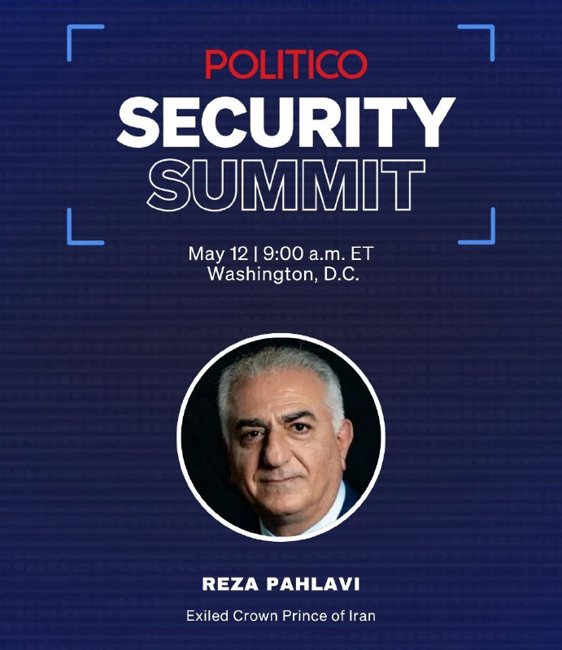

🎙داشا برنز رئیس دفتر کاخ سفید در نشریه پولیتیکو (Politico): به ما در «اجلاس امنیتی POLITICO Live» بپیوندید، جایی که من با ولیعهد تبعیدی ایران، رضا پهلوی، درباره وضعیت جنگ و آینده جنبش مخالفان ایران گفت‌وگو خواهم کرد.

🔹می‌توانید به‌صورت حضوری در واشنگتن دی‌سی (DC) شرکت کنید یا پخش زنده را آنلاین تماشا کنید:
https://www.politico.com/politicosecuritysummit

@mwarmonitor

## mwarmonitor — post 8943

  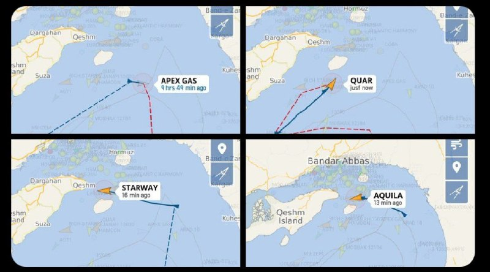

📍 ۴ نفتکش/تانکر صبح امروز از تنگه هرمز عبور کردند:

🚢 نفتکش LPG APEX GAS با پرچم امارات (مرتبط با 🇨🇳 چین)
🚢 نفتکش نفت QUAR با پرچم جزایر ویرجین (مرتبط با 🇨🇳 چین)
🚢 نفتکش نفت STARWAY با مالکیت 🇨🇳 چین
🚢 نفتکش نفت AQUILA با پرچم سنگاپور (مرتبط با 🇨🇳 چین)

@mwarmonitor

## mwarmonitor — post 8942

📝 سوالی دارید دایرکت جواب میدم ...

## mwarmonitor — post 8941

  

📝 وقتی پستی و رذالت به مغز استخوان برسد، موجودی پدید می‌آید که حتی واژه «حرامزاده» برای توصیف عمق کثافت و بی‌ریشگی‌اش کم می‌آورد. علیرضا دبیر تفاله‌ی متعفن و نطفه‌ی منعقد شده در لجن‌زار ابلیس، با آرزوی مرگ برای یک نوزاد نشان دادی که نه تنها بویی از انسانیت نبرده‌ای، بلکه درنده‌خویی و پستی‌ات از هر جانوری فراتر رفته است. این حد از خباثت و کثافتِ باطنی تنها در ذاتِ بی‌اصل و نسبی چون تو پیدا می‌شود که با نانِ حرام و دست‌بوسیِ ظالمان پروار شده‌ای. تُف بر آن پیشانی پینه‌بسته‌ات که نقابِ ریای توست؛ تو لکه‌ی ننگی بر دامن خلقت و لجنِ خالص در کالبد بشری هستی که بوی گندِ روحِ پوسیده‌ات تمام فضا را مسموم کرده است. موجودی که داغِ یک طفل را آرزو می‌کند، باید در زباله‌دانِ تاریخ زیر خروارها لعنت و حقارت دفن شود، ای پست‌فطرتِ بی‌ریشه که حتی مرگ هم از دربرگرفتن کالبدِ نجسِ تو شرم دارد.

@mwarmonitor

## mwarmonitor — post 8938

⚠️افشاگری به نقل از CBSNews: 🔴منابعی به Jennifer Jacobs و JimLaPorta گفتند که در حالی که پاکستان خود را به‌عنوان کانال دیپلماتیک میان تهران و واشینگتن مطرح می‌کرد، به‌طور پنهانی به هواپیماهای نظامی ایران اجازه داد در خاک این کشور مستقر شوند؛ اقدامی که می‌توانست…

## mwarmonitor — post 8937

  <a href="telegram/content/mwarmonitor_8937_1778573854.mp4" target="_blank">🎬 Download video</a>

📌موقعیت احتمالی یک پایگاه نظامی محرمانه اسرائیل در صحرای عراق در مختصات 31.66697°N, 42.44864°E که دارای یک باند خاکی حدود ۱.۷ کیلومتری است. 🔸این محل که تنها ۷۰ کیلومتر با مرز عربستان فاصله دارد، به نظر می‌رسد چند روز پیش از آغاز جنگ با ایران ساخته شده باشد.…

## mwarmonitor — post 8936

🔴رئیس‌جمهور ترامپ از افشای اطلاعات در رسانه‌ها درباره جنگ با ایران به دادستان کل موقت شکایت کرد؛ موضوعی که باعث شد وزارت دادگستری تحقیقات را آغاز کند. WSJ

@mwarmomitor

## FoxNewsTwitter — post 341570

  <a href="telegram/content/FoxNewsTwitter_341570_1778573856.mp4" target="_blank">🎬 Download video</a>

Fox News (Twitter/X)

A hero K-9 named Boomer saved the day after successfully tracking down a "missing and endangered" 96-year-old man, who was eventually found in the woods in Lutz, Florida.

## FoxNewsTwitter — post 341569

  <a href="telegram/content/FoxNewsTwitter_341569_1778573859.mp4" target="_blank">🎬 Download video</a>

Fox News (Twitter/X)

"I love the name."

President Trump says Border Czar Tom Homan told him he didn't like the president's idea to rename ICE to "NICE" to mess with the media

## FoxNewsTwitter — post 341568

  <a href="telegram/content/FoxNewsTwitter_341568_1778573861.mp4" target="_blank">🎬 Download video</a>

Fox News (Twitter/X)

"I saw them take JD by the shoulders and lift him up like he was a little boy."

President Trump praised Secret Service Director Sean Curran for keeping him and Vice President JD Vance safe during the WHCA Dinner shooting.

## FoxNewsTwitter — post 341567

  <a href="telegram/content/FoxNewsTwitter_341567_1778573864.mp4" target="_blank">🎬 Download video</a>

Fox News (Twitter/X)

"Who likes JD Vance? Who likes Marco Rubio?"

President Trump polled the crowd during a Rose Garden Club dinner at the White House on potential presidential and vice presidential candidates for the 2028 ticket.

## pm_afshaa — post 90609

🔴وزارت خزانه داری آمریکا تا الان 12 فرد و نهاد را به دلیل کمک به ارسال نفت از ایران به چین تحریم کرد

💧 Rainbet.com the #1 Non-KYC Crypto Casino & Sportsbook @rainbetcom

😁 @Pm_Afshaa

## pm_afshaa — post 90608

🔴2 مقام ارشد آمریکایی به فاکس نیوز:
ترامپ به از سرگیری جنگ با ایران متمایل شده

💧 Rainbet.com the #1 Non-KYC Crypto Casino & Sportsbook @rainbetcom

😁 @Pm_Afshaa

## pm_afshaa — post 90607

🔴شاهزاده رضا پهلوی: جمهوری‌اسلامی امروز از همیشه ضعیف‌تره و مردم ایران آماده‌ن تا سرنگونش کنن، اتخاذ سیاستی درست در این لحظه میتونه قرن آینده رو تغییر بده

💧 Rainbet.com the #1 Non-KYC Crypto Casino & Sportsbook @rainbetcom

😁 @Pm_Afshaa

## pm_afshaa — post 90606

🔴سی‌بی‌اس نیوز:پاکستان علیرغم نقش میانجی، به هواپیماهای نظامی ایران اجازه داد در فرودگاه‌هایش پارک کنند و به طور بالقوه از آنها در برابر حملات هوایی ایالات متحده محافظت کند

💧 Rainbet.com the #1 Non-KYC Crypto Casino & Sportsbook @rainbetcom

😁 @Pm_Afshaa

## pm_afshaa — post 90605

🔴کانال 14 اسرائیل:کارخانه های خودرو سازی ایران از اهداف بعدی اسرائیل هستن

💧 Rainbet.com the #1 Non-KYC Crypto Casino & Sportsbook @rainbetcom

😁 @Pm_Afshaa

## pm_afshaa — post 90604

🔴سی ان ان:ترامپ تا قبل از سفرش به چین تصمیمی برای حمله به ایران نمی گیرد و پس از اتمام این سفر، تصمیم حمله را خواهد گرفت

💧 Rainbet.com the #1 Non-KYC Crypto Casino & Sportsbook @rainbetcom

😁 @Pm_Afshaa

## pm_afshaa — post 90603

🔴ترامپ:سیاست‌های دموکرات‌ها دیوانه‌وار است و آن‌ها کشور ما را به ویرانی خواهند کشاند.

ما باید در انتخابات میان‌دوره‌ای عملکرد خوبی داشته باشیم، و اگر نداشته باشیم، آن‌ها هر کاری که بتوانند انجام خواهند داد تا کشور ما را نابود کنن

💧 Rainbet.com the #1 Non-KYC Crypto Casino & Sportsbook @rainbetcom

😁 @Pm_Afshaa

## pm_afshaa — post 90602

  <a href="telegram/content/pm_afshaa_90602_1778573866.mp4" target="_blank">🎬 Download video</a>

ترامپ درباره ایران:نیروهای نظامی ما عالی هستند. ما داریم حسابی ضربه می‌زنیم

💧 Rainbet.com the #1 Non-KYC Crypto Casino & Sportsbook @rainbetcom

😁 @Pm_Afshaa

## iaghapour — post 2600

🔻نمیتونم خبر رو تایید کنم ولی میگن:
— افغانستان اینترنت 5G آورده.
— عراق تلگرام رو رفع فیلتر کرده.
— سوریه هم که ویزا و مستر کارت و...

این که ما درگیر فیلترینگ مسخره هستیم واقعا گریه داره...

## DEJradio — post 4576

  <a href="telegram/content/DEJradio_4576_1778573869.webm" target="_blank">🎬 Download video</a>

🔺📢 شاهزاده رضا پهلوی بامداد سه‌شنبه ۲۲ اردیبهشت به‌وقت ایران در«ایکس» نوشت که جمهوری اسلامی ۴۷ سال است علیه آمریکا و متحدانش جنگ به راه انداخته، و تاکید کرد: «امروز این رژیم از همیشه ضعیف‌تر است و مردم ایران آماده‌اند تا آن را سرنگون کنند.» او نوشت که اتخاذ سیاستی درست در این لحظه، می‌تواند قرن آینده را تغییر دهد.

#شاهزاده_رضا_پهلوی #جمهوری_اسلامی
@DEJradio

## DEJradio — post 4575

  <a href="telegram/content/DEJradio_4575_1778573870.webm" target="_blank">🎬 Download video</a>

🔺📢 بر اساس گزارش‌های منابع محلی، یک نفت‌کش متعلق به جمهوری اسلامی که قصد خروج از محدوده محاصره دریایی آمریکایی را داشت توسط موشک هدف قرار گرفت.
تاریخ دقیق اصابت مشخص نیست اما گفته شده ۱۹ یا ۲۰ اردیبهشت اتفاق افتاده است. بر اساس تصاویر زبانه‌های آتش و دود سیاه غلیظ از قسمت انتهایی عرضه این نفتکش کاملا پیداست اما از خدمه کسی کشته نشده است.
نام این کشتی در گذشته «سنندج» بود.

#محاصره_دریایی #آتشبس
@DEJradio

## mamlekate — post 103510

📝 بحران تنگه هرمز و بازار باقلوا؛ آیا پسته ایرانی جای خود را به رقبای ترک و سوری می‌دهد؟

برآوردهای اقتصادی نشان می‌دهد که قیمت باقلوا به دلیل افزایش قیمت پسته ایرانی، حدود ۱۰ درصد افزایش یافته است.

@mamlekate

## mamlekate — post 103509

  <a href="telegram/content/mamlekate_103509_1778573870.mp4" target="_blank">🎬 Download video</a>

رئیس‌جمهور ایالات متحده درباره ایران:

آن‌ها افراد بسیار بی‌اعتباری هستند؛ [منظورم] رهبری‌شان است. آن‌ها مدام نظرشان را عوض می‌کنند. من در تجارت بارها با این موضوع روبه‌رو شده‌ام. شما با این افراد معامله می‌کنید و بعد آن‌ها برایتان یک سند می‌فرستند که باید در ۲۰ دقیقه به دست شما برسد، اما پنج روز طول می‌کشد تا برسد.

آن‌ها هرگز سلاح هسته‌ای نخواهند داشت.

USABehFarsi
@mamlekate

## mamlekate — post 103508

📝 وال‌استریت ژورنال: امارات به‌طور مخفیانه حملاتی علیه جمهوری اسلامی انجام داده است

روزنامه وال‌استریت ژٰورنال دوشنبه ۲۱ اردیبهشت به‌نقل از منابع آگاه خبر داد که امارات متحده عربی به‌طور مخفیانه حملاتی علیه جمهوری اسلامی انجام و در یکی از این حملات در ماه آوریل پالایشگاه نفتی جزیره لاوان ایران را هدف قرار داده است.

@mamlekate

## mamlekate — post 103507

📝 گزارش: دونالد ترامپ با تیم امنیت ملی خود درباره ایران جلسه گذاشت

دونالد ترامپ، رئيس جمهوری آمریکا روز دوشنبه بار دیگر با تیم امنیت ملی خود در کاخ سفید دیدار و گفت‌وگو کرد.

📝 نتانیاهو: جمهوری اسلامی اکنون می‌داند بستن تنگه هرمز چه خطر بزرگی برای خودش دارد

بنیامین نتانیاهو، نخست‌وزیر اسرائیل، در نخستین مصاحبه تلویزیونی با رسانه‌‌های آمریکایی پس از آغاز جنگ، به سی‌بی‌اس نیوز گفت جنگ ایران «دستاوردهای زیادی» داشته، اما به پایان نرسیده است.

📝 ترامپ می‌گوید خسته نمی‌شود و فشار بر جمهوری اسلامی را تا پیروزی کامل ادامه خواهد داد

ترامپ: «احمق‌ها نمی‌خواستند قبول کنند. فکر می‌کردند من خسته می‌شوم یا حوصله‌ام سر می‌رود یا تحت فشار قرار می‌گیرم، اما هیچ فشاری وجود ندارد. ما به یک پیروزی کامل خواهیم رسید.»

📝 سی‌ان‌ان: ترامپ با جدیت بیشتری عملیات گسترده نظامی علیه جمهوری اسلامی را بررسی می‌کند

سی ان ان به نقل از منابع آگاه گزارش داد ترامپ به طور فزاینده ای از نحوه مدیریت مذاکرات از سوی مقام های ایران ابراز نارضایتی می کند و برخی از دستیاران او می گویند که ترامپ اکنون نسبت به هفته های اخیر، با جدیت بیشتری در حال بررسی ازسرگیری عملیات گسترده نظامی است.

@mamlekate

## mamlekate — post 103505

  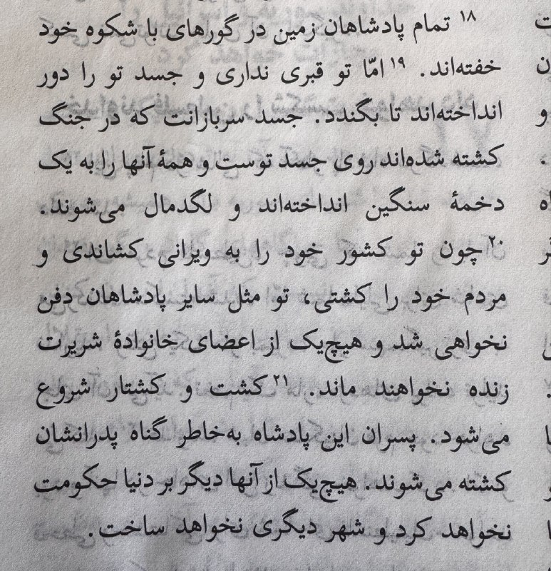

📞 شرح زندگی خامنه ای در تورات
[تورات، کتاب اشعیا، باب ۱۴، آیه ۱۸ تا ۲۱]

@mamlekate

## IranIntlTV — post 336773

  

🔻تیم ملی والیبال ایران در مرحله مقدماتی لیگ ملت‌های ۲۰۲۶ در کشورهای برزیل، فرانسه و صربستان به مصاف حریفان خود می‌رود که در یکی از حساس‌ترین بازی‌ها شاگردان روبرتو پیاتزا ۴ تیر در فرانسه باید برابر آمریکا قرار بگیرند.

🔹در هفته اول این رقابت‌ها که از ۲۰ تا ۲۴ خرداد برگزار می‌شود، تیم ملی ایران در شهر برازیلیا برابر برزیل، بلغارستان، آرژانتین و بلژیک قرار می‌گیرد. دیدارهای این هفته به میزبانی کانادا، برزیل و چین برگزار خواهد شد.

🔹ملی‌پوشان ایران در ادامه و در هفته دوم لیگ ملت‌ها، از سوم تا هفتم تیر در شهر اورلئان فرانسه برابر فرانسه، آمریکا، ژاپن و کوبا صف‌آرایی می‌کنند. همزمان مسابقات این هفته در لهستان و اسلوونی نیز پیگیری می‌شود.

🔹هفته سوم مرحله مقدماتی لیگ ملت‌های ۲۰۲۶ از ۲۴ تا ۲۸ تیر برگزار خواهد شد و تیم ملی ایران در شهر بلگراد به مصاف اوکراین، آلمان، اسلوونی و ترکیه می‌رود. رقابت‌های این هفته علاوه بر صربستان، در آمریکا و ژاپن نیز برگزار می‌شود.

@iranintltvsport

## IranIntlTV — post 336772

🗣روایت شما از بحران اقتصادی و زندگی در آتش‌بس- سه‌شنبه ۲۲ اردیبهشت:

🔹در تاریخ ۲۰ اردیبهشت یک متر لوله پلیکا در ملایر خریدم یک میلیون و ۷۰۰ هزار تومان. قیمت‌ها به شکلی باورنکردنی افزایش یافته‌اند.

🔹من بیماری صرع دارم. پک ۶ تایی دارویم را قبلا در شیراز ۲۵۰ هزار تومن می‌خریدم، یک ماه پیش شد ۷۵۰ هزار تومان، الان قیمتش رسیده به دو میلیون و ۳۰۰ هزار تومان.

🔹چند ماه پیش قیمت آزاد قطره بتامتازون نهایتا ۷۰ هزار تومن بود امروز همان را با قیمت ۱۴۰ هزار تومان خریدم.

🔹قیمت بستنی قیفی در تهران در مقایسه با دوره پیش و پس از جنگ جهش کرده و از ۳۰ تومان به ۸۰ تومان رسیده است.

🔹من کارمند شرکت سایپا هستم حقوق‌ها را قسطی می‌ریزند، حتی به بازنشسته‌ها گفته‌اند سنوات‌تان را مهر ماه واریز می‌کنیم.

🔹پنج عدد تخم مرغ و سه تا دونه گوجه‌فرهنگی و یه پاکت سیگار، جمعا ۳۲۰ هزار تومن شد.

## IranIntlTV — post 336771

  

نت‌بلاکس اعلام کرد امروز هفتاد و چهارمین روزی است که ایران تا حد زیادی از اینترنت جهانی قطع شده و این اختلال اکنون وارد هزار و هفتصد و پنجاه و دومین ساعت خود شده است. نت‌بلاکس نوشت از ۹ اسفند جهان شاهد پیشرفت‌هایی در حوزه علم و فناوری بوده، در حالی که همزمان حکومت ایران در حال بازداشت و اعدام متخصصان حوزه فناوری بوده است.
https://iranintl.com/202605129825

## IranIntlTV — post 336770

  <a href="telegram/content/IranIntlTV_336770_1778573875.mp4" target="_blank">🎬 Download video</a>

عائد الهلالی، مشاور نخست‌وزیر عراق، در گفت‌وگو با شبکه الجزیره تایید کرد هدف از عملیاتی که در ماه مارس از سوی نیروهای اسرائیلی در خاک عراق انجام شد، ایجاد پایگاه نظامی نبوده است.

جزییات بیشتر با تروسکه صادقی، خبرنگار ایران‌اینترنشنال
@iranintltv

## IranIntlTV — post 336769

  <a href="telegram/content/IranIntlTV_336769_1778573877.mp4" target="_blank">🎬 Download video</a>

وزیر دفاع آلمان در سفری اعلام‌نشده به اوکراین از برنامه مشترک دو کشور برای توسعه پهپادها و سامانه‌های تسلیحاتی جدید خبر داد.

علی حسن‌پور، خبرنگار ایران‌اینترنشنال، گزارش می‌دهد

@iranintltv

## IranIntlTV — post 336768

  

بر اساس اطلاعات رسیده به ایران‌اینترنشنال، شیوا اسماعیلی، گلرخ ایرایی، سکینه پروانه، فروغ تقی‌پور، زهرا صفایی، مرضیه فارسی، الهه فولادی و وریشه مرادی، هشت تن از زندانیان سیاسی زن محبوس در بند زنان زندان اوین، از حق ملاقات با خانواده و وکیلان خود محروم شده‌اند.

اطلاعات رسیده حاکی است این محرومیت‌ها پس از تشدید فضای امنیتی در بند زنان اوین و در پی فشار و برخورد با زندانیانی اعمال شده که در برنامه‌های جمعی، یادبودها و رخدادهای اعتراضی داخل بند، مشارکت داشته‌اند.
https://iranintl.com/202605122250

## IranIntlTV — post 336767

  

بر اساس اطلاعات رسیده به ایران‌اینترنشنال، محترم پرندین، معروف به محشر، هنرمند و نقاش زندانی در اوین که ماه‌هاست با اتهامات سیاسی در حبس است، با وجود ابتلا به دو تومور در ناحیه پشت سر، نزدیک مخچه و گلو و همچنین بیماری حاد قلبی، از اعزام درمانی و جراحی فوری محروم مانده است.

یک منبع مطلع به ایران‌اینترنشنال گفت پزشک زندان جراحی فوری پرندین را ضروری دانسته و درباره خطر تومور نزدیک مخچه هشدار داده است؛ توموری که باعث اختلال در بینایی، تکلم و حرکات بدنی او شده و به گفته هم‌بندی‌هایش، آثار آن در راه رفتن و صحبت کردنش قابل مشاهده است.

به گفته این منبع آگاه، با وجود تاکید پزشک زندان، مسئولان تاکنون برای اعزام درمانی او همکاری نکرده‌اند و با وجود گذشت بیش از نیمی از ایام حبس و وخامت حال، با آزادی مشروط و مرخصی درمانی‌اش نیز مخالفت کرده‌اند؛ این در حالی است که سند لازم برای مرخصی در اختیار دادستانی قرار دارد.

محترم پرندین مادر یک پسر نوجوان و محصل است و پس از درگذشت همسرش سرپرستی خانواده را بر عهده دارد. فرزند او نیز به بیماری خاص مبتلاست و در نبود مادر با مشکلات جدی روبه‌رو شده است.
https://iranintl.com/2026051226

## IranIntlTV — post 336764

  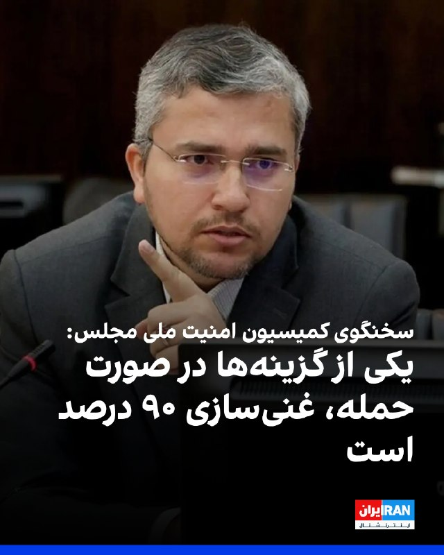

ابراهیم رضایی، سخنگوی کمیسیون امنیت ملی مجلس، در شبکه اجتماعی ایکس نوشت یکی از گزینه‌های جمهوری اسلامی در صورت حمله مجدد می‌تواند غنی‌سازی ۹۰ درصد باشد.

او نوشت: «یکی از گزینه‌‌ها در صورت حمله مجدد می‌تواند غنی‌سازی ۹۰ درصد باشد. در مجلس بررسی می‌کنیم.»
https://iranintl.com/202605126303

## IranIntlTV — post 336763

  <a href="telegram/content/IranIntlTV_336763_1778573882.mp4" target="_blank">🎬 Download video</a>

اسرائیل به تصمیم اتحادیه اروپا برای تحریم برخی شهرک‌نشینان اسرائیلی در کرانه باختری واکنش نشان داد و با این اقدام مخالفت کرد.

بابک اسحاقی، خبرنگار ایران‌اینترنشنال، گزارش می‌دهد
@iranintltv

## IranIntlTV — post 336762

  <a href="telegram/content/IranIntlTV_336762_1778573884.mp4" target="_blank">🎬 Download video</a>

نمایشگاهی با هدف «بیدارسازی افکار عمومی» اروپا نسبت به نقض گسترده حقوق بشر و موج اعدام‌ها در ایران، به‌مدت یک ماه در شهرهای برلین، لاهه، آمستردام، بروکسل، پاریس و ژنو برگزار شد.

مهدی تهرانی، خبرنگار ایران‌اینترنشنال، گزارش می‌دهد
@iranintltv

## IranIntlTV — post 336761

  

وزارت خارجه پاکستان گزارش درباره اعزام هواپیماهای نظامی و غیرنظامی جمهوری اسلامی به پاکستان برای در امان ماندن از حملات، را «گمراه‌کننده» توصیف کرد و آن را رد کرد.

این وزارتخانه در بیانیه‌ای اعلام کرد که پس از برقراری آتش‌بس و در جریان مذاکرات، شماری از هواپیماها وارد پاکستان شدند تا جابه‌جایی تیم‌ها را تسهیل کنند و برخی از این هواپیماها و نیروهای پشتیبانی «به‌طور موقت» در این کشور باقی ماندند تا برای دورهای بعدی تعامل آماده باشند.

در این بیانیه آمده است: «هواپیماهای ایرانی که هم‌اکنون در پاکستان مستقر هستند، در دوره آتش‌بس وارد این کشور شدند و هیچ‌گونه ارتباطی با هیچ سناریوی نظامی یا ترتیبات حفاظتی ندارند.»

شبکه خبری سی‌بی‌اس به نقل از «مقام‌های آگاه آمریکایی» گزارش داده بود که جمهوری اسلامی، شماری از هواپیماهای نظامی خود را به پایگاه نورخان پاکستان و همچنین چند هواپیمای غیرنظامی را به افغانستان اعزام کرده است تا از خسارات ناشی از جنگ در امان بمانند.
https://iranintl.com/202605125000

## IranIntlTV — post 336760

🗣روایت شما از بحران اقتصادی و زندگی در آتش‌بس- سه‌شنبه ۲۲ اردیبهشت:

🔹دانه قهوه شده کیلویی ۲ میلیون تومان، قهوه فوری شده کیلویی ۳ میلیون تومان! دیگه نمی‌شه قهوه خورد

🔹لوازم بهداشتی به‌شدت گران شده‌ان. قیمت مام ضد تعریقی که می‌گرفتم ۲۰۰ هزار تومان به ۶۰۰ هزار تومان افزایش یافته.

🔹با ۲۸ میلیون حقوق ماهیانه، زندگی دو نفره رزیدنتی ما به بن‌بست رسیده. پس‌اندازهایمان تمام شده و حتی توان تعمیر وسایل را نداریم.

🔹من فارغ‌التحصیل ارشدم، دو سال با بدبختی پول جور کردم یه لپ‌تاپ خریدم تحقیقات انجام دادم همین که اومدم مقاله رو چاپ کنم نت قطع شد. این وضعیت برای یکی مثل من که هیچ‌وقت دست از تلاش برنمی‌داشتم یعنی خود مرگ.

🔹از میانکوه خوزستان پیام می‌دهم؛ منطقه یک انتقال گاز در سال جدید حقوق ارکان ثالث را پرداخت نکرده که سابقه نداشته، همیشه برج یک دستمزدها پرداخت می‌شد.

🔹جمهوری اسلامی دقیقا به سبک کارتل‌های مواد مخدر عمل می‌کند. یک عده وفادار به خودش را با تطمیع و پول‌پاشی نگه داشته، ملت ایران را ول کرده در فقر و گرونی دست و پا بزنند. الحق که جمهوری اسلامی جمع رذایل همه‌ حکومت‌های تاریخ است.

## IranIntlTV — post 336759

  <a href="https://t.me/IranintlTV/336759" target="_blank">📎 Download file</a>

🎧نسخه صوتی اخبار بامدادی | سه‌شنبه ۲۲ اردیبهشت
@iranintlTV

## IranIntlTV — post 336758

  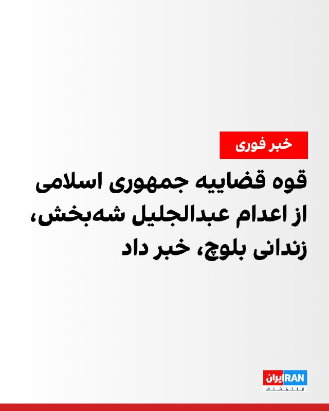

خبرگزاری میزان، رسانه قوه قضاییه جمهوری اسلامی، اعلام کرد که حکم اعدام عبدالجلیل شه‌بخش، زندانی بلوچ، بامداد سه‌شنبه ۲۲ اردیبهشت اجرا شده است. میزان اتهام او را «عضویت در گروه انصارالفرقان» و «بغی» عنوان کرده است.

در گزارش منتشرشده از سوی این رسانه، به تاریخ دقیق بازداشت عبدالجلیل شه‌بخش اشاره‌ای نشده است. همچنین پیشتر اطلاعی درباره بازداشت و روند طی شدن مراحل قضایی پرونده او منتشر نشده بود.
https://iranintl.com/202605126293

## IranIntlTV — post 336757

  <a href="telegram/content/IranIntlTV_336757_1778573889.mp4" target="_blank">🎬 Download video</a>

تصویری از یک راهب که هر صبح با گروهی از سگ‌های یک معبد در تایلند برای جمع‌آوری نذورات و غذا در اطراف محله حرکت می‌کند، در روزهای اخیر در شبکه‌های اجتماعی بازتاب گسترده‌ای داشته و میلیون‌ها بار دیده شده است.

گزارش فرزیا ثابتی، خبرنگار ایران‌اینترنشنال
@iranintltv

## IranIntlTV — post 336756

  <a href="telegram/content/IranIntlTV_336756_1778573891.mp4" target="_blank">🎬 Download video</a>

آیلین وانگ، شهردار شهر آرکادیا در ایالت کالیفرنیا، پس از متهم شدن به «همکاری پنهانی با دولت چین»، از سمت خود کناره‌گیری کرد.

گفت‌وگو با رضا گوهرزاد، روزنامه‌نگار و تحلیلگر سیاسی
@iranintltv

## IranIntlTV — post 336755

  <a href="telegram/content/IranIntlTV_336755_1778573893.mp4" target="_blank">🎬 Download video</a>

حمله به یک کشتی کره جنوبی در تنگه هرمز بازتاب گسترده‌ای در رسانه‌ها و محافل بین‌المللی داشته است. در همین ارتباط، سفیر جمهوری اسلامی در سئول هرگونه دخالت ایران در این حادثه را رد کرد.

گفت‌وگو با توماج طاهباز، خبرنگار ایران‌اینترنشنال
@iranintltv

## IranIntlTV — post 336754

  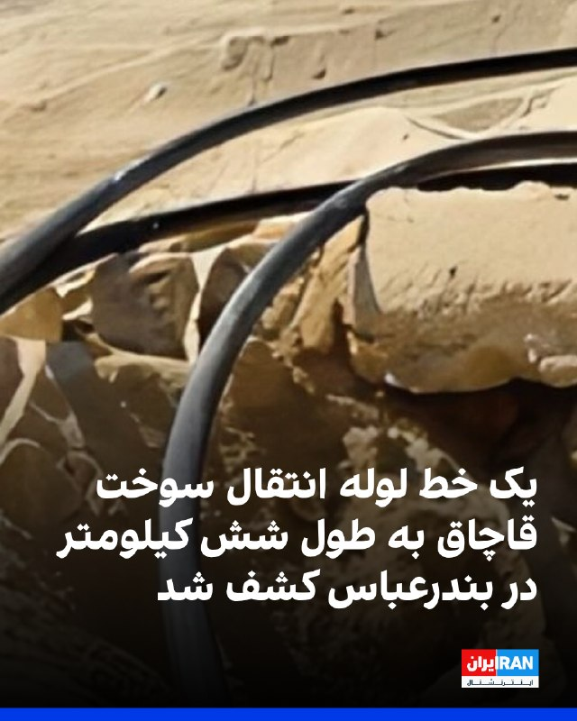

جانشین پایگاه دریابانی بندرعباس از شناسایی و انهدام یک خط لوله انتقال سوخت قاچاق به طول شش کیلومتر خبر داد. به گزارش فارس، وابسته به سپاه، قاچاقچیان این خطوط لوله را زیر ماسه‌ها و آب دریا جاسازی کرده بودند و از آن طریق، سوخت را از ساحل به دریا و شناورهای متخلف انتقال می‌دادند.
https://iranintl.com/202605125372

## IranIntlTV — post 336753

  <a href="telegram/content/IranIntlTV_336753_1778573897.mp4" target="_blank">🎬 Download video</a>

🔻امانوئل مکرون، رییس‌جمهوری فرانسه، که برای شرکت در نشست «آفریقا فوروارد ۲۰۲۶» به کنیا سفر کرده است، صبح دوشنبه همراه با الیود کیپچوگه، قهرمان ماراتن المپیک‌های ۲۰۱۶ و ۲۰۲۰، دقایقی در خیابان‌های نایروبی، پایتخت کنیا دوید.

🔹الیود کیپچوگه با انتشار تصاویری درباره دویدن رییس‌جمهور فرانسه با او‌ نوشت: «فرصت داشتیم درباره این صحبت کنیم که چگونه می‌توانیم حمایت و فرصت‌های بیشتری برای نسل بعدی ورزشکاران آفریقایی فراهم کنیم.»

🔹او نوشت: «چنین لحظاتی به من یادآوری می‌کند که دویدن فراتر از حرکت است. این یک زبان جهانی است که مردم، فرهنگ‌ها و ایده‌ها را به هم پیوند می‌دهد.»

@iranintltvsport

## IranIntlTV — post 336752

  <a href="telegram/content/IranIntlTV_336752_1778573899.mp4" target="_blank">🎬 Download video</a>

دولت استرالیا از اعمال تحریم‌های جدید علیه مقام‌ها و نهادهای جمهوری اسلامی، از جمله وزیر کشور، فرماندهان امنیتی و نیروی انتظامی، به‌دلیل نقش آن‌ها در سرکوب معترضان و همچنین محدود کردن اینترنت در ایران خبر داد.

علیرضا محبی، خبرنگار ایران‌اینترنشنال،‌گزارش می‌دهد
@iranintltv

## ManotoTV — post 105335

  <a href="telegram/content/ManotoTV_105335_1778573901.mp4" target="_blank">🎬 Download video</a>

گروهی از نیروهای ارتش بریتانیا برای رساندن کمک پزشکی به یک شهروند بریتانیایی مشکوک به ابتلا به هانتاویروس، با چتر روی جزیره دورافتاده تریستان دا کونا در جنوب اقیانوس اطلس فرود آمدند.

بر اساس اعلام وزارت دفاع بریتانیا، این عملیات با حضور شش چترباز و دو پزشک نظامی از تیپ شانزدهم حمله هوایی انجام شد. این نیروها از یک هواپیمای ترابری ایرفورس ای۴۰۰ام به جزیره اعزام شدند و همزمان اکسیژن و تجهیزات پزشکی نیز از هوا رها شد.

وزارت دفاع بریتانیا گفته است این نخستین‌بار است که ارتش این کشور برای یک ماموریت بشردوستانه پزشکی، نیروی درمانی را از راه پرش با چتر اعزام می‌کند. هانتاویروس بیماری نادری است که معمولا از طریق تماس یا تنفس ذرات آلوده به ادرار، مدفوع یا بزاق جوندگان منتقل می‌شود و در موارد شدید می‌تواند خطرناک باشد.

## ManotoTV — post 105334

  <a href="telegram/content/ManotoTV_105334_1778573903.mp4" target="_blank">🎬 Download video</a>

وزارت خارجه پاکستان اعلام کرد اگرچه مذاکرات رسمی هنوز از سر گرفته نشده، تماس‌های دیپلماتیک در سطح بالا همچنان ادامه دارد.

این وزارتخانه در واکنش به گزارش سی‌بی‌اس درباره حضور هواپیماهای جمهوری اسلامی در پایگاه نورخان پاکستان، این گزارش را «گمراه‌کننده و جنجالی» خواند و گفت هواپیماهایی از ایران و آمریکا پس از آتش‌بس و در جریان دور نخست گفت‌وگوهای اسلام‌آباد وارد پاکستان شده بودند تا جابه‌جایی دیپلمات‌ها، تیم‌های امنیتی و کارکنان اداری مرتبط با روند مذاکرات را تسهیل کنند.

وزارت خارجه پاکستان همچنین گفت برخی هواپیماها و نیروهای پشتیبانی به‌طور موقت در پاکستان باقی ماندند تا برای دورهای بعدی تماس‌ها آماده باشند. اسلام‌آباد تاکید کرده است هواپیماهای ایرانی موجود در پاکستان ارتباطی با «اقدام نظامی» یا «حفظ دارایی‌های نظامی» ندارند و پاکستان در این روند نقش میانجی «بی‌طرف و سازنده» داشته است.

## ManotoTV — post 105333

  <a href="telegram/content/ManotoTV_105333_1778573904.mp4" target="_blank">🎬 Download video</a>

وزارت خارجه استرالیا اعلام کرد این کشور تحریم‌های مالی هدفمند و ممنوعیت سفر تازه‌ای را علیه هفت فرد و چهار نهاد وابسته به جمهوری اسلامی اعمال کرده است.

پنی وانگ، وزیر خارجه استرالیا، گفت این تحریم‌ها در واکنش به «سرکوب خشونت‌بار مردم ایران»، قطع اینترنت، فشار بر زنان و دختران و اقدامات بی‌ثبات‌کننده جمهوری اسلامی در منطقه اعمال می‌شود.

بر اساس اعلام دفتر تحریم‌های استرالیا، افراد تحریم‌شده شامل اسکندر مومنی، مجید فیض جعفری، روح‌الله مومن‌نسب، قربان‌محمد ولی‌زاده، محسن ابراهیمی، ناصر زرین‌قلم و منصور زرین‌قلم هستند. نیروی انتظامی جمهوری اسلامی، سراج سایبرسپیس، صرافی برلیان و صرافی جی‌سی‌ام نیز در فهرست نهادهای تحریم‌شده قرار گرفته‌اند.

## ManotoTV — post 105332

  <a href="telegram/content/ManotoTV_105332_1778573905.mp4" target="_blank">🎬 Download video</a>

تصویری از نفتکش ایرانی «سی‌استار سه» منتشر شده که آتش‌سوزی در بخش دودکش آن را پس از هدف قرار گرفتن در دریای عمان نشان می‌دهد.

تانکر ترکرز گزارش داد این نفتکش متعلق به شرکت ملی نفتکش ایران، نزدیک جاسک هدف قرار گرفته است. به گفته این وب‌سایت تخصصی ردیابی نفتکش‌ها، «سی‌استار سه» از نفتکش‌های بسیار بزرگ حمل نفت خام است، نام اولیه آن «سنندج» بوده و پس از تحریم‌ها چند بار تغییر نام داده است.

در این گزارش آمده است خدمه نفتکش آسیبی ندیده‌اند.

پیشتر سنتکام، فرماندهی مرکزی ارتش آمریکا، اعلام کرده بود یک جنگنده نیروی دریایی آمریکا از ناو هواپیمابر «جورج اچ دبلیو بوش» ۱۸ اردیبهشت دودکش این نفتکش را هدف قرار داده است. سنتکام گفته بود این اقدام برای جلوگیری از ورود این نفتکش به یکی از بنادر ایران انجام شد.

## ManotoTV — post 105331

  <a href="telegram/content/ManotoTV_105331_1778573906.mp4" target="_blank">🎬 Download video</a>

پلیس منطقه یورک در کانادا اعلام کرد مهران محققی، ۳۹ ساله و ساکن ریچموند هیل، در ارتباط با حادثه‌ای در جریان یک تجمع درباره ایران در این شهر بازداشت و متهم شده است.

بر اساس بیانیه پلیس، این حادثه روز یکشنبه ۲۱ اردیبهشت در حوالی تقاطع خیابان یانگ و میجر مکنزی رخ داد. پلیس می‌گوید مظنون با خودرو به شکلی خطرناک در نزدیکی تجمع حرکت کرده، با یک راننده تحویل غذا که در تجمع حضور نداشت برخورد کرده و هنگام فرار نیز با خودرویی دیگر تصادف کرده است.

به گفته پلیس، محققی به حمله با سلاح، رانندگی خطرناک، تهدید و توقف نکردن پس از تصادف متهم شده است. تحقیقات در این پرونده ادامه دارد و پلیس از شاهدان و دارندگان تصاویر دوربین خودرو، تلفن همراه یا دوربین‌های امنیتی خواسته است اطلاعات خود را در اختیار بازرسان بگذارند.

## ManotoTV — post 105330

  <a href="telegram/content/ManotoTV_105330_1778573907.mp4" target="_blank">🎬 Download video</a>

وزارت خارجه آمریکا از طریق برنامه «پاداش برای عدالت» اعلام کرد برای دریافت اطلاعاتی که به مختل شدن سازوکارهای مالی سپاه و شاخه‌های مختلف آن، از جمله نیروی قدس سپاه، منجر شود، تا سقف ۱۵ میلیون دلار پاداش پرداخت می‌کند.

بر اساس اعلام این برنامه، سپاه بخشی از فعالیت‌های خارجی خود را از طریق فروش نفت تحریم‌شده جمهوری اسلامی و با استفاده از شبکه‌ای از شرکت‌های پوششی تامین مالی می‌کند. وزارت خارجه آمریکا می‌گوید این شبکه‌ها درآمدهای حاصل از فروش نفت را از مسیرهای غیرشفاف و از جمله از طریق نظام بانکی آمریکا جابه‌جا کرده‌اند.

در اطلاعیه برنامه «پاداش برای عدالت» از وانگ شائویون، تبعه چین، و محمود راشد عامر الحبسی، تبعه عمان، نام برده شده است. به گفته مقام‌های آمریکایی، این دو نفر به همراه افراد و شرکت‌های وابسته در چین، عمان و ترکیه، فروش و انتقال نفت تحریم‌شده ایران به پالایشگاه‌ها و شرکت‌های دولتی چین را سازمان‌دهی کرده‌اند تا درآمد آن به نیروی قدس سپاه برسد.

## ManotoTV — post 105329

  <a href="telegram/content/ManotoTV_105329_1778573907.mp4" target="_blank">🎬 Download video</a>

سی‌بی‌اس نیوز به نقل از مقام‌های آمریکایی گزارش داد پاکستان، همزمان با ایفای نقش میانجی میان تهران و واشینگتن، به چند هواپیمای نظامی جمهوری اسلامی اجازه داد در پایگاه‌های هوایی این کشور مستقر شوند.

بر اساس این گزارش، این اقدام احتمالا برای دور نگه داشتن بخشی از دارایی‌های هوایی جمهوری اسلامی از حملات آمریکا انجام شده است. مقام‌های آمریکایی گفته‌اند یکی از این هواپیماها یک فروند آرسی-۱۳۰ نیروی هوایی ایران بود که به پایگاه نورخان پاکستان منتقل شد.

یک مقام ارشد پاکستانی این گزارش را رد کرد و گفت پنهان کردن چنین هواپیماهایی در پایگاه نورخان، به دلیل موقعیت آن در قلب شهر، ممکن نیست.

## ManotoTV — post 105328

  <a href="telegram/content/ManotoTV_105328_1778573908.mp4" target="_blank">🎬 Download video</a>

رزا پرتو، روزنامه‌نگار «منوتو»، در گردهمایی ایرانیان روبروی دادگاه لاهه در هلند گفت: «جمهوری اسلامی باید در دادگاه لاهه محاکمه شود».

## FarsiVOA — post 217507

  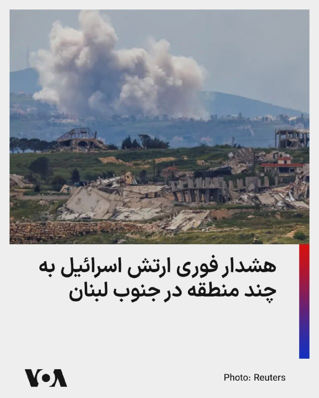

ارتش اسرائیل با صدور هشدار فوری از ساکنان چند شهر و روستای لبنان خواست فوراً محل حضور خود را ترک کنند و دست‌کم هزار متر از مناطق مسکونی به سمت زمین‌های باز فاصله بگیرند.

این هشدار شامل مناطق ارزون، طیر دبا، البازوریه و الحوش اعلام شده است.

در این پیام آمده است که «به‌دلیل نقض توافق آتش‌بس از سوی حزب‌الله تروریستی، ارتش اسرائیل ناچار است با قدرت علیه مواضع و زیرساخت‌های این گروه اقدام کند.»

ارتش اسرائیل تأکید کرده قصد آسیب‌رساندن به غیرنظامیان را ندارد اما «هر فردی که در نزدیکی نیروها، تأسیسات یا تجهیزات جنگی حزب‌الله تروریستی باقی بماند، جان خود را در معرض خطر قرار می‌دهد.»

این هشدار نشان می‌دهد تنش‌ها در جنوب لبنان بار دیگر وارد مرحله‌ای حساس شده و احتمال عملیات گسترده‌تر علیه مواضع حزب‌الله افزایش یافته است.
@FarsiVOA

## FarsiVOA — post 217506

🔺پالایشگاه‌های مستقل چین تولید را کاهش دادند؛ فشار تازه بر مسیر فروش نفت تحریمی تهران

▪️رویترز به نقل از منابع تجاری و پالایشگاهی گزارش داد شماری از پالایشگاه‌های مستقل چین در استان شاندونگ، همزمان با افزایش زیان مالی، تولید سوخت خود را کاهش داده‌اند.

▪️این اقدام می‌تواند تقاضا برای نفت تحریمی ایران و روسیه را در بزرگ‌ترین واردکننده نفت جهان کاهش دهد.

▪️پالایشگاه‌های مستقل چین حدود ۹۰ درصد نفت صادراتی جمهوری اسلامی را خریداری می‌کنند و واردات آنها از نفت ایران در ماه مارس به رکورد حدود یک میلیون و ۸۰۰ هزار بشکه در روز رسیده بود.

⬇️ بیشتر بخوانید:
https://ir.voanews.com/a/8149151.html

## FarsiVOA — post 217505

  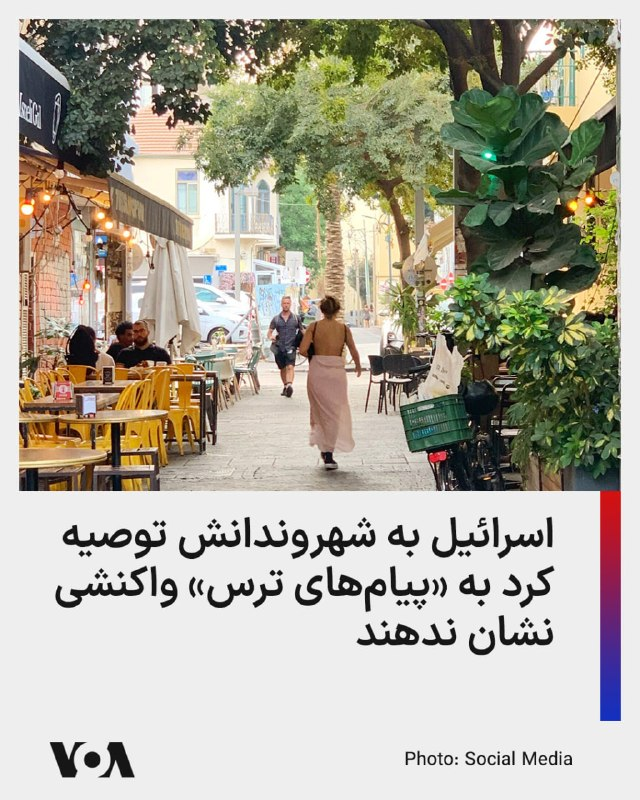

یک اداره اسرائیلی به مردم این کشور توصیه کرد که اگر پیام‌هایی موسوم به «پیام‌های ترس» دریافت کرده‌اند، نسبت به آن واکنشی نشان ندهند.

اداره ملی سایبری اسرائیل سه‌شنبه اعلام کرد که در چند ساعت گذشته، مردم این کشور این نوع پیام‌ها دریافت کرده‌اند که هدف آن‌ها «ایجاد وحشت و تضعیف احساس امنیت» است.

این اداره افزود: «این یک تلاش آشنا برای تأثیرگذاری در فضای دیجیتال است: پیام‌های تهدیدآمیز، دراماتیک یا استرس‌زا که مستقیماً برای شهروندان ارسال می‌شوند و تلاش می‌کنند آن‌ها را وادار کنند بر اساس ترس عمل کنند.»

این نهاد جزئیاتی درباره محتوای پیام‌ها ارائه نداد و مشخص نکرد که چه کسی پشت ارسال آن‌ها قرار دارد.

اداره ملی سایبری اسرائیل توصیه کرد که دریافت‌کنندگان چنین پیام‌هایی روی هیچ لینکی کلیک نکنند، آنها را برای دیگران ارسال نکنند و به آن‌ها پاسخ ندهند.
@FarsiVOA

## FarsiVOA — post 217504

🔺اسلام‌آباد: حضور هواپیماهای ایرانی در پاکستان برای حفاظت از آنها نیست

▪️وزارت خارجه پاکستان اعلام کرد که حضور برخی هواپیماهای ایرانی در پاکستان در چارچوب «وضعیت اضطراری نظامی یا ترتیبات حفاظتی» نیست و صرفاً برای «تسهیل جابه‌جایی» مقامات جمهوری اسلامی در چارچوب مذاکرات است.

▪️پیشتر شبکه خبری سی‌بی‌اس گزارش داده بود که پاکستان به هواپیماهای نظامی جمهوری اسلامی اجازه داده در خاک آن کشور مستقر شوند و این اقدام به‌طور بالقوه آن هواپیماها را از حملات هوایی آمریکا محافظت می‌‌کند.

▪️در واکنش به این خبر، سناتور لیندزی گراهام، گفته بود: «اگر این گزارش درست باشد، باید نقش پاکستان به‌عنوان میانجی میان [جمهوری اسلامی] ایران، ایالات متحده و دیگر طرف‌ها به‌طور کامل بازنگری شود.»

⬇️ بیشتر بخوانید:
https://ir.voanews.com/a/8149150.html

## FarsiVOA — post 217503

🔺استرالیا نیروی انتظامی، وزیر کشور و چند فرد و نهاد دیگر جمهوری اسلامی را تحریم کرد

▪️استرالیا تحریم‌هایی را علیه نیروی انتظامی، وزیر کشور و چندین فرد و نهاد دیگر جمهوری اسلامی وضع و آن‌ها را به دست داشتن در نقض حقوق بشر، برنامه موشکی تهران، حمایت از گروه حماس و دیگر «اقدامات بی‌ثبات‌کننده» متهم کرد.

▪️وزیر کشور، رئیس‌ پلیس امنیت عمومی فراجا، دبیر ستاد امر به معروف و نهی از منکر تهران، فرمانده سپاه سیدالشهدا، فرمانده نیروهای موسوم به «نوپو»، و دو فردی که گفته می‌شود نقش کلیدی در پول‌شویی برای جمهوری اسلامی دارند، در فهرست این تحریم‌ها هستند.

▪️همچنین علاوه بر نیروی انتظامی، سازمان فضای مجازی سراج، صرافی برلیان و صرافی جی‌سی‌ام توسط استرالیا تحریم شده‌اند.

⬇️ بیشتر بخوانید:
https://ir.voanews.com/a/8149148.html

## FarsiVOA — post 217502

  

خبرگزاری قوه قضائیه اعلام کرد حکم اعدام عبدالجلیل شه‌بخش، معروف به «شکیب»، بامداد سه‌شنبه ۲۲ اردیبهشت اجرا شده است.

بر اساس این گزارش، مقام‌های قضایی جمهوری اسلامی او را «از اعضای عملیاتی گروه انصارالفرقان» معرفی کرده و گفته‌اند پرونده او با اتهام «بغی»، از طریق حمله مسلحانه به مقرهای انتظامی و عضویت در این گروه، در دادگاه انقلاب بررسی شده بود.

رئیس کل دادگستری سیستان و بلوچستان گفته است مدارک استخراج‌شده از وسایل ارتباطی، فایل‌های صوتی و آنچه «اقاریر» متهم خوانده شده، مبنای صدور حکم قرار گرفته و دیوان عالی کشور نیز حکم را تأیید کرده بود.

جزئیات دادرسی، دسترسی متهم به وکیل مستقل و روند اخذ اعترافات به‌طور مستقل تأیید نشده است.
@FarsiVOA

## FarsiVOA — post 217501

🔺نماینده آمریکا استقرار «گنبد آهنین» در امارات را تأیید کرد

▪️مایک والتز، سفیر آمریکا در سازمان ملل، استقرار سامانه دفاع موشکی «گنبد آهنین» اسرائیل برای رهگیری موشک‌های جمهوری اسلامی در امارات متحده عربی را تأیید کرد.

▪️والتز در جریان سخنرانی خود در مراسم روز استقلال که از سوی هیئت اسرائیل در سازمان ملل در نیویورک برگزار شد، گفت: «ما دیدیم که امارات متحده عربی از گنبد آهنینی که اسرائیل در اختیارش قرار داده بود استفاده کرد.»

▪️پیشتر اکسیوس گزارش کرده بود که در اوایل جنگ اخیر با جمهوری اسلامی، نتانیاهو به ارتش اسرائیل دستور داد که یک واحد سامانه گنبد آهنین همراه با رهگیرها و چند ده نیروی ارتش اسرائیل به امارات ارسال شود.

⬇️ بیشتر بخوانید:
https://ir.voanews.com/a/8149149.html

## FarsiVOA — post 217500

🔺دیده‌بان حقوق بشر: فناوری‌های نظارتی اروپا به کشورهای ناقض حقوق بشر صادر شده است

▪️دیده‌بان حقوق بشر در گزارشی تازه اعلام کرد اتحادیه اروپا، با وجود مقرراتی که برای کنترل صادرات فناوری‌های حساس تصویب کرده، همچنان در جلوگیری از انتقال ابزارهای نظارتی به دولت‌هایی با سابقه نقض حقوق بشر ناکام بوده است.

▪️بر اساس این گزارش، فناوری‌های نظارتی اروپایی به بیش از ۲۴ کشور رسیده‌اند؛ کشورهایی که سابقه مستند در سرکوب مخالفان، روزنامه‌نگاران یا فعالان مدنی دارند.

▪️ایران در گزارش تازه دیده‌بان حقوق بشر به‌عنوان مقصد صادرات ذکر نشده، اما پیش‌تر نام چند شرکت خارجی در ارتباط با فروش یا انتقال فناوری‌های شنود و نظارت به ایران مطرح شده بود.

⬇️ بیشتر بخوانید:
https://ir.voanews.com/a/8149147.html

## FarsiVOA — post 217499

  

وزارت خارجه آمریکا اعلام کرد مارکو روبیو، وزیر خارجه این کشور، در تماس‌هایی جداگانه با پنی وانگ، وزیر خارجه استرالیا، و ایوت کوپر، وزیر خارجه بریتانیا، درباره ایران و تلاش‌ها برای بازگرداندن آزادی کشتیرانی در تنگه هرمز گفت‌وگو کرده است.

به گزارش رویترز، جنگ آمریکا و جمهوری اسلامی عملاً عبور از تنگه هرمز را مختل کرده و بزرگ‌ترین اختلال در بازار انرژی را رقم زده است. پیش از جنگ، حدود ۲۰ درصد محموله‌های جهانی نفت و گاز طبیعی مایع از این تنگه عبور می‌کرد.

تهران تقریباً همه کشتی‌ها به‌جز کشتی‌های خود را از عبور از این مسیر منع کرده و دونالد ترامپ نیز محاصره جداگانه‌ای علیه بنادر ایران اعمال کرده است. ترامپ روز دوشنبه گفت آتش‌بس با ایران که بیش از یک ماه پیش به دست آمد، «در وضعیت بسیار شکننده» قرار دارد.
@FarsiVOA

## FarsiVOA — post 217498

🔺گزارش: دونالد ترامپ با تیم امنیت ملی خود درباره ایران جلسه گذاشت

▪️دونالد ترامپ، رئيس جمهوری آمریکا روز دوشنبه بار دیگر با تیم امنیت ملی خود در کاخ سفید دیدار و گفت‌وگو کرد.

⬇️ بیشتر بخوانید:
https://ir.voanews.com/a/8149146.html
@FarsiVOA

## FarsiVOA — post 217497

  

⚡️ارتش اسرائيل با صدور هشداری فوری به ساکنان روستای سحمر در لبنان، از آن‌ها خواست برای حفظ امنیت خود، فوراً خانه‌های خود را ترک کنند و دست‌کم به فاصله ۱۰۰۰ متری از روستا، به مناطق باز منتقل شوند. ارتش اسرائيل در این هشدار گفت حزب‌الله لبنان توافق آتش‌بس را نقض کرده است و «ارتش دفاعی ناچار است علیه آن با قدرت اقدام کند. ارتش قصد آسیب رساندن به شما را ندارد.» ارتش اسرائيل افزود «هر فردی که در نزدیکی عناصر حزب‌الله، تأسیسات یا تجهیزات نظامی آن‌ها حضور داشته باشد، جان خود را در معرض خطر قرار می‌دهد.»
@FarsiVOA

## FarsiVOA — post 217496

  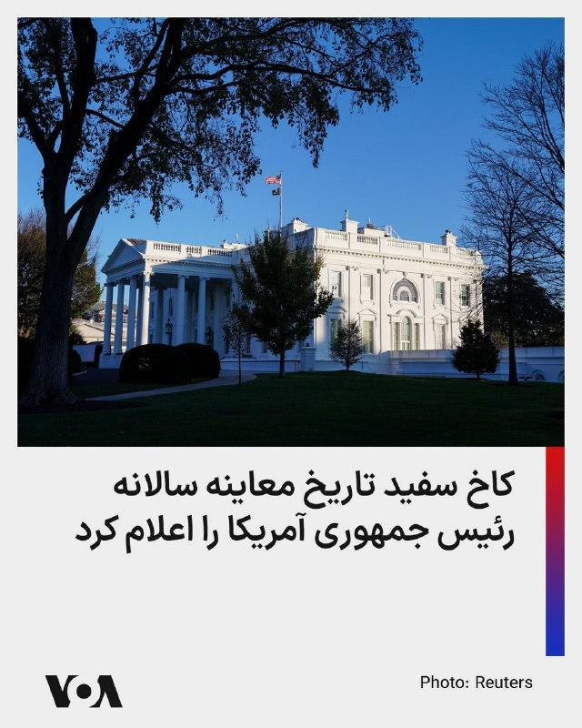

⚡️کاخ سفید دوشنبه شب اعلام کرد که دونالد ترامپ، رئیس‌جمهوری آمریکا، در تاریخ ۵ خرداد (۲۶ مه) برای انجام معاینات سالانه پزشکی و دندان‌پزشکی خود به «مرکز پزشکی نظامی والتر رید» مراجعه می‌کند.
@FarsiVOA

## DW_Farsi — post 124586

  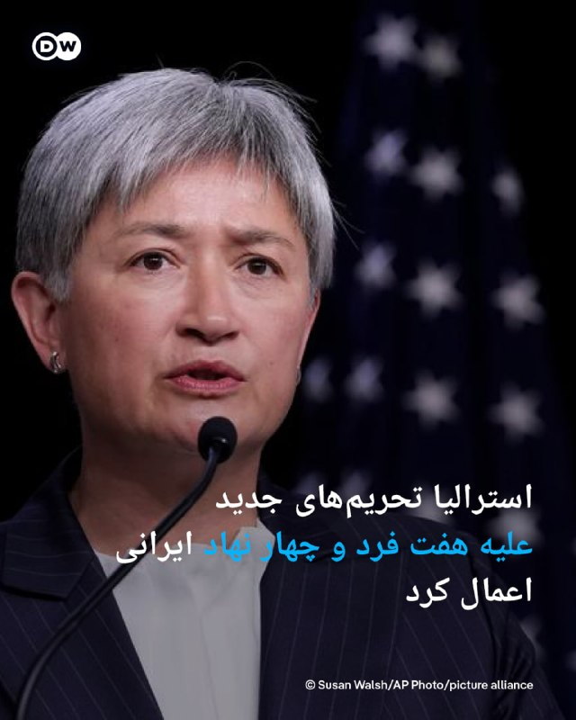

🔶 استرالیا تحریم‌های جدید علیه هفت فرد و چهار نهاد ایرانی اعمال کرد

پنی وانگ، وزیر امور خارجه استرالیا، روز سه‌شنبه ۱۲ مه (۲۲ اردیبهشت) اعلام کرد، دولت این کشور در واکنش به "سرکوب خشونت‌آمیز" مستمر شهروندان توسط حکومت جمهوری اسلامی و همچنین بازداشت ناعادلانه اتباع خارجی، ۷ فرد و ۴ نهاد ایرانی را تحریم می‌کند.

در بیانیه‌ای که وبسایت وزارت خارجه استرالیا منتشر کرده، آمده است: «در ماه ژانویه، رژیم ایران هزاران نفر از شهروندان خود را قتل‌عام کرد و دست به بازداشت‌های گسترده معترضان مسالمت‌آمیز زد؛ بازداشت‌شدگانی که تحت شکنجه قرار گرفتند، وادار به اعترافات اجباری شدند و از ارتباط با خانواده‌هایشان محروم ماندند.»

در این بیانیه با اشاره به قطع سراسری اینترنت گفته شده است حکومت ایران "دسترسی به اینترنت را محدود کرد تا مانع از آگاهی جهان از این جنایات شود".

به گفته وزیر خارجه استرالیا تحریم‌های جدید "همچنین نظام بانکی سایه‌ای ایران را هدف قرار می‌دهد که به این کشور اجازه می‌دهد گروه‌های نیابتی مانند حماس را تأمین مالی کند، از برنامه موشک‌های بالستیک خود حمایت کند و دیگر اقدامات بی‌ثبات‌کننده را انجام دهد".

## DW_Farsi — post 124585

  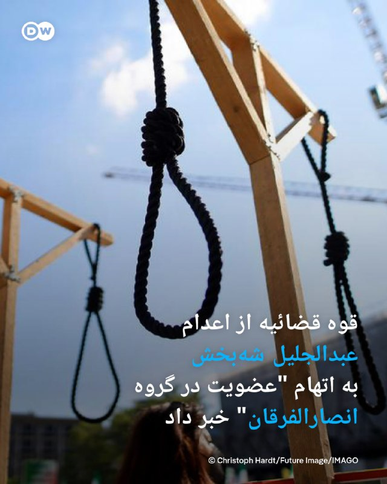

🔶 قوه قضائیه از اعدام عبدالجلیل شه‌بخش به اتهام "عضویت در گروه انصارالفرقان" خبر داد

قوه قضائیه جمهوری اسلامی در اطلاعیه‌ای از اعدام یک زندانی دیگر به نام عبدالجلیل شه‌بخش در بامداد روز سه‌شنبه ۲۲ اردیبهشت (۱۲ مه) خبر داد.

در این اطلاعیه ادعا شده او "یکی از عناصر کلیدی گروه انصار الفرقان" بوده است که در جریان اعتراضات سراسری سال ۱۴۰۱ در استان سیستان و بلوچستان "با هدف انتقام‌جویی و ایجاد ناامنی، شناسایی مقرهای انتظامی را در دستور کار" قرار می‌دادند.

در این اطلاعیه اذعان شده است که عبدالجلیل شه‌بخش در مراحل اولیه بازجویی ارتباط با این گروه را تکذیب کرده است.

در ادامه ادعا شده است که او "در یکی از کشورهای همسایه آموزش‌های نظامی و ضد اطلاعاتی" دیده و "مستندات غیرقابل انکاری از حضور او در عملیات‌های مسلحانه" به دست آمده است.

قوه قضائیه مدعی شده است که عبدالجلیل شه‌بخش "حدود ۶ سال پیش" با گروه انصارالفرقان آشنا شده و " از روابط فامیلی و ترددهای عادی خود در مناطق کورین و تفتان به عنوان پوششی برای شناسایی مسیرها و مقرهای نظامی استفاده می‌کرده است".

@dw_farsi

## DW_Farsi — post 124584

  

🔶 جایزه ۱۵ میلیون دلاری آمریکا برای دریافت اطلاعات مربوط به ساز‌وکارهای مالی سپاه پاسداران

دولت آمریکا در چارچوب تلاش‌های خود برای افزایش فشار بر تهران و در ادامه کارزار "خشم اقتصادی" علیه تهران، جایزه‌ای تا سقف ۱۵ میلیون دلار برای اطلاعاتی که "به مختل‌ کردن سازوکارهای مالی" سپاه پاسداران انقلاب اسلامی منجر شود، تعیین کرده است.

این جایزه از سوی برنامه "پاداش برای عدالت" وزارت خارجه آمریکا و برای دریافت اطلاعات درباره "منابع درآمد سپاه پاسداران، نیروی قدس سپاه، شاخه‌های وابسته به آن یا سازوکارهای کلیدی تسهیل مالی آن" ارائه می‌شود؛ از جمله شرکت‌های صوری، افرادی که به سپاه در دور زدن تحریم‌ها کمک می‌کنند یا مؤسسات مالی‌ که با این نهاد همکاری دارند.

@dw_farsi

## DW_Farsi — post 124583

  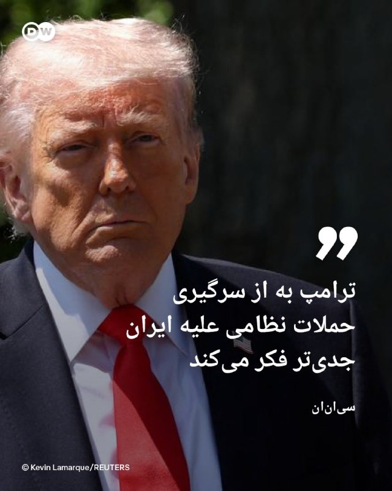

🔶 سی‌ان‌ان: ترامپ به از سرگیری حملات نظامی علیه ایران جدی‌تر فکر می‌کند

شبکه خبری سی‌ان‌ان گزارش داد دونالد ترامپ، رئیس‌ جمهور آمریکا، به‌طور فزاینده‌ای از نحوه مدیریت مذاکرات توسط مقام‌های ایرانی برای پایان دادن به جنگ دچار نارضایتی شده و برخی از مشاوران ترامپ می‌گویند که او اکنون نسبت به هفته‌های اخیر، "با جدیت بیشتری به ازسرگیری عملیات‌های گسترده نظامی علیه ایران فکر می‌کند".

@dw_farsi

## DW_Farsi — post 124582

  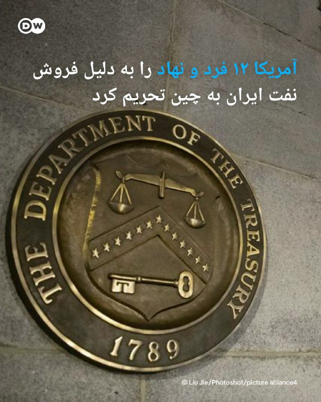

🔶 آمریکا ۱۲ فرد و نهاد را به دلیل فروش نفت ایران به چین تحریم کرد

دولت آمریکا روز دوشنبه ۱۱ مه (۲۱ اردیبهشت) اعلام کرد که سه فرد و ۹ شرکت از جمله چهار شرکت مستقر در هنگ‌کنگ و چهار شرکت در امارات متحده عربی را به دلیل کمک به ارسال نفت ایران به چین تحریم کرده است. شرکت نهم نیز در عمان مستقر است.

وزارت خزانه‌داری آمریکا در بیانیه‌ای گفت که این تحریم‌های جدید که توسط دفتر کنترل دارایی‌های خارجی (OFAC) اعمال شده، افراد و نهادهایی را هدف قرار می‌دهد که به سپاه پاسداران انقلاب اسلامی ایران کمک کرده‌اند تا سهم خود از نفت ایران را از طریق مجموعه‌ای از شرکت‌های پوششی به چین بفروشد و ارسال کند.

اسکات بسنت، وزیر خزانه‌داری، تأکید کرد که دولت ترامپ به استفاده از تحریم‌ها برای محروم کردن حکومت و ارتش ایران از منابع مالی لازم برای تأمین تسلیحات، برنامه هسته‌ای یا حمایت از نیروهای نیابتی در منطقه ادامه خواهد داد.

@dw_farsi

## DW_Farsi — post 124581

  

🔶 وال استریت ژورنال: امارات مخفیانه حملات نظامی علیه ایران انجام داده است

روزنامه وال استریت ژورنال به نقل از منابع مطلع گزارش داد که امارات متحده عربی به طور مخفیانه "حملات نظامی" جمهوری اسلامی انجام داده است. این روزنامه آمریکایی روز دوشنبه (۱۱ مه) ۲۱ اردیبهشت در گزارشی نوشت که حملات امارات پالایشگاهی واقع در جزیره لاوان را هدف قرار داده و "تقریباً هم‌زمان" با اعلام آتش‌بس جنگ از سوی دونالد ترامپ، رئیس ‌جمهور آمریکا، رخ داده است.

در این گزارش به نقل از یک منبع ناشناس ذکر شده است که آمریکا به طور محرمانه از حملات امارات و همچنین از هر کشور عربی حاشیه خلیج فارس که بخواهد به این جنگ با ایران بپیوندد، استقبال کرده است.

جمهوری اسلامی پس از آغاز جنگ چندین کشور عربی حاشیه خلیج فارس را هدف حملات موشکی و پهپادی قرار داد و در این میان امارات بیشترین حجم حملات را متحمل شد.

وال استریت ژورنال اشاره دقیقی به تاریخ حمله امارات به ایران نکرده و نوشته است این حمله که تا کنون به صورت علنی از سوی امارات تأیید نشده، اوایل ماه آوریل انجام شد.

@dw_farsi

## DW_Farsi — post 124580

  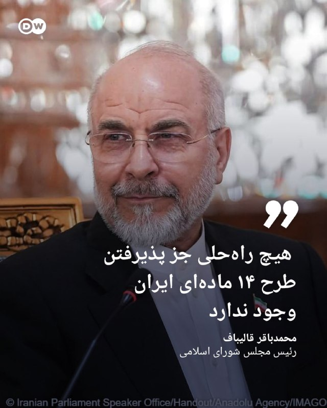

🔶 قالیباف: هیچ راه‌حلی جز پذیرفتن طرح ۱۴ ماده‌ای ایران وجود ندارد

محمدباقر قالیباف،‌ رئیس مجلس شورای اسلامی، با انتشار پیامی در شبکه ایکس به زبان انگلیسی در واکنش به ابراز ناخرسندی و انتقاد شدید دونالد ترامپ در مورد پاسخ تهران به پیشنهاد واشنگتن برای پایان جنگ، نوشت: «هیچ راه‌حلی جز پذیرش حقوق مردم ایران، آن‌گونه که در طرح ۱۴ ماده‌ای بیان شده است، وجود ندارد.»

او در این پیام که شامگاه دوشنبه ۲۱ اردیبهشت منتشر شد تأکید کرد: «هر رویکرد دیگری کاملاً بی‌نتیجه خواهد بود؛ چیزی جز شکست‌های پی‌درپی در پی نخواهد داشت.»

قالیباف به آمریکا نسبت به تعلل در پایان جنگ هشدار داد و افزود: «هرچه بیشتر وقت‌کشی کنند، مالیات‌دهندگان آمریکایی هزینه بیشتری برای آن خواهند پرداخت.»

@dw_farsi

## DW_Farsi — post 124579

  

🔶 جام ۱۹۳۸؛ سیلویو پیولا، مهاجم زهردار لاجوردی‌پوشان ایتالیا

تیم ملی ایتالیا در مسابقات جام جهانی ۱۹۳۸ فرانسه مهاجمی جوان را در صف خود داشت که با ۲۷۴ گل، بهترین گلزن تاریخ لیگ فوتبال این کشور محسوب می‌شود: سیلویو پیولا که او را از مبتکران ضربه‌برگردان نیز می‌دانند.

سیلویو پیولا اگر چه در مسابقات جام جهانی ۱۹۳۸ فرانسه عنوان بهترین گلزن را به لئونیداس، ملی‌پوش برزیل واگذار کرد، اما با گل‌های مهم و سرنوشت‌ساز خود دومین عنوان قهرمانی جهان را برای لاجوردی‌های ایتالیا به ارمغان آورد.

خطرآفرینی و قابلیت‌های گلزنی پیولا سبب شده بود که ایتالیایی‌ها او را "سیلویو گل" بنامند. گل‌های او در مرحله یک‌چهارم نهایی جام جهانی ۳۸ مقابل فرانسه که حذف تیم میزبان را به دنبال داشت نیز باعث شد که نشریات فرانسوی پیولا را "جلادی" بخوانند که موجب نابودی فرانسویان شده بود.

@dw_farsi

## Persian_Trend_Official — post 13961

دو روز ۱۸ و ۱۹ دی ۱۴۰۴، ۲۳۶ کودک رو کشتید. ۵۵۵ بچه رو هم بازداشت کردید. از جنایت هاتون در سوریه هم یه روزی وقتش برسه حرف میزنیم. تاریخ قضاوت خواهد کرد بلایی که شما سر ایران آوردید مغول نیاورد ... 📌 @persian_trend_official پرشین ترند | متفاوت‌ترین کانال نظامی

## Persian_Trend_Official — post 13960

  <a href="telegram/content/Persian_Trend_Official_13960_1778573923.webm" target="_blank">🎬 Download video</a>

🔴سخنگوی دولت: اینترنت حق شهروندی است، پس از رفع تهدیدات شرایط عادی می‌شود

💢سخنگوی دولت در پاسخ به خبرنگار خبرهای فوری مهم درباره هزینه اینترنت پرو و تناقض آن با شعار رفع فیلتر توسط دولت و اینکه چه نهادی ناظر بر این مبالغ است تا منجر به رانت و فساد نشود، گفت:

🔹 دولت دسترسی عادلانه به اینترنت را حق شهروندی می‌داند و تبعیض را برنمی‌تابد.
مهاجرانی با اشاره به قطعی‌های مکرر اینترنت در سال ۱۴۰۴ و فضای ملتهب منطقه‌ای تأکید کرد:

🔹 اینترنت پرو مصوبه شورای عالی امنیت و با هدف حمایت از کسب‌وکارها بوده و این محدودیت‌ها موقتی خواهد بود.

🔹سخنگوی دولت وعده داد با بازگشت ثبات، وضعیت اینترنت هم عادی‌سازی می‌شود و درباره احتمال فساد در هزینه‌های دریافتی هم گفت نهادهای نظارتی بر همه فرآیندها نظارت دارند و مردم نگران نباشند

🫆:Tony

📌 @persian_trend_official
پرشین ترند | متفاوت‌ترین کانال نظامی

## Persian_Trend_Official — post 13959

  

رویترز، تولید نفت اوپک در ماه آوریل بار دیگر کاهش یافت و به پایین‌ترین سطح خود در بیش از دو دهه گذشته رسید.

بر اساس این نظرسنجی، تولید نفت خام ۱۲ عضو اوپک نسبت به ماه قبل، روزانه ۸۳۰ هزار بشکه کاهش یافته و به ۲۰.۰۴ میلیون بشکه در روز رسیده است. همچنین برآورد تولید ماه مارس نیز، پس از بازنگری در داده‌های عربستان سعودی، ۷۰۰ هزار بشکه در روز کمتر اعلام شد.

کویت بیشترین افت تولید را در میان اعضای اوپک ثبت کرد. عربستان سعودی و عراق نیز کاهش قابل‌توجهی در تولید داشتند. در مقابل، امارات متحده عربی تنها تولیدکننده بزرگ خلیج فارس بود که توانست تولید خود را افزایش دهد؛ اقدامی که با بهره‌گیری از مسیرهای صادراتی خارج از تنگه هرمز امکان‌پذیر شد. داده‌های ردیابی نفتکش‌ها نیز افزایش صادرات امارات در ماه آوریل را تأیید می‌کند.

رویترز گزارش داده است که سطح تولید اوپک در آوریل، پایین‌ترین میزان از سال ۲۰۰۰ تاکنون بوده است؛ البته با در نظر گرفتن تغییرات بعدی در عضویت این سازمان.

علاوه بر امارات، ونزوئلا و لیبی نیز از جمله کشورهایی بودند که در ماه آوریل افزایش تولید را تجربه کردند.

☆Phantom☆

📌 @persian_trend_official
پرشین ترند | متفاوت‌ترین کانال نظامی

## Persian_Trend_Official — post 13958

🔴 ارتش اسرائیل: بیش از ۳۵۰ نیروی حزب‌الله در جنوب لبنان کشته شدند

ارتش اسرائیل اعلام کرد طی هفته‌های اخیر، در جریان عملیات‌های انجام‌شده در جنوب لبنان، بیش از ۳۵۰ نفر از نیروهایی که آن‌ها را «تهدیدی علیه غیرنظامیان و نیروهای اسرائیلی» توصیف کرده، کشته شده‌اند.

بر اساس بیانیه ارتش اسرائیل:

▪️ بیش از ۱۱۰۰ هدف وابسته به حزب‌الله نیز هدف حمله قرار گرفته است

▪️ این اهداف شامل:

▪️ساختمان‌های مورد استفاده نظامی

▪️انبارهای تسلیحات

▪️سکوهای آماده شلیک

▪️زیرساخت‌های وابسته به حزب‌الله

بوده‌اند.

ارتش اسرائیل تأکید کرده عملیات‌ها در چارچوب تفاهمات میان اسرائیل و لبنان و طبق دستور مقامات سیاسی ادامه خواهد داشت.

🫆:Tony

📌 @persian_trend_official
پرشین ترند | متفاوت‌ترین کانال نظامی

## Persian_Trend_Official — post 13957

  <a href="telegram/content/Persian_Trend_Official_13957_1778573924.webm" target="_blank">🎬 Download video</a>

سنتکام؛ در تاریخ ۹ مه یک هواپیمای B-1B لانسر نیروی هوایی ایالات متحده در طول یک مأموریت آموزشی بر فراز خاورمیانه پرواز می‌کند،

☆Phantom☆

📌 @persian_trend_official
پرشین ترند | متفاوت‌ترین کانال نظامی

## Persian_Trend_Official — post 13956

کانال رسمی پرشین ترند pinned a video

## Persian_Trend_Official — post 13955

  <a href="telegram/content/Persian_Trend_Official_13955_1778573925.mp4" target="_blank">🎬 Download video</a>

خب اینم ضد حمله جنگ تبلیغاتی لگویی
جرات داری نت رو وصل کن ببین جطور جواب اراجیفت رو مردم ایران میدن !

📌 @persian_trend_official
پرشین ترند | متفاوت‌ترین کانال نظامی

## Persian_Trend_Official — post 13954

  

دو روز ۱۸ و ۱۹ دی ۱۴۰۴، ۲۳۶ کودک رو کشتید.
۵۵۵ بچه رو هم بازداشت کردید.
از جنایت هاتون در سوریه هم یه روزی وقتش برسه حرف میزنیم.
تاریخ قضاوت خواهد کرد بلایی که شما سر ایران آوردید مغول نیاورد ...

📌 @persian_trend_official
پرشین ترند | متفاوت‌ترین کانال نظامی

## Persian_Trend_Official — post 13953

#صبحانه_خبری

📍 بولتن صبحگاهی پرشین ترند
🗓 ۲۲ اردیبهشت ۱۴۰۵

━━━━━━━━━━━━━━

◾️ ایران به فرانسه و بریتانیا درباره حضور نظامی در تنگه هرمز هشدار داد

◾️ بیش از ۴۰ کشور درباره اسکورت کشتی‌ها در هرمز جلسه برگزار می‌کنند

◾️ ترامپ در حال بررسی گسترش «پروژه آزادی» در تنگه هرمز است

◾️ تمرکز مذاکرات تهران و واشنگتن روی پایان جنگ و امنیت هرمز قرار گرفت

◾️ ناو هواپیمابر شارل دوگل وارد دریای سرخ شد

◾️ جنگنده‌ها و سوخت‌رسان‌های فرانسوی به سمت خاورمیانه حرکت کردند

◾️ سنتکام: بیش از ۲۰ ناو جنگی آمریکا در محاصره دریایی ایران مشارکت دارند

◾️ دومین سیگنال اضطراری F-35 آمریکا طی ۲۴ ساعت گذشته ثبت شد

◾️ نفتکش قطری مسیر خود را در تنگه هرمز تغییر داد

◾️ حمله به کشتی فله‌بر نزدیک قطر نگرانی امنیت دریایی را افزایش داد

◾️ فرمانده نیروی دریایی ایران: زیردریایی‌های سبک به هرمز اعزام شدند

◾️ اتحادیه اروپا: تمرکز فعلی بر بازگشایی تنگه هرمز است

◾️ ترامپ چین را درباره روابطش با ایران تحت فشار قرار می‌دهد

◾️ احتمال ارسال سامانه‌های پدافندی چین به ایران بررسی می‌شود

◾️ نتانیاهو: سقوط حکومت ایران ممکن است اما تضمینی نیست

◾️ نتانیاهو: چین در تولید موشک به ایران کمک کرده است

◾️ اسرائیل آماده گسترش عملیات زمینی در لبنان می‌شود

◾️ رئیس رافائل: اسرائیل کمبود موشک رهگیر ندارد

◾️ ترکیه نخستین زیردریایی کوچک اژدرافکن خود را آزمایش کرد

◾️ ترکیه تولید انبوه بمب هدایت‌شونده TOLUN را آغاز کرد

◾️ عرفان شکورزاده به اتهام همکاری با موساد و سیا اعدام شد

◾️ وزارت اطلاعات: دو هسته وابسته به موساد متلاشی شدند

◾️ احتمال سفر عراقچی به هند برای نشست بریکس

◾️ تماس تلفنی عراقچی و وزیر خارجه عربستان درباره مذاکرات با آمریکا

◾️ کره جنوبی حمله به کشتی باری خود را محکوم کرد

◾️ جنگ ایران امنیت غذایی آسیا را تحت تاثیر قرار داده است

◾️ اروپا درباره تبعات اقتصادی جنگ ایران هشدار داد

◾️ پدافند ایران یک پهپاد شناسایی «دشمن» را سرنگون کرد

━━━━━━━━━━━━━━
📌 @persian_trend_official
پرشین ترند | متفاوت‌ترین کانال نظامی

## Persian_Trend_Official — post 13952

  

امروز میخوام یه ویدیو تحلیلی در مورد این تصویر برم

اما به نظر شما چه اتفاقاتی از این پیشبینی محقق شده ؟

## Persian_Trend_Official — post 13951

  <a href="telegram/content/Persian_Trend_Official_13951_1778573929.mp4" target="_blank">🎬 Download video</a>

صبحتون بخیر ❤️

📝 Nick
📌 @persian_trend_official
پرشین ترند | متفاوت‌ترین کانال نظامی

## RadioFarda — post 157079

  <a href="https://t.me/radiofarda/157079" target="_blank">📎 Download file</a>

«خیرمقدم به بی‌حجاب‌ها»؛ عقب‌نشینی تاکتیکی یا استراتژی جدید جمهوری اسلامی؟

🔸احمد مَروی، تولیت آستان قدس رضوی و از روحانیون محافظه کار در جمهوری اسلامی، خواستار «خیرمقدم» به زنان با پوشش اختیاری در اجتماعات حکومتی شد.

🔸در روزهای گذشته نیز، در برخی تجمعات شبانه حامیان حکومت، از زنان و دخترانِ با ‌حجاب اختیاری به عنوان «ناموس ایران» یاد شد، و شعارهایی در استقبال از حضور آن‌ها در مراسم حکومتی سر داده شد.

🔸آیا استقبال از زنان با پوشش اختیاری در راهپیمایی‌های حکومتی یک چرخش ایدئولوژیک در ساختار جمهوری اسلامی است یا تنها یک تاکتیک موقت سیاسی در شرایط فعلی محسوب می‌شود؟

🔸این پرسشی است که با مهدیه گلرو، فعال حقوق زنان در سوئد، در میان گذاشته‌ایم.

@RadioFarda

## RadioFarda — post 157078

  

🔸دبیر کارگروه نجات دریاچه ارومیه می‌گوید تراز دریاچه ارومیه به بالاترین سطح خود در ۶ سال گذشته رسیده و موجب احیای حیات دوباره آن و بازگشت پرندگان مهاجر شده است.

🔸رضا رحمانی، استاندار آذربایجان غربی و دبیر کارگروه نجات دریاچه ارومیه روز سه‌شنبه ۲۲ اردیبهشت گفت: در چند ماه گذشته روزانه حدود ۳۰ میلیون متر مکعب آب به حوضچه دریاچه ارومیه واریز شده که باعث شده تراز آن به بالاترین سطح خود از سال ۱۳۹۹ تاکنون برسد

🔸استاندار آذربایجان غربی «میزان مناسب بارندگی، لایروبی رودخانه‌ها، تامین حق آب و آبگیری تالاب‌های اقماری» را از دلایل بهبود وضعیت دریاچه ارومیه عنوان کرد و گفت: «اگر این شرایط تا سال آینده تثبیت نشود، سیکل تبخیر تابستانی دوباره وضعیت دریاچه را بحرانی خواهد کرد.»

🔸رضا رحمانی همچنین بر ادامه اصلاح الگوهای آبخیزداری به ویژه در بخش کشاورزی تاکید کرد و افزود: حفظ تراز فعلی نیازمند مقابله با توسعه بی‌رویه کشاورزی و برداشت‌های غیرمجاز است.

🔸کاهش تراز آبی و خشکی دریاچه ارومیه در سال‌های اخیر سبب نگرانی کارشناسان و فعالان محیط زیست شده و بحران محیط زیستی پیرامون دریاچه ایجاد کرده بود.

@RadioFarda

## RadioFarda — post 157077

«خیرمقدم به بی‌حجاب‌ها»؛ عقب‌نشینی تاکتیکی یا استراتژی جدید جمهوری اسلامی؟

🔸احمد مَروی، تولیت آستان قدس رضوی و از روحانیون محافظه کار در جمهوری اسلامی، خواستار «خیرمقدم» به زنان با پوشش اختیاری در اجتماعات حکومتی شد.

🔸در روزهای گذشته نیز، در برخی تجمعات شبانه حامیان حکومت، از زنان و دخترانِ با ‌حجاب اختیاری به عنوان «ناموس ایران» یاد شد، و شعارهایی در استقبال از حضور آن‌ها در مراسم حکومتی سر داده شد.

🔸آیا استقبال از زنان با پوشش اختیاری در راهپیمایی‌های حکومتی یک چرخش ایدئولوژیک در ساختار جمهوری اسلامی است یا تنها یک تاکتیک موقت سیاسی در شرایط فعلی محسوب می‌شود؟

🔸نسخه کامل این گفت‌وگو را در وب‌سایت رادیوفردا بشنوید.

@RadioFarda

## RadioFarda — post 157076

  

🔸روزنامه وال‌استریت جورنال به نقل از منابع آگاه، از «حملات نظامی» امارات متحده عربی به ایران خبر داد.

🔸بر اساس این گزارش، این حملات که امارات تاکنون به‌صورت علنی آن‌ها را تأیید نکرده، شامل «حمله به یک پالایشگاه در جزیره لاوان» ایران در خلیج فارس بوده است.

🔸آن‌طور که وال‌استریت جورنال نوشته، این حمله در اوایل ماه آوریل انجام شد.

🔸از زمان آغاز حملات مشترک آمریکا و اسرائیل به ایران، امارات متحده عربی، بیش از سایر کشورهای همسایه، مورد حملات پهپادی و موشکی جمهوری اسلامی قرار گرفته است. این کشور حتی در جریان آتش‌بس نیز اعلام کرد که چندبار هدف حملات موشکی و پهپادی قرار گرفته است.

🔸به‌نوشته وال‌استریت جورنال، این اقدام امارات می‌تواند این کشور را به یکی از طرف‌های فعال جنگی تبدیل کند که خود بیش از هر کشور دیگری هدف حملات حکومت ایران بوده است.

@RadioFarda

## RadioFarda — post 157075

  

🔸پاکستان گزارش سی‌بی‌اس مبنی بر اجازه دادن این کشور به ایران برای استقرار هواپیماهای نظامی در فرودگاه نورخان اسلام‌آباد را رد کرد، اما تأیید کرد که پس از دور نخست مذاکرات، شماری هواپیما و نیروهای پشتیبانی در پایگاه هوایی نورخان باقی ماندند.

🔸شبکه سی‌بی‌اس روز دوشنبه ۲۱ اردیبهشت در گزارشی به‌نقل از مقام‌های آمریکایی نوشت پاکستان، «پس از اعلام آتش‌بس میان ایران و آمریکا، به‌طور بی‌سر و صدا به چندین هواپیمای نظامی ایران اجازه داد در پایگاه هوایی نورخان مستقر شوند».

🔸این گزارش همچنین مدعی شد که در میان تجهیزات نظامی منتقل‌شده، «یک فروند هواپیمای RC-130 نیروی هوایی ارتش ایران» نیز وجود داشت.

🔸پاکستان اما روز سه‌شنبه با انتشار بیانیه‌ای، این گزارش را «گمراه‌کننده» خواند و در عین حال اعلام کرد: «هواپیماهای ایرانی که اکنون در پاکستان مستقر هستند، در دورهٔ آتش‌بس وارد این کشور شده‌اند و هیچ ارتباطی با هیچ‌گونه نیروی نظامی یا ترتیبات حفاظتی ندارند.»

@RadioFarda

## RadioFarda — post 157074

  

🔸دستگاه قضایی جمهوری اسلامی ایران از اجرای حکم اعدام یک زندانی دیگر به نام عبدالجلیل شه‌بخش در بامداد سه‌شنبه ۲۲ اردیبهشت خبر داد.

🔸ارگان رسمی قوه قضاییه، ادعا کرد عبدالجلیل شه‌بخش «تروریست آموزش‌دیده» گروه «انصارالفرقان» بوده است.

🔸در این گزارش آمده که در پی بازداشت عبدالجلیل شه‌بخش در جریان اقدامات «ضدتروریستی در شرق کشور، پرونده‌ای علیه وی تشکیل و دادسرا او را با عناوین اتهامی بغی از طریق حمله مسلحانه به مقر‌های انتظامی و عضویت در گروه باغی انصارالفرقان به دادگاه انقلاب معرفی کرد.»

🔸میزان نوشته که صدور حکم اعدام برای او به‌دلیل «وجود مدارک و مستندات متقن استخراج شده از وسایل ارتباطی و فایل‌های صوتی متهم و همچنین اقاریر صریح وی در مراحل مختلف بازجویی و بازپرسی» صورت گرفت. با این حال، در گزارش، مدارک و مستنداتی در این باره ارائه نشده و از جزئیات روند محاکمه نیز اطلاعی در دست نیست.

🔸از زمان حملات آمریکا و اسرائیل به ایران، جمهوری اسلامی اجرای احکام اعدام را افزایش داده است و در برخی روزها چند نفر را اعدام کرده است.

@RadioFarda

## RadioFarda — post 157073

🔸تصاویری از خرس‌های قهوه‌ای در معرض خطر انقراض به همراه توله‌هایشان در کوه‌های سبلان ایران که به تازگی مشاهده شدند، منتشر شده است.

🔸خبرگزاری تسنیم گزارش داد که فعالان محیط زیست و سازمان حفاظت از محیط زیست ایران در مشاهده خرس‌های قهوه‌ای در معرض خطر انقراض، از جمله چندین توله، در منطقه کوهستانی سبلان مشارکت داشته‌اند.

🔸این تصاویر پس از آن ثبت شد که تصور می‌شد نسل خرس قهوه‌ای در برخی مناطق ایران منقرض شده است.

🔸بازگشت این خرس‌ها که در لیست «گونه‌های در خط انقراض» بودند سبب امیدواری برای حفظ تنوع زیستی در کوه‌های شمال غرب ایران شده است.

🔸خرس قهوه‌ای در ایران به‌عنوان گونه‌ای در خطر انقراض شناخته می‌شود.

🔸این گونه به‌ویژه در مناطق کوهستانی البرز، زاگرس و بخش‌هایی از استان‌های شمالی و شمال غرب ایران مانند مازندران، کردستان و لرستان پراکنده است.

@RadioFarda

## RadioFarda — post 157072

  

🔸دولت استرالیا اعلام کرد که در واکنش به سرکوب خشن و مداوم مردم ایران و بی‌ثبات‌سازی منطقه توسط حکومت ایران، تحریم‌های مالی هدفمند و ممنوعیت‌های سفر بیشتری را علیه افراد و نهادهای ایرانی اعمال می‌کند.

🔸در بیانیه وزارت خارجه استرالیا آمده که «در ماه ژانویه، حکومت ایران هزاران نفر از شهروندان خود را قتل‌عام کرد و دست به بازداشت گسترده معترضان مسالمت‌آمیز زد؛ بازداشت‌شدگانی که تحت شکنجه قرار گرفتند، مجبور به اعترافات اجباری شدند و از ارتباط با عزیزانشان محروم ماندند.»

🔸این بیانیه همچنین به محدودیت دسترسی مردم ایران به اینترنت اشاره کرده و گفته هدف حکومت ایران از این اعمال محدودیت این بود که «جهان از این جنایات مطلع نشود».

🔸این بیانیه نوشته: «هفت فرد و چهار نهادی که امروز تحریم شده‌اند، شامل مقام‌ها و سازمان‌های ارشدی هستند که در این اقدامات هولناک، از جمله خشونت علیه زنان و کودکان، نقش داشته‌اند.»

🔸از جمله مقام‌هایی که تحت تحریم استرالیا قرار گرفته‌اند، وزیر کشور، رئیس پلیس امنیت عمومی فراجا، دبیر ستاد امر به معروف و نهی از منکر استان تهران و فرمانده سپاه «سیدالشهدا» در استان تهران هستند.

@RadioFarda

## RadioFarda — post 157071

  

🔸دونالد ترامپ، رئیس‌جمهور آمریکا، روز دوشنبه ۲۱ اردیبهشت پس از رد آخرین پیشنهاد متقابل ایران، هشدار داد که آتش‌بس در وضعیت شکننده‌ای است و «به دستگاه حفظ حیات» متصل است.

🔸ترامپ پس از آنکه پاسخ تهران را «کاملاً غیرقابل قبول» خواند، تأکید کرد که ایالات متحده شاهد «پیروزی کامل» بر ایران خواهد بود و افزود که آتش‌بس که بیش از یک ماه است جنگ در خلیج فارس را تا حد زیادی متوقف کرده است، در آخرین لحظات خود قرار دارد.

🔸او روز دوشنبه به خبرنگاران گفت که آتش‌بس در وضعیت «حفظ حیات» قرار دارد، جایی که پزشک وارد می‌شود و می‌گوید: «آقا، عزیز شما تقریباً یک درصد شانس زنده ماندن دارد.»

🔸محمد باقر قالیباف، رئیس مجلس شورای اسلامی، اندکی پس از آن گفت که نیروهای مسلح آماده هر سناریویی هستند.

🔸قالیباف همچنین اعلام کرد که «هیچ جایگزینی» جز پذیرش نکات مطرح شده در پیشنهاد ۱۴ ماده‌ای ایران که توسط ترامپ رد شد، وجود ندارد.

@RadioFarda

## RadioFarda — post 157070

  

🔸محمدباقر قالیباف، رئیس مجلس شورای اسلامی در واکنش به مواضع دونالد ترامپ رئیس جمهوری آمریکا در قبال ایران روز دوشنبه ۲۱ اردیبهشت بر ضرورت پذیرش شروط تهران از سوی واشینگتن تاکید و اعلام کرد: «هیچ جایگزینی جز پذیرش حقوق ملت ایران وجود ندارد.»

🔸قالیباف در پیامی در شبکه اجتماعی ایکس نوشت: «هر رویکردی دیگری بی‌نتیجه خوواهد بود و تنها به شکست‌های پیاپی منجر می‌شود.»

🔸او همچنین هشدار داد که ادامه این روند هزینه بیشتری برای مالیات دهندگان آمریکایی به همراه خواهد داشت.

🔸این پیام پس از آن منتشر شد که دونالد ترامپ، رئیس‌جمهور آمریکا، شامگاه یکشنبه ۲۰ اردیبهشت پاسخ ایران به طرح پیشنهادی آمریکا برای پایان جنگ را «کاملا غیر قابل‌ قبول» خواند.

🔸او در پیام کوتاهی در شبکه اجتماعی تروث سوشال نوشت: «من همین حالا پاسخِ به‌اصطلاح “نمایندگان” ایران را خواندم. از آن خوشم نمی‌آید. کاملاً غیرقابل‌قبول است!»

@RadioFarda

## RadioFarda — post 157069

  <a href="https://t.me/radiofarda/157069" target="_blank">📎 Download file</a>

📻بشنوید: سرخط خبرها با رادیوفردا، ۲۲ اردیبهشت ۱۴۰۵‌

@RadioFarda

## IranianMinds — post 19994

  

🔴 شاهزاده رضا پهلوی قراره امشب حدود ساعت ۲۰ به‌وقت ایران تو اجلاس امنیتی پولیتیکو تو واشنگتن سخنرانی کنه.

+ در این اجلاس مقامات رده‌بالایی همچون معاون وزیر دفاع آمریکا، مقامات ارشد پنتاگون، وزیر سابق امنیت‌داخلی آمریکا، سناتورهای کمیته نیروهای مسلح، کمیته اعتبارات و کمیته امنیت‌داخلی سنا، اعضای ارشد کمیته نیروهای مسلح و کمیته اطلاعات مجلس نمایندگان، مقامات دفاعی آلمان، مدیران ارشد شرکت لاکهید مارتین، و مدیران DARPA (آژانس پروژه‌های تحقیقاتی پیشرفته دفاعی) حضور دارن.

@IranianMinds

## IranianMinds — post 19993

  <a href="telegram/content/IranianMinds_19993_1778573940.mp4" target="_blank">🎬 Download video</a>

🔴یه مشت شیعه وارداتی از اوگاندا در تجمعات شبانه رژیم.

@IranianMinds

## IranianMinds — post 19992

🔴سی‌ان‌ان:

ترامپ تا قبل از سفرش به چین، تصمیمی برای حمله به ایران نمی‌گیرد و پس از اتمام سفر، تصمیم حمله را خواهد گرفت.

@IranianMinds

## IranianMinds — post 19991

  

🔴 شاهزاده رضا پهلوی :

شرایط امروز جمهوری اسلامی نسبت به گذشته ضعیف‌تره و مردم ایران آمادگی تغییر وضعیت رو دارن. یک سیاست درست در این مقطع می‌تونه آینده کشور رو شکل بده!

@IranianMinds

## IranianMinds — post 19990

  <a href="https://t.me/IranianMinds/19990" target="_blank">📎 Download file</a>

📲#اپلیکیشن اندروید سایت جهانی دربی بت

👍اسپانسر لیگ انگلیس
👍
🔥امکان شارژ امن از طریق کارت بانکی
➖➖➖➖➖➖➖➖➖

🪙همین حالا عضو شوید 👇
https://t.me/+aCbq7yy8QY80NzQ0

## IranianMinds — post 19989

  

😤دنبال یه سایت شرط بندی بین المللی بودی که به ایرانیا خدمات بده؟!
⛔

👍دربی بت همون انتخاب  100%

💎ویژگی های سایت جهانی Derby Bet:

⬅️امکان شارژ امن با کارت بانکی

⬅️واریز اول دوبل شارژ می شوید(بونوس۱۰۰٪)

⬅️پر اپشن ترین سایت فعال در ایران

⬅️تسویه حساب کمتر از 5 دقیقه

⬅️برگشت بخشی از باخت به صورت هفتگی

🚨کد هدیه ثبت نام:GG007

⚠️برای دانلود اپلکیشن کلیک کنید
👉
re22

🔔کانال دربی بت :

🪙https://t.me/+aCbq7yy8QY80NzQ0

## IranianMinds — post 19988

  

انگار‌ دیگه مستقیم خودشون عضوت میکنن دوروز دیگه اومدن گفتن آمار شد ۹۵ میلیون‌ نفر تعجب نکنید

@IranianMinds

## IranianMinds — post 19987

  <a href="telegram/content/IranianMinds_19987_1778573945.mp4" target="_blank">🎬 Download video</a>

🔴 ترامپ :

من نه قراره خسته بشم نه قراره کوتاه بیام جلو ایران ، تا پیروزی کامل ادامه میدم !

@IranianMinds

## IranianMinds — post 19986

🔴 وزارت خارجه پاکستان:

پاکستان همچنان به حمایت از تمامی تلاش‌های صادقانه برای تقویت گفت‌وگو متعهد است.

@IranianMinds

## IranianMinds — post 19985

🔴 ایالات متحده جایزه ۱۵ میلیون دلاری برای اطلاعاتی که به مختل شدن سازوکارهای مالی سپاه و شاخه‌های مختلف اون منجر بشه، تعیین کرد.

@IranianMinds

## IranianMinds — post 19984

  

ترامپ یه سری پستارو داره ریپوست میکنه که خواهان بازداشت اوباما هستن

@IranianMinds

## BBCPersian — post 280814

🔻شاید باقلوا تنها یک شیرینی سنتی خاورمیانه‌ای به نظر بیاید که در مناسبت‌ها و مهمانی‌ها سرو می‌شود، اما پشت لایه‌های نازک خمیر، شربت و مغز پسته، زنجیره‌ای جهانی و بسیار حساس از تامین کالا قرار دارد.

با افزایش تنش‌های منطقه‌ای و بسته شدن تنگه هرمز، یکی از مهم‌ترین شریان‌های دریایی تجارت جهانی، این شیرینی کوچک هم بازتابی از بحران‌هایی بزرگ‌تر از اندازه خود شده است. این بحران بر قیمت پسته، زعفران و دیگر مواد اولیه صنعت شیرینی‌پزی اثر گذاشته است؛ به ویژه در بازارهای خلیج فارس که وابستگی زیادی به واردات دارند.

ادامه مطلب⬇️

https://bbc.in/4wvMvvB
📸GettyImages/ Anadolu via Getty Images/ AFP via Getty Images/ Universal Images Group via Getty Images
@BBCPersian

## BBCPersian — post 280813

  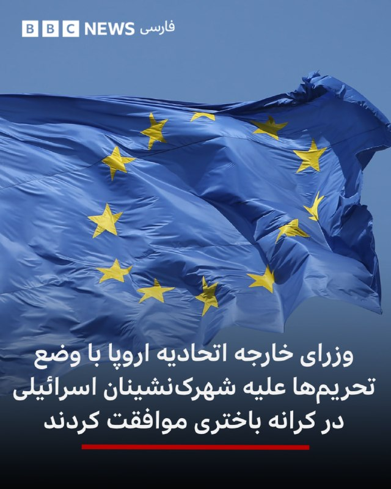

🔻۲۷ وزير خارجه اتحاديه اروپا روز دوشنبه با اعمال تحريم‌های جديد عليه شهرک‌نشينان اسرائيلی به دليل افزايش خشونت‌ها عليه فلسطينيان در کرانه باختری اشغالی، موافقت کردند.

بر اساس آمار سازمان ملل متحد، از زمان آغاز جنگ غزه در اکتبر ۲۰۲۳، حملات شهرک‌نشينان افزايش چشمگيری داشته است.

شهرک‌های اسرائيلی — که طبق حقوق بين‌الملل غيرقانونی محسوب می‌شوند — بر روی اراضی اشغالی اسرائيل در کرانه باختری و بيت‌المقدس شرقی ساخته شده‌اند؛ مناطقی که فلسطينيان آنها را برای تشکيل کشور آينده خود مطالبه می‌کنند.

کايا کالاس، مسئول سیاست خارجی اتحادیه اروپا، روز دوشنبه گفت: «زمان آن رسيده که از بن‌بست به مرحله اقدام برسيم... افراط‌گرايی و خشونت بايد پيامد داشته باشد.»

تغيير دولت در مجارستان به ماه‌ها تأخير در اجرای تحريم‌های جديد اتحاديه اروپا پايان داد؛ تحريم‌هايی که پيش‌تر توسط نخست‌وزير راست‌گرای سابق اين کشور، ويکتور اوربان، از متحدان نزديک اسرائيل، متوقف شده بود.

ادامه مطلب⬇️
📸GettyImages
https://bbc.in/42sS8Nm
@BBCPersian

## BBCPersian — post 280812

🔻 قوه قضائیه جمهوری اسلامی ایران از اعدام عبدالجلیل شه‌بخش به جرم عضویت در گروه «انصار الفرقان» خبر داد. میزان، خبرگزاری قوه قضائیه اعلام کرد که او بامداد امروز (سه‌شنبه) اعدام شد. در بیانیه قوه قضائیه آمده است عبدالجلیل شه‌بخش «در جریان اقدامات ضد تروریستی…

## BBCPersian — post 280811

  

🔻 قوه قضائیه جمهوری اسلامی ایران از اعدام عبدالجلیل شه‌بخش به جرم عضویت در گروه «انصار الفرقان» خبر داد.

میزان، خبرگزاری قوه قضائیه اعلام کرد که او بامداد امروز (سه‌شنبه) اعدام شد.

در بیانیه قوه قضائیه آمده است عبدالجلیل شه‌بخش «در جریان اقدامات ضد تروریستی در شرق کشور» بازداشت شده بود.

انصارالفرقان، یک گروه مسلح سنی است که در سال های گذشته، در مواردی در جنوب شرقی ایران به نیروهای حکومتی حمله کرده است.

جمهوری اسلامی ایران این گروه را «باغی و تروریستی» می‌خواند.

عبدالجلیل شه‌بخش پس از بازداشت متهم به عضویت در این گروه شد و قوه قضائیه همچنین ادعا کرده است که او شش سال قبل برای دریافت آموزش‌های نظامی «به یکی از کشورهای همسایه» رفته بود. قوه قضائیه همچنین ویدیویی از او را به عنوان «اعترافات» منتشر کرده است. مشخص نیست که این ویدیو از او در چه شرایطی گرفته شده است.

📷MIZAN
@BBCPersian

## BBCPersian — post 280810

  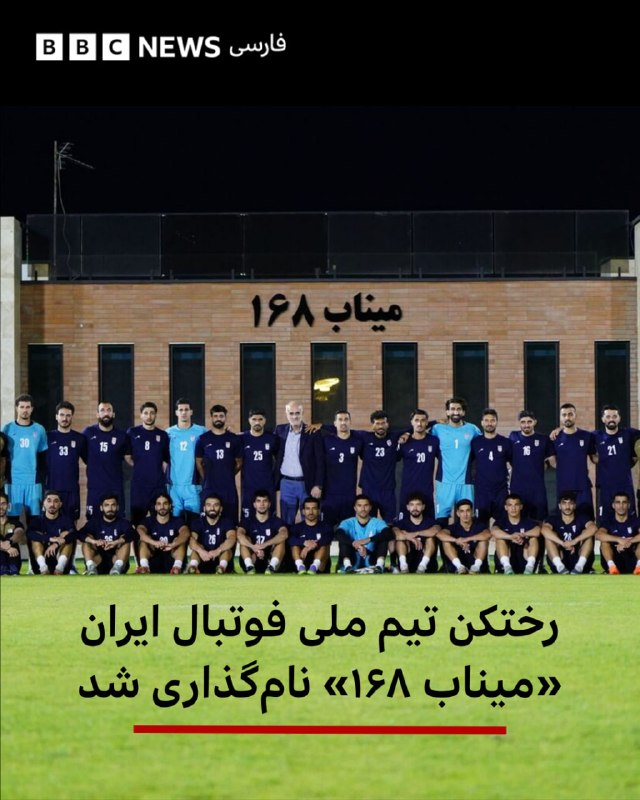

🔸تیم ملی فوتبال مردان ایران که آخرین تمرین‌های خود پیش از شرکت در جام جهانی را پشت سر می‌گذارد با انتشار عکسی دسته جمعی در روز دوشنبه - ۲۱ اردیبهشت - از نام‌گذاری رختکن کمپ تیم ملی به یاد کشته‌شدگان دبستان شجره طیبه میناب پرده برداشتند.

در این عکس که خبرگزاری ایرنا منتشر کرده تابلو «میناب ۱۶۸» در پشت سر بازیکنان حاضر در اردوی تیم ملی فوتبال دیده می‌شود.

تیم ملی فوتبال ایران برای برگزاری یک اردو تدارکاتی به زودی راهی ترکیه خواهد شد.

این تیم سه مسابقه مرحله گروهی خود را باید ماه آینده در لس‌آنجلس و سیاتل آمریکا برگزار کند و انتظار می‌رود در آنجا با حواشی فراونی از جمله اعتراضات ایرانیان مخالف جمهوری اسلامی روبرو شود.

📸IRNA
https://bbc.in/4dCcLg6
@BBCPersian

## BBCPersian — post 280809

  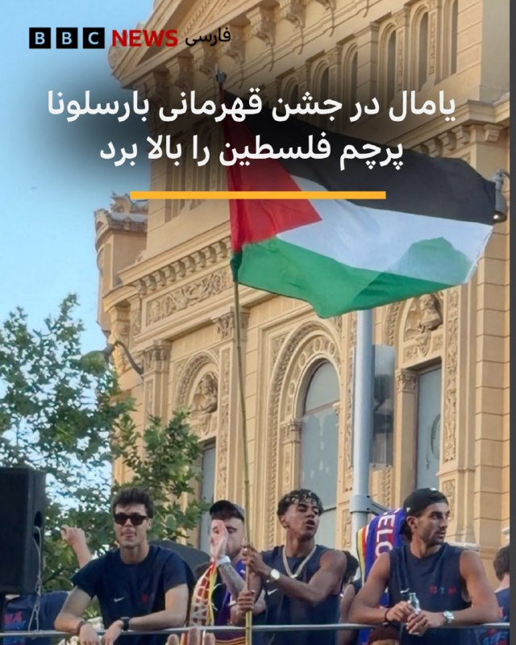

🔸لامین یامال، فوق ستاره فوتبال اسپانیا و جهان که عصر یکشنبه به همراه تیم بارسلونا توانست با شکست رئال مادرید در ال‌کلاسیکو، قهرمانی این تیم در لالیگا را قطعی کند، روز دوشنبه در هنگام جشن خیابانی این تیم با بالا بردن پرچم فلسطین خبرساز شد.

بارسلونا در بازی اخیرش با نتیجه دو بر صفر، رئال مادرید را برد و سه هفته مانده به پایان مسابقات این فصل قهرمانی خود را مسجل کرد و و برای ۲۹مین بار جام قهرمانی باشگاه‌های اسپانیا را تصاحب کرد.

اسپانیا از کشورهای پیشگام اتحادیه اروپا در به رسمیت شناختن کشور مستقل فلسطینی است.

📸INSTAGRAM/Reuters
https://bbc.in/4wpg69U
@BBCPersian

## BBCPersian — post 280808

  

🔻بنابر گزارش رسانه‌های ایران،‌ رضا رحمانی، دبیر کارگروه نجات دریاچه ارومیه گفته است در چند ماه گذشته حدود ۳۰ میلیون متر مکعب آب به حوضچه دریاچه ارومیه افزوده شده که موجب شکسته شدن رکود ۶ ساله تراز آبی این دریاچه شده است.

استاندار آذربایجان غربی «لایروبی نهرها ، تامین حق آب و آبگیری تالاب های اقماری در کنار وضعیت مناسب بارش‌ها» را از دلایل بهبود وضعیت دریاچه ارومیه دانسته است و بر ادامه اصلاح الگوهای آبخیزداری به ویژه در بخش کشاورزی تاکید کرده است.

خشکی دریاچه ارومیه سالهاست که موجب نگرانی کارشناسان و فعالان محیط زیست شده است.

📸IRNA
https://bbc.in/4u5xbUz
@BBCPersian

## BBCPersian — post 280807

  

🔻جان رابرتز، گزارشگر و از مجریان شبکه خبری فاکس نیوز در حساب ایکس خود نوشته که در تماسی تلفنی با دونالد ترامپ، رئیس جمهور آمریکا به او گفته به ایده انضمام ونزوئلا به عنوان ایالت پنجاه و یکم آمریکا «به طور جدی» فکر می‌کند.

آقای ترامپ پیش‌تر هم از ایده پیوستن کانادا به ایالات متحده به طور جدی سخن گفته بود که با واکنش تند دولت این کشور و بسیاری از رهبران غربی روبرو شد.

او همچنین از «به دست آوردن» گرینلند به طور جدی سخن گفته و حتی ایده خود را به اجلاس رهبران اروپا و ناتو هم برده بود هر چند در نهایت با طرح پیشنهادهایی از سوی کشورهای اروپایی و متحد واشنگتن، دیگر آن را مطرح نکرد.

📸EPA/Shutterstock
https://bbc.in/4wpH3Ko
@BBCPersian

## BBCPersian — post 280806

🔻مقامات لبنان از سفیر آمریکا خواستند اسرائیل را برای توقف حملات تحت فشار بگذارد

مقامات لبنان از سفیر آمریکا در بیروت خواسته‌اند که واشنگتن را برای متوقف کردن حملات اسرائیل به لبنان تحت فشار بگذارد. حملاتی که با وجود آتش‌بس در جنگ اسرائیل و حزب‌الله، همچنان ادامه دارد.

مقام‌های لبنانی اعلام کرده‌اند شمار کشته‌شدگان حملات اسرائیل از دوم مارس تاکنون به ۲ هزار و ۸۶۹ نفر رسیده که ده‌ها نفر از آن‌ها پس از اجرایی شدن آتش‌بس در ۱۷ آوریل کشته شده‌اند.

ژوزف عون، رئیس‌جمهوری لبنان و نواف سلام نخست‌وزیر جداگانه با میشل عیسی، سفیر آمریکا دیدار کردند. دیدارهایی که در آستانه سومین نشست نمایندگان لبنان و اسرائیل در واشنگتن انجام شد.

نواف سلام گفته است که از سفیر آمریکا خواسته برای توقف حملات و نقض‌ مداوم آتش‌بس از سوی اسرائیل اقدام کند.

در روزهای اخیر، اسرائیل حملات خود به لبنان را تشدید کرده و برخی حملات تا حدود ۲۰ کیلومتری بیروت پیش رفته است.

خبرگزاری رسمی لبنان گزارش داده که اسرائیل روز دوشنبه بیش از ۳۰ نقطه در جنوب و شرق این کشور را هدف حملات هوایی قرار داده است.

https://bbc.in/3RyM0k8
@BBCPersian

## BBCPersian — post 280805

  

🔻محمدباقر قالیباف، رئیس مجلس شوری اسلامی ایران در واکنشی تازه به اظهارات دونالد ترامپ گفته است: «هيچ جايگزينی جز پذيرش حقوق مردم ايران، آن‌گونه که در پيشنهاد ۱۴ بندی آمده، وجود ندارد.»

این اظهارات را حساب کاربری آقای قالیباف عصر دوشنبه در شبکه ایکس و به زبان انگلیسی منتشر کرده و نوشته است: «هر رويکرد ديگری کاملا بی‌نتيجه خواهد بود و چيزی جز شکست‌های پياپی به همراه نخواهد داشت. هرچه بیشتر تعلل کنند، مالیات‌دهندگان آمریکایی هزینه بیشتری از جیب خود خواهند پرداخت.»

آقای قالیباف در پست قبلی هم گفته بود ایران برای هر سناریویی آماده است.

به نظر می‌رسد اظهارات رئیس مجلس ایران در واکنش به اظهارات دونالد ترامپ است که در آنها رئیس جمهور آمریکا از نارضایتی کامل خود از پاسخ ایران به پیشنهادهای او خبر داده است.

آقای ترامپ روز دوشنبه گفته بود با توجه به نارضایتی او از پاسخ ایران، آتش بس میان دو کشور در وضعیتی شبیه زنده ماندن به کمک «دستگاه تنفس مصنوعی» است.

📸Handout via Getty Images
https://bbc.in/437QfWl
@BBCPersian

## BBCPersian — post 280804

🔻گزارش‌ها درباره احداث یک پایگاه مخفی اسرائیل در خاک عراق، ابعاد تازه‌ای از جنگ ۳۹ روزه آمریکا و اسرائیل با ایران را آشکار کرده است.
گفته می‌شود اسرائیل از این پایگاه که در وسط صحرای عراق ساخته شده بود، برای پشتیبانی عملیات علیه ایران استفاده می‌کرد.

گزارش فرزاد صیفی‌کاران از بخش راستی‌آزمایی بی‌بی‌سی

@BBCPERSIAN

## BBCPersian — post 280803

  

🔻شبکه سی بی اس - شریک کاری بی‌بی‌سی در آمریکا - به نقل از دو مقام آمریکایی گزارش کرده است پاکستان در میان تلاش‌ها برای متوقف کردن جنگ میان ايران و ايالات متحده آمريکا، «به‌طور غيرعلنی به هواپيماهای نظامی ايران اجازه داد در پايگاه‌های هوايی اين کشور مستقر» شوند؛ اقدامی که به گفته مقام‌های امريکايی مطلع در گفتگو با سی‌بی‌اس، ممکن است حاکی از تلاش ایران برای محافظت از هواپیماهای خود در بربر حملات هوايی آمريکا بوده باشد.

دو مقام امريکايی به سی‌بی‌اس نيوز گفتند ايران همچنين هواپيماهای غيرنظامی را برای استقرار به افغانستان فرستاده است، هرچند مشخص نيست که آيا در ميان آنها هواپيماهای نظامی هم وجود داشته يا نه.

به گفته اين مقام‌ها، اين جابه‌جايی‌ها نشان‌دهنده تلاش آشکار تهران برای محافظت از بخشی از دارايی‌های باقی‌مانده نظامی و هوايی خود در برابر گسترش درگيری‌ها بوده؛ در حالی که مقام‌ها در اسلام آباد به‌طور علنی نقش ميانجی برای کاهش تنش را ايفا می‌کردند.
ادامه مطلب⬇️

📸AFP via Getty Images
https://bbc.in/4wn3TCv
@BBCPersian

## Dirty_Kids — post 389296

زندگی اینجوری شده که ۲-۳ ساعت بهت خوش می‌گذره؛
بعد یهو ته دلت خالی می‌شه و یک دلشوره عجیبی میاد سراغت.

@Dirty_Kids 👻۰

## Dirty_Kids — post 389295

  

من هیچ جانوری رو ندیده بودم که آرزوی مرگ یک نوزاد رو بکنه!
کس ننه آقای دبیر و همه ۷۸۴ نفری که لایک کردن

@Dirty_Kids 👻

## Hranews — post 112892

عبدالجلیل شه‌بخش اعدام شد

❗️
❗️
❗️
❗️
❗️– رسانه قوه قضاییه از اجرای حکم #اعدام عبدالجلیل شه‌بخش، زندانی با اتهامات امنیتی از جمله «بغی» و عضویت در یک گروه مسلح مخالف نظام، خبر داد. این حکم بامداد امروز سه‌شنبه ۲۲ اردیبهشت‌ماه، پس از تایید در دیوان عالی کشور به اجرا درآمد.

ادامه مطلب

#عبدالجلیل_شه‌بخش

↘️
@hranews_bot تماس ✉️ -  @Hranews  کانال هرانا 🆑

## manototv — post 105335

  <a href="telegram/content/manototv_105335_1778573957.mp4" target="_blank">🎬 Download video</a>

گروهی از نیروهای ارتش بریتانیا برای رساندن کمک پزشکی به یک شهروند بریتانیایی مشکوک به ابتلا به هانتاویروس، با چتر روی جزیره دورافتاده تریستان دا کونا در جنوب اقیانوس اطلس فرود آمدند.

بر اساس اعلام وزارت دفاع بریتانیا، این عملیات با حضور شش چترباز و دو پزشک نظامی از تیپ شانزدهم حمله هوایی انجام شد. این نیروها از یک هواپیمای ترابری ایرفورس ای۴۰۰ام به جزیره اعزام شدند و همزمان اکسیژن و تجهیزات پزشکی نیز از هوا رها شد.

وزارت دفاع بریتانیا گفته است این نخستین‌بار است که ارتش این کشور برای یک ماموریت بشردوستانه پزشکی، نیروی درمانی را از راه پرش با چتر اعزام می‌کند. هانتاویروس بیماری نادری است که معمولا از طریق تماس یا تنفس ذرات آلوده به ادرار، مدفوع یا بزاق جوندگان منتقل می‌شود و در موارد شدید می‌تواند خطرناک باشد.

## manototv — post 105334

  <a href="telegram/content/manototv_105334_1778573959.mp4" target="_blank">🎬 Download video</a>

وزارت خارجه پاکستان اعلام کرد اگرچه مذاکرات رسمی هنوز از سر گرفته نشده، تماس‌های دیپلماتیک در سطح بالا همچنان ادامه دارد.

این وزارتخانه در واکنش به گزارش سی‌بی‌اس درباره حضور هواپیماهای جمهوری اسلامی در پایگاه نورخان پاکستان، این گزارش را «گمراه‌کننده و جنجالی» خواند و گفت هواپیماهایی از ایران و آمریکا پس از آتش‌بس و در جریان دور نخست گفت‌وگوهای اسلام‌آباد وارد پاکستان شده بودند تا جابه‌جایی دیپلمات‌ها، تیم‌های امنیتی و کارکنان اداری مرتبط با روند مذاکرات را تسهیل کنند.

وزارت خارجه پاکستان همچنین گفت برخی هواپیماها و نیروهای پشتیبانی به‌طور موقت در پاکستان باقی ماندند تا برای دورهای بعدی تماس‌ها آماده باشند. اسلام‌آباد تاکید کرده است هواپیماهای ایرانی موجود در پاکستان ارتباطی با «اقدام نظامی» یا «حفظ دارایی‌های نظامی» ندارند و پاکستان در این روند نقش میانجی «بی‌طرف و سازنده» داشته است.

## manototv — post 105333

  <a href="telegram/content/manototv_105333_1778573960.mp4" target="_blank">🎬 Download video</a>

وزارت خارجه استرالیا اعلام کرد این کشور تحریم‌های مالی هدفمند و ممنوعیت سفر تازه‌ای را علیه هفت فرد و چهار نهاد وابسته به جمهوری اسلامی اعمال کرده است.

پنی وانگ، وزیر خارجه استرالیا، گفت این تحریم‌ها در واکنش به «سرکوب خشونت‌بار مردم ایران»، قطع اینترنت، فشار بر زنان و دختران و اقدامات بی‌ثبات‌کننده جمهوری اسلامی در منطقه اعمال می‌شود.

بر اساس اعلام دفتر تحریم‌های استرالیا، افراد تحریم‌شده شامل اسکندر مومنی، مجید فیض جعفری، روح‌الله مومن‌نسب، قربان‌محمد ولی‌زاده، محسن ابراهیمی، ناصر زرین‌قلم و منصور زرین‌قلم هستند. نیروی انتظامی جمهوری اسلامی، سراج سایبرسپیس، صرافی برلیان و صرافی جی‌سی‌ام نیز در فهرست نهادهای تحریم‌شده قرار گرفته‌اند.

## manototv — post 105332

  <a href="telegram/content/manototv_105332_1778573961.mp4" target="_blank">🎬 Download video</a>

تصویری از نفتکش ایرانی «سی‌استار سه» منتشر شده که آتش‌سوزی در بخش دودکش آن را پس از هدف قرار گرفتن در دریای عمان نشان می‌دهد.

تانکر ترکرز گزارش داد این نفتکش متعلق به شرکت ملی نفتکش ایران، نزدیک جاسک هدف قرار گرفته است. به گفته این وب‌سایت تخصصی ردیابی نفتکش‌ها، «سی‌استار سه» از نفتکش‌های بسیار بزرگ حمل نفت خام است، نام اولیه آن «سنندج» بوده و پس از تحریم‌ها چند بار تغییر نام داده است.

در این گزارش آمده است خدمه نفتکش آسیبی ندیده‌اند.

پیشتر سنتکام، فرماندهی مرکزی ارتش آمریکا، اعلام کرده بود یک جنگنده نیروی دریایی آمریکا از ناو هواپیمابر «جورج اچ دبلیو بوش» ۱۸ اردیبهشت دودکش این نفتکش را هدف قرار داده است. سنتکام گفته بود این اقدام برای جلوگیری از ورود این نفتکش به یکی از بنادر ایران انجام شد.

## manototv — post 105331

  <a href="telegram/content/manototv_105331_1778573961.mp4" target="_blank">🎬 Download video</a>

پلیس منطقه یورک در کانادا اعلام کرد مهران محققی، ۳۹ ساله و ساکن ریچموند هیل، در ارتباط با حادثه‌ای در جریان یک تجمع درباره ایران در این شهر بازداشت و متهم شده است.

بر اساس بیانیه پلیس، این حادثه روز یکشنبه ۲۱ اردیبهشت در حوالی تقاطع خیابان یانگ و میجر مکنزی رخ داد. پلیس می‌گوید مظنون با خودرو به شکلی خطرناک در نزدیکی تجمع حرکت کرده، با یک راننده تحویل غذا که در تجمع حضور نداشت برخورد کرده و هنگام فرار نیز با خودرویی دیگر تصادف کرده است.

به گفته پلیس، محققی به حمله با سلاح، رانندگی خطرناک، تهدید و توقف نکردن پس از تصادف متهم شده است. تحقیقات در این پرونده ادامه دارد و پلیس از شاهدان و دارندگان تصاویر دوربین خودرو، تلفن همراه یا دوربین‌های امنیتی خواسته است اطلاعات خود را در اختیار بازرسان بگذارند.

## manototv — post 105330

  <a href="telegram/content/manototv_105330_1778573962.mp4" target="_blank">🎬 Download video</a>

وزارت خارجه آمریکا از طریق برنامه «پاداش برای عدالت» اعلام کرد برای دریافت اطلاعاتی که به مختل شدن سازوکارهای مالی سپاه و شاخه‌های مختلف آن، از جمله نیروی قدس سپاه، منجر شود، تا سقف ۱۵ میلیون دلار پاداش پرداخت می‌کند.

بر اساس اعلام این برنامه، سپاه بخشی از فعالیت‌های خارجی خود را از طریق فروش نفت تحریم‌شده جمهوری اسلامی و با استفاده از شبکه‌ای از شرکت‌های پوششی تامین مالی می‌کند. وزارت خارجه آمریکا می‌گوید این شبکه‌ها درآمدهای حاصل از فروش نفت را از مسیرهای غیرشفاف و از جمله از طریق نظام بانکی آمریکا جابه‌جا کرده‌اند.

در اطلاعیه برنامه «پاداش برای عدالت» از وانگ شائویون، تبعه چین، و محمود راشد عامر الحبسی، تبعه عمان، نام برده شده است. به گفته مقام‌های آمریکایی، این دو نفر به همراه افراد و شرکت‌های وابسته در چین، عمان و ترکیه، فروش و انتقال نفت تحریم‌شده ایران به پالایشگاه‌ها و شرکت‌های دولتی چین را سازمان‌دهی کرده‌اند تا درآمد آن به نیروی قدس سپاه برسد.

## manototv — post 105329

  <a href="telegram/content/manototv_105329_1778573963.mp4" target="_blank">🎬 Download video</a>

سی‌بی‌اس نیوز به نقل از مقام‌های آمریکایی گزارش داد پاکستان، همزمان با ایفای نقش میانجی میان تهران و واشینگتن، به چند هواپیمای نظامی جمهوری اسلامی اجازه داد در پایگاه‌های هوایی این کشور مستقر شوند.

بر اساس این گزارش، این اقدام احتمالا برای دور نگه داشتن بخشی از دارایی‌های هوایی جمهوری اسلامی از حملات آمریکا انجام شده است. مقام‌های آمریکایی گفته‌اند یکی از این هواپیماها یک فروند آرسی-۱۳۰ نیروی هوایی ایران بود که به پایگاه نورخان پاکستان منتقل شد.

یک مقام ارشد پاکستانی این گزارش را رد کرد و گفت پنهان کردن چنین هواپیماهایی در پایگاه نورخان، به دلیل موقعیت آن در قلب شهر، ممکن نیست.

## manototv — post 105328

  <a href="telegram/content/manototv_105328_1778573964.mp4" target="_blank">🎬 Download video</a>

رزا پرتو، روزنامه‌نگار «منوتو»، در گردهمایی ایرانیان روبروی دادگاه لاهه در هلند گفت: «جمهوری اسلامی باید در دادگاه لاهه محاکمه شود».

## alonews — post 119444

  <a href="telegram/content/alonews_119444_1778573966.webm" target="_blank">🎬 Download video</a>

👈مشاور نخست‌وزیر عراق: گزارش روزنامه «وال‌استریت ژورنال» درباره ایجاد یک پایگاه نظامی مخفی اسرائیل در صحرای نجف صحت ندارد.

🔴آنچه در صحرای نجف رخ داده، نه ایجاد پایگاه نظامی بلکه یک «تلاش برای عملیات هلی‌برن» بوده که توسط نیروهای عراقی ناکام مانده است.

✅ @AloNews خبر جنگ

## alonews — post 119443

  <a href="telegram/content/alonews_119443_1778573967.webm" target="_blank">🎬 Download video</a>

👈بی‌بی‌سی: ایالات متحده مذاکرات منظم و محرمانه‌ای با دانمارک برای افتتاح سه پایگاه نظامی جدید در جنوب گرینلند برگزار کرده است.

🔴این پایگاه‌های جدید به عنوان قلمرو حاکمیتی آمریکا تعیین خواهند شد.

🔴تمرکز این پایگاه‌ها بر نظارت بر فعالیت‌های دریایی روسیه و چین در گذرگاه GIUK خواهد بود.

🔴ایالات متحده در حال حاضر تنها یک پایگاه در گرینلند دارد — پایگاه فضایی پیتوفیک — که این تعداد در دوران جنگ سرد حدود ۱۷ پایگاه بود.

✅ @AloNews خبر جنگ

## alonews — post 119442

  <a href="telegram/content/alonews_119442_1778573967.webm" target="_blank">🎬 Download video</a>

👈سفیر آمریکا تو اسرائیل : ما نمی دونیم که اوضاع در مورد ایران به کجا میرسه

✅ @AloNews خبر جنگ

## alonews — post 119441

  <a href="telegram/content/alonews_119441_1778573967.webm" target="_blank">🎬 Download video</a>

👈گزارش شبکه i24 اسرائیل نخستین بار از شروع جنگ نیروهای واحد گولانی ارتش اسرائیل درگیری در آن سوی رودخانه لیطانی با نیروهای حزب الله داشته اند که منجر به زخمی شدن ۸ نیروی تیپ گولانی شده است و به ادعای آنها پس از کشته شدن چندین نیروی حزب الله، مابقی دسته اقدام به عقب نشینی از منطقه مورد نظر(روستای زوطر الشرقیه) کرده اند.

✅ @AloNews خبر جنگ

## alonews — post 119440

  <a href="telegram/content/alonews_119440_1778573968.webm" target="_blank">🎬 Download video</a>

👈العربیه به نقل از سفیر آمریکا در اسرائیل:
نمیدانیم اوضاع با ایران به کجا خواهد کشید.

✅ @AloNews خبر جنگ

## alonews — post 119439

  <a href="telegram/content/alonews_119439_1778573968.webm" target="_blank">🎬 Download video</a>

👈وزارت خارجه پاکستان: اگرچه مذاکرات رسمی هنوز از سر گرفته نشده است، اما تماس‌های دیپلماتیک در سطح بالا ادامه دارد

✅ @AloNews خبر جنگ

## alonews — post 119438

  <a href="telegram/content/alonews_119438_1778573968.webm" target="_blank">🎬 Download video</a>

👈کره جنوبی هم به مذاکرات چندملیتی بازگشایی تنگه هرمز پیوست

🔴سئول قرار است امروز سه شنبه به یک نشست چندملیتی سطح بالای وزرای دفاع برای بحث در مورد امنیت تنگه هرمز بپیوندد.

✅ @AloNews خبر جنگ

## alonews — post 119437

  <a href="telegram/content/alonews_119437_1778573969.mp4" target="_blank">🎬 Download video</a>

👈ترامپ پس از شنیدن صدای یک پرنده در نشست خبری کاخ سفید: اوه! فکر کردم یه پهپاده؛ این روزها پهپادها رو در اندازه‌های مختلف درست می‌کنن و می‌تونن خیلی مخرب باشن، همون‌طور که احتمالا شنیدید

✅ @AloNews خبر جنگ

## alonews — post 119436

  <a href="telegram/content/alonews_119436_1778573970.webm" target="_blank">🎬 Download video</a>

👈معاون نیروی دریایی سپاه: تحرکات را با دقت زیرنظر داریم در یکی از موارد اخیر، یک ناوچه آمریکایی قصد عبور از محدودهٔ تنگهٔ هرمز را داشت که با رصد دقیق نیروهای مسلح مواجه شد و پس از مشاهدهٔ برخی رفتارهای تحریک‌آمیز، نیروی دریایی ارتش با شلیک‌های هشداردهنده و هدفمند، پیام لازم را منتقل کرد و این شناور نیز بلافاصله مسیر خود را تغییر داد.

✅ @AloNews خبر جنگ

## alonews — post 119435

  <a href="telegram/content/alonews_119435_1778573971.webm" target="_blank">🎬 Download video</a>

👈هاکان فیدان وزیر خارجه ترکیه با خلیل الحیه رهبر گروه حماس دیدار کرد

🔴الحیه تحت تعقیب اسرائیل قرار دارد

✅ @AloNews خبر جنگ

## alonews — post 119434

  <a href="telegram/content/alonews_119434_1778573971.webm" target="_blank">🎬 Download video</a>

👈سخنگوی دولت: اینترنت پرو مصوبه‌ شورای‌ عالی امنیت ملی را دارد و اين شرايط موقت است

✅ @AloNews خبر جنگ

## alonews — post 119433

  <a href="telegram/content/alonews_119433_1778573971.mp4" target="_blank">🎬 Download video</a>

👈ترامپ : همه ۱۱۱ موشک ایرانی که به سمت یک ناو آمریکایی شلیک شده بودن، رهگیری و ساقط شدن

🔴 خدمه فقط حدود ۱۳ ثانیه وقت داشتن برای تصمیم‌گیری در هر درگیری

🔴 اگه یه محاسبه اشتباه بکنی، هم کلی نیرو از دست میدی، هم یه عالمه کشتی چند میلیارد دلاری

✅ @AloNews خبر جنگ

## alonews — post 119432

  <a href="telegram/content/alonews_119432_1778573974.webm" target="_blank">🎬 Download video</a>

👈آخرین قیمت نفت ۱۰۶.۳۸ دلار

✅ @AloNews خبر جنگ

## alonews — post 119431

  <a href="telegram/content/alonews_119431_1778573975.webm" target="_blank">🎬 Download video</a>

👈قراردادهای آتی نفت خام برنت بیش از ۲٪ افزایش یافت و به ۱۰۶.۳۸ دلار در هر بشکه رسید، طبق گزارش رویترز

✅ @AloNews خبر جنگ

## alonews — post 119430

  <a href="telegram/content/alonews_119430_1778573975.webm" target="_blank">🎬 Download video</a>

👈شیخ حمد بن جاسم بن جابر آل ثانی، نخست‌وزیر سابق قطر: عملیات نظامی به طور کلی به نفع منطقه نبود. آمریکا به دوستان خود در منطقه آسیب زد.

🔴عملیات نظامی به طور شخصی به نفع نتانیاهو و برنانه‌های او بود

🔴او به صراحت درباره نقشه جدید منطقه، اتحادهای جدید و اسرائیل بزرگ صحبت می‌کند.

🔴آنها از ساختار قدرت در ایران بی‌اطلاعند. این هرم طی ۴۷ سال ساخته شده است، اینطور که آنها فکر می‌کنند فرو نخواهد ریخت

✅ @AloNews خبر جنگ

## alonews — post 119429

  <a href="telegram/content/alonews_119429_1778573975.mp4" target="_blank">🎬 Download video</a>

👈ترامپ از رئیس جمهور بعدی آمریکا گفت: ترکیب ونس-روبیو رویایی است!

🔴«چه کسی جی‌دی ونس را دوست دارد؟ چه کسی مارکو روبیو را؟ بسیار خب. به نظر ترکیب خوبی می‌آید. ضمناً، من معتقدم که این یک تیم رویایی است. فکر می‌کنم به نظر می‌رسد کاندیدای ریاست جمهوری و کاندیدای معاونت ریاست جمهوری باشد.

✅ @AloNews خبر جنگ

## alonews — post 119428

  <a href="telegram/content/alonews_119428_1778573978.webm" target="_blank">🎬 Download video</a>

👈رسایی: از نظر من باید با خانم‌های بی حجاب برخورد فرهنگی و انتظامی بشه

✅ @AloNews خبر جنگ

## alonews — post 119427

  <a href="telegram/content/alonews_119427_1778573978.webm" target="_blank">🎬 Download video</a>

👈سخنگوی ارتش اسرائیل، آویخای آدراعی، هشدار فوری به ساکنان ارزون، طیر دبّه، البازوریه و الحوش در لبنان صادر کرده است تا فوراً خانه‌های خود را تخلیه کرده و حداقل ۱۰۰۰ متر به سمت مناطق باز حرکت کنند، با اشاره به نقض آتش‌بس توسط حزب‌الله و هشدار اینکه هر کسی که در نزدیکی اعضا، تأسیسات یا تجهیزات حزب‌الله باشد در معرض خطر است.

✅ @AloNews خبر جنگ

## alonews — post 119426

  <a href="telegram/content/alonews_119426_1778573978.mp4" target="_blank">🎬 Download video</a>

👈عوستاد خوش چشم سری قبل گفت جنگ نمیشه اما شد، اینسری گفته جنگ میشه ظرف ۱هفته و باید ببینیم دوباره گلشعر گفته یا نه

✅ @AloNews خبر جنگ

## alonews — post 119425

  <a href="telegram/content/alonews_119425_1778573981.mp4" target="_blank">🎬 Download video</a>

👈انفجار پالایشگاه سالیناکروز در مکزیک

🔴براثر انفجار پالایشگاه سالیناکروز در مکزیک، ۶ نفر زخمی و بخشی از این پالایشگاه تخریب شده است.

✅ @AloNews خبر جنگ

---
📅 بروزرسانی: 1405/02/22 03:57
---

## VahidOOnLine — post 239607

در این فهرست،
زندگی‌ها درست در آغاز راه متوقف شدند؛
کسی که می‌خواست به دوستانش هشدار بدهد،
کسی که تازه کار موردعلاقه‌اش را شروع کرده بود،
دختری که مقاومت کرد،
و جوانی که پیکرش در سکوت و ارعاب دفن شود.

وحید هاشمی، محمدمهدی رضایی آدریانی، ساغر سیف‌اللهی، رضا اکبری، نیما عباسی، عرفان صفری، علی (فرزان) عربی و محمد جهاندیده

جاویدنامان انقلاب ملی ایرانیان؛
نام‌هایی که با هر تکرار، یادآوری می‌کنند این فهرست فقط از مرگ نوشته نشده؛ از زندگی‌هایی‌ست که ناگهان ناتمام ماندند.
#جاویدنامان_انقلاب_ملی_ایرانیان
‌🏁 🇬🇧 IranintlTV

🤖 @VahidOOnLine

## VahidOOnLine — post 239606

  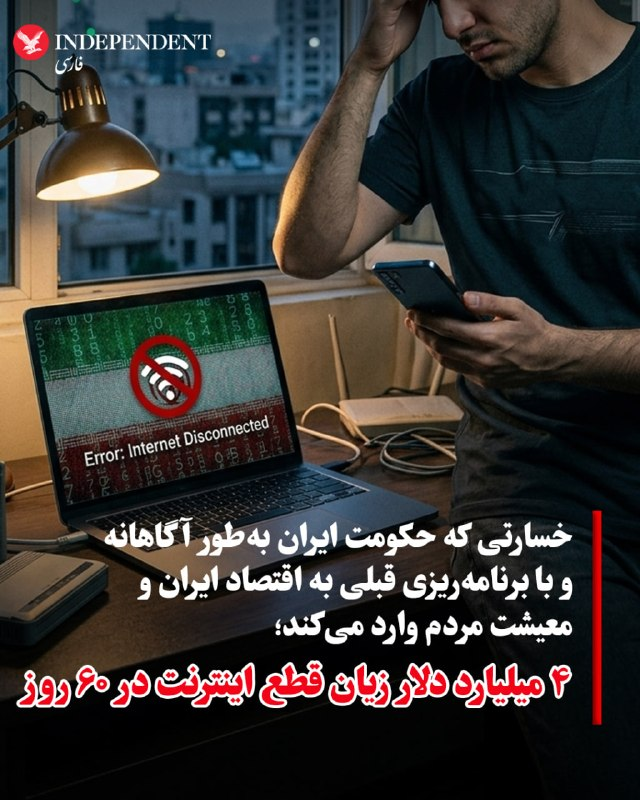

♦️درحالی که حکومت ایران از سال‌ها قبل پروژه «اینترنت بومی» یا «اینترانت» را پیش‌برد و به بهانه جنگ آن را اجرا کرد و با معرفی «اینترنت طبقاتی»،آن را به طرحی برای دریافت پول از مردم تبدیل کرد، دنیای اقتصاد به خسارت‌های اقتصادی هنگفت قطع اینترنت پرداخته و آمار و ارقامی از این ضرر هنگفت برای اقتصاد ایران و معیشت مردم ارایه می‌دهد که عمق فاجعه را نشان می‌دهد. فاجعه‌ای که با برنامه‌ریزی قبلی حکومت ایران و به‌طور آگاهانه ایجاد شده است. در این گزارش آمده است: . به عقیده وزیر ارتباطات، خسارت روزانه به هسته اقتصاد دیجیتال حدود ۵۰۰میلیارد تومان برآورد شده که عمدتا به اپراتورها و بخش شبکه‌ای مربوط است. خسارت روزانه به ‌اقتصاد کلان هم حدود ۵ هزارمیلیارد تومان برآورد می‌شود که لایه‌های دوم و سوم اقتصاد دیجیتال را نیز شامل می‌شود. به این ترتیب در ۶۰ روز قطعی اینترنت، اقتصاد ایران ۳۰۰ هزار‌میلیارد تومان زیان دیده است. افشین کلاهی، رئیس کمیسیون دانش‌بنیان اتاق بازرگانی ایران، خسارت مستقیم روزانه بر اثر قطعی اینترنت را ۳۰ تا ۴۰‌میلیون دلار اعلام کرده است. او تاکید دارد خسارت غیرمستقیم قطعی اینترنت معادل ۸۰-۷۰‌میلیون دلار در روز است.
به این ترتیب در ۶۰ روز حداقل یک‌میلیارد و هشتصد‌ میلیون دلار خسارت مستقیم به اقتصاد ایران وارد شده است. این زیان با احتساب زیان غیرمستقیم به بیش از چهار‌میلیارد دلار می‌رسد. (اقتصادنیوز، ۹ اردیبهشت۱۴۰۵) از سوی دیگر، گفته می‌شود حدود ۱۰میلیون نفر عمدتا از اقشار متوسط و پایین جامعه مستقیما درگیر فعالیت‌های وابسته به اینترنت هستند لذا محدودیت دسترسی به اینترنت، شغل و معیشت آنها را در معرض تهدید قرار می‌دهد. از این رو مشاور وزیر ارتباطات و فناوری اطلاعات نسبت به بحران امنیتی ناشی از محدودیت‌های اینترنتی هشدار می‌دهد (ایرانیان استارت‌آپ، ۱۲ اردیبهشت ۱۴۰۵).»
‌🇸🇦 Indypersian

🤖 @VahidOOnLine

## VahidOOnLine — post 239605

  <a href="telegram/content/VahidOOnLine_239605_1778545666.mp4" target="_blank">🎬 Download video</a>

♦️بهبود تراز آبی دریاچه ارومیه باعث شده تا جزیره «شاهسون» بار دیگر به زیستگاهی امن برای پرندگان مهاجر تبدیل شود. بر اساس تصاویر منتشر شده، با احیای نسبی وضعیت دریاچه، دسته‌های پرندگان «کاکایی» به این منطقه بازگشته‌اند تا بار دیگر در آشیانه‌های قدیمی خود استقرار یابند.
‌🇸🇦 Indypersian

🤖 @VahidOOnLine

## VahidOOnLine — post 239604

  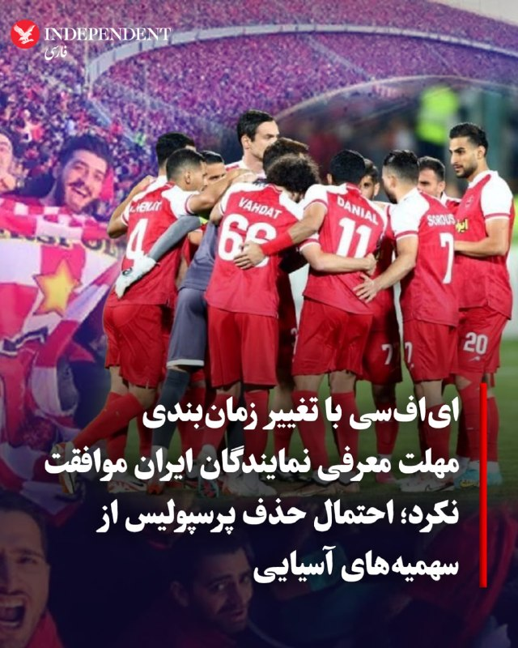

♦️کنفدراسیون فوتبال آسیا (AFC) روز دوشنبه ۲۱ اردیبهشت درخواست تغییر زمان‌بندی معرفی نمایندگان ایران را رد کرد و احتمال حذف پرسپولیس از سهمیه‌های آسیایی فصل آینده افزایش یافت. این درخواست با هدف تمدید مهلت معرفی نمایندگان ایران تا پایان لیگ مطرح شده بود، اما کنفدراسیون فوتبال آسیا با تغییر زمان‌بندی موافقت نکرد.
پس از توقف رقابت‌های لیگ برتر به‌دلیل شرایط اخیر و باقی ماندن هشت هفته تا پایان فصل، تعیین نمایندگان آسیایی به یکی از چالش‌های اصلی فوتبال ایران تبدیل شد. در حالی که برخی باشگاه‌ها خواستار مشخص شدن سهمیه‌ها بر اساس جدول نهایی بودند، فدراسیون بر مبنای جدول فعلی، استقلال و تراکتور را برای لیگ نخبگان آسیا و سپاهان را برای سطح دوم لیگ قهرمانان معرفی کرده است.
با توجه به اینکه مهلت معرفی تیم‌ها تا ۱۰ خرداد تعیین شده، احتمالا همین ترکیب نهایی خواهد شد و شانس تیم‌هایی مانند پرسپولیس برای حضور در رقابت‌های آسیایی از بین می‌رود. با این حال، فدراسیون فوتبال اعلام کرده همچنان در حال رایزنی با کنفدراسیون فوتبال آسیا برای بررسی برخی جزئیات است.
‌🇸🇦 Indypersian

🤖 @VahidOOnLine

## VahidOOnLine — post 239603

  

♦️به موازات گزارش‌های مربوط به مشکلات شدید دانشجویان برای دسترسی به اینترنت و صف انتظار برای دسترسی به اینترنت در دانشگاه‌ها، بیژن رنجبر، رئیس دانشگاه آزاد اعلام کرده که برای برای ۲۰ هزار عضو هیئت علمی دانشگاه نیز درخواست‌هایی برای دست دسترسی به اینترنت ارائه شده و «منتظر پاسخ نهایی هستیم.»بر اساس گزارش‌ها، در اردیبهشت ۱۴۰۵، وضعیت دسترسی به اینترنت در برخی دانشگاه‌های بزرگ ایران، از جمله دانشگاه علوم پزشکی تهران و دانشگاه آزاد، با چالش‌های جدی مواجه شده است.به دلیل کمبود زیرساخت‌ها، استادان و پژوهشگران ناچارند برای استفاده از اینترنت در محیط دانشگاه، در صف‌های انتظار بمانند و به‌صورت نوبتی از آن استفاده کنند.دسترسی پایدار به اینترنت تنها در چند نقطه خاص از محوطه دانشگاه امکان‌پذیر است.این وضعیت، به‌ویژه برای دانشجویان تحصیلات تکمیلی که نیاز به دسترسی مداوم به پایگاه‌های علمی خارجی دارند، اختلال جدی در روند تحقیقات و نگارش رساله ایجاد کرده است.
‌🇸🇦 Indypersian

🤖 @VahidOOnLine

## VahidOOnLine — post 239602

  

وزارت خارجه آمریکا بر اساس برنامه «پاداش برای عدالت» این وزارتخانه تا سقف ۱۵ میلیون دلار برای اطلاعاتی که به مختل شدن سازوکارهای مالی سپاه و شاخه‌های مختلف آن منجر شود، پاداش تعیین کرد.
پیش‌تر در روز دوشنبه، دولت آمریکا تحریم‌های جدیدی مرتبط با جمهوری اسلامی علیه سه فرد و ۹ نهاد، از جمله چهار نهاد مستقر در هنگ‌کنگ، چهار نهاد در امارات متحده عربی و یک نهاد در عمان وضع کرد.

‌🏁 🇬🇧 IranintlTV

🤖 @VahidOOnLine

## VahidOOnLine — post 239601

  <a href="telegram/content/VahidOOnLine_239601_1778545672.mp4" target="_blank">🎬 Download video</a>

♦️دونالد ترامپ، رئیس‌جمهوری ایالات متحده، روز دوشنبه ۲۱ اردیبهشت در پاسخ به پرسش خبرنگاران درباره سفر پیش‌رو به چین، به موضوع ایران نیز اشاره کرد.
او با بیان اینکه بخشی از گفتگوها ممکن است به مسائل انرژی و موضوعات مرتبط با برخی کشورها از جمله ایران بپردازد، گفت: «ایران کشور بسیار زیبایی است، اما افرادی آن را اداره می‌کنند که نباید آنجا باشند و آن‌ها باعث سقوط و نابودی آن شده‌اند.»
ترامپ همچنین افزود این وضعیت «نباید رخ می‌داد» و اشاره کرد که احتمال دارد در جریان این سفر، موضوعات دیگری نیز در سطح گفتگوهای دوجانبه مطرح شود.
‌🇸🇦 Indypersian

🤖 @VahidOOnLine

## VahidOOnLine — post 239600

  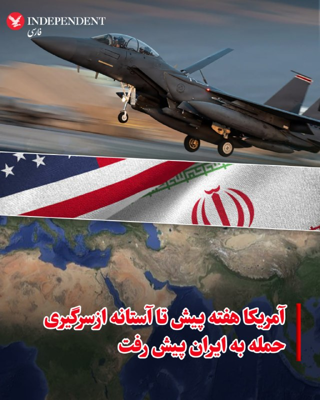

♦️رسانه والا روز دوشنبه گزارش داد ایالات متحده هفته گذشته تا آستانه ازسرگیری حملات به ایران پیش رفت، اما این تصمیم «در آخرین لحظه» متوقف شد تا «آخرین تلاش برای مذاکرات پیش از تشدید دوباره درگیری نظامی» انجام شود. هفته گذشته گزارش هایی درباره تلاش پاکستان و قطر و برخی کشورهای منطقه برای میانجی‌گری منتشر شد.
‌🇸🇦 Indypersian

🤖 @VahidOOnLine

## VahidOOnLine — post 239599

  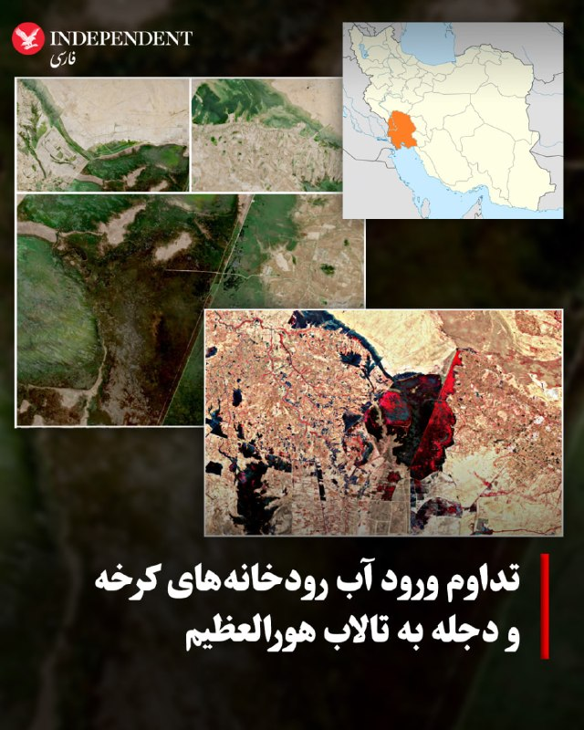

♦️براساس تصاویر ماهواره «سنتینل»، ورود آب از رودخانه‌های کرخه و دجله به تالاب هورالعظیم در مرز ایران و عراق همچنان ادامه دارد. این تصاویر ماهواره‌ای که آخرین وضعیت هورالهویزه را به تصویر کشیده‌اند، نشان‌دهنده تداوم جریان آب به بخش‌های مختلف این تالاب بین‌المللی است. همچنین در تصاویر ثبت‌شده با طیف رنگی کاذب (False color)، وضعیت پراکندگی و تراکم نیزارها در پهنه آبی تالاب به وضوح قابل مشاهده است که از بهبود نسبی شرایط زیست‌محیطی در این منطقه مرزی حکایت دارد.
‌🇸🇦 Indypersian

🤖 @VahidOOnLine

## WithYashar — post 11021

شکلگیری یک دین
@withyashar

## WithYashar — post 11020

طبق گزارش‌های معتبر (از جمله بلومبرگ و سی بی اس و رویترز): دولت ترامپ تصمیم گرفته بخش بزرگی از ذخایر استراتژیک نفت آمریکا (SPR) را برای جلوگیری از افزایش قیمت‌ها به دلیل جنگ آزاد کندو وارد بازار کند.
عدد اعلام‌شده در بسته اصلی تصمیم، حدود ۱۷۲ میلیون بشکه است، ولی در مرحله های جداگانه ، همکنون حدود ۵۳ تا ۵۳.۳ میلیون بشکه “به صورت وام/عرضه اولیه” وارد بازار شده.
@withyashar

## WithYashar — post 11019

اتاق جنگ با شما : این داستان انتقال هواپیماهای نظامی و غیر نظامی به پاکستان و افغانستان رو که خوندم عجیب یاد اواخر حکومت صدام حسین افتادم!
اونم وقتی آمریکا بهش حمله تقریبا تمام جنگنده ها و هواپیماهای ترابری نظامیش رو منتقل کرد به ایران
که البته ایران دیگه بهش پس نداد
اونم شیر نفت رو باز کرد تو خلیج فارس!
اونم به طرفداراش میگفت هر شب بیاید تو خیابون و از من حمایت کنید
@withyashar

## WithYashar — post 11018

رهبر دموکرات‌های سنای آمریکا: برای هفتمین‌بار، طرح محدود کردن اختیارات جنگی ترامپ و پایان دادن جنگ ایران به رأی گذاشته می‌شود.

چاک شومر: تکرار می‌کنم، ترامپ آمریکا را به یک جنگ غیرقانونی، پرهزینه و بدون هیچ هدف و هیچ پایانی کشاند.
@withyashar

## WithYashar — post 11017

## WithYashar — post 11016

درود بر sir yashar دریاسالار و فرمانده قرارگاه اتاق جنگ
یه چیزی به ذهنم رسید برای این خبر هواپیماهای ایران که رفته پاکستان و افغانستان و نوشتن که برای حفاظت از دارایی ها ایران بوده به نظرت این کار همون شخصیت ال سی سی نمیتونه باشه که داره همون بخش کوچیک نیرو هوایی که بعدا لازم ایران میشه رو فعلا خارج میکنه تا اسیب نبینه تو‌جنگ؟ صرفا به ذهنم رسیده نمیدونم اصلا میتونه ربطی داشته باشه اگر نیست که اصلا جواب نده وقتت گرفته نشه
مرسی که هستی و بهمون انرژی میدیییی❤️
جاوید شاه

## FoxNewsTwitter — post 341566

  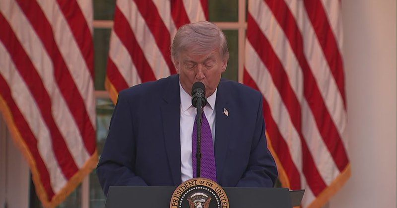

Fox News (Twitter/X)

WATCH LIVE: President Trump hosts a Rose Garden Club dinner https://twitter.com/i/broadcasts/1yxBeMavvObJN

## FoxNewsTwitter — post 341565

  <a href="telegram/content/FoxNewsTwitter_341565_1778545675.mp4" target="_blank">🎬 Download video</a>

Fox News (Twitter/X)

Health officials are on high alert as an American tests positive for hantavirus. Meanwhile, President Trump warns the Iran ceasefire is on "life support." FOX News' @BillMelugin_ reports.

## FoxNewsTwitter — post 341564

  <a href="telegram/content/FoxNewsTwitter_341564_1778545678.mp4" target="_blank">🎬 Download video</a>

Fox News (Twitter/X)

CDC official Dr. David Fitter emphasized that federal and local officials are working around the clock to ensure the safe return of passengers while protecting American communities from potential health risks.

"Big priorities for us are the safe and healthy return of the passengers, but also safe and healthy American communities."

## VahidOnline — post 75427

  

به گزارش نشریه آمریکایی وال استریت ژورنال، امارات متحده عربی به‌طور مخفیانه حملات نظامی علیه ایران انجام داده است؛ موضوعی که به گفته منابع آگاه به این نشریه، می تواند امارات را به یکی از طرف‌های فعال مخاصمه با ایران مطرح کند.

منابع آگاه به وال استریت ژورنال گفته‌اند حملاتی که امارات تاکنون به‌صورت علنی تایید نکرده، شامل حمله به یک پالایشگاه در جزیره لاوان در خلیج فارس بوده است.

در اوایل آوریل گذشته و هم‌زمان با اعلام آتش‌بس از سوی دونالد ترامپ چند حمله هوایی به تاسیسات نفتی ایران در جزایر این کشور و اصطلاحا مناطق فلات قاره شرکت ملی نفت ایران صورت گرفت که باعث آتش‌سوزی گسترده و خروج بخش بزرگی از ظرفیت پالایشگاه لاوان از مدار برای چندین ماه شد.

ایران در آن زمان اعلام کرده بود این پالایشگاه در یک «حمله دشمن» هدف قرار گرفته و در پاسخ، موجی از حملات موشکی و پهپادی علیه امارات و کویت انجام داده است.
@VahidHeadline

📡 @VahidOnline

## IranIntlTV — post 336720

در این فهرست،
زندگی‌ها درست در آغاز راه متوقف شدند؛
کسی که می‌خواست به دوستانش هشدار بدهد،
کسی که تازه کار موردعلاقه‌اش را شروع کرده بود،
دختری که مقاومت کرد،
و جوانی که پیکرش در سکوت و ارعاب دفن شود.

وحید هاشمی، محمدمهدی رضایی آدریانی، ساغر سیف‌اللهی، رضا اکبری، نیما عباسی، عرفان صفری، علی (فرزان) عربی و محمد جهاندیده

جاویدنامان انقلاب ملی ایرانیان؛
نام‌هایی که با هر تکرار، یادآوری می‌کنند این فهرست فقط از مرگ نوشته نشده؛ از زندگی‌هایی‌ست که ناگهان ناتمام ماندند.
#جاویدنامان_انقلاب_ملی_ایرانیان

## IranIntlTV — post 336719

  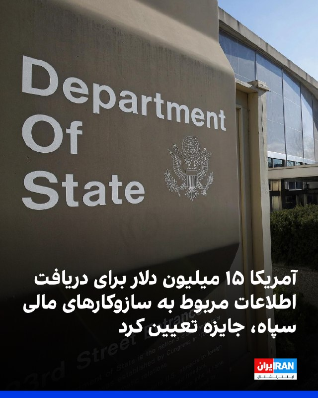

وزارت خارجه آمریکا بر اساس برنامه «پاداش برای عدالت» این وزارتخانه تا سقف ۱۵ میلیون دلار برای اطلاعاتی که به مختل شدن سازوکارهای مالی سپاه و شاخه‌های مختلف آن منجر شود، پاداش تعیین کرد.
پیش‌تر در روز دوشنبه، دولت آمریکا تحریم‌های جدیدی مرتبط با جمهوری اسلامی علیه سه فرد و ۹ نهاد، از جمله چهار نهاد مستقر در هنگ‌کنگ، چهار نهاد در امارات متحده عربی و یک نهاد در عمان وضع کرد.

https://iranintl.com/202605119344

## IranIntlTV — post 336718

  <a href="telegram/content/IranIntlTV_336718_1778545682.mp4" target="_blank">🎬 Download video</a>

شهروندی با ارسال پیامی به ایران‌اینترنشنال، به مزاحمت‌های شبانه حامیان جمهوری اسلامی در خیابان‌های کرج اشاره می‌کند و می‌گوید آن‌ها هیچ ملاحظه‌ای برای کسی ندارند.
او در ادامه می‌گوید: «کسی به داد ما نمی‌رسد؛ جوانان ما دارند از بین می‌روند.»

## Shin_Persian — post 5962

  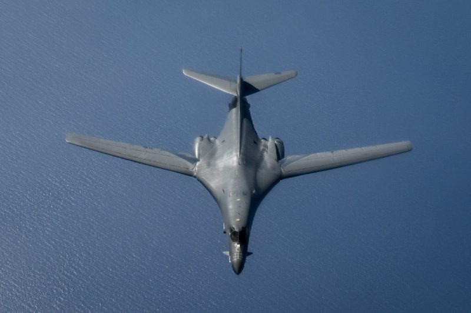

U.S. Central Command ✓ @CENTCOM
Mon, 11 May 2026 23:00:36 UTC

A U.S. Air Force B-1B Lancer flies over the Middle East during a training mission, May 9.

فارسی

یک فروند بمب‌افکن بی-۱بی لنسر نیروی هوایی ایالات متحده (USAF) در جریان یک ماموریت آموزشی، ۹ می، برفراز خاورمیانه پرواز می‌کند.

𝕏 · @shin_persian

## FarsiVOA — post 217495

  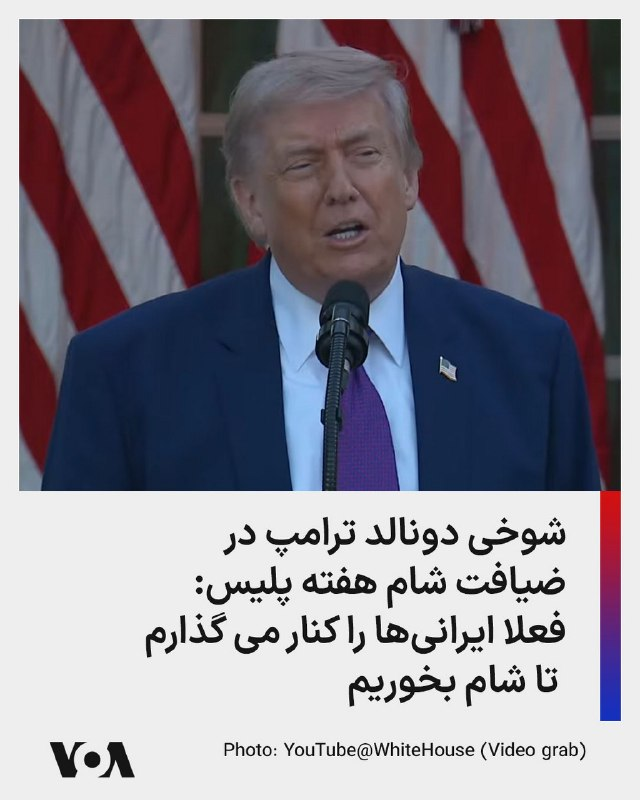

⚡️دونالد ترامپ، رئیس‌جمهوری آمریکا، شامگاه دوشنبه در کاخ سفید، میزبان ضیافت شامی در «باغ رز» کاخ سفید بود. این مراسم به افتخار هفته پلیس بود. آقای ترامپ در پایان سخنرانی خود برای مهمانان، به شوخی گفت: «گفتم امشب خیلی سرم شلوغ است و وقت شام خوردن ندارم. بعد به من گفتند، اوه، این [ضیافت شام] برای قدردانی از پلیس است. گفتم اوم، پس شام می‌خورم. پس به شما ملحق می‌شوم برای شام ایرادی ندارد؟ پس من [مسئله] ایرانی‌ها را برای خوردن شام کنار می‌گذارم. ایرانی‌ها را می‌گذارم کنار و می‌رویم یک شام کوچک بخوریم.»
@FarsiVOA

## FarsiVOA — post 217494

🔺وال‌استریت ژورنال: امارات به‌طور مخفیانه حملاتی به جمهوری اسلامی انجام داده است

▪️روزنامه وال‌استریت ژورنال به نقل از افراد آگاه گزارش داد که امارات به‌طور مخفیانه حملاتی نظامی علیه جمهوری اسلامی انجام داده است.

⬇️ بیشتر بخوانید:
https://ir.voanews.com/a/8148938.html
@FarsiVOA

## FarsiVOA — post 217493

⚡️«درهای باز اتحادیه اروپا» در واشنگتن دی‌سی
@FarsiVOA

## FarsiVOA — post 217492

⚡️افشای جزئیات جدید از پایگاه مشترک آمریکا و اسرائیل در قلب صحرای عراق
@FarsiVOA

## FarsiVOA — post 217491

  

⚡️دونالد ترامپ، رئیس جمهوری آمریکا، صبح دوشنبه پاسخ جمهوری اسلامی به پیشنهاد آمریکا برای چارچوب مذاکرات صلح را به شدت رد کرد و آن را «به‌طرز باورنکردنی ضعیف» خواند. او گفت: «بعد از خواندن آن آشغالی که برای ما فرستادند، باید بگویم این ضعیف‌ترین واکنش [جمهوری اسلامی] تا الان بوده است.» آقای ترامپ گفت: «حتی خواندنش را هم تمام نکردم. وقت خودم را برای خواندنش تلف نمی‌کنم.» جمهوری اسلامی، از طریق پاکستان، پاسخ خود را ارائه داد.
@FarsiVOA

## FarsiVOA — post 217490

🔺سناتور لیندزی گراهام به گزارش‌های پناه‌گرفتن هواپیماهای جمهوری اسلامی در پاکستان واکنش نشان داد

◾️شبکه خبری آمریکایی سی‌بی‌اس در گزارشی نوشت که حالی که پاکستان خود را به‌عنوان کانال دیپلماتیک میان تهران و واشنگتن مطرح می‌کند، بی ‌سروصدا به هواپیماهای نظامی جمهوری اسلامی اجازه داده است در خاک آن کشور مستقر شوند.

⬇️ بیشتر بخوانید:
https://ir.voanews.com/a/8148935.html
@FarsiVOA

## Persian_Trend_Official — post 13950

  <a href="telegram/content/Persian_Trend_Official_13950_1778545685.mp4" target="_blank">🎬 Download video</a>

شبتون بخیر 🔥
📝 Nick

## BBCPersian — post 280802

  

🔻رئیس شورای شهر تهران گفته است محل انبار نفت شهران در تهران باید تغییر کند،‌ زیرا که در مجاورت منازل مسکونی قرار دارد که این از نظر ایمنی و زیست محیطی مناسب نیست.

مهدی چمران گفت که این شورا از دوره سوم پیگیر جابجایی انبار نفت شهران بوده،‌ اما هنوز این اتفاق نیفتاده است.

به گفته رئیس شورای شهر تهران موقعیت جغرافیایی این انبار نفت مناسب نیست و در طول جنگ هم پس از هدف قرار گرفتن و آتش سوزی، بنزین در خیابان‌ها جاری شد که این باعث شد خودروهای اطراف این محل دچار آتش سوزی شوند.

پس از حملات آمریکا و اسرائیل به انبار نفت شهران تصاویری از دود غلیظ و آثار دوده بر خودروها و منازل در غرب تهران منتشر شد.

مقامات بهداشتی ایران در آن زمان به شهروندان هشدار دادند که فقط در موارد ضروری از خانه خارج شوند.

📸GettyImages
https://bbc.in/4wpu4IE
@BBCPersian

## BBCPersian — post 280801

🔻پایان پوشش زنده

با ورود به بامداد ۲۲ اردیبهشت پوشش زنده ما از آخرین تحولات ایران و خاورمیانه به صفحه جدید روز سه شنبه منتقل می‌شود.

لطفا برای مرور تحولات ۲۴ ساعت گذشته به لینک پایین مراجعه کنید و از جمله آخرین اظهارات مقام‌های ایران و آمریکا درباره مذاکرات آتش‌بس را بخوانید.

https://bbc.in/4tnabzf
@BBCPersian

## BBCPersian — post 280795

🖋کیتی گورنال و سارا داوکینز/ بی‌بی‌سی

اگر از کاربران شبکه‌های اجتماعی باشید، احتمالا آن‌ها را دیده‌اید؛ ویدئوهای پر زرق‌وبرق بدنسازی که وعده می‌دهند هیکل شما را در عرض چند هفته به‌کلی دگرگون می‌کنند.

این ویدئوها بدن‌هایی تراشیده و تصاویر خیره‌کننده «قبل و بعد» نشان می‌دهند و ادعا می‌کنند که با دنبال کردن یک روتین ساده، می‌توانید چندین سال جوان‌تر به نظر برسید.

نتایج اغلب آن‌قدر خوب به نظر می‌رسند که باورکردنی نیستند و البته در بسیاری از موارد، واقعا هم نباید باورشان کرد.

طبق تحقیقات بی‌بی‌سی، آگهی‌های ورزشی گمراه‌کننده‌ای با استفاده از شخصیت‌های ساخته‌شده توسط هوش مصنوعی در حال انتشار هستند که قوانین تبلیغات بریتانیا را نقض می‌کنند. بسیاری از این آگهی‌ها همچنین به وضوح اعلام نکرده بودند که افراد نمایش‌داده‌شده واقعی نیستند.

ادامه مطلب⬇️

📸GettyImages
https://bbc.in/4u6vu9q
@BBCPersian

## BBCPersian — post 280794

🔻بازداشت یک نفر در تورنتو همزمان با تجمع هواداران سلطنت

پلیس تورنتو با انتشار بیانیه‌ای از بازداشت یک مرد ایرانی به اتهام «حمله با سلاح، تهدید،‌ رانندگی خطرناک و عدم توقف بعد از سانحه رانندگی» در حاشیه تجمع روز گذشته هواداران سلطنت در این شهر کانادا خبر داده است.

روز یکشنبه - ۲۰ اردیبهشت - گزارش‌هایی در شبکه‌های اجتماعی از تلاش برای اختلال در تجمعی در شهر ریچموند هیل تورنتو منتشر شد که در ویدیوهای منتسب به آن مردی که پرچم رسمی جمهوری اسلامی ایران در دست داشت در میان افسران پلیس دیده می‌شد که دقایقی بعد در حالی که دستبند به دست داشت افسران او را سوار خودرو پلیس می‌کردند.

در بیانیه روز دوشنبه - ۱۱ مه / ۲۱ اردیبهشت - پلیس تورنتو این حادثه چنین تشریح شده است: «روز يکشنبه ۱۰ مه ۲۰۲۶، حدود ساعت ۳:۱۵ بعدازظهر، پليس در پی گزارش‌هايی درباره يک راننده خطرناک در محدوده ميجر مکنزی درايو وست و خیابان يانگ به محل اعزام شد. مظنون در نزديکی يک تجمع اعتراضی، خودرو را به شکلی خطرناک هدايت می‌کرد. او با يک راننده تحويل غذا — که در اين تجمع نقشی نداشت — برخورد کرد و هنگام فرار از صحنه، به خودروی ديگری نيز زد. پليس می‌گويد مظنون سپس خودرويش را متوقف کرد و اقدام به فرياد زدن تهديدهايی عليه معترضان کرد، پيش از آنکه بازداشت شود.»

دهها ایرانی روز گذشته در تورنتو با پرچم‌های شیر و خورشید و پوسترهای رضا پهلوی، فرزند آخرین پادشاه ایران، تجمع کرده بودند که به گفته پلیس تورنتو این حادثه در خلال زمان برگزاری این تجمع روی داده است.

https://bbc.in/4uCcSxT
@BBCPersian

## alonews — post 119408

  <a href="telegram/content/alonews_119408_1778545687.webm" target="_blank">🎬 Download video</a>

👈طبق گزارش والای اسرائیلی: ایالات متحده هفته گذشته به از سرگیری حملات به ایران نزدیک شد، اما تصمیم به تعویق افتاد پس از آنکه مشاوران در دایره نزدیک ترامپ به او توصیه کردند که قبل از تشدید نظامی، یک تلاش نهایی برای مذاکرات را مجاز کند

همزمان، مقامات ارشد ارتش اسرائیل به گزارش در جلسات بسته موضعی سخت‌گیرانه یکپارچه ارائه می‌دهند و استدلال می‌کنند که رهبری سیاسی اسرائیل باید به طور جدی حملات استراتژیک به زیرساخت‌های ملی ایران را در نظر بگیرد.


✅ @AloNews خبر جنگ

## alonews — post 119407

  <a href="telegram/content/alonews_119407_1778545687.mp4" target="_blank">🎬 Download video</a>

👈شبکه 14 اسرائیل: بخشی از اهداف بعدی در خاک ایران:

🔴تاسیسات انرژی و صنعت پتروشیمی

🔴صنعت خودروسازی و پایگاه‌ های موشک بالستیک

🔴صنعت نفت و صنعت فولاد

✅ @AloNews خبر جنگ

## alonews — post 119405

  <a href="telegram/content/alonews_119405_1778545690.webm" target="_blank">🎬 Download video</a>

👈دو روزنامه تندرو و کم مخاطب داخلی مذاکرات با ایالات متحده را رد کردند

✅ @AloNews خبر جنگ

## alonews — post 119404

  <a href="telegram/content/alonews_119404_1778545690.webm" target="_blank">🎬 Download video</a>

👈تیتر جالب روزنامه سازندگی

✅ @AloNews خبر جنگ

## mmafars — post 1372

مبارزه کامل حمزت چیمايف در مقابل شان استریکلند

## mmafars — post 1368

MMA FARSI pinned Deleted message

## mmafars — post 1366

https://youtu.be/3m4HNiD0YSo

## mmafars — post 1365

MMA FARSI pinned «https://youtu.be/y_gwgzTlFOY»

## mmafars — post 1364

## mmafars — post 1360

https://youtu.be/y_gwgzTlFOY

## mmafars — post 1359

  

تا ساعتی دیگر تحلیل و بررسی UFC 328 حمزت چیمائف و شان استریک لند در یوتوب MMA FARSI - اوج در گیری تیم چچنی ها با آمریکایی ها

## mmafars — post 1355

کل مبارزات UFC 324 (جاستین گیچی در مقابل پدی پیمبلت) به صورت یکجا 🔥

برنامه های بیشتر در
https://youtube.com/c/mmafarsi

## mmafars — post 1354

کل مبارزات UFC 325 (الکساندر ولکانوفسکی در مقابل لوپز ۲) به صورت یکجا 🔥

برنامه های بیشتر در
https://youtube.com/c/mmafarsi

## mmafars — post 1353

در درگیری واقعی کدوم برندس عضله یا تکنیک !
https://youtu.be/vZOdjf2X3cw

## mmafars — post 1352

https://youtu.be/GHFf4bwpslk

## mmafars — post 1350

محمد علی در ایران؟ | آخرین مبارزه‌ای که کسی باورش نمی‌کرد
https://youtu.be/rVLGkFX0GFk

## mmafars — post 1349

مستند محمد منصوری قهرمان جوجیتسو و مرد اخلاق
https://youtu.be/ARkHLY1I0fM

## mmafars — post 1347

تمامی برنامه ها در یوتوب هم اکنون دوباره قابل دسترس هستند

https://youtube.com/@mmafarsi?si=p6WwEi2FY2vT7N_V

## mmafars — post 1345

مبارزه بوکس اندرو تیت در مقابل چیس دیمور 🔥

برنامه های بیشتر در
https://youtube.com/c/mmafarsi

## mmafars — post 1344

مبارزه بوکس تونی فرگوسن در مقابل وان اسپنسر 🔥

برنامه های بیشتر در
https://youtube.com/c/mmafarsi

## mmafars — post 1342

مبارزه بوکس جیک پاول در مقابل انتونی جاشوا کیفیت عالی🔥

برنامه های بیشتر در
https://youtube.com/c/mmafarsi

## mmafars — post 1341

مبارزه بوکس جیک پاول در مقابل انتونی جاشوا🔥

برنامه های بیشتر در
https://youtube.com/c/mmafarsi

## mmafars — post 1340

مبارزه بوکس اندرسون سیلوا در مقابل تایرون وودلی🔥

برنامه های بیشتر در
https://youtube.com/c/mmafarsi

## mmafars — post 1339

قهرمان سنگین وزن بوکس در مقابل یوتوبر ! آنتونی جاشوا در مقابل جیک پائول
https://youtu.be/m8mABUwTrYg

---
📅 بروزرسانی: 1405/02/22 02:13
---

## VahidOOnLine — post 239598

  

♦️کانال ۱۴ تلویزیون اسرائیل به نقش ترکیه در پولشویی برای رژیم ایران اشاره کرده و می گوید گزارش‌هایی درباره هواپیماهای خصوصی حامل پول نقد و طلا، صراف‌ها و انتقال آزادانه منابع مالی حکومت از طریق مرز زمینی باز منتشر شده است.
صراف‌های غیررسمی ترکیه پس از تنش ها بین رژیم ایران و امارات متحده عربی به شریان مالی جدید حکومت ایران تبدیل شده‌اند.
کانال ۱۴می گوید، بدون اینکه اردوغان چشم خود را بر این فعالیت‌ها ببندد، بقای حکومت زیر فشار اقتصادی بسیار دشوار خواهد بود.»
این گزارش می گوید، حکومت ایران به‌طور فزاینده‌ای فعالیت‌های مالی خود را به سیستم «حواله» منتقل می‌کند؛ سازوکاری غیررسمی برای انتقال پول. این سیستم به این شکل عمل می‌کند.
‌🇸🇦 Indypersian

🤖 @VahidOOnLine

## VahidOOnLine — post 239597

  

♦️نشریه تایمز روز دوشنبه ۲۱ اردیبهشت گزارش داد که دست‌کم ۸۰ نماینده حزب کارگر در نامه‌ای که کاترین وست، نماینده پارلمان، ارائه کرده است از کی‌یر استارمر، نخست‌وزیر بریتانیا، خواسته شده برای کناره‌گیری خود جدول زمانی مشخصی ارائه دهد.
بر اساس این گزارش، برخی اعضای ارشد این کابینه از جمله شابانا محمود، وزیر کشور، نیز به استارمر توصیه کرده‌اند درباره ادامه حضور خود در قدرت تجدیدنظر کند. هم‌زمان، یکی از دستیاران وزارتی نیز در اعتراض به وضعیت فعلی استعفا داده و خواستار کناره‌گیری نخست‌وزیر شده است.
در همین حال، اختلافات درون‌حزبی در میان نمایندگان حزب کارگر افزایش یافته و تلاش‌ها برای جلب حمایت از برگزاری انتخابات رهبری تا ماه سپتامبر ادامه دارد. با این حال، استارمر با رد این درخواست‌ها تاکید کرده که از «مبارزه برای آینده بریتانیا» عقب‌نشینی نخواهد کرد.
‌🇸🇦 Indypersian

🤖 @VahidOOnLine

## VahidOOnLine — post 239596

  

♦️لیندزی گراهام، سناتور جمهوری‌خواه، در واکنش به گزارش‌های اخیر مبنی بر پناه دادن پاکستان به هواپیماهای نظامی رژیم ایران، خواستار بازنگری در نقش دیپلماتیک اسلام‌آباد شد و در اکس نوشت: «اگر این گزارش‌ها دقیق باشد، مستلزم ارزیابی مجدد کامل نقشی است که پاکستان به عنوان میانجی بین ایران، ایالات متحده و سایر طرف‌ها ایفا می‌کند.» او همچنین با اشاره به مواضع پیشین مقامات دفاعی پاکستان در قبال اسرائیل، تاکید کرد که از شنیدن چنین خبری شوکه نخواهد شد، چرا که این اقدامات با رویکرد اخیر اسلام‌آباد همخوانی دارد.
پیش از این، «سی‌بی‌اس» روز دوشنبه، ۲۱ اردیبهشت‌ماه، گزارش داد که پاکستان برخلاف نقش خود به عنوان میانجی دیپلماتیک میان تهران و واشنگتن، به طور مخفیانه اجازه داده است هواپیماهای نظامی رژیم ایران در پایگاه‌های هوایی این کشور مستقر شوند تا از حملات هوایی آمریکا در امان بمانند. خبری که مقامات ارشد پاکستان در گفتگو با «سی‌بی‌اس نیوز» آن را تکذیب کرده‌اند.
‌🇸🇦 Indypersian

🤖 @VahidOOnLine

## VahidOOnLine — post 239595

  

لیندسی گراهام، سناتور جمهوری‌خواه، در واکنش به گزارش سی‌بی‌اس درباره انتقال هواپیماهای نظامی ایران به پاکستان گفت: «اگر این گزارش درست باشد، باید نقش پاکستان به‌عنوان میانجی میان ایران، آمریکا و سایر طرف‌ها به‌طور کامل بازنگری شود.»
لیندسی گراهام افزود با توجه به برخی اظهارات گذشته مقام‌های دفاعی پاکستان درباره اسرائیل، صحت این گزارش درباره کمک اسلام آباد به حکومت ایران برای او دور از انتظار نیست.
‌🏁 🇬🇧 IranintlTV

🤖 @VahidOOnLine

## VahidOOnLine — post 239594

  

♦️دونالد ترامپ روز دوشنبه، ۲۱ اردیبهشت‌ماه، با انتشار پیامی در شبکه اجتماعی «تروث سوشال»، در آستانه سفر به پکن، با ابراز خرسندی نوشت: «بسیار مشتاق سفرم به چین هستم. کشوری شگفت‌انگیز با رهبری همچون رئیس‌جمهور شی که مورد احترام همگان است.» رئیس‌جمهوری ایالات متحده در ادامه پیام خود با خوش‌بینی نسبت به نتایج این دیدار تاکید کرد که «اتفاقات بزرگی برای هر دو کشور رقم خواهد خورد.» ترامپ قرار است از ۲۳ تا ۲۵ اردیبهشت‌ماه به پکن سفر کند.
‌🇸🇦 Indypersian

🤖 @VahidOOnLine

## VahidOOnLine — post 239593

  <a href="telegram/content/VahidOOnLine_239593_1778539400.mp4" target="_blank">🎬 Download video</a>

روزنامه وال‌استریت ژورنال به نقل از منابع آگاه گزارش داد امارات متحده عربی به‌طور مخفیانه حملاتی نظامی علیه جمهوری اسلامی انجام داده و به یکی از طرف‌های مستقیم جنگ تبدیل شده است.

بر اساس این گزارش، یکی از این حملات در ماه آوریل پالایشگاه نفتی لاوان در خلیج فارس را هدف قرار داده؛ حمله‌ای که همزمان با اعلام آتش‌بس از سوی دونالد ترامپ رخ داده و باعث آتش‌سوزی گسترده و از کار افتادن بخش بزرگی از ظرفیت پالایشگاه برای چند ماه شده است.

به نوشته وال‌استریت ژورنال، جمهوری اسلامی در آن زمان اعلام کرده بود پالایشگاه در «حمله دشمن» هدف قرار گرفته و در واکنش، موجی از حملات موشکی و پهپادی علیه امارات و کویت انجام داده است.

این گزارش می‌گوید آمریکا از حمله امارات ناراضی نبوده و به‌طور غیرعلنی از مشارکت کشورهای خلیج فارس در جنگ علیه جمهوری اسلامی استقبال کرده است.

وزارت خارجه امارات از اظهار نظر مستقیم درباره این حملات خودداری کرده، اما به بیانیه‌های پیشین خود درباره «حق پاسخ، از جمله پاسخ نظامی، به اقدامات خصمانه» اشاره کرده است.

وال‌استریت ژورنال همچنین گزارش داد جمهوری اسلامی بیش از ۲۸۰۰ موشک و پهپاد به سمت امارات شلیک کرده؛ حملاتی که به بخش‌های هوایی، گردشگری و بازار املاک این کشور آسیب زده است.

در این گزارش آمده امارات پس از آغاز جنگ، همکاری نظامی خود با آمریکا را حفظ کرده و همزمان اقداماتی علیه منافع مالی جمهوری اسلامی، از جمله محدودیت برای شهروندان ایرانی و تعطیلی مراکز مرتبط با تهران در دبی، انجام داده است.
‌🏁 🇬🇧 ManotoTV

🤖 @VahidOOnLine

## VahidOOnLine — post 239592

  

♦️به گزارش خبرگزاری فرانسه، ایالات متحده در آستانه سفر دونالد ترامپ، رئیس جمهوری آمریکا به پکن، تحریم‌های جدیدی را علیه ۱۲ فرد و نهاد مرتبط با شبکه فروش و جابجایی نفت ایران به چین اعمال کرد. وزارت خزانه‌داری آمریکا روز دوشنبه در بیانیه‌ای اعلام کرد که این افراد و شرکت‌ها نقش کلیدی در تسهیل تجارت نفتی تهران ایفا کرده‌اند. واشنگتن تاکید کرد که سپاه پاسداران برای پنهان کردن نقش خود در معاملات نفتی و هدایت درآمدهای حاصل از آن به سمت رژیم ایران، به طور گسترده از شرکت‌های صوری در حوزه‌های قضایی با نظارت اقتصادی ضعیف استفاده می‌کند.
در فهرست جدید تحریم‌ها، نام چندین فرد مستقر در ایران و شرکت‌هایی در امارات متحده عربی و هنگ‌کنگ به چشم می‌خورد که متهم به همکاری با نیروی قدس سپاه پاسداران هستند. این اقدام که درست چند روز پیش از دیدارهای دیپلماتیک سطح بالای ترامپ در چین نهایی شده، نشان‌دهنده عزم واشنگتن برای مسدود کردن مسیرهای دور زدن تحریم‌ها و خشکاندن منابع مالی تهران در بازارهای شرق آسیا است. بر اساس این تحریم‌ها، کلیه دارایی‌های این نهادها در آمریکا مسدود و هرگونه مراوده مالی با آن‌ها با جریمه‌های سنگین مواجه خواهد شد.
‌🇸🇦 Indypersian

🤖 @VahidOOnLine

## VahidOOnLine — post 239591

  

شاهزاده رضا پهلوی در شبکه اجتماعی ایکس نوشت که جمهوری اسلامی ۴۷ سال است علیه آمریکا و متحدانش جنگ به راه انداخته، و تاکید کرد: «امروز این رژیم از همیشه ضعیف‌تر است و مردم ایران آماده‌اند تا آن را سرنگون کنند.»
او نوشت که اتخاذ سیاستی درست در این لحظه، می‌تواند قرن آینده را تغییر دهد.

‌🏁 🇬🇧 IranintlTV

🤖 @VahidOOnLine

## VahidOOnLine — post 239590

  

♦️محمدباقر قالیباف، رئیس مجلس شورای اسلامی، روز دوشنبه با انتشار پیامی در اکس، بر ضرورت پذیرش شروط تهران تاکید کرد و نوشت: «هیچ جایگزینی جز پذیرش حقوق ملت ایران، آن‌گونه که در پیشنهاد ۱۴ ماده‌ای آمده است، وجود ندارد.» او با هشدار نسبت به بی‌نتیجه بودن رویکردهای جایگزین مدعی شد که هر مسیر دیگری «کاملا بی‌سرانجام خواهد بود و چیزی جز شکست‌های پی‌درپی به همراه نخواهد داشت.» قالیباف همچنین خطاب به مقامات آمریکایی خاطرنشان کرد که «هرچه بیشتر در این امر تعلل کنند، مالیات‌دهندگان آمریکایی هزینه بیشتری برای آن پرداخت خواهند کرد.»
‌🇸🇦 Indypersian

🤖 @VahidOOnLine

## VahidOOnLine — post 239589

  

♦️روزنامه اطلاعات در یادداشتی با اشاره به ادامه جنگ، تحریم‌ها و محدودیت‌های دولت، از مردم خواست در مصرف منابعی مانند آب، برق، سوخت و مواد غذایی صرفه‌جویی کنند.
این روزنامه با انتقاد از برخی رفتارهای مصرفی نوشت در شرایطی که حمل‌ونقل عمومی در دسترس است، استفاده از خودروهای تک‌سرنشین یا «دور دور»های تفریحی ضرورتی ندارد و به افزایش مصرف سوخت دامن می‌زند.
اطلاعات همچنین به موضوع مصرف مواد غذایی پرداخت و تاکید کرد مصرف بیش از اندازه اقلامی مانند برنج و گندم، در کنار الگوهای تغذیه ناسالم، می‌تواند به بروز بیماری‌ها، کاهش طول عمر و افزایش هزینه‌های درمانی منجر شود.
‌🇸🇦 Indypersian

🤖 @VahidOOnLine

## VahidOOnLine — post 239588

  <a href="telegram/content/VahidOOnLine_239588_1778539405.mp4" target="_blank">🎬 Download video</a>

‌
محمدباقر قالیباف، رئیس مجلس شورای اسلامی، در پیامی به زبان انگلیسی در شبکه اکس نوشت «هیچ» جایگزینی جز پذیرش «طرح ۱۴ ماده‌ای» وجود ندارد.

قالیباف افزود:
«هر رویکرد دیگری کاملاً بی‌نتیجه خواهد بود و چیزی جز شکست‌های پی‌درپی به همراه نخواهد داشت. هرچه بیشتر وقت‌کشی کنند، هزینه بیشتری بر دوش مالیات‌دهندگان آمریکایی گذاشته خواهد شد.»
‌🏁 🇬🇧 ManotoTV

🤖 @VahidOOnLine

## VahidOOnLine — post 239587

  <a href="telegram/content/VahidOOnLine_239587_1778539405.mp4" target="_blank">🎬 Download video</a>

تماسی از چنارشاهیجان کازرون:
از جاویدنامان علیرضا نادری، عارف براتی، فرزانه ساسانی‌پور، بهبود حسن‌زاده، جبار پناهی و آنیسا هوشنگی گفت…
‌🏁 🇬🇧 ManotoTV

🤖 @VahidOOnLine

## VahidOOnLine — post 239586

  

♦️«سی‌بی‌اس» روز دوشنبه، ۲۱ اردیبهشت‌ماه، گزارش داد که پاکستان برخلاف نقش خود به عنوان میانجی دیپلماتیک میان تهران و واشنگتن، به طور مخفیانه اجازه داده است هواپیماهای نظامی ایران در پایگاه‌های هوایی این کشور مستقر شوند تا از حملات هوایی آمریکا در امان بمانند. بر اساس گزارش منابع آگاه در دولت ایالات متحده، تنها چند روز پس از اعلام آتش‌بس موقت توسط دونالد ترامپ، رئیس جمهوری آمریکا، در اوایل آوریل، چندین فروند هواپیما از جمله یک هواپیمای شناسایی و جاسوسی مدل «آر-۱۳۰» (RC-130) نیروی هوایی ایران در پایگاه هوایی «نورخان» پاکستان، واقع در نزدیکی شهر راولپندی، دیده شده‌اند. هم‌زمان گزارش‌هایی از اعزام هواپیماهای غیرنظامی ایران به افغانستان نیز منتشر شده است که به نظر می‌رسد بخشی از تلاش گسترده تهران برای حفاظت از دارایی‌های هوانوردی و نظامی باقی‌مانده خود در میانه درگیری‌های اخیر باشد.
همزمان، مقامات ارشد پاکستان این ادعاها را به شدت رد کرده‌اند. یک مقام عالی‌رتبه پاکستانی در گفتگو با «سی‌بی‌اس نیوز» تاکید کرد که پایگاه هوایی نورخان در قلب شهر واقع شده و استقرار ناوگان بزرگی از هواپیماهای خارجی در چنین مکانی غیرممکن است که از دید عموم پنهان بماند. با این حال، تحلیلگران آمریکایی بر این باورند که این جابه‌جایی‌های استراتژیک نشان‌دهنده تلاش رژیم ایران برای بهره‌گیری از روابط منطقه‌ای جهت کاهش آسیب‌پذیری ناوگان هوایی خود در برابر فشارهای نظامی و محاصره اعمال شده توسط واشنگتن است.
‌🇸🇦 Indypersian

🤖 @VahidOOnLine

## VahidOOnLine — post 239585

  

مجتبی ذوالنوری، عضو کمیسیون حقوقی مجلس، گفت: «لازم نیست در تنگه هرمز باشیم تا هر شناوری را که از آنجا رد می‌شود، بزنیم. از سمنان و مشهد و تهران می‌زنیم. چند شناور که آنجا غرق شود، خود تنگه بسته می‌شود. روی بحث مین‌ریزی کار کردیم و نجابت به خرج دادیم از این حق استفاده نکردیم.»
‌🏁 🇬🇧 IranintlTV

🤖 @VahidOOnLine

## VahidOOnLine — post 239584

  

وال استریت ژورنال به نقل از منابع مطلع گزارش داد که امارات متحده عربی حملات نظامی علیه جمهوری اسلامی انجام داده است؛ اقدامی که این کشور را در جایگاه یکی از طرف‌های فعال در جنگ قرار می‌دهد.

در این گزارش آمده است نیروهای نظامی این کشور به جنگنده‌های ساخت غرب و شبکه‌های نظارتی پیشرفته مجهز هستند و این حملات نشان می‌دهد امارات متحده عربی اکنون تمایل بیشتری دارد از این توانمندی‌ها برای حفاظت از قدرت اقتصادی و نفوذ رو‌به‌گسترش خود در سراسر خاورمیانه استفاده کند.

وال استریت ژورنال افزود که این حملات شامل حمله به یک پالایشگاه در جزیره لاوان ایران در خلیج فارس بوده که در اواسط فروردین انجام شده است؛ امارات به‌طور علنی انجام این حملات را تایید نکرده است.
در بخش دیگری از این گزارش آمده است که امارات متحده عربی اکنون تهران را تهدیدی مستقیم علیه ثبات و مدل اقتصادی خود می‌داند. همچنین براساس گمانه‌زنی‌ها، گفته می‌شود امارات متحده عربی با استفاده از جنگنده‌های میراژ فرانسوی و پهپادهای چینی متعلق به خود، در داخل ایران عملیات انجام داده است.
‌🏁 🇬🇧 IranintlTV

🤖 @VahidOOnLine

## VahidOOnLine — post 239583

  

♦️همزمان با افزایش تنش‌ها میان تهران و واشنگتن، مجتبی ذوالنور، عضو کمیسیون قضایی و حقوقی مجلس، در گفتگو با شبکه خبر با اشاره به ویژگی‌های جغرافیایی تنگه هرمز گفت عرض این تنگه در باریک‌ترین نقطه حدود ۴۵ کیلومتر است، اما همه این محدوده قابل کشتیرانی نیست. به گفته او، بخش‌هایی از مسیر به‌دلیل عمق کم و بستر صخره‌ای، به‌ویژه در نزدیکی سواحل عمان و جزیره سلامه، محدودیت عبور دارند و عملا مسیرهای کشتیرانی به نواحی مشخصی محدود می‌شود.
ذوالنور همچنین با اشاره به موقعیت راهبردی ایران در این منطقه افزود آب‌های سرزمینی ایران، که حدود ۱۲ مایل دریایی (نزدیک به ۲۲ کیلومتر) را شامل می‌شود، بخش مهمی از مسیر عبور کشتی‌ها را پوشش می‌دهد. او مدعی شد ایران توان هدف قرار دادن شناورها را حتی از فواصل دور دارد و تأکید کرد هر شناوری که بخواهد از تنگه هرمز عبور کند را می‌توانیم از سمنان، تهران و مشهد بزنیم.
او همچنین به موضوع توانمندی‌های مین‌ریزی در خلیج فارس اشاره کرد و گفت ایران تاکنون از این ظرفیت استفاده نکرده است.
‌🇸🇦 Indypersian

🤖 @VahidOOnLine

## VahidOOnLine — post 239582

  

♦️وزارت خزانه‌داری ایالات متحده، روز دوشنبه، ۲۱ اردیبهشت‌ماه، در بیانیه‌ای رسمی اعلام کرد که پاسخ اخیر تهران به پیشنهاد دیپلماتیک واشنگتن، نه‌تنها از نظر سیاسی غیرقابل‌قبول است، بلکه با استانداردهای لازم برای لغو تحریم‌های مالی و اقتصادی نیز همخوانی ندارد. این وزارتخانه تاکید کرد که رویکرد فعلی ایران مانع از هرگونه گشایش در مسیر مبادلات بین‌المللی و آزادسازی دارایی‌های بلوکه شده می‌شود و تا زمانی که تعهدات شفافی در حوزه برنامه هسته‌ای ارائه نشود، فشارها بر شبکه مالی این کشور ادامه خواهد یافت.
در همین راستا، اسکات بسنت، وزیر خزانه‌داری دولت دونالد ترامپ، در اکس با بازنشر این بیانیه، موضعی قاطعانه اتخاذ کرد. او با اشاره به اینکه پاسخ تهران نشان‌دهنده عدم تمایل این کشور به همکاری واقعی است، نوشت: «در حالی که دولت ترامپ با حسن نیت مسیری برای دیپلماسی باز کرد، تهران با پاسخی کاملا غیرقابل‌قبول به میز مذاکره بازگشته است.» بسنت تاکید کرد که وزارت خزانه‌داری، سیاست‌های مالی را به گونه‌ای تنظیم خواهد کرد که جمهوری اسلامی متوجه شود عدم پذیرش توافق، هزینه‌های اقتصادی سنگین و غیرقابل‌جبرانی برای نظام پولی و بانکی این کشور به همراه خواهد داشت. او نوشت: «زمان آن رسیده که تهران متوجه شود هزینه لجاجت، فروپاشی کامل اقتصادی است».
‌🇸🇦 Indypersian

🤖 @VahidOOnLine

## VahidOOnLine — post 239581

  <a href="telegram/content/VahidOOnLine_239581_1778539411.mp4" target="_blank">🎬 Download video</a>

وزارت خزانه‌داری آمریکا اعلام کرد ۱۲ فرد و نهاد را به‌دلیل نقش در فروش و انتقال نفت جمهوری اسلامی توسط سپاه پاسداران به چین تحریم کرده است.

در بیانیه دفتر کنترل دارایی‌های خارجی وزارت خزانه‌داری آمریکا آمده سپاه پاسداران برای پنهان کردن نقش خود در فروش نفت و انتقال درآمدها به جمهوری اسلامی، از شرکت‌های پوششی در کشورهای مختلف استفاده می‌کند.

اسکات بسنت، وزیر خزانه‌داری آمریکا، گفت: «در حالی که ارتش ایران تلاش می‌کند خود را بازسازی کند، عملیات “خشم اقتصادی” به محروم کردن جمهوری اسلامی از منابع مالی برنامه‌های تسلیحاتی، نیروهای نیابتی و جاه‌طلبی‌های هسته‌ای ادامه خواهد داد.»

وزارت خزانه‌داری آمریکا همچنین اعلام کرد جمهوری اسلامی به‌جای استفاده از درآمدهای نفتی برای حمایت از مردم ایران، این منابع را صرف توسعه تسلیحات، حمایت از گروه‌های نیابتی و تأمین مالی نیروهای امنیتی می‌کند.

در میان افراد تحریم‌شده، نام احمد محمدی‌زاده، رئیس قرارگاه نفتی شهید پورجعفری سپاه، صمد فتحی سلامی، مسئول مالی این قرارگاه، و محمدرضا اشرفی گهی، مسئول بازرگانی آن، دیده می‌شود.

همچنین چند شرکت مستقر در هنگ‌کنگ، دبی، عمان و شارجه به اتهام همکاری در انتقال نفت ایران و دور زدن تحریم‌ها هدف تحریم قرار گرفته‌اند.

وزارت خزانه‌داری آمریکا هشدار داد هر شرکت یا مؤسسه مالی خارجی که با شبکه‌های مرتبط با سپاه پاسداران همکاری کند، ممکن است هدف تحریم‌های ثانویه آمریکا قرار گیرد.
‌🏁 🇬🇧 ManotoTV

🤖 @VahidOOnLine

## VahidOOnLine — post 239580

  

سی‌بی‌اس نیوز به نقل از مقام‌های آمریکایی گزارش داد که پاکستان به‌طور غیررسمی اجازه داده است برخی هواپیماهای نظامی ایران در فرودگاه‌های این کشور مستقر شوند؛ اقدامی که احتمالا آن‌ها را از حملات هوایی آمریکا مصون می‌سازد.
براساس این گزارش، ایران همچنین برخی هواپیماهای غیرنظامی خود را به افغانستان منتقل کرده است، هرچند مشخص نیست که آیا در میان آن‌ها هواپیماهای نظامی نیز وجود دارد یا خیر.
‌🏁 🇬🇧 IranintlTV

🤖 @VahidOOnLine

## VahidOOnLine — post 239579

  <a href="telegram/content/VahidOOnLine_239579_1778539413.mp4" target="_blank">🎬 Download video</a>

دونالد ترامپ در کاخ سفید با تیم امنیتی و فرماندهان نظامی آمریکا درباره ادامه مسیر جنگ با جمهوری اسلامی جلسه برگزار می‌کند. او گفته در داخل حکومت ایران اختلاف وجود دارد؛ «میانه‌روها» دنبال توافق‌اند اما «دیوانه‌ها» می‌خواهند جنگ ادامه پیدا کند.
‌🏁 🇬🇧 IranintlTV

🤖 @VahidOOnLine

## WithYashar — post 11015

  

فاکس نیوز اعلام کرد
جزئیات جدیدترین پیشنهاد ایران
که ترامپ آن را رد کرد:

- دریافت غرامت بابت خسارات جنگی
- به رسمیت شناختن حاکمیت ایران بر تنگه هرمز
- پایان دزدی دریایی آمریکا علیه کشتی‌های ایرانی
- آزادسازی دارایی‌های مسدود شده ایران
@withyashar

## WithYashar — post 11014

ادعای سی.بی.اس به نقل از مقامات آمریکایی: چند روز پس از اعلام آتش‌بس با ایران توسط ترامپ در اوایل آوریل، تهران چندین فروند هواپیما را به پایگاه هوایی «نور خان» نیروی هوایی پاکستان فرستاد. این پایگاه، یک تأسیسات نظامی راهبردی است که درست در حومه شهر راولپندی،…

## WithYashar — post 11013

ترامپ : من خیلی منتظر سفرم به چین هستم، یک کشور فوق‌العاده، با رهبری، رئیس‌جمهور شی، که مورد احترام همه است.

همکاری های بزرگی برای هر دو کشور رخ خواهد داد!
@withyashar

## WithYashar — post 11012

تایید نشده : ایران به شورای امنیت سازمان ملل اطلاع داده است که در صورت اعزام زیردریایی هسته‌ای آمریکا به خاورمیانه، سطح غنی سازی ۱۰ تن اورانیوم باقی مانده را به ۶۰ درصد خواهد رساند
@withyashar

## WithYashar — post 11011

## WithYashar — post 11010

یاشارجان درود
وقتت بخیر
اینکه میگن قراره تو دیدار ترامپ و شی و از طرفی بصورت غیرمستقیم با پوتین در مورد تایوان و ایران و اوکراین معامله صورت بگیره درسته؟؟
لطفا یه تحلیل کوچولو در این مورد برو
ازبس که از اینور اونور این اخبار زرد و بی اساس. شنیدیم واقعا خسته ایم
بعنوان یه ایرانی واژه خسته با ماها معنی میشه

ممنونم ازت بابت کانال خوبت و اخبار کاملی که میذاری
در پناه اهورای پاک🙏🙏🙏💚🤍♥️

## WithYashar — post 11009

من یکی با اینکه قبلا رفتار های اشتباهی در مقابل شما داشتم
ولی الان واقعا قدر زحماتتونو میفهمم
تنها ویسایی که باز میکنم ویسای شماست و ممنونم که واسمون وقت میزاری 🙏❤️

## WithYashar — post 11008

## WithYashar — post 11007

اخجون کلی ویس
اخجون تحلیل😍

## WithYashar — post 11006

## WithYashar — post 11005

## WithYashar — post 11004

  <a href="telegram/content/WithYashar_11004_1778539416.mp4" target="_blank">🎬 Download video</a>

😳😳😳😳 @withyashar

## WithYashar — post 11003

## WithYashar — post 11002

## WithYashar — post 11001

## WithYashar — post 11000

## WithYashar — post 10999

## WithYashar — post 10997

پنتاگون تأیید کرد که زیردریایی هسته‌ای آمریکایی در مسیر خود به خاورمیانه ست @withyashar

## WithYashar — post 10996

کانال ۱۲ اسرائیل: رئیس‌جمهور ترامپ تمایل دارد دستور ازسرگیری درگیری با ایران را صادر کند
@withyashar

## WithYashar — post 10995

## mwarmonitor — post 8935

🔴تحلیل اختصاصی کانال: دیپلماسی در لبه پرتگاه؛ استراتژی «تأدیب» یا «تغییر رژیم»؟

📝گزارش اخیر «باراک راوید» از وضعیت کنونی روابط ایران و آمریکا، نشان‌دهنده عبور از مرحله «چانه‌زنی سخت» و ورود به فاز «رویارویی کنترل‌شده» است. در ادامه، ابعاد مختلف این بن‌بست سیاسی تحلیل می‌شود:

۱. کالبدشکافی استراتژی ترامپ: «نقشه ساده» برای معامله‌ای پیچیده
ترامپ در سخنان خود از مفهومی به نام «بهترین نقشه تاریخ» یاد می‌کند که در ظاهر ساده است (ایران نباید سلاح هسته‌ای داشته باشد)، اما در باطن بر پایه تخریب کامل اهرم‌های قدرت طرف مقابل بنا شده است.

تاکتیک گوش‌مالی (Adjustment): استفاده از عبارت «کمی آن‌ها را تنظیم خواهد کرد» نشان می‌دهد که ترامپ به دنبال جنگ کلاسیک و اشغال‌گرایانه نیست؛ بلکه به دنبال حملات جراحی‌گونه (Surgical Strikes) برای تحمیل اراده سیاسی است.

تشدید دوقطبی داخلی ایران: ادعای ترامپ مبنی بر تقسیم رهبری ایران به «میانه‎‌روها و دیوانگان»، یک جنگ روانی هدفمند برای ایجاد گسل در ساختار تصمیم‌گیری تهران در لحظات بحرانی است.

۲. بن‌بست هسته‌ای؛ خط قرمزهای متقاطع
شکاف اصلی در مذاکرات روز یکشنبه، بر سر «خروج ذخایر اورانیوم» بوده است.
موضع ایران: تهران با غیرقابل مذاکره خواندن غنی‌سازی، به دنبال حفظ «آستانه هسته‌ای» به عنوان تنها کارت بازی باقی‌مانده است.
موضع ترامپ: او معتقد است ایرانِ بدون توان نظامی (طبق ادعای او)، حق داشتنِ اهرم هسته‌ای را ندارد. تعبیر «آتش‌بس در کما»، سیگنال واضحی است که آمریکا دیگر «زمان» را به عنوان یک فاکتور دیپلماتیک به رسمیت نمی‌شناسد.

۳. گزینه‌های نظامی روی میز: از «پروژه آزادی» تا «تأسیسات زیربنایی»
در صورت شکست کامل دیپلماسی پس از سفر ترامپ به چین، سه سناریوی نظامی محتمل است:
محاصره دریایی و تنگه هرمز: ازسرگیری «پروژه آزادی» به معنای به چالش کشیدن حاکمیت دریایی ایران و قطع شریان‌های باقی‌مانده اقتصادی است.
تکمیل بانک اهداف: اشاره به ۲۵ درصد باقی‌مانده از اهداف شناسایی شده، نشان‌دهنده آمادگی پنتاگون برای هدف قرار دادن زیرساخت‌های حیاتی (انرژی و مخابرات) است.
سناریوی خطرناک اسرائیل: عملیات نیروهای ویژه برای تصرف ذخایر اورانیوم، اگرچه از نظر ترامپ «پرخطر» توصیف شده، اما وجود آن در لیست بررسی، نشان‌دهنده سطح بی‌سابقه تنش است.

۴. متغیر چین؛ میانجی‌گری یا چراغ سبز؟
سفر ترامپ به چین نقطه عطف این بحران است. ترامپ به دنبال آن است که با استفاده از نفوذ اقتصادی چین بر ایران، تهران را به پذیرش شروط خود وادار کند.

🔵 اگر شی‌جین‌پینگ نتواند ایران را به عقب‌نشینی متقاعد کند، ترامپ احتمالاً از این «شکستِ دیپلماتیک» به عنوان مجوزی برای اقدام نظامی استفاده خواهد کرد تا به افکار عمومی نشان دهد «تمامی راه‌های غیرنظامی» را طی کرده است.

📌 پارادوکس «تاج مآبانه»
لحن ترامپ (استفاده از استعاره‌های پزشکی و تجاری) نشان می‌دهد که او با بحران ایران مانند یک «دارایی ورشکسته» در تجارت املاک برخورد می‌کند. او معتقد است ایران در ضعیف‌ترین موضع تاریخی خود قرار دارد و به همین دلیل، تمایلی به دادن امتیاز کوچک هم ندارد.

🔴ما اکنون در وضعیت «انتظار فعال» هستیم. بازه زمانی بازگشت ترامپ از چین (آخر هفته میلادی)، بحرانی‌ترین زمان برای تعیین تکلیف صلح یا جنگ خواهد بود. ایران میان دو گزینه «پذیرش خلع سلاح غنی‌سازی» (که آن را تسلیم می‌نامد) و «تحمل موج جدید حملات نظامی»، با سخت‌ترین تصمیم دهه اخیر خود روبروست.

☑️ تأکید ترامپ بر کشته شدن ۴۲,۰۰۰ نفر در اعتراضات، نشان‌دهنده آن است که او قصد دارد هرگونه اقدام نظامی احتمالی را تحت پوشش «حمایت از مردم» و «مسائل حقوق بشری» مشروعیت‌بخشی کند.

@mwarmonitor

## mwarmonitor — post 8934

  

✈️📡 هواپیمای RC-135V Rivet Joint هواپیمای شناسایی و شنود الکترونیکی (جمع‌آوری اطلاعات سیگنالی و ارتباطی).(شماره 64-14848 از پایگاه سودا بی یونان) بر فراز عربستان سعودی مشاهده شد؛ در حال بازگشت از خلیج فارس. (تداخل شدید GPS در منطقه میان ریاض، امارات متحده…

## mwarmonitor — post 8933

  <a href="telegram/content/mwarmonitor_8933_1778539419.mp4" target="_blank">🎬 Download video</a>

📝 این انگل‌های وارداتی حشدالشعبی که معلوم نیست چطور فارسی‌نفهمیده برای خامنه‌ای زجه می‌زنند، در واقع آینه دقِ آن حرامزاده‌های ارتشی و بزدلانِ پادگان‌نشینی هستند که شرفشان را با جیره و مواجب معامله کرده‌اند. خاک بر سر آن نظامیانی که دیروز مدعی بودند یک گردان کشته دادند تا کسی به ناموس ایران نگاه چپ نکند، اما حالا مثل هرزه‌های ترسو در سوراخ‌های خود خزیده‌اند و فرشِ زیر پای وحوشِ بیگانه شده‌اند. شما نه پاسدار مرز، که نگهبان ذلت و تماشاگرِ حقارتِ ملت هستید؛ بی‌رگ‌هایی که در ازای یک لقمه نانِ آغشته به خون، عزت و خاک وطن را به این گله‌های وارداتی واگذار کردید.

@mwarmonitor

## mwarmonitor — post 8932

🇦🇪امارات متحده عربی به‌طور مخفیانه حملات نظامی علیه ایران انجام داده است، به گفته منابع - وال‌استریت ژورنال

🔸این حملات شامل حمله به یک پالایشگاه در جزیره لاوان ایران بوده است.

@mwarmonitor

## mwarmonitor — post 8931

🔴رئیس‌جمهور ترامپ تمایل دارد دستور ازسرگیری درگیری با ایران را صادر کند — کانال ۱۲ اسرائیل

@mwarmonitor

## mwarmonitor — post 8930

💠امروز، دفتر کنترل دارایی‌های خارجی وزارت خزانه‌داری آمریکا (OFAC)، ۱۲ فرد و نهاد را به دلیل نقش آن‌ها در تسهیل فروش و انتقال نفت ایران توسط سپاه پاسداران انقلاب اسلامی (IRGC) به جمهوری خلق چین تحریم کرد.

💠سپاه پاسداران برای پنهان‌سازی نقش خود در فروش نفت و انتقال درآمدها به حکومت ایران، به شرکت‌های پوششی در حوزه‌های اقتصادی سهل‌گیر متکی است. به‌جای آنکه این درآمدها صرف حمایت از مردم در مضیقه ایران شود، حکومت ایران آن را به سمت توسعه تسلیحات، حمایت از نیروهای نیابتی تروریستی، و تأمین مالی نیروهای امنیتی که آزادی‌های شهروندان را سرکوب می‌کنند هدایت می‌کند.

🔸اسکات بسنت وزیر خزانه‌داری آمریکا ؛

🔘در حالی که نیروهای نظامی ایران به‌شدت در تلاش برای بازسازی خود هستند، کارزار «خشم اقتصادی» همچنان به محروم کردن رژیم از منابع مالی مورد نیاز برای برنامه‌های تسلیحاتی، نیروهای نیابتی تروریستی و جاه‌طلبی‌های هسته‌ای ادامه خواهد داد.

🔘وزارت خزانه‌داری به تلاش خود برای قطع دسترسی رژیم ایران به شبکه‌های مالی که از آن‌ها برای انجام اقدامات تروریستی و بی‌ثبات کردن اقتصاد جهانی استفاده می‌کند، ادامه خواهد داد.

@mwarmonitor

## mwarmonitor — post 8929

⚠️افشاگری به نقل از CBSNews: 🔴منابعی به Jennifer Jacobs و JimLaPorta گفتند که در حالی که پاکستان خود را به‌عنوان کانال دیپلماتیک میان تهران و واشینگتن مطرح می‌کرد، به‌طور پنهانی به هواپیماهای نظامی ایران اجازه داد در خاک این کشور مستقر شوند؛ اقدامی که می‌توانست…

## mwarmonitor — post 8928

⚠️افشاگری به نقل از CBSNews:

🔴منابعی به Jennifer Jacobs و JimLaPorta گفتند که در حالی که پاکستان خود را به‌عنوان کانال دیپلماتیک میان تهران و واشینگتن مطرح می‌کرد، به‌طور پنهانی به هواپیماهای نظامی ایران اجازه داد در خاک این کشور مستقر شوند؛ اقدامی که می‌توانست آن‌ها را از حملات هوایی آمریکا مصون نگه دارد.

🔴چند روز پس از آنکه دونالد ترامپ در اوایل آوریل آتش‌بس را اعلام کرد، تهران چندین فروند هواپیما را به پایگاه هوایی نورخان متعلق به نیروی هوایی پاکستان منتقل کرد.

🔴در میان تجهیزات نظامی منتقل‌شده، یک فروند RC-130 نیروی هوایی ایران نیز وجود داشت؛ گونه‌ای شناسایی و جمع‌آوری اطلاعات از هواپیمای ترابری تاکتیکی C-130 هرکولس.

@mwarmonitor

## FoxNewsTwitter — post 341563

  <a href="telegram/content/FoxNewsTwitter_341563_1778539421.mp4" target="_blank">🎬 Download video</a>

Fox News (Twitter/X)

"We know this virus. It's not novel and we know what we need to do."

CDC official David Fitter said the Andes hantavirus strain is significantly more difficult to spread than typical respiratory viruses.

## FoxNewsTwitter — post 341562

  

Fox News (Twitter/X)

President Trump announced he is "very much looking forward to" his upcoming trip to China.

## FoxNewsTwitter — post 341561

  

Fox News (Twitter/X)

WATCH LIVE: Health officials hold hantavirus news conference in Georgia
https://twitter.com/i/broadcasts/1nxnRYdRXLkxO

## FoxNewsTwitter — post 341560

  <a href="telegram/content/FoxNewsTwitter_341560_1778539425.mp4" target="_blank">🎬 Download video</a>

Fox News (Twitter/X)

NEW: President Trump is met with 'Hoosiers' chants as he reflects on the team's historic National Championship run during their visit to the White House:

"This was a year that will live forever in the hearts of Indiana football fans."

"You're the biggest story. There's no story like this."

"The Hoosiers delivered the program's first-ever undefeated, untied season and capped it off with their first-ever national title. That's amazing."

## FoxNewsTwitter — post 341559

  

Fox News (Twitter/X)

NEW: President Trump receives an honorary ‘Trump’ jersey from the reigning CFP National Champions, the Indiana Hoosiers, during their White House celebration ceremony.

## FoxNewsTwitter — post 341558

  <a href="telegram/content/FoxNewsTwitter_341558_1778539429.mp4" target="_blank">🎬 Download video</a>

Fox News (Twitter/X)

NEW: President Trump addresses star quarterback of the 2025 National Championship Indiana Hoosiers Fernando Mendoza not attending the White House ceremony:

"The reason he's not here — he was so nice, he called..."

"Actually, JD's a big fan of yours. You wouldn't believe it because he didn't show up. I'm not happy, but that's okay."

"The reason he didn't because he's at spring training, right?"

COACH CIGNETTI: Correct."

"If he was not here for other reasons like he didn't like Trump or he didn't want to come, I wouldn't have even mentioned him... But he's a great guy actually and he is actually a big fan of what we're doing for our country."

## FoxNewsTwitter — post 341557

  <a href="telegram/content/FoxNewsTwitter_341557_1778539431.mp4" target="_blank">🎬 Download video</a>

Fox News (Twitter/X)

BREAKING: President Trump is presented with a custom “Trump” jersey and helmet by Indiana Hoosiers coach Curt Cignetti:

“I like this guy.”

## FoxNewsTwitter — post 341556

  <a href="telegram/content/FoxNewsTwitter_341556_1778539434.mp4" target="_blank">🎬 Download video</a>

Fox News (Twitter/X)

RT @Outkick: “I think he’s the coach of the decade.”

Donald Trump gives Curt Cignetti his flowers 💐

## FoxNewsTwitter — post 341555

  <a href="telegram/content/FoxNewsTwitter_341555_1778539436.mp4" target="_blank">🎬 Download video</a>

Fox News (Twitter/X)

BREAKING: President Trump welcomes the 2025 College Football National Champions the Indiana Hoosiers to the White House.

## FoxNewsTwitter — post 341554

  

Fox News (Twitter/X)

WATCH LIVE: President Trump hosts college football champion Indiana Hoosiers https://twitter.com/i/broadcasts/1qxvvkErMBgxB

## FoxNewsTwitter — post 341553

  <a href="telegram/content/FoxNewsTwitter_341553_1778539439.mp4" target="_blank">🎬 Download video</a>

Fox News (Twitter/X)

JUST IN: Senate Majority Leader John Thune slams Democrats for their attempt to block funding for immigration enforcement:

"My Democrat colleagues refused to provide a single dollar for the men and women who protect our borders."

"They refused to provide a single dollar for the men and women who take dangerous criminal, illegal aliens off of our streets."

"My Democrat colleagues apparently believe that there should be no physical presence at our borders and no law enforcement officers to deport dangerous criminals who have entered our country illegally."

## pm_afshaa — post 90601

🔥رفقا هانا که همیشه تبلیغشو کردم فقط مخصوص یوزرای ما تخفیف گذاشته👇🏼 1 Gig = 280,000 T 2 Gig = 560,000 T 3 Gig = 800,000 T 5 Gig = 1,200,000 T 10 Gig = 2,200,000T 20 Gig = 4,000,000T 💎پرداخت ریال ، کارت به کارت 💵واریز با ارز دیجیتال ( ترون ) 📌قابلیت…

## pm_afshaa — post 90600

🔥رفقا هانا که همیشه تبلیغشو کردم فقط مخصوص یوزرای ما تخفیف گذاشته👇🏼

1 Gig = 280,000 T
2 Gig = 560,000 T
3 Gig = 800,000 T
5 Gig = 1,200,000 T
10 Gig = 2,200,000T
20 Gig = 4,000,000T

💎پرداخت ریال ، کارت به کارت

💵واریز با ارز دیجیتال ( ترون )

📌قابلیت مشاهده حجم مصرفی
📌نامحدود بودن تعداد کاربران
📌سرعت دانلود به شدت بالا

ایدی جهت خرید👇🏼👇🏼👇🏼👇🏼

@RealHoneyi

## pm_afshaa — post 90599

  <a href="telegram/content/pm_afshaa_90599_1778539441.webm" target="_blank">🎬 Download video</a>

🔴سی‌بی‌اس نیوز به نقل از مقامات آمریکایی: پاکستان علیرغم نقش میانجی، به هواپیماهای نظامی ایران اجازه داد در فرودگاه‌هایش پارک کنن و به طور بالقوه از آنها در برابر حملات هوایی آمریکا محافظت کنه! چند روز پس از اعلام آتش‌بس با ایران توسط ترامپ، ایران چندین فروند…

## pm_afshaa — post 90598

  <a href="telegram/content/pm_afshaa_90598_1778539442.webm" target="_blank">🎬 Download video</a>

🔴سی‌بی‌اس نیوز به نقل از مقامات آمریکایی:
پاکستان علیرغم نقش میانجی، به هواپیماهای نظامی ایران اجازه داد در فرودگاه‌هایش پارک کنن و به طور بالقوه از آنها در برابر حملات هوایی آمریکا محافظت کنه!

چند روز پس از اعلام آتش‌بس با ایران توسط ترامپ، ایران چندین فروند هواپیما رو به پایگاه هوایی «نور خان» نیروی هوایی پاکستان فرستاد. این پایگاه، یک تأسیسات نظامی راهبردی است که درست در حومه شهر راولپندی، شهر پادگانی پاکستان قرار داره. در میان تجهیزات نظامی ارسالی، یک فروند آر سی-۱۳۰ از نیروی هوایی ایران وجود داشت که نوعی هواپیمای شناسایی و گردآوری اطلاعات از فروند لاکهید سی-۱۳۰ هرکولس (هواپیمای ترابری تاکتیکی) محسوب میشه.

💧Rainbet.com the #1 Non-KYC Crypto Casino & Sportsbook @rainbetcom

😁 @Pm_Afshaa

## pm_afshaa — post 90597

  <a href="telegram/content/pm_afshaa_90597_1778539443.webm" target="_blank">🎬 Download video</a>

🔴اسکای‌نیوز:
60 تا از نماینده حزب کارگر خواستار کناره‌گیری کیر استارمر نخست وزیر بریتانیا شدن.

💧 Rainbet.com the #1 Non-KYC Crypto Casino & Sportsbook @rainbetcom

😁 @Pm_Afshaa

## pm_afshaa — post 90596

  <a href="telegram/content/pm_afshaa_90596_1778539443.webm" target="_blank">🎬 Download video</a>

🔴مدیرعامل آرامکو: جنگ ایران و بسته‌ موندن تنگه هرمز باعث شده که یک میلیارد بشکه نفت صادر نشه.

💧 Rainbet.com the #1 Non-KYC Crypto Casino & Sportsbook @rainbetcom

😁 @Pm_Afshaa

## pm_afshaa — post 90595

  <a href="telegram/content/pm_afshaa_90595_1778539444.webm" target="_blank">🎬 Download video</a>

🔴آمریکا تحریم‌های جدیدی علیه 3 فرد و 9 نهاد مرتبط با جمهوری اسلامی اعمال کرد؛ نهادهایی در هنگ‌کنگ، امارات و عمان.

طبق این گزارش، محمدرضا اشرفی، صمد فتحی سلامی و احمد محمدی‌زاده به دلیل ارتباط با سپاه پاسداران تحریم شدن.

💧Rainbet.com the #1 Non-KYC Crypto Casino & Sportsbook @rainbetcom

😁 @Pm_Afshaa

## pm_afshaa — post 90593

  <a href="telegram/content/pm_afshaa_90593_1778539444.webm" target="_blank">🎬 Download video</a>

🔴سازمان رادیو و تلویزیون اسرائیل:
در ساعات اخیر بحث و رایزنی‌هایی با آمریکا درباره ازسرگیری جنگ علیه ایران در حال انجامه.

💧 Rainbet.com the #1 Non-KYC Crypto Casino & Sportsbook @rainbetcom

😁 @Pm_Afshaa

## pm_afshaa — post 90592

  <a href="telegram/content/pm_afshaa_90592_1778539445.webm" target="_blank">🎬 Download video</a>

🔴تسنیم به نقل از منبع نزدیک به تیم مذاکرات: برخلاف اظهارات برخی رسانه‌های غربی، در متن پیشنهادی جمهوری اسلامی هیچ‌گونه پذیرش خروج مواد غنی‌شده هسته‌ای از کشور وجود نداره.

💧 Rainbet.com the #1 Non-KYC Crypto Casino & Sportsbook @rainbetcom

😁 @Pm_Afshaa

## pm_afshaa — post 90591

🔴وزیر دفاع بلژیک: به ابتکار فرانسه و انگلیس برای پاکسازی تنگه هرمز از مین‌های دریایی و بازگشت به دریانوردی آزاد خواهیم پیوست

💧 Rainbet.com the #1 Non-KYC Crypto Casino & Sportsbook @rainbetcom

😁 @Pm_Afshaa

## iaghapour — post 2599

سلام خواستم یه نکته کوچولو بگم
فقط بحث کسب و کارهای کوچیک نبود
فقط بحث آنلاین شاپ ها نبود
ماهایی که ۴ سال تو دیجیتال مارکتینگ بودیم توی طراحی سایت و سئو و اتوماسیون کار میکردیم هم کاملا ورشکست شدیم
نه از ۹ اسفند
ما یه بار جنگ خرداد زمین خوردیم تا اومدیم بلند شیم از جامون و داشتیم اوکی میشدیم دلار دی ماه سر به فلک کشید و بعد یه قطعی دیگه داشتیم که خیلی ها بهانه کردن و پول ندادن آخر دی ما هیچی پروژه نداشتیم حتی بهترین کارفرماها اومدن گفتن کار شما خیلی خوبه ولی ما واقعا پول پرسنل رو هم به زور میدیم نمیرسه به سئو
بهمن اومدیم خودمون رو جمع کنیم تیر آخر رو اول اسفند بهمون زدن
دفترمون رو تحویل دادیم
نیروهامونو از بهمن تعدیل کرده بودیم
و الان چه جوون ها و چه پدرانی که بیکار شدن
منی که تمام تخصصم همیناست
یک متخصص بیکار محسوب میشم.

©️ پیام ارسالی از کاربر shafikhany

## DEJradio — post 4574

  

👑
📱 شاهزاده رضا پهلوی در نخستین دقایق بامداد سه‌شنبه،در پیامی در شبکهٔ اکس اعلام کردند جمهوری اسلامی طی ۴۷سال گذشته علیه آمریکا و متحدانش جنگ به راه انداخته است. ایشان با اشاره به تضعیف بی‌سابقهٔ رژیم،تأکید کردند مردم ایران آماده‌اند جمهوری اسلامی را سرنگون کنند. شاهزاده رضا پهلوی همچنین نوشتند اتخاذ سیاستی درست در این مقطع حساس،می‌تواند قرن آینده را تغییر دهد. ایشان افزودند که قرار است روز سه‌شنبه در «نشست امنیتی پولیتیکو» دربارهٔ این موضوع گفت‌وگو کنند.

#شاهزاده_رضا_پهلوی
@DEJradio

## DEJradio — post 4573

  <a href="telegram/content/DEJradio_4573_1778539446.mp4" target="_blank">🎬 Download video</a>

🚨
🔸 خبر ۲۱
دوشنبه ۲۱ اردیبهشت ۱۴۰۵

#خبر۲۱
@DEJradio

## mamlekate — post 103504

📝 رویترز: نفتکش‌هایی از قطر، امارات متحده عربی و عراق از تنگه‌ هرمز عبور کردند

بررسی داده‌ها و گزارش‌های رسمی نشان می‌دهد عبور نفتکش‌ها و کشتی‌های حامل گاز طبیعی مایع از تنگه هرمز همچنان به‌صورت محدود، موردی و با هماهنگی‌های امنیتی انجام می‌شود. برخی کشتی‌ها با موافقت جمهوری اسلامی و خاموش کردن سیستم‌های رهگیری از این آبراه عبور کرده‌اند.

@mamlekate

## VahidOnline — post 75426

  

وزارت خزانه‌داری ایالات متحده، روز دوشنبه، ۲۱ اردیبهشت‌ماه، در بیانیه‌ای رسمی اعلام کرد که پاسخ اخیر تهران به پیشنهاد دیپلماتیک واشنگتن، نه‌تنها از نظر سیاسی غیرقابل‌قبول است، بلکه با استانداردهای لازم برای لغو تحریم‌های مالی و اقتصادی نیز همخوانی ندارد.

این وزارتخانه تاکید کرد که رویکرد فعلی ایران مانع از هرگونه گشایش در مسیر مبادلات بین‌المللی و آزادسازی دارایی‌های بلوکه شده می‌شود و تا زمانی که تعهدات شفافی در حوزه برنامه هسته‌ای ارائه نشود، فشارها بر شبکه مالی این کشور ادامه خواهد یافت.

در همین راستا، اسکات بسنت، وزیر خزانه‌داری دولت دونالد ترامپ، در اکس با بازنشر این بیانیه، موضعی قاطعانه اتخاذ کرد.
او با اشاره به اینکه پاسخ تهران نشان‌دهنده عدم تمایل این کشور به همکاری واقعی است، نوشت: «در حالی که دولت ترامپ با حسن نیت مسیری برای دیپلماسی باز کرد، تهران با پاسخی کاملا غیرقابل‌قبول به میز مذاکره بازگشته است.» بسنت تاکید کرد که وزارت خزانه‌داری، سیاست‌های مالی را به گونه‌ای تنظیم خواهد کرد که جمهوری اسلامی متوجه شود عدم پذیرش توافق، هزینه‌های اقتصادی سنگین و غیرقابل‌جبرانی برای نظام پولی و بانکی این کشور به همراه خواهد داشت. او نوشت: «زمان آن رسیده که تهران متوجه شود هزینه لجاجت، فروپاشی کامل اقتصادی است».
@VahidOOnLine

📡 @VahidOnline

## kianmeli1 — post 87355

  <a href="telegram/content/kianmeli1_87355_1778539450.mp4" target="_blank">🎬 Download video</a>

🔴 شبکه 14 اسرائیل: بخشی از اهداف بعدی ایران

-تاسیسات انرژی و صنعت پتروشیمی
-صنعت خودروسازی و پایگاه‌ های موشک بالستیک
-صنعت نفت و صنعت فولاد
https://t.me/kianmeli1

## kianmeli1 — post 87354

  <a href="https://t.me/kianmeli1/87354" target="_blank">📎 Download file</a>

https://t.me/kianmeli1

## kianmeli1 — post 87353

  

🔴روسیه با شروع صادرات قطعات به ایران، بزرگترین کارخانه پهپاد جهان را گسترش می‌دهد.
https://t.me/kianmeli1

## kianmeli1 — post 87352

  

🔴طبق گزارش سی‌بی‌اس، به نقل از مقامات آمریکایی که نخواستند نامشان فاش شود، پاکستان، میانجی کلیدی در مذاکرات جاری به ایران اجازه داد تا هواپیماهای کلیدی خود را در پایگاه‌هایشان جابجا کند، احتمالاً برای جلوگیری از دست دادن آنها در حملات هوایی ایالات متحده. طبق این گزارش، هم پاکستان و هم افغانستان به آنها اجازه انجام این کار را دادند. ایران در روزهای اولیه جنگ، یکی از هواپیماهای ISR خود، یک RC-130 تبدیل‌شده به نام «صبا» و سایر هواپیماها، چه نظامی و چه غیرنظامی، را به پایگاه نیروی هوایی نورخان پاکستان فرستاد.
https://t.me/kianmeli1

## kianmeli1 — post 87351

  

🔴به گزارش وال استریت ژورنال، به نقل از افراد آگاه، امارات متحده عربی در واقع حملاتی علیه ایران انجام داده است.

طبق این گزارش، این حملات شامل حملات به پالایشگاه ایران در جزیره لاوان بلافاصله پس از اعلام آتش‌بس اسمی نیز می‌شد.

علاوه بر این، طبق گزارش‌ها، ایالات متحده نه تنها از دخالت خود آگاه بوده، بلکه «بی‌سروصدا» از پیوستن امارات و احتمالاً سایر کشورهای خلیج فارس به اقدامات تهاجمی علیه ایران استقبال کرده است.

تا به امروز، امارات متحده عربی به طور نامتناسبی بیشتر از هر یک از همسایگان خلیج فارس خود، هدف موشک‌ها و پهپادهای ایرانی قرار گرفته است و همواره گفته است که حق خود را برای جلوگیری از حملات ایران به هر وسیله ممکن محفوظ می‌دارد.
https://t.me/kianmeli1

## kianmeli1 — post 87350

  <a href="telegram/content/kianmeli1_87350_1778539454.mp4" target="_blank">🎬 Download video</a>

🔴ذوالنور عضو کمیسیون قضایی و حقوقی مجلس: هر شناوری که بخواهد از تنگه هرمز عبور کند را می‌توانیم از سمنان ،تهران و مشهد بزنیم
https://t.me/kianmeli1

## kianmeli1 — post 87349

  

🔴رونق بازار سیم‌کارت‌های عراقی در شهرهای مرزی کشور / اینترنت جایگزین از مسیر غیررسمی به ایران رسید

گزارش‌های میدانی و پیام‌های دریافتی از مخاطبان نشان می‌دهد در برخی مناطق مرزی کشور، به‌ویژه در استان خوزستان و نواحی همجوار با مرز عراق، فروش سیم‌کارت‌های اپراتورهای عراقی از جمله زین و دیگر اپراتورهای فعال این کشور افزایش یافته است.

این سیم‌کارت‌ها از مسیرهای غیررسمی وارد کشور شده و با قیمت‌هایی به‌مراتب بالاتر از نرخ معمول، در اختیار متقاضیان قرار می‌گیرند.
آنچه این بازار را قابل توجه کرده، استقبال بخشی از مردم از این سیم‌کارت‌هاست؛ کاربرانی که برای دسترسی به اینترنت بین‌الملل و حفظ ارتباطات خود، به استفاده از خدمات اپراتورهای خارجی روی آورده‌اند.
https://t.me/kianmeli1

## kianmeli1 — post 87348

  

🔴 ترامپ به سمت صدور دستور از سرگیری جنگ با ایران متمایل است -N12
https://t.me/kianmeli1

## IranIntlTV — post 336717

  <a href="https://t.me/IranintlTV/336717" target="_blank">📎 Download file</a>

🎧نسخه صوتی سیاست با مراد ویسی: از شاه‌ تا مجتبی، اوج و افول نفت ایران
@iranintlTV

## IranIntlTV — post 336716

  <a href="telegram/content/IranIntlTV_336716_1778539459.mp4" target="_blank">🎬 Download video</a>

مراد ویسی، تحلیل‌گر ارشد ایران‌اینترنشنال، گفت: «این روزها در رسانه‌های جمهوری اسلامی از علی لاریجانی به‌عنوان چهره‌ای اهل تدبیر یاد می‌شود، در حالی که او به‌عنوان دبیر شورای عالی امنیت ملی نقش اصلی را در کشتار دی‌ماه داشته است. لاریجانی پس از خامنه‌ای، آمر اصلی بزرگ‌ترین کشتار خیابانی تاریخ ایران است.»
@iranintltv

## IranIntlTV — post 336715

  

لیندسی گراهام، سناتور جمهوری‌خواه، در واکنش به گزارش سی‌بی‌اس درباره انتقال هواپیماهای نظامی ایران به پاکستان گفت: «اگر این گزارش درست باشد، باید نقش پاکستان به‌عنوان میانجی میان ایران، آمریکا و سایر طرف‌ها به‌طور کامل بازنگری شود.»
لیندسی گراهام افزود با توجه به برخی اظهارات گذشته مقام‌های دفاعی پاکستان درباره اسرائیل، صحت این گزارش درباره کمک اسلام آباد به حکومت ایران برای او دور از انتظار نیست.
https://iranintl.com/202605115329

## IranIntlTV — post 336714

  <a href="https://t.me/IranintlTV/336714" target="_blank">📎 Download file</a>

🎧نسخه صوتی «برنامه با کامبیز حسینی»؛ دارو؛ کالایی لوکس در میانهٔ فروپاشی معیشت در ایران
@iranintlTV

## IranIntlTV — post 336713

  <a href="telegram/content/IranIntlTV_336713_1778539462.mp4" target="_blank">🎬 Download video</a>

میلاد محمدی، برادر شهریار محمدی، جان‌باخته اعتراضات سراسری ۱۴۰۱ ایران، با انتشار ویدیویی در اینستاگرام از هم‌پیمان شدن جمعی از مادران دادخواه کردستان خبر داد.
او در شرح این ویدیو نوشته است: «ما مادران دادخواه، مادران کردستان، مادران «ژن، ژیان، ئازادی» هنوز با جای خالی فرزندانمان نفس می‌کشیم. ما را با سکوت آشنا کردند، اما درد به ما صدا داد. مادر بودن فقط زندگی بخشیدن نیست؛ گاهی یعنی ایستادن بر زخم و ادامه دادن.»
او در پایان، روز مادر را به همه مادران دادخواه و داغدار تبریک گفت.
@iranintltv

## IranIntlTV — post 336712

  <a href="telegram/content/IranIntlTV_336712_1778539463.mp4" target="_blank">🎬 Download video</a>

مراد ویسی، تحلیل‌گر ارشد ایران‌اینترنشنال، گفت: «با رسیدن مذاکرات جمهوری اسلامی و آمریکا به بن‌بست، موقعیت اسرائیل که طرفدار ازسرگیری حملات نظامی است تقویت شده چون اسرائیل از ابتدا معتقد بود مذاکره و توافق با جمهوری اسلامی نتیجه‌ای ندارد. حالا که ترامپ پیشنهاد جمهوری اسلامی را غیرقابل قبول می‌داند، دست اسرائیل برای ترغیب واشینگتن به بازگشت به گزینه نظامی بازتر شده است.»
@iranintltv

## IranIntlTV — post 336711

  

شاهزاده رضا پهلوی در شبکه اجتماعی ایکس نوشت که جمهوری اسلامی ۴۷ سال است علیه آمریکا و متحدانش جنگ به راه انداخته، و تاکید کرد: «امروز این رژیم از همیشه ضعیف‌تر است و مردم ایران آماده‌اند تا آن را سرنگون کنند.»
او نوشت که اتخاذ سیاستی درست در این لحظه، می‌تواند قرن آینده را تغییر دهد.

https://iranintl.com/202605117455

## IranIntlTV — post 336710

  <a href="telegram/content/IranIntlTV_336710_1778539466.mp4" target="_blank">🎬 Download video</a>

مراد ویسی، تحلیل‌گر ارشد ایران‌اینترنشنال، گفت: «در حالی که عربستان با ظرفیت تولید ۱۲ میلیون بشکه نفت در روز و صادرات هفت میلیون بشکه در روز حتی در شرایط جنگی، در اوج قدرت نفتی است، در جمهوری اسلامی ایران تولید و صادرات نفت به شدت افت کرده و تامین بنزین داخلی هم به وضعیت بحرانی رسیده است. ایران و عربستان دو کشوری که روزی غول‌های نفتی منطقه بودند، حالا دو سرنوشت نفتی متفاوت یافته‌اند.»
@iranintltv

## IranIntlTV — post 336709

  

مجتبی ذوالنوری، عضو کمیسیون حقوقی مجلس، گفت: «لازم نیست در تنگه هرمز باشیم تا هر شناوری را که از آنجا رد می‌شود، بزنیم. از سمنان و مشهد و تهران می‌زنیم. چند شناور که آنجا غرق شود، خود تنگه بسته می‌شود. روی بحث مین‌ریزی کار کردیم و نجابت به خرج دادیم از این حق استفاده نکردیم.»
https://iranintl.com/202605116088

## IranIntlTV — post 336708

  

وال استریت ژورنال به نقل از منابع مطلع گزارش داد که امارات متحده عربی حملات نظامی علیه جمهوری اسلامی انجام داده است؛ اقدامی که این کشور را در جایگاه یکی از طرف‌های فعال در جنگ قرار می‌دهد.

در این گزارش آمده است نیروهای نظامی این کشور به جنگنده‌های ساخت غرب و شبکه‌های نظارتی پیشرفته مجهز هستند و این حملات نشان می‌دهد امارات متحده عربی اکنون تمایل بیشتری دارد از این توانمندی‌ها برای حفاظت از قدرت اقتصادی و نفوذ رو‌به‌گسترش خود در سراسر خاورمیانه استفاده کند.

وال استریت ژورنال افزود که این حملات شامل حمله به یک پالایشگاه در جزیره لاوان ایران در خلیج فارس بوده که در اواسط فروردین انجام شده است؛ امارات به‌طور علنی انجام این حملات را تایید نکرده است.
در بخش دیگری از این گزارش آمده است که امارات متحده عربی اکنون تهران را تهدیدی مستقیم علیه ثبات و مدل اقتصادی خود می‌داند. همچنین براساس گمانه‌زنی‌ها، گفته می‌شود امارات متحده عربی با استفاده از جنگنده‌های میراژ فرانسوی و پهپادهای چینی متعلق به خود، در داخل ایران عملیات انجام داده است.
https://iranintl.com/202605110620

## IranIntlTV — post 336707

  <a href="telegram/content/IranIntlTV_336707_1778539469.mp4" target="_blank">🎬 Download video</a>

دونالد ترامپ گفت که آتش‌بس مانند بیماری در وضعیت احتضار با دستگاه زنده است و شانس زنده ماندن آن را «تنها یک درصد» خواند. همزمان گمانه‌زنی‌ها درباره ادامه رویکرد ترامپ برای حل مساله ایران از طریق دیپلماسی یا حمله نظامی ادامه دارد.

گفت‌وگو با جیسون برادسکی، مدیر سیاست‌گذاری اتحاد علیه ایران هسته‌ای
@iranintltv

## IranIntlTV — post 336706

  <a href="telegram/content/IranIntlTV_336706_1778539471.mp4" target="_blank">🎬 Download video</a>

مصطفی دانشگر، تحلیل‌گر سیاسی، گفت: «تلاش تهران برای امتیاز ندادن به واشینگتن در مساله هسته‌ای، بیش از آن‌که بر پشتوانه‌ای مشخص استوار باشد، ناشی از توهم و اشتباه محاسباتی است.»
@iranintltv

## IranIntlTV — post 336705

  <a href="telegram/content/IranIntlTV_336705_1778539473.mp4" target="_blank">🎬 Download video</a>

ائتلاف منطقه‌ای علیه تهران در حال شکل‌گیری است. تام کاتن، سناتور جمهوری‌خواه، گفت کشورهای عربی دیگر از آمریکا برای صلح کمک نمی‌خواهند، بلکه به‌دنبال همکاری نظامی علیه جمهوری اسلامی هستند.

گفت‌وگو با شایان سمیعی، کارشناس امنیت ملی
@iranintltv

## IranIntlTV — post 336704

  

سی‌بی‌اس نیوز به نقل از مقام‌های آمریکایی گزارش داد که پاکستان به‌طور غیررسمی اجازه داده است برخی هواپیماهای نظامی ایران در فرودگاه‌های این کشور مستقر شوند؛ اقدامی که احتمالا آن‌ها را از حملات هوایی آمریکا مصون می‌سازد.
براساس این گزارش، ایران همچنین برخی هواپیماهای غیرنظامی خود را به افغانستان منتقل کرده است، هرچند مشخص نیست که آیا در میان آن‌ها هواپیماهای نظامی نیز وجود دارد یا خیر.
https://iranintl.com/202605113219

## IranIntlTV — post 336703

  <a href="telegram/content/IranIntlTV_336703_1778539476.mp4" target="_blank">🎬 Download video</a>

دونالد ترامپ در کاخ سفید با تیم امنیتی و فرماندهان نظامی آمریکا درباره ادامه مسیر جنگ با جمهوری اسلامی جلسه برگزار می‌کند. او گفته در داخل حکومت ایران اختلاف وجود دارد؛ «میانه‌روها» دنبال توافق‌اند اما «دیوانه‌ها» می‌خواهند جنگ ادامه پیدا کند.
@iranintltv

## IranIntlTV — post 336702

  <a href="https://t.me/IranintlTV/336702" target="_blank">📎 Download file</a>

🎧نسخه صوتی ۲۴ با فرداد فرحزاد: جلسه ترامپ و فرماندهان ارتش در کاخ سفید در مورد ایران
@iranintlTV

## IranIntlTV — post 336701

  <a href="telegram/content/IranIntlTV_336701_1778539478.mp4" target="_blank">🎬 Download video</a>

وخیم‌ترین اوضاع اقتصاد ایران بعد از قحطی جنگ جهانی

چشم‌انداز با مهدی مهدوی‌آزاد

تماشای نسخه کامل این برنامه در یوتیوب:
https://youtu.be/r1t36aJQtRA
@iranintltv

## IranIntlTV — post 336700

  <a href="https://t.me/IranintlTV/336700" target="_blank">📎 Download file</a>

🎧نسخه صوتی چشم‌انداز: وخیم‌ترین اوضاع اقتصاد ایران بعد از قحطی جنگ جهانی
@iranintlTV

## Shin_Persian — post 5961

↩️ Quoted tweet: Shin ✓ @hey_itsmyturn Sun, 10 May 2026 21:01:49 UTC Another night with jet activity over Baghdad #Iraq 🇮🇶 ↩️ توییت نقل‌قول شده — برای پاسخ، پست زیر را ببینید. فارسی شبی دیگر با فعالیت جنگنده‌ها بر فراز بغداد #Iraq 🇮🇶 𝕏 · @shin_persian

## Shin_Persian — post 5960

↩️ Quoted tweet:
Shin ✓ @hey_itsmyturn
Sun, 10 May 2026 21:01:49 UTC

Another night with jet activity over Baghdad #Iraq 🇮🇶

↩️ توییت نقل‌قول شده — برای پاسخ، پست زیر را ببینید.

فارسی

شبی دیگر با فعالیت جنگنده‌ها بر فراز بغداد #Iraq 🇮🇶

𝕏 · @shin_persian

## Shin_Persian — post 5959

Shin ✓ @hey_itsmyturn
Mon, 11 May 2026 19:30:59 UTC

Treasury's Economic Fury campaign targets 12 individuals and entities facilitating IRGC oil sales to China through front companies in Hong Kong, Dubai, and other jurisdictions, disrupting tens of millions in oil revenue.

𝐈𝐧𝐝𝐢𝐯𝐢𝐝𝐮𝐚𝐥𝐬:
- 𝐀𝐡𝐦𝐚𝐝 𝐌𝐨𝐡𝐚𝐦𝐦𝐚𝐝𝐢 𝐙𝐚𝐝𝐞𝐡 (Iran): Chief of IRGC Shahid Purja'fari Oil Headquarters, coordinates debt resolution with sanctioned entities through Golden Globe cover company
- 𝐒𝐚𝐦𝐚𝐝 𝐅𝐚𝐭𝐡𝐢 𝐒𝐚𝐥𝐚𝐦𝐢 (Iran): Finance chief of IRGC Shahid Purja'fari Oil Headquarters, manages foreign currency operations overseas
- 𝐌𝐨𝐡𝐚𝐦𝐦𝐚𝐝𝐫𝐞𝐳𝐚 𝐀𝐬𝐡𝐫𝐚𝐟𝐢 𝐆𝐡𝐞𝐡𝐢 (Iran): Commercial chief of IRGC oil headquarters, handled communications with Haokun Energy regarding debts

𝐄𝐧𝐭𝐢𝐭𝐢𝐞𝐬:
- 𝐇𝐨𝐧𝐠 𝐊𝐨𝐧𝐠 𝐁𝐥𝐮𝐞 𝐎𝐜𝐞𝐚𝐧 𝐋𝐢𝐦𝐢𝐭𝐞𝐝 (Hong Kong): Cover company arranging IRGC oil sales and shipments worth tens of millions, used sanctioned tankers GAGAN, CANGJIE, and HASNA
- 𝐇𝐨𝐧𝐠 𝐊𝐨𝐧𝐠 𝐒𝐚𝐧𝐦𝐮 𝐋𝐢𝐦𝐢𝐭𝐞𝐝 (Hong Kong): Cover company performing similar role to Golden Globe in facilitating Iranian oil sales
- 𝐎𝐜𝐞𝐚𝐧 𝐀𝐥𝐥𝐢𝐚𝐧𝐳 𝐒𝐡𝐢𝐩𝐩𝐢𝐧𝐠 𝐋𝐋𝐂 (Dubai): Facilitated IRGC oil shipments on five sanctioned shadow fleet tankers in 2025
- 𝐀𝐭𝐢𝐜 𝐄𝐧𝐞𝐫𝐠𝐲 𝐅𝐙𝐄 (Sharjah): Worked with IRGC to facilitate oil shipments on sanctioned vessels
- 𝐙𝐞𝐮𝐬 𝐋𝐨𝐠𝐢𝐬𝐭𝐢𝐜𝐬 𝐆𝐫𝐨𝐮𝐩 (Oman): Arranged vessels for Iranian oil cargoes including shipments on CANGJIE
- 𝐉𝐢𝐚𝐧𝐝𝐢 𝐇𝐊 𝐋𝐢𝐦𝐢𝐭𝐞𝐝 (Hong Kong): Entered deal to purchase tens of millions in Iranian oil from IRGC in mid-2025
- 𝐌𝐚𝐱 𝐇𝐨𝐧𝐨𝐫 𝐈𝐧𝐭𝐞𝐫𝐧𝐚𝐭𝐢𝐨𝐧𝐚𝐥 𝐓𝐫𝐚𝐝𝐞 𝐂𝐨., 𝐋𝐢𝐦𝐢𝐭𝐞𝐝 (Hong Kong): Purchased millions of barrels of Iranian oil carried on sanctioned SCALER and SKIPPER
- 𝐁𝐥𝐚𝐧𝐜𝐚 𝐆𝐨𝐨𝐝𝐬 𝐖𝐡𝐨𝐥𝐞𝐬𝐚𝐥𝐞𝐫 𝐋𝐋𝐂 (Dubai): Arranged 2025 oil deal with IRGC via Golden Globe
- 𝐔𝐧𝐢𝐯𝐞𝐫𝐬𝐚𝐥 𝐅𝐨𝐫𝐭𝐮𝐧𝐞 𝐓𝐫𝐚𝐝𝐢𝐧𝐠 𝐋𝐋𝐂 (Dubai): Contracted with Golden Globe for oil carried by sanctioned XD LEO, also serves as NIOC front company

𝐊𝐞𝐲 𝐕𝐞𝐬𝐬𝐞𝐥𝐬 𝐑𝐞𝐟𝐞𝐫𝐞𝐧𝐜𝐞𝐝:
- 𝐆𝐀𝐆𝐀𝐍 (IMO 9256468)
- 𝐂𝐀𝐍𝐆𝐉𝐈𝐄 (IMO 9299680)
- 𝐇𝐀𝐒𝐍𝐀 (IMO 9212917)
- 𝐇𝐀𝐍𝐒𝐎𝐍 (IMO 9237412)
- 𝐎𝐓𝐋𝐀 (IMO 9299719)
- 𝐒𝐂𝐀𝐋𝐄𝐑 (IMO 9254915)
- 𝐁𝐄𝐋𝐋𝐀 𝟏 (IMO 9230880)
- 𝐀𝐍𝐃𝐑𝐎𝐌𝐄𝐃𝐀 𝐕 (IMO 9197832)
- 𝐒𝐊𝐈𝐏𝐏𝐄𝐑 (IMO 9304667)
- 𝐗𝐃 𝐋𝐄𝐎 (IMO 9312872)

Action builds on July 2025 designation of Golden Globe Demir Celik Petrol, expanding pressure on IRGC oil revenue networks. Treasury warns of potential secondary sanctions on Chinese "teapot" refineries and foreign financial institutions facilitating Iranian commerce.

ترجمه فارسی در بخش نظرات

𝕏 · @shin_persian

## ManotoTV — post 105327

  <a href="telegram/content/ManotoTV_105327_1778539481.mp4" target="_blank">🎬 Download video</a>

سهیلا یوسفی فعال سیاسی و عضو حزب ایران نوین در گردهمایی ایرانیان روبروی دادگاه لاهه در هلند گفت: «شاهزاده رضا پهلوی تنها رهبر ماست».

## ManotoTV — post 105326

  <a href="telegram/content/ManotoTV_105326_1778539483.mp4" target="_blank">🎬 Download video</a>

روزنامه وال‌استریت ژورنال به نقل از منابع آگاه گزارش داد امارات متحده عربی به‌طور مخفیانه حملاتی نظامی علیه جمهوری اسلامی انجام داده و به یکی از طرف‌های مستقیم جنگ تبدیل شده است.

بر اساس این گزارش، یکی از این حملات در ماه آوریل پالایشگاه نفتی لاوان در خلیج فارس را هدف قرار داده؛ حمله‌ای که همزمان با اعلام آتش‌بس از سوی دونالد ترامپ رخ داده و باعث آتش‌سوزی گسترده و از کار افتادن بخش بزرگی از ظرفیت پالایشگاه برای چند ماه شده است.

به نوشته وال‌استریت ژورنال، جمهوری اسلامی در آن زمان اعلام کرده بود پالایشگاه در «حمله دشمن» هدف قرار گرفته و در واکنش، موجی از حملات موشکی و پهپادی علیه امارات و کویت انجام داده است.

این گزارش می‌گوید آمریکا از حمله امارات ناراضی نبوده و به‌طور غیرعلنی از مشارکت کشورهای خلیج فارس در جنگ علیه جمهوری اسلامی استقبال کرده است.

وزارت خارجه امارات از اظهار نظر مستقیم درباره این حملات خودداری کرده، اما به بیانیه‌های پیشین خود درباره «حق پاسخ، از جمله پاسخ نظامی، به اقدامات خصمانه» اشاره کرده است.

وال‌استریت ژورنال همچنین گزارش داد جمهوری اسلامی بیش از ۲۸۰۰ موشک و پهپاد به سمت امارات شلیک کرده؛ حملاتی که به بخش‌های هوایی، گردشگری و بازار املاک این کشور آسیب زده است.

در این گزارش آمده امارات پس از آغاز جنگ، همکاری نظامی خود با آمریکا را حفظ کرده و همزمان اقداماتی علیه منافع مالی جمهوری اسلامی، از جمله محدودیت برای شهروندان ایرانی و تعطیلی مراکز مرتبط با تهران در دبی، انجام داده است.

## ManotoTV — post 105325

  <a href="telegram/content/ManotoTV_105325_1778539485.mp4" target="_blank">🎬 Download video</a>

‌
محمدباقر قالیباف، رئیس مجلس شورای اسلامی، در پیامی به زبان انگلیسی در شبکه اکس نوشت «هیچ» جایگزینی جز پذیرش «طرح ۱۴ ماده‌ای» وجود ندارد.

قالیباف افزود:
«هر رویکرد دیگری کاملاً بی‌نتیجه خواهد بود و چیزی جز شکست‌های پی‌درپی به همراه نخواهد داشت. هرچه بیشتر وقت‌کشی کنند، هزینه بیشتری بر دوش مالیات‌دهندگان آمریکایی گذاشته خواهد شد.»

## ManotoTV — post 105324

  <a href="telegram/content/ManotoTV_105324_1778539485.mp4" target="_blank">🎬 Download video</a>

تماسی از چنارشاهیجان کازرون:
از جاویدنامان علیرضا نادری، عارف براتی، فرزانه ساسانی‌پور، بهبود حسن‌زاده، جبار پناهی و آنیسا هوشنگی گفت…

## ManotoTV — post 105323

  <a href="telegram/content/ManotoTV_105323_1778539487.mp4" target="_blank">🎬 Download video</a>

وزارت خزانه‌داری آمریکا اعلام کرد ۱۲ فرد و نهاد را به‌دلیل نقش در فروش و انتقال نفت جمهوری اسلامی توسط سپاه پاسداران به چین تحریم کرده است.

در بیانیه دفتر کنترل دارایی‌های خارجی وزارت خزانه‌داری آمریکا آمده سپاه پاسداران برای پنهان کردن نقش خود در فروش نفت و انتقال درآمدها به جمهوری اسلامی، از شرکت‌های پوششی در کشورهای مختلف استفاده می‌کند.

اسکات بسنت، وزیر خزانه‌داری آمریکا، گفت: «در حالی که ارتش ایران تلاش می‌کند خود را بازسازی کند، عملیات “خشم اقتصادی” به محروم کردن جمهوری اسلامی از منابع مالی برنامه‌های تسلیحاتی، نیروهای نیابتی و جاه‌طلبی‌های هسته‌ای ادامه خواهد داد.»

وزارت خزانه‌داری آمریکا همچنین اعلام کرد جمهوری اسلامی به‌جای استفاده از درآمدهای نفتی برای حمایت از مردم ایران، این منابع را صرف توسعه تسلیحات، حمایت از گروه‌های نیابتی و تأمین مالی نیروهای امنیتی می‌کند.

در میان افراد تحریم‌شده، نام احمد محمدی‌زاده، رئیس قرارگاه نفتی شهید پورجعفری سپاه، صمد فتحی سلامی، مسئول مالی این قرارگاه، و محمدرضا اشرفی گهی، مسئول بازرگانی آن، دیده می‌شود.

همچنین چند شرکت مستقر در هنگ‌کنگ، دبی، عمان و شارجه به اتهام همکاری در انتقال نفت ایران و دور زدن تحریم‌ها هدف تحریم قرار گرفته‌اند.

وزارت خزانه‌داری آمریکا هشدار داد هر شرکت یا مؤسسه مالی خارجی که با شبکه‌های مرتبط با سپاه پاسداران همکاری کند، ممکن است هدف تحریم‌های ثانویه آمریکا قرار گیرد.

## ManotoTV — post 105322

  <a href="telegram/content/ManotoTV_105322_1778539489.mp4" target="_blank">🎬 Download video</a>

تماسی از رشت:
«از رضا سمیع‌پور گفت…
۵۱ ساله، مردی نجیب و حامی حیوانات که جلوی خانه‌اش از پشت هدف گلوله قرار گرفت.
و از آیدین دولت‌خواه…
جوان ۲۲ ساله‌ای که با چهار گلوله کشته شد.

## FarsiVOA — post 217489

  

⚡️وزارت خارجه آمریکا، با اعلام خبر تحریم‌های روز دوشنبه علیه شبکه بین‌المللی فروش نفت سپاه، گفت «برنامه پاداش برای عدالت» وزارت امور خارجه ایالات متحده، تا سقف ۱۵ میلیون دلار برای اطلاعاتی که منجر به اختلال در سازوکارهای مالی سپاه پاسداران انقلاب اسلامی و شاخه‌های مختلف آن شود، پاداش می‌دهد.
@FarsiVOA

## FarsiVOA — post 217488

⚡️تازه‌ترین واکنش‌های قانون‌گذاران آمریکایی به تحولات مرتبط با ایران
@FarsiVOA

## FarsiVOA — post 217487

  <a href="telegram/content/FarsiVOA_217487_1778539491.mp4" target="_blank">🎬 Download video</a>

⚡️بحران برق در ایران و نگرانی‌ها درباره آینده صادرات انرژی به افغانستان
@FarsiVOA

## FarsiVOA — post 217486

⚡️پوشش ویژه | پرزیدنت ترامپ میزبان قهرمانان ملی فوتبال آمریکایی
@FarsiVOA

## FarsiVOA — post 217485

⚡️دونالد ترامپ: پاسخ حکومت ایران به پیشنهاد صلح ایالات متحده را «پیشنهادی احمقانه» است
@FarsiVOA

## FarsiVOA — post 217484

🔺وزارت خزانه‌داری آمریکا به بانک‌ها دستور داد شبکه‌های مشکوک پول‌شویی مرتبط با رژیم ایران را شناسایی و گزارش کنند

▪️وزارت خزانه‌داری آمریکا روز دوشنبه ۲۱ اردیبهشت از بانک‌ها و دیگر مؤسسات مالی این کشور خواست شبکه‌های احتمالی پولشویی مرتبط با جمهوری اسلامی ایران را که از منابع مالی خود برای قاچاق نفت تحریم‌شده از طریق شرکت‌های پوششی و شبکه‌های رمزارزی استفاده می‌کنند، شناسایی کرده و گزارش کنند.

⬇️ بیشتر بخوانید:
https://ir.voanews.com/a/treasury-banking-monitoring-money-laundering-iran/8148885.html
@FarsiVOA

## FarsiVOA — post 217483

🔺آمریکا شبکه بین‌المللی فروش نفت سپاه پاسداران را هدف تحریم‌های تازه قرار داد

▪️وزارت خزانه‌داری ایالات متحده روز دوشنبه ۲۱ اردیبهشت از اعمال تحریم‌های جدید علیه ۱۲ فرد و شرکت مرتبط با شبکه فروش نفت سپاه پاسداران انقلاب اسلامی خبر داد؛ اقدامی که بخشی از کارزار «خشم اقتصادی» دولت رئیس جمهوری آمریکا، دونالد ترامپ علیه رژیم ایران توصیف شده است.

⬇️ بیشتر بخوانید:
https://ir.voanews.com/a/ofac-sanctions-twelve-iranian-individuals-and-entities-oil/8148883.html
@FarsiVOA

## FarsiVOA — post 217482

  

⚡️دونالد ترامپ، رئیس جمهوری آمریکا، دوشنبه عصر در یک سخنرانی در کاخ سفید با اشاره به قیمت‌های انرژی گفت: «ما مجبور شدیم سفری به کشور زیبای ایران داشته باشیم. نمی‌خواستیم اجازه دهیم آنها به سلاح هسته‌ای دست پیدا کنند. و تصمیم درستی گرفتیم و حالا اوضاع‌مان خیلی خوب است. به‌محض اینکه آن ماجرا تمام شود، قیمت‌ها به‌شدت کاهش پیدا خواهد کرد و ما آن را سر و سامان می‌دهیم.»

@FarsiVOA

## FarsiVOA — post 217481

⚡️دونالد ترامپ، رئیس جمهوری آمریکا، روز دوشنبه ۲۱ اردیبهشت، طی مراسمی در کاخ سفید، درباره مذاکرات جاری با رژیم ایران گفت که رهبران جمهوری اسلامی افرادی غیرشرافتمند و دیوانگانی هستند که مدام نظرشان را تغییر می‌دهند. صدای آمریکا بخشی از این مراسم را به طور زنده و با ترجمه همزمان پژواک کیومرثی پخش کرد.
@FarsiVOA

## FarsiVOA — post 217480

  <a href="telegram/content/FarsiVOA_217480_1778539493.mp4" target="_blank">🎬 Download video</a>

⚡️سینا قنبرپور در برنامه تفسیر خبر: از زنان ایران بیاموزیم که چگونه یک حکومت خودکامه را به عقب برانیم
@FarsiVOA

## FarsiVOA — post 217479

🔺سی‌ان‌ان: رژیم ایران شبکه‌های خرابکاری را برای اقدامات یهودستیزانه در اروپا اجیر می‌کند

▪️شبکه «سی‌ان‌ان» در یک تحقیق مفصل گزارش داده است که رژیم ایران و گروه‌های نیابتی وابسته به آن در حال گسترش شبکه‌های اطلاعاتی و خرابکاری خود در اروپا هستند. آنها از طریق شبکه‌های اجتماعی افراد مختلفی مثل مجرمان، جوانان، و نیروهای اجیرشده را برای جمع‌آوری اطلاعات و انجام عملیات علیه یهودستیزانه جذب می‌کنند.

⬇️ بیشتر بخوانید:
https://ir.voanews.com/a/cnn-report-iran-antisemitism-terrorism-britain/8148804.html
@FarsiVOA

## FarsiVOA — post 217478

⚡️در گفت‌وگو با حسن هاشمیان از صدای آمریکا به سفر پنهانی اسماعیل قاآنی به بغداد پرداختیم؛ سفری که به‌گفته آقای هاشمیان با «ورود و دیدار قاچاقی» فرمانده نیروی قدس انجام شده و هدفش مهار دولت جدید عراق و دور کردن علی الزیدی از واشنگتن در میانه کشمکش فزاینده جمهوری اسلامی و آمریکا است.
@FarsiVOA

## FarsiVOA — post 217477

  <a href="telegram/content/FarsiVOA_217477_1778539494.mp4" target="_blank">🎬 Download video</a>

⚡️نازیلا گلستان در برنامه تفسیر خبر: آزادی زندانیان سیاسی باید به یک مطالبه ملی تبدیل شود
@FarsiVOA

## FarsiVOA — post 217476

⚡️در برنامه تفسیر خبر امروز، مهدی آقازمانی با کارشناسان مهمان، درباره چالش موجود در مذاکرات بین آمریکا و باقی‌مانده جمهوری اسلامی در سایه تشدید فشار داخلی بر مردم ایران از سوی حکومت و تلاش برای سرعت بخشی به اعدام معترضان، گفتگو می‌کند
@FarsiVOA

## FarsiVOA — post 217475

  <a href="telegram/content/FarsiVOA_217475_1778539495.mp4" target="_blank">🎬 Download video</a>

⚡️آلان توفیقی: اپوزسیون ایران به جای همگرایی به واگرایی رسیده است
@FarsiVOA

## DW_Farsi — post 124578

  

🔶 سفر قاآنی به عراق برای جلوگیری از خلع‌ سلاح حامیان جمهوری اسلامی

رسانه‌های عربی به نقل از منابع عراقی گزارش داده‌اند که تلاش‌هایی برای به تعویق انداختن نشست پارلمان عراق، که قرار است به رای‌گیری درباره ترکیب کابینه علی الزیدی اختصاص یابد، در جریان است.

بر اساس این گزارش‌ها، در درون "چارچوب هماهنگی" بر سر توزیع پست‌های وزارتی اختلاف‌های جدی وجود دارد و همین موضوع برگزاری نشست پارلمان را با تاخیر روبه‌رو کرده است.

هم‌زمان، روزنامه الشرق الاوسط به نقل از دو مقام عراقی گزارش داد که اختلاف بر سر نقش گروه‌های مسلح نزدیک به ایران، روند تشکیل دولت جدید عراق را با مانع روبه‌رو کرده است.

به گفته این منابع، تهران با تلاش‌ها برای محدود کردن حضور این گروه‌ها در ساختار دولت آینده مخالفت کرده و از جریان‌های همسو خواسته است از حمایت هر کابینه‌ای که به تضعیف جایگاه این نیروها منجر شود، خودداری کنند.

این گزارش‌ها هم‌زمان با خبرهایی درباره سفر اسماعیل قاآنی، فرمانده نیروی قدس سپاه پاسداران انقلاب اسلامی، به بغداد منتشر شده‌اند.
@dw_farsi

## DW_Farsi — post 124577

  

🔶 وزیر نفت ایران: اقداماتی در واکنش به محاصره دریایی آمریکا انجام داده‌ایم

محسن پاک‌نژاد، وزیر نفت جمهوری اسلامی، روز دوشنبه ۱۱ مه (۲۱ اردیبهشت) در گفت‌وگو با تلویزیون دولتی ایران گفت بخش نفت این کشور از زمان آغاز محاصره دریایی آمریکا علیه بنادر ایران با برخی مشکلات روبه‌رو شده، اما وزارت نفت اقدام‌های مقابله‌ای انجام داده است.

او بدون اشاره به جزئیات این اقدام‌ها گفت این روند همچنان ادامه دارد. پاک‌نژاد در عین حال اظهار داشت: «در طول ۴۰ روز جنگ، تولید ما کاهش پیدا نکرد و روند صادرات مطلوب بود.»

او افزود: «طبیعتا در روزهای پس از محاصره آمریکا با چالش‌هایی روبه‌رو شده‌ایم، اما اقدام‌هایی انجام شده و این روند ادامه دارد». وزیر نفت جمهوری اسلامی در ادامه گفت: «دشمن دچار توهم است.»

در همین حال، خبرگزاری رویترز گزارش داد که پاک‌نژاد در اظهارات خود جزئیاتی درباره این تدابیر ارائه نکرده است.

پیش‌تر نیز برخی مقام‌های آمریکایی گفته بودند جمهوری اسلامی در حال سازگار شدن با محاصره از راه‌های مختلف است.
@dw_farsi

## Persian_Trend_Official — post 13949

  

🔹محمد باقر قالیباف

💢هیچ راهی جز پذیرش حقوق ملت ایران، آن‌گونه که در طرح ۱۴ بندی آمده، وجود ندارد.

💢هر مسیر دیگری کاملاً بی‌نتیجه خواهد بود و چیزی جز شکست‌های پیاپی به همراه نخواهد داشت.

💢هرچه بیشتر وقت‌کشی کنند، هزینه بیشتری هم از جیب مالیات‌دهندگان آمریکایی پرداخت خواهد شد.

🫆:Tony

📌 @persian_trend_official
پرشین ترند | متفاوت‌ترین کانال نظامی

## Persian_Trend_Official — post 13948

  

🔴 وال‌استریت ژورنال: امارات حملات مخفیانه‌ای علیه ایران انجام داده است

💢وال‌استریت ژورنال به نقل از منابع مدعی شد امارات متحده عربی به‌صورت مخفیانه چند حمله نظامی علیه ایران انجام داده که از جمله آن‌ها حمله به یک پالایشگاه نفت در جزیره لاوان در اوایل آوریل بوده است؛ تقریباً هم‌زمان با زمانی که ترامپ از آتش‌بس صحبت کرده بود.

💢طبق این گزارش، این حمله باعث آتش‌سوزی گسترده شده و پالایشگاه را برای چند ماه از مدار خارج کرده است.

💢در ادامه ادعا شده ایران نیز در پاسخ، حملات موشکی و پهپادی علیه امارات و کویت انجام داده است.

🫆:Tony

📌 @persian_trend_official
پرشین ترند | متفاوت‌ترین کانال نظامی

## Persian_Trend_Official — post 13947

  

🔴 ادعای سی‌بی‌اس درباره پرواز هواپیماهای ایرانی به پاکستان برای حفاظت در برابر حملات

به گزارش سی‌بی‌اس به نقل از مقامات آمریکایی، چند روز پس از اعلام آتش‌بس میان ایران و آمریکا در اوایل آوریل، چند فروند هواپیمای ایرانی به پایگاه هوایی «نور خان» نیروی هوایی پاکستان در نزدیکی راولپندی اعزام شده‌اند.

بر اساس این ادعا:

این پایگاه یک مرکز نظامی مهم در حومه اسلام‌آباد/راولپندی محسوب می‌شود.

در میان هواپیماهای اعزامی، یک فروند C-130 هرکولس نیروی هوایی ایران نیز دیده شده است

📌 این گزارش هنوز به‌طور مستقل تأیید نشده و جزئیات رسمی از سوی ایران یا پاکستان منتشر نشده است.

🫆:Tony

📌 @persian_trend_official
پرشین ترند | متفاوت‌ترین کانال نظامی

## Persian_Trend_Official — post 13946

  <a href="telegram/content/Persian_Trend_Official_13946_1778539498.mp4" target="_blank">🎬 Download video</a>

🔹 آتش سوزی در پالایشگاه اوکلاهامای آمریکا

💢منابع خبری از وقوع آتش‌سوزی در پالایشگاه شرکت اچ‌اف سینکلر در تولسا، در اوکلاهمای آمریکا خبر دادند.

💢در جریان این حادثه دود سیاه عظیمی از این تأسیسات  نفتی به آسمان برخاست.

💢مقامات هنوز علت این آتش سوزی یا اینکه آیا کسی آسیب دیده است یا خیر را اعلام نکرده‌اند.

🫆:Tony

📌 @persian_trend_official
پرشین ترند | متفاوت‌ترین کانال نظامی

## Persian_Trend_Official — post 13945

🔴 ۶۰ نماینده حزب کارگر خواستار کناره‌گیری استارمر شدند

شبکه «اسکای‌نیوز» گزارش داد تاکنون ۶۰ نماینده حزب کارگر بریتانیا خواستار کناره‌گیری «کی یر استارمر» نخست‌وزیر این کشور شده‌اند.

🫆:Tony

📌 @persian_trend_official
پرشین ترند | متفاوت‌ترین کانال نظامی

## Persian_Trend_Official — post 13944

  <a href="telegram/content/Persian_Trend_Official_13944_1778539500.webm" target="_blank">🎬 Download video</a>

💢وزیر دفاع بلژیک

💢به فرانسه و انگلیس برای پاکسازی تنگه هرمز از مین‌های دریایی و بازگشت به دریانوردی آزاد خواهیم پیوست.

🫆:Tony

📌 @persian_trend_official
پرشین ترند | متفاوت‌ترین کانال نظامی

## Persian_Trend_Official — post 13943

🔴وزارت خزانه داری آمریکا اطلاع داده که تحریم های جدیدی علیه افراد مرتبط با جمهوری اسلامی اعمال کرده است

🫆:Tony

📌 @persian_trend_official
پرشین ترند | متفاوت‌ترین کانال نظامی

## RadioFarda — post 157068

آمریکا تحریم‌های جدیدی را علیه شبکه مالی حامی ایران اعمال کرد

🔸وزارت خزانه‌داری آمریکا در ادامه کارزار «خشم اقتصادی» علیه تهران، از اعمال تحریم‌های جدیدی علیه شبکه‌های مالی حامی جمهوری اسلامی خبر داد.

🔸بر اساس بیانیه‌ای که در وب‌سایت رسمی این وزارتخانه منتشر شد، واشینگتن ۳ فرد و ۹ نهاد را به فهرست تحریم‌های خود اضافه کرده است.

🔸نکته قابل توجه در این فهرست، حضور ۴ شرکت مستقر در هنگ‌کنگ است که به گفته مقامات آمریکایی، «نقشی کلیدی در تسهیل جابه‌جایی پول و دور زدن تحریم‌های نفتی ایران در بازارهای آسیایی» ایفا می‌کردند.

🔸بر اساس بیانیۀ وزارت خزانه‌داری ایالات متحده، این افراد و شرکت‌ها، انتقال نفت ایران به چین را تسهیل می‌کرده‌اند.

🔸مقامات وزارت خزانه‌داری آمریکا پیشتر تأکید کرده بودند که ردیابی دارایی‌های سپاه پاسداران در بانک‌های بین‌المللی با همکاری متحدان منطقه‌ای با سرعت بیشتری ادامه خواهد یافت.

🔸به گزارش رویترز، تحلیلگران معتقدند هدف قرار دادن شرکت‌های مستقر در هنگ‌کنگ، پیامی صریح به شبکه‌های واسطه در شرق آسیاست که همچنان به همکاری مالی با تهران ادامه می‌دهند. این تحریم‌ها در شرایطی اعمال می‌شود که بن‌بست دیپلماتیک میان واشینگتن و تهران بر سر بازگشایی تنگه هرمز و برنامه هسته‌ای همچنان پابرجاست.

@RadioFarda

## RadioFarda — post 157067

  

تشکیل جلسه امنیتی در کاخ سفید برای تصمیم‌گیری درباره جنگ ایران

🔸در پی سخنان دونالد ترامپ درباره پیشنهادات تازه ایران، وب‌سایت خبری اکسیوس روز دوشنبه به نقل از سه منبع خبر داد که قرار است برای تصمیم‌گیری درباره گام‌های پیشِ رو در مورد ایران در کاخ سفید جلسه امنیتی تشکیل شود.

🔸به نوشته اکسیوس، بررسی امکان بازگشت به حمله نظامی از جمله این گام‌های احتمالی است.

🔸بر اساس این گزارش، علاوه بر رئیس جمهور آمریکا، جی‌دی ونس، معاون او، استیو ویتکاف، نماینده ویژه ترامپ، مارکو روبیو، وزیر خارجه، و پیت هگست، وزیر دفاع، نیز در این جلسه حضور خواهند داشت.

🔸اکسیوس از دن کین، رئیس ستاد مشترک ارتش آمریکا، و جان رتکلیف، رئیس سی‌آی‌ای، به عنوان دو شرکت‌کننده دیگر در این جلسه امنیتی نام برده است.

🔸این جلسه پس از آن برگزار می‌شود که ترامپ در دفتر کار خود در گفت‌وگو با خبرنگاران پیشنهادات تازه حکومت ایران را «احمقانه» و «آشغال» نامید و چنین نظر داد که آتش‌بس فعلی به‌زور زنده نگه داشته شده است.

@RadioFarda

## IranianMinds — post 19983

## IranianMinds — post 19982

  

🔴 سی بی اس نیوز:

پاکستان به‌طور پنهانی به ایران اجازه داد تا هواپیماهای نظامی از جمله یک هواپیمای شناسایی RC-130 را در پایگاه هوایی راهبردی نورخان نزدیک راولپندی پارک کند، حتی در حالی که اسلام‌آباد به‌طور عمومی خود را به‌عنوان میانجی بین تهران و واشنگتن معرفی می‌کرد.

ایران همچنین هواپیماهای غیرنظامی خود را به افغانستان منتقل کرد؛ از جمله یک هواپیمای ماهان ایر که از کابل به هرات منتقل شد تا در جریان حملات هوایی پاکستان به کابل در ماه مارس در امنیت باشد.

مقامات پاکستان و طالبان افغانستان این ادعاها را رد کردند، در حالی که مقامات آمریکایی می‌گویند این اقدام به‌نظر می‌رسد با هدف محافظت از دارایی‌های ایرانی در برابر حملات آمریکا انجام شده باشد

@IranianMinds

## IranianMinds — post 19981

فقط کافیه مرغ از خیابون رد کنی و‌پولت چند برابر کنی
💵👌

## IranianMinds — post 19980

  <a href="telegram/content/IranianMinds_19980_1778539502.mp4" target="_blank">🎬 Download video</a>

بچه ها اسم این بازی عبور مرغ از خیابون  هست ویدئو نگاه کنید خیلی راحت 8 میلیون ازش سود گرفتیم😍

😤اگ توم دوس داری خیلی راحت از بازی های انلاین پول در بیاری حتما عضو کازینو شبانه شو
✅

توی کازینو شبانه بهت اموزش میدیم از بازی های انلاین پول دربیاری👌

کازینو شبانه راهی برای چند برابر کردن سرمایت 🤷‍♂

کسب درامد انلاین با یه ادم حرفه ای یاد بگیر و‌ پول دربیار 
💵
ae21
🎯همین حالا عضو شو و شروع کن👇
https://t.me/+OS-QBvyDO4M2ZGY0
https://t.me/+OS-QBvyDO4M2ZGY0

## IranianMinds — post 19979

  

🔴 ترامپ :

من خیلی منتظر سفرم به چین هستم، یک کشور فوق‌العاده، با رهبری، رئیس‌جمهور شی، که مورد احترام همه است.

کارهای بزرگی برای هر دو کشور رخ خواهد داد!

@IranianMinds

## IranianMinds — post 19978

🔴 کی‌ر استارمر، نخست وزیر بریتانیا : می‌دونم مردم و حتی کشور ازم ناراضی شدن

ولی قصد ندارم استفعا بدم و می‌خوام ثابت کنم که منتقدها اشتباه میکنن

@IranianMinds

## IranianMinds — post 19977

  

🔴 قالیباف:

نیروهای مسلح ما آماده‌اند تا پاسخ شایسته‌ای به هرگونه تجاوز بدهند؛ استراتژی اشتباه و تصمیمات نادرست همیشه به نتایج اشتباه منجر می‌شوند — کل جهان قبلاً این را فهمیده است.

ما برای همه گزینه‌ها آماده‌ایم؛ آن‌ها غافلگیر خواهند شد.

@IranianMinds

## IranianMinds — post 19976

🔴وال‌استریت‌ژورنال:

حمله ماه پیش به جزیره لاوان ایران، کار امارات بوده است.

@IranianMinds

## IranianMinds — post 19975

🔴کانال ۱۲ اسرائیل:

رئیس جمهور ترامپ تمایل دارد دستور از سرگیری درگیری با ایران را صادر کند.

@IranianMinds

## IranianMinds — post 19974

  

درود قهرمان.

@IranianMinds

## BBCPersian — post 280793

  

🔻به گزارش نشریه آمریکایی وال استريت ژورنال، امارات متحده عربی به‌طور مخفيانه حملات نظامی عليه ايران انجام داده است؛ موضوعی که به گفته منابع آگاه به این نشریه، می تواند امارات را به يکی از طرف‌های فعال مخاصمه با ایران مطرح کند.

منابع آگاه به وال استریت ژورنال گفته‌اند حملاتی که امارات تاکنون به‌صورت علنی تاييد نکرده، شامل حمله به يک پالايشگاه در جزيره لاوان در خليج فارس بوده است.

در اوايل آوريل گذشته و هم‌زمان با اعلام آتش‌بس از سوی دونالد ترامپ چند حمله هوایی به تاسیسات نفتی ایران در جزایر این کشور و اصطلاحا مناطق فلات قاره شرکت ملی نفت ایران صورت گرفت که باعث آتش‌سوزی گسترده و خروج بخش بزرگی از ظرفيت پالايشگاه لاوان از مدار برای چندين ماه شد.

ايران در آن زمان اعلام کرده بود اين پالايشگاه در يک «حمله دشمن» هدف قرار گرفته و در پاسخ، موجی از حملات موشکی و پهپادی عليه امارات و کويت انجام داده است.

📸AFP via Getty Images
https://bbc.in/4tyiBDX
@BBCPersian

## BBCPersian — post 280792

🔻رئیس سازمان انرژی اتمی: غنی‌سازی قابل مذاکره نیست

محمد اسلامی، رئیس سازمان انرژی اتمی ایران در نشست کمیسیون امنیت ملی مجلس با اشاره به این که «فناوری هسته‌ای در دستور کار مذاکرات قرار ندارد» گفت که برنامه غنی‌سازی ایران «قابل مذاکره نیست.»

آقای اسلامی گفت که «تمهیدات لازم» برای حفاظت از مراکز و دارایی‌های هسته‌ای ایران انجام شده است.

دونالد ترامپ عصر امروز درباره ذخیره اورانیوم غنی‌شده ایران گفته بود: «ایران به من گفت که می‌خواهد گردوغبار هسته‌ای را به ما بدهند. اما باید خودتان آن را خارج کنید.»

https://bbc.in/4nlrNud
@BBCPersian

## BBCPersian — post 280791

🔻نماینده ایران در سازمان بین‌المللی دریانوردی: اقدام آمریکا علیه دو نفتکش حامل خدمه ایرانی غیرقانونی است

نماینده جمهوری اسلامی ایران در سازمان بین‌المللی دریانوردی (آیمو) در نامه‌ای به دبیرکل این سازمان، اقدام علیه دو نفتکش حامل خدمه ایرانی را «غیرقانونی و غیرانسانی» خواند و واشنگتن را «مسئول جان و سلامت دریانوردان» گرفتار در این وضعیت دانست.

به گفته علی موسوی، این دو نفتکش در جریان عملیات محاصره دریایی آمریکا و به دلیل آن چه که «حمل محموله مرتبط با ایران» خوانده شده، توقیف شده‌اند.

در این نامه آمده است که حدود ۶۰ نفر از خدمه دو نفتکش «ام‌تی تیفانی» و «ام‌تی ماجستیک» پس از توقیف، به یدک‌کش منتقل شده‌اند و در شرایطی «نامناسب و ناامن» نگهداری می‌شوند.

در این نامه گفته شده است که که این افراد تاکنون بیش از«۱۲۰۰ مایل دریایی» جابه‌جا شده‌اند و با کمبود غذا و آب روبه‌رو هستند.

آقای موسوی همچنین گفته است که این شناور اجازه حرکت به سمت مالزی را نداشته و تحت فشار نیروهای آمریکایی به سمت سنگاپور هدایت شده، اما هنوز مجوز پیاده شدن خدمه در این بندر صادر نشده است.

نماینده ایران در آیمو با محکوم کردن رفتار آمریکا، این اقدامات را «غیرقانونی، غیرانسانی و مغایر با اصول بنیادین ایمنی جان انسان‌ها در دریا» توصیف کرد و هشدار داد که ادامه این وضعیت می‌تواند پیامدهای انسانی فاجعه‌باری به همراه داشته باشد.

او از دبیرکل آیمو و کشورهای عضو خواست برای ارسال فوری غذا، آب و کمک‌های پزشکی و همچنین فراهم کردن شرایط امن برای انتقال و تعیین تکلیف خدمه اقدام کنند.

https://bbc.in/49pCSo6
@BBCPersian

## BBCPersian — post 280790

  <a href="telegram/content/BBCPersian_280790_1778539507.mp4" target="_blank">🎬 Download video</a>

🔻آخرین خبرهای مهم روز دوشنبه ۲۱ اردیبهشت ۱۴۰۵

@BBCPersian

## BBCPersian — post 280789

🔻لیتوانی اعزام نیروی نظامی برای کمک به آمریکا در تنگه هرمز را بررسی می‌کند

لیتوانی اعزام نیروی نظامی برای کمک به ایالات متحده در تنگه هرمز را بررسی می‌کند.

شورای دفاع دولتی لیتوانی که ریاست آن با رئیس‌جمهور است، امروز طرحی در این زمینه به پارلمان فرستاد.

این طرح می گوید که به دنبال آن است که لیتوانی بتواند تا ۴۰ سرباز و نیروی نظامی برای کمک به ایالات متحده در تنگه هرمز اعزام کند.

https://bbc.in/4d4DBxt
@BBCPersian

## BBCPersian — post 280788

🔻وزیر ارتباطات: در تلاش هستیم تا اینترنت در اسرع وقت برقرار شود

وزیر ارتباطات و فناوری اطلاعات با اشاره به قطع اینترنت گفته است که این وزارتخانه به نمایندگی از مردم به صورت شبانه روزی در حال پیگری است تا «دسترسی با کیفیت به اینترنت بین‌الملل برای کاربران در اسرع وقت برقرار شود.»

ستار هاشمی گفت که یکی از مطالبات به حق مردم و کسب و کارها از حاکمیت «دسترسی با کیفیت به اینترنت است.»

به گفته وزیر ارتباطات محدودیت دسترسی به اینترنت بین‌المللی به دلیل شرایط جنگی و بر اساس صلاح‌دید مراجع مربوطه بوده است.

او همچنین با ابراز امیدواری به این که این وضعیت هر چه سریع‌تر بهبود پیدا کند، افزود در این مورد جلسات مکرری در حوزه‌های مختلف برگزار شده است.

از زمان شروع جنگ در نهم اسفند ماه سال گذشته دسترسی به اینترنت در ایران قطع شده است.

https://bbc.in/4ubn7K2
@BBCPersian

## Dirty_Kids — post 389294

  <a href="https://t.me/Dirty_Kids/389294" target="_blank">📎 Download file</a>

✅ اپلیکیشن اندروید سایت جهانی دربی بت

💰اولین سایت جهانی با امکان شارژ و برداشت ریالی(کارت به کارت)

🔗 برای ورود فیلترشکن روی کشور مناسب قرار دهید مانند فنلاند و المان و....

😀Telegram Channel
👇
https://t.me/+bcynkEgSW2dlYTc0

## Dirty_Kids — post 389293

  

😤دنبال یه سایت شرط بندی بین المللی بودی که به ایرانیا خدمات بده؟!
⛔

👍دربی بت همون انتخاب  100%

💎ویژگی های سایت جهانی Derby Bet:

⬅️امکان شارژ امن با کارت بانکی

⬅️واریز اول دوبل شارژ می شوید(بونوس۱۰۰٪)

⬅️پر اپشن ترین سایت فعال در ایران

⬅️تسویه حساب کمتر از 5 دقیقه

⬅️برگشت بخشی از باخت به صورت هفتگی

🚨کد هدیه ثبت نام:GG007

⚠️برای دانلود اپلکیشن کلیک کنید
👉

🔔کانال دربی بت :

🪙https://t.me/+bcynkEgSW2dlYTc0

## Dirty_Kids — post 389292

  

#بخوابیم

@Dirty_Kids 👻

## Dirty_Kids — post 389291

  

سریال Margo's Got Money Troubles
مشکلات مالی مارگو

یه سریال خوب کمدی-درام که سرشار از سکس و نود ایناس...

از شبکه +AppleTV توقع نداشتم

@Dirty_Kids 👻

## Dirty_Kids — post 389290

کاش زودتر آیفون ۱۸ بیاد که آیفون ۱۷ ارزون‌تر بشه بتونیم تن ماهی بخریم

@Dirty_Kids 👻

## Dirty_Kids — post 389289

  <a href="telegram/content/Dirty_Kids_389289_1778539511.mp4" target="_blank">🎬 Download video</a>

مجتبی‌پور محسن مورد علاقم 😂😂

@Dirty_Kids 👻

## Dirty_Kids — post 389288

  <a href="telegram/content/Dirty_Kids_389288_1778539513.mp4" target="_blank">🎬 Download video</a>

پارگی پرچم شیر و خورشید و آزار فیزیکی؛ درگیری کوثر افتخاری با تجمع‌کنندگان پرو-فلسطین

برلین، آلمان – کوثر افتخاری، یکی از نمادهای آسیب‌دیدگان جنبش زن، زندگی، آزادی، در جریان تجمعات اخیر در برلین هدف حمله گروهی از تجمع‌کنندگان حامی فلسطین و جمهوری اسلامی قرار گرفت.
کوثر افتخاری در مهرماه ۱۴۰۱ (اکتبر ۲۰۲۲) طی اعتراضات تهران با سلاح پینت‌بال یا گلوله مستقیم به چشم راستش مورد اصابت قرار گرفت و بینایی یک چشم خود را از دست داد. او پس از این حادثه به آلمان پناهنده شد و در برلین ساکن گردید.
بر اساس ویدیوهای منتشرشده، کوثر در مقابل تجمع حامیان جمهوری اسلامی و گروه‌های pro-Palestine در برلین حضور یافت، پرچم شیر و خورشید را برافراشت و شعارهایی مانند «سپاه پاسداران تروریست است» و روایت شخصی خود از شلیک به چشمش را فریاد زد. در ادامه، تعدادی از حاضران به سمت او هجوم بردند، پرچم را از دستش ربودند و پاره کردند، او را محاصره کرده و با رفتارهای خشن فیزیکی و جنسیتی آزار دادند. پلیس آلمان دخالت کرد و حداقل دو نفر را بازداشت کرد.
قبل از این درگیری، در دوزهای گذشته...

@Dirty_Kids 👻

## Dirty_Kids — post 389287

  

ظاهراً عمو «لینسی گراهام»، این رفیق گرمابه و گلستان ترامپ شیر خدا قراره دهن کشور نیوخایه‌مال پاکستان رو در این مقطع بگاد

طبق توئیت خبرنگار بلومبرگ، در دوران آتش‌بس روافض هزارپدر چند فروند از هواپیماهای نظامی‌شون رو از جمله یک فروند RC-130 که مدلی پیشرفته از هواپیمای هرکولس C-130 برای عملیات‌های شناسایی و جمع‌آوری اطلاعاته رو به پایگاه هوایی نورخان پاکستان قرمساق فرستاده و اونجا پارک کرده [ظاهراً تعدادی رو هم به افغانستان فرستاده]

عمو «لینسی گراهام» در توئیتی نظرش در خصوص این کسکلک‌بازی پاکستانی‌ها رو این‌طور بیان کرده:

«اگه این گزارش‌ها صحت داشته باشه، نقش پاکستان قرمدنگ به عنوان میانجی‌گر بین شیعه‌سانان رافضی، آمریکا و سایر طرف‌ها باید به طور کامل مورد بازنگری قرار بگیره. [این کسکشای نیوخایه‌مال هم از توبره دارن می‌خورن هم از آخور]

با توجه به مواضع تندی که برخی مقامات دفاعی قرمساق پاکستانی علیه اسرائیل اتخاذ کرده بودن، اگه این خبر واقعیت داشته باشه [دهنشون گاییده‌ست] و خیلی شوکه نمی‌شم [از این بی‌شرفای جاکش‌پدر].»

@Dirty_Kids 👻

## Dirty_Kids — post 389286

  <a href="telegram/content/Dirty_Kids_389286_1778539516.mp4" target="_blank">🎬 Download video</a>

🔴تو قسمت جدید سریال "ايفوريا | Euphoria" سیدنی سویینی حسابی به فوت فتیش‌ها حال داده و علاوه بر نمایش پاهاش، اونارو شخصا لیس زده!

+ تو این سریالِ فاخر، بانو سویینی به علت مسائل مالی، اکانت اونلی فنز زده و داره از این طریق، امرار معاش میکنه.

@Dirty_Kids 👻

## Dirty_Kids — post 389283

  <a href="telegram/content/Dirty_Kids_389283_1778539518.mp4" target="_blank">🎬 Download video</a>

لامین یامال بازیکن بی اخلاق و خانم‌باز بارسا توی جشن قهرمانی بارسلونا پرچم فلسطین را برافراشته.

+ این در جریان ۱ ماه دیگه باید بره امریکا لای کلی ایرانی؟

@Dirty_Kids 👻

## Dirty_Kids — post 389282

  <a href="telegram/content/Dirty_Kids_389282_1778539519.webm" target="_blank">🎬 Download video</a>

🎶 کانفیگ من کجایی

@Dirty_Kids 👻

## Dirty_Kids — post 389281

‏صدا سیما از آپارات شکایت کرده و 3.5 همت براش حکم بریده
بعد یجوری تیم مدیریتی آپارات توقع دارن مردم پشتشون باشن انگار تا الان درصدی پشت مردم بودن
کون لقتون خودتون داخل خودتون کون خودتون رو پاره کنید

پ‌ن: درصدی دلتون نسوزه
طرف مالک صبا ایده‌س جدای آپارات کلی پلتفرم رانتی دیگه از جمله فیلیمو داره که سالها 10 ها برابر این هزینه رو از هر کدومش دراورده
بعد جالبه کسی که خودش صادر کننده حکم اولیه انحصار پلتفرم توی فعالیت های مجازیه از انحصار صدا و سیما میناله
هنوز سایت فیلم و سریال های متفاوتی که با شکایت فیلیمو به فاک رفتن چون رایگان بودن از یاد کسی نرفته
جالبی ماجرا چیه؟
خود فعالیت فیلیمو غیرقانونیه از نظر جهانی و دقیقا همون فیلم سریال خارجی رو از تورنت به رایگان میگیرن انکد میکنن و با اشتراک میدن دست ملت
چرا؟ چون مردم صلاحیت استفاده از بیت تورنت رو ندارن و شورای فیلترینگ از همون اول اکثر ترکر ها رو فیلتر کرده برای مردم عادی!!!!
درصدی این افراد دم از وای آزادی بیان و انحصار بازار بزنن باید کیرتو در بیاری شلاقی بذاری دهنشون!

@Dirty_Kids 👻

## Dirty_Kids — post 389280

اگه اینترنت غزه ۷۲ روز قطع می‌شد گرتا تونبرگ به نشانه‌ی اعتراض ۷۲ متر کابل اینترنت رو می‌کرد تو کونش.

@Dirty_Kids 👻

## Dirty_Kids — post 389279

  <a href="telegram/content/Dirty_Kids_389279_1778539520.mp4" target="_blank">🎬 Download video</a>

وقتی آبرو نداری، نگران از دست دادنش نیستی و حد و مرزی برات وجود نداره در دروغ و تظاهر و فرومایگی و رنگ عوض کردن و جنایت و .... !! شرم بر کسانی که هنوز امید به اصلاح و بهبود از این نکبت دارند !!

@Dirty_Kids 👻

## Hranews — post 112891

گزارشی از قطع بیمه کارگران شهرداری ارومیه

❗️
❗️
❗️
❗️
❗️– شماری از #کارگران شهرداری ارومیه از قطع بیمه درمانی خود خبر دادند. اداره تامین اجتماعی ارومیه به دلیل بدهی‌های مالی شهرداری به تامین اجتماعی، از تمدید اعتبار درمان این کارگرانی که نیازمند خدمات هستند، خودداری کرده است.

ادامه مطلب

↘️
@hranews_bot تماس ✉️ - @Hranews کانال هرانا 🆑

## Hranews — post 112890

ایرانشهر؛ ۴ شهروند در پی تیراندازی بی‌ضابطه نیروهای امنیتی کشته شدند

❗️
❗️
❗️
❗️
❗️– روز گذشته در پی #تیراندازی_بی‌ضابطه نیروهای اداره اطلاعات ایرانشهر به سمت یک خودرو، چهار سرنشین آن جان خود را از دست دادند.

ادامه مطلب

↘️
@hranews_bot تماس ✉️ - @Hranews کانال هرانا 🆑

## manototv — post 105327

  <a href="telegram/content/manototv_105327_1778539523.mp4" target="_blank">🎬 Download video</a>

سهیلا یوسفی فعال سیاسی و عضو حزب ایران نوین در گردهمایی ایرانیان روبروی دادگاه لاهه در هلند گفت: «شاهزاده رضا پهلوی تنها رهبر ماست».

## manototv — post 105326

  <a href="telegram/content/manototv_105326_1778539526.mp4" target="_blank">🎬 Download video</a>

روزنامه وال‌استریت ژورنال به نقل از منابع آگاه گزارش داد امارات متحده عربی به‌طور مخفیانه حملاتی نظامی علیه جمهوری اسلامی انجام داده و به یکی از طرف‌های مستقیم جنگ تبدیل شده است.

بر اساس این گزارش، یکی از این حملات در ماه آوریل پالایشگاه نفتی لاوان در خلیج فارس را هدف قرار داده؛ حمله‌ای که همزمان با اعلام آتش‌بس از سوی دونالد ترامپ رخ داده و باعث آتش‌سوزی گسترده و از کار افتادن بخش بزرگی از ظرفیت پالایشگاه برای چند ماه شده است.

به نوشته وال‌استریت ژورنال، جمهوری اسلامی در آن زمان اعلام کرده بود پالایشگاه در «حمله دشمن» هدف قرار گرفته و در واکنش، موجی از حملات موشکی و پهپادی علیه امارات و کویت انجام داده است.

این گزارش می‌گوید آمریکا از حمله امارات ناراضی نبوده و به‌طور غیرعلنی از مشارکت کشورهای خلیج فارس در جنگ علیه جمهوری اسلامی استقبال کرده است.

وزارت خارجه امارات از اظهار نظر مستقیم درباره این حملات خودداری کرده، اما به بیانیه‌های پیشین خود درباره «حق پاسخ، از جمله پاسخ نظامی، به اقدامات خصمانه» اشاره کرده است.

وال‌استریت ژورنال همچنین گزارش داد جمهوری اسلامی بیش از ۲۸۰۰ موشک و پهپاد به سمت امارات شلیک کرده؛ حملاتی که به بخش‌های هوایی، گردشگری و بازار املاک این کشور آسیب زده است.

در این گزارش آمده امارات پس از آغاز جنگ، همکاری نظامی خود با آمریکا را حفظ کرده و همزمان اقداماتی علیه منافع مالی جمهوری اسلامی، از جمله محدودیت برای شهروندان ایرانی و تعطیلی مراکز مرتبط با تهران در دبی، انجام داده است.

## manototv — post 105325

  <a href="telegram/content/manototv_105325_1778539527.mp4" target="_blank">🎬 Download video</a>

‌
محمدباقر قالیباف، رئیس مجلس شورای اسلامی، در پیامی به زبان انگلیسی در شبکه اکس نوشت «هیچ» جایگزینی جز پذیرش «طرح ۱۴ ماده‌ای» وجود ندارد.

قالیباف افزود:
«هر رویکرد دیگری کاملاً بی‌نتیجه خواهد بود و چیزی جز شکست‌های پی‌درپی به همراه نخواهد داشت. هرچه بیشتر وقت‌کشی کنند، هزینه بیشتری بر دوش مالیات‌دهندگان آمریکایی گذاشته خواهد شد.»

## manototv — post 105324

  <a href="telegram/content/manototv_105324_1778539527.mp4" target="_blank">🎬 Download video</a>

تماسی از چنارشاهیجان کازرون:
از جاویدنامان علیرضا نادری، عارف براتی، فرزانه ساسانی‌پور، بهبود حسن‌زاده، جبار پناهی و آنیسا هوشنگی گفت…

## manototv — post 105323

  <a href="telegram/content/manototv_105323_1778539529.mp4" target="_blank">🎬 Download video</a>

وزارت خزانه‌داری آمریکا اعلام کرد ۱۲ فرد و نهاد را به‌دلیل نقش در فروش و انتقال نفت جمهوری اسلامی توسط سپاه پاسداران به چین تحریم کرده است.

در بیانیه دفتر کنترل دارایی‌های خارجی وزارت خزانه‌داری آمریکا آمده سپاه پاسداران برای پنهان کردن نقش خود در فروش نفت و انتقال درآمدها به جمهوری اسلامی، از شرکت‌های پوششی در کشورهای مختلف استفاده می‌کند.

اسکات بسنت، وزیر خزانه‌داری آمریکا، گفت: «در حالی که ارتش ایران تلاش می‌کند خود را بازسازی کند، عملیات “خشم اقتصادی” به محروم کردن جمهوری اسلامی از منابع مالی برنامه‌های تسلیحاتی، نیروهای نیابتی و جاه‌طلبی‌های هسته‌ای ادامه خواهد داد.»

وزارت خزانه‌داری آمریکا همچنین اعلام کرد جمهوری اسلامی به‌جای استفاده از درآمدهای نفتی برای حمایت از مردم ایران، این منابع را صرف توسعه تسلیحات، حمایت از گروه‌های نیابتی و تأمین مالی نیروهای امنیتی می‌کند.

در میان افراد تحریم‌شده، نام احمد محمدی‌زاده، رئیس قرارگاه نفتی شهید پورجعفری سپاه، صمد فتحی سلامی، مسئول مالی این قرارگاه، و محمدرضا اشرفی گهی، مسئول بازرگانی آن، دیده می‌شود.

همچنین چند شرکت مستقر در هنگ‌کنگ، دبی، عمان و شارجه به اتهام همکاری در انتقال نفت ایران و دور زدن تحریم‌ها هدف تحریم قرار گرفته‌اند.

وزارت خزانه‌داری آمریکا هشدار داد هر شرکت یا مؤسسه مالی خارجی که با شبکه‌های مرتبط با سپاه پاسداران همکاری کند، ممکن است هدف تحریم‌های ثانویه آمریکا قرار گیرد.

## alonews — post 119403

  <a href="telegram/content/alonews_119403_1778539531.webm" target="_blank">🎬 Download video</a>

👈خبرگزاری والا: ساختار دفاعی اسرائیل ارزیابی می‌کند که مجتبی خامنه‌ای مانع اصلی پیشرفت در مذاکرات ایالات متحده و جمهوری اسلامی است.

✅ @AloNews خبر جنگ

## alonews — post 119402

  

🔥
🔝از اول جنگ کانفیگ های اینجا وصله بدون قطعی، سروراش تضمین بازگشت وجه داره، درجه یک با کیفیت. قیمت خیلی مناسب گیگی 250 پرداخت ارزی و تومن داره

🖥آیدی خود عسل @Asal_vpn021

آیدی کانالش
⬇️

👑
⭐️https://t.me/+wXrSv4IM6p9kNGQ0

👑
⭐️https://t.me/+wXrSv4IM6p9kNGQ0

## alonews — post 119401

  <a href="telegram/content/alonews_119401_1778539532.mp4" target="_blank">🎬 Download video</a>

👈حرکت جنگنده های سنگین امشب بر فراز بغداد پایتخت عراق مشاهده شد

✅ @AloNews خبر جنگ

## alonews — post 119400

  <a href="telegram/content/alonews_119400_1778539533.webm" target="_blank">🎬 Download video</a>

👈کیر استارمر: استعفا نمیدم

✅ @AloNews خبر جنگ

## alonews — post 119399

  <a href="telegram/content/alonews_119399_1778539533.webm" target="_blank">🎬 Download video</a>

👈وال استریت ژورنال:
در پی حمله امارات به لاوان ایران پس از اعلام آتش بس ترامپ و تهران، ایران با حملات موشکی و پهپادی به امارات و کویت پاسخ داد.

🔴ایالات متحده از این حملات امارات ناراحت نشده و به‌طور خصوصی از مشارکت امارات و دیگر کشورهای حوزه خلیج فارس که مایل به پیوستن به نبرد هستند، استقبال کرده است.

✅ @AloNews خبر جنگ

## alonews — post 119398

  <a href="telegram/content/alonews_119398_1778539533.webm" target="_blank">🎬 Download video</a>

👈شیخ منصور، معاون رئیس امارات: ایرانی ها در حد امارات متحده عربی نیستند و بهتر است اراده ما را محک نزنند زیرا ما خود آتش هستیم

🔴آنها باید جزایر ما را پس دهند

✅ @AloNews خبر جنگ

## alonews — post 119397

  <a href="telegram/content/alonews_119397_1778539533.mp4" target="_blank">🎬 Download video</a>

👈یک روحانی در صداوسیما:
امام علی شوهر زنی را کشت اما چون مهربان بود با زن بیوه دوست شد با او به خونه‌‌اش رفت، بعد شام هم با بچه‌های زن بیوه بازی کرد هم با خود زن بیوه

🔴پ.ن: سوال اینجاست که این روحانی چطور از تمام جزئیات هم خبر دارد؟ مشخص است فقط دروغ میگوید

✅ @AloNews خبر جنگ

## alonews — post 119396

  <a href="telegram/content/alonews_119396_1778539535.webm" target="_blank">🎬 Download video</a>

👈دبیرکل سازمان ملل: جنگ باید تموم بشه

✅ @AloNews خبر جنگ

## alonews — post 119394

  <a href="telegram/content/alonews_119394_1778539535.mp4" target="_blank">🎬 Download video</a>

تهران در روزهای آتش بس

البته تهران پُرو

[@AloTweet]

## alonews — post 119392

  <a href="telegram/content/alonews_119392_1778539537.webm" target="_blank">🎬 Download video</a>

👈قالیباف: 
راه دیگری جز پذیرش حقوق مردم ایران که در پیشنهاد ۱۴ بندی آمده است، وجود ندارد.

🔴هر رویکرد دیگری کاملاً بی‌نتیجه و شکست‌ پشت شکست خواهد بود.

🔴هرچه بیشتر تعلل کنند، مالیات‌دهندگان آمریکایی هزینه بیشتری از جیب خود خواهند پرداخت.

✅ @AloNews خبر جنگ

## alonews — post 119391

  <a href="telegram/content/alonews_119391_1778539538.webm" target="_blank">🎬 Download video</a>

👈سایت خبری اسرائیلی والا به نقل از منابع: واشنگتن یک هفته پیشدر آستانه تصمیم گیری برای از سرگیری حملات به ایران بود

🔴افراد نزدیک به ترامپ هفته گذشته در آخرین لحظه او را متقاعد کردند که تصمیم به بازگشت به جنگ را متوقف کند.

🔴اسرائیل ارزیابی می‌کند که سید مجتبی خامنه‌ای همچنان مانع هرگونه پیشرفتی در مذاکرات می‌شود.

✅ @AloNews خبر جنگ

## alonews — post 119390

  <a href="telegram/content/alonews_119390_1778539538.webm" target="_blank">🎬 Download video</a>

🔴فوووووووووووری/ ایران به شورای امنیت سازمان ملل اطلاع داده است که در صورت اعزام زیردریایی هسته‌ای آمریکا به خاورمیانه، سطح غنی سازی ۱۰ تن اورانیوم باقی مانده را به ۶۰ درصد خواهد رساند!

✅ @AloNews خبر جنگ

## alonews — post 119389

  <a href="telegram/content/alonews_119389_1778539538.webm" target="_blank">🎬 Download video</a>

👈2 مقام ارشد آمریکایی به فاکس نیوز:
ترامپ به از سرگیری جنگ با ایران متمایل شده است.

✅ @AloNews خبر جنگ

## alonews — post 119388

  <a href="telegram/content/alonews_119388_1778539538.webm" target="_blank">🎬 Download video</a>

👈 آخرین قیمت نفت ۱۰۴.۲۴ دلار

✅ @AloNews خبر جنگ

## alonews — post 119387

  <a href="telegram/content/alonews_119387_1778539539.webm" target="_blank">🎬 Download video</a>

👈مدیرعامل آرامکو: اگر تنگهٔ هرمز همین امروز هم باز شود، بازگشت تعادل به بازار نفت ماه‌ها زمان خواهد برد

🔴اما اگر بازگشایی تنگه چند هفتهٔ دیگر به تعویق بیفتد، عادی‌سازی شرایط تا سال ۲۰۲۷ طول خواهد کشید.

✅ @AloNews خبر جنگ

## alonews — post 119386

  <a href="telegram/content/alonews_119386_1778539539.webm" target="_blank">🎬 Download video</a>

👈وال استریت ژورنال، با استناد به منابع:
امارات متحده عربی حملات نظامی علیه ایران انجام داده است، از جمله حمله به یک پالایشگاه در جزیره لاوان ایران

✅ @AloNews خبر جنگ

## alonews — post 119385

  <a href="telegram/content/alonews_119385_1778539539.webm" target="_blank">🎬 Download video</a>

👈فرماندهی عملیات مشترک عراق تأیید کرد که نیروهایش در ماه مارس با «واحدهای ناشناس بدون مجوز» که توسط هواپیما پشتیبانی می‌شدند در بیابان کربلا درگیر شدند، در حالی که تأکید کرد در حال حاضر هیچ نیروی غیرمجاز یا پایگاهی در خاک عراق وجود ندارد.

✅ @AloNews خبر جنگ

## alonews — post 119384

  <a href="telegram/content/alonews_119384_1778539539.webm" target="_blank">🎬 Download video</a>

👈کانال ۱۲ اسرائیل: رئیس‌جمهور ترامپ تمایل دارد دستور ازسرگیری درگیری با ایران را صادر کند

✅ @AloNews خبر جنگ

## alonews — post 119383

  <a href="telegram/content/alonews_119383_1778539540.webm" target="_blank">🎬 Download video</a>

👈کارکنان یک بیمارستان در هلند پس از اشتباهات رویه‌ای مرتبط با یک بیمار مبتلا به هانتاویروس، ایزوله شده‌اند، به گفته خبرگزاری AFP

✅ @AloNews خبر جنگ

## alonews — post 119382

  <a href="telegram/content/alonews_119382_1778539540.mp4" target="_blank">🎬 Download video</a>

👈ذوالنور عضو کمیسیون قضایی و حقوقی مجلس: هر شناوری که بخواهد از تنگه هرمز عبور کند را می‌توانیم از سمنان ،تهران و مشهد بزنیم

✅ @AloNews خبر جنگ

<!-- MSG END -->

<!-- NAV START -->

<a href="https://github.com/Monster-Of-Mishigan/aio-downloader/blob/main/telegram/content/archive_1.md" style="display:inline-block; padding:6px 12px; margin:0 4px; background-color:#2ea44f; color:white; text-decoration:none; border-radius:4px; font-weight:bold;">صفحه بعد</a>

<!-- NAV END -->
